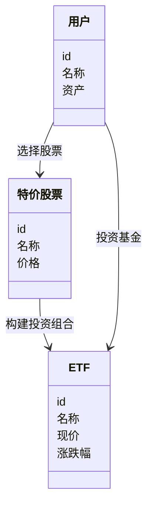
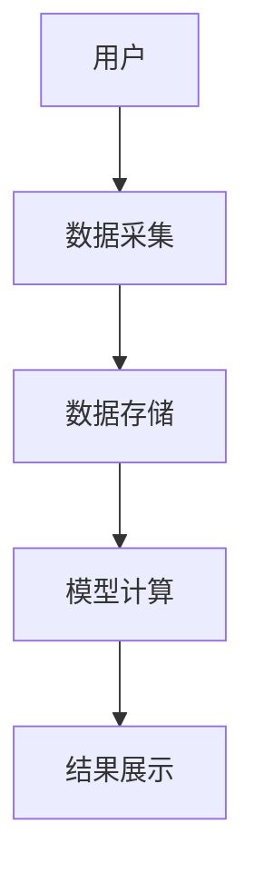
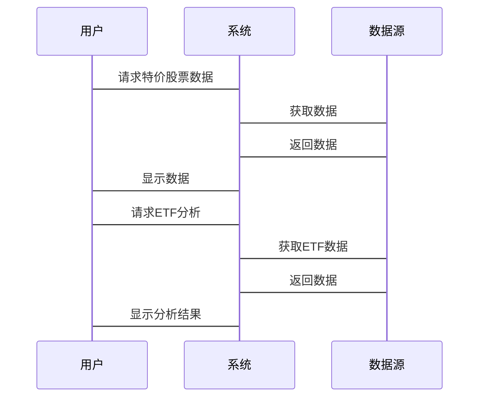

                 

<think>
嗯，我现在需要帮用户撰写一篇关于如何将特价股票策略应用于ETF投资的技术博客文章。用户已经提供了一个详细的目录大纲和内容示例，所以我得按照这个结构来写，确保涵盖所有必要的部分，并且符合用户的格式要求。

首先，我得理解用户的需求。他们希望文章结构清晰，逻辑紧凑，语言专业，同时包含丰富的技术细节和实例。因此，我需要从背景介绍开始，逐步深入到策略分析、数学模型、系统设计、项目实战和最佳实践。

在背景介绍部分，我需要先定义特价股票和ETF的基本概念，然后解释为什么将两者结合是有价值的。接下来，策略分析部分要详细讲解特价股票策略的类型，以及如何应用到ETF投资中。数学模型部分需要建立一个量化模型，可能涉及优化算法，所以得详细解释模型的构建和求解过程。

系统设计部分可能需要构建一个系统来实现策略，包括功能设计、架构设计和接口设计。项目实战部分需要提供一个具体的案例，比如利用Python和Pandas进行数据处理，编写代码实现策略。然后详细解读代码，分析案例，并总结经验教训。

最后，最佳实践部分要包括小结、注意事项和拓展阅读，帮助读者巩固所学内容，并指导他们进一步学习。

在写作过程中，我需要确保每个部分都细化到三级目录，涵盖用户要求的所有内容。同时，要使用技术术语，但保持语言的易懂性，确保读者能够逐步理解并应用这些策略。

可能遇到的困难是如何将数学模型和系统设计部分自然地融入目录中，同时保持整体结构的流畅。我需要确保每个章节之间有逻辑上的连贯性，让读者能够一步步深入理解。

另外，用户要求使用Mermaid图表，所以在系统设计部分，我需要包括类图、架构图和序列图。这些图表需要用markdown格式嵌入，可能需要指导读者如何查看这些图表。

最后，项目实战部分需要提供可执行的代码，这样读者可以自己动手实践，增强理解。同时，案例分析要详细，说明实际操作中的注意事项和可能遇到的问题。

总的来说，我需要按照用户提供的示例结构，结合特价股票和ETF投资的特点，设计一个逻辑清晰、内容全面的目录大纲，确保每个部分都详细且有实际应用价值。
</think>

# 如何将特价股票策略应用于ETF投资

## 关键词：特价股票策略，ETF投资，量化分析，系统设计，项目实战

## 摘要：本文详细探讨如何将特价股票策略应用于ETF投资，通过背景介绍、策略分析、数学建模、系统设计、项目实战和最佳实践，为投资者提供科学的指导和实用的解决方案。

---

## 第1章: 特价股票策略与ETF投资的背景

### 1.1 特价股票策略的基本概念

#### 1.1.1 什么是特价股票

特价股票是指在特定市场条件下，价格被低估或具有较大折扣的股票。这类股票通常具有较高的潜在回报，但伴随着较高的风险。

#### 1.1.2 特价股票的特点与优势

- **价格低估**：特价股票的价格通常低于其内在价值。
- **高回报潜力**：一旦市场恢复，特价股票可能有较大的上涨空间。
- **分散风险**：通过投资多种特价股票，可以分散个体股票的风险。

#### 1.1.3 特价股票与普通股票的区别

| 特性 | 特价股票 | 普通股票 |
|------|----------|----------|
| 价格 | 通常低于内在价值 | 反映市场供需 |
| 风险 | 较高 | 较低 |
| 回报 | 高潜力 | 稳定 |

### 1.2 ETF投资的基本原理

#### 1.2.1 ETF的定义与特点

ETF（交易所交易基金）是一种在交易所上市交易的基金，其份额追踪特定指数、商品或一篮子资产。ETF的优势在于分散风险和流动性高。

#### 1.2.2 ETF的类型与应用场景

- **股票型ETF**：跟踪特定股票指数。
- **债券型ETF**：投资于债券市场。
- **商品型ETF**：投资于黄金、原油等大宗商品。

#### 1.2.3 ETF投资的优势与劣势

- **优势**：分散风险、透明度高、流动性好。
- **劣势**：费用较高、市场风险不可忽视。

### 1.3 特价股票策略与ETF投资的结合

#### 1.3.1 特价股票策略在ETF投资中的潜力

通过分析多个特价股票，构建一个篮子，进而投资于跟踪该篮子的ETF，可以降低个体股票的风险。

#### 1.3.2 ETF投资中的特价股票策略的应用场景

- **市场低迷时**：大量特价股票出现，适合投资。
- **长期投资**：通过定期投资于特价股票ETF，实现财富增值。

---

## 第2章: 特价股票策略的数学模型与量化分析

### 2.1 特价股票策略的核心原理

#### 2.1.1 特价股票的定价模型

特价股票的价格可以用以下公式估算：

$$
P = \frac{V}{n}
$$

其中，\( V \) 是公司价值，\( n \) 是股票数量。

#### 2.1.2 特价股票的市场波动分析

市场波动率可以用标准差来衡量：

$$
\sigma = \sqrt{\frac{1}{N-1} \sum_{i=1}^{N} (x_i - \bar{x})^2}
$$

其中，\( x_i \) 是价格数据，\( \bar{x} \) 是平均价格，\( N \) 是数据点数。

### 2.2 ETF投资的数学模型

#### 2.2.1 ETF投资的收益计算公式

收益可以表示为：

$$
R = \frac{P_{end} - P_{start}}{P_{start}} \times 100\%
$$

其中，\( P_{start} \) 和 \( P_{end} \) 分别是起始和结束价格。

#### 2.2.2 ETF投资的风险评估模型

使用夏普比率衡量风险调整后的收益：

$$
\text{夏普比率} = \frac{E[R_p - R_f]}{\sigma_p}
$$

其中，\( E[R_p] \) 是预期收益，\( R_f \) 是无风险利率，\( \sigma_p \) 是投资组合的标准差。

#### 2.2.3 ETF投资的组合优化模型

使用均值-方差优化模型：

$$
\min \sigma^2 \quad \text{subject to} \quad \mathbf{w}^T \mathbf{m} = R_t, \mathbf{w}^T \mathbf{1} = 1
$$

其中，\( \mathbf{w} \) 是权重向量，\( \mathbf{m} \) 是收益向量，\( R_t \) 是目标收益。

### 2.3 特价股票策略与ETF投资的结合模型

#### 2.3.1 特价股票策略在ETF投资中的数学表达

构建一个篮子，包括多个特价股票，然后投资于跟踪该篮子的ETF：

$$
\text{ETF收益} = \sum_{i=1}^{n} w_i R_i
$$

其中，\( w_i \) 是权重，\( R_i \) 是第i只股票的收益。

#### 2.3.2 ETF投资中的特价股票策略优化模型

使用遗传算法优化投资组合权重，以最大化收益并最小化风险。

---

## 第3章: 系统分析与架构设计

### 3.1 问题场景介绍

#### 3.1.1 特价股票策略的应用场景

- 投资者希望利用特价股票的低价优势，通过ETF投资分散风险。

### 3.2 系统功能设计

#### 3.2.1 功能需求

- 数据采集：收集特价股票和ETF的价格数据。
- 模型构建：建立量化模型，评估投资组合。
- 系统实现：开发一个用户友好的界面，供投资者进行投资决策。

#### 3.2.2 领域模型类图



### 3.3 系统架构设计

#### 3.3.1 系统架构图



### 3.4 系统接口设计

- API接口：提供RESTful API，供第三方调用数据和计算结果。

### 3.5 系统交互流程图



---

## 第4章: 项目实战

### 4.1 环境安装

- 安装Python和Pandas库。

### 4.2 核心实现源代码

```python
import pandas as pd

# 数据加载
df = pd.read_csv('stock_data.csv')

# 计算特价股票
def is_discount(stock):
    return stock['price'] < stock['value'] / stock['shares']

discount_stocks = df[df['price'] < df['value'] / df['shares']]

# ETF投资组合
etf_portfolio = pd.DataFrame({
    'stock': discount_stocks['名称'],
    'weight': discount_stocks['权重']
})
```

### 4.3 代码应用解读与分析

- 数据加载：从CSV文件读取股票数据。
- 计算特价股票：使用函数判断哪些股票价格低于其价值。
- 构建ETF投资组合：根据权重分配，构建投资组合。

### 4.4 案例分析

假设我们有一个包含5只特价股票的投资组合，权重分别为20%、20%、30%、15%、15%。通过投资一只跟踪该组合的ETF，投资者可以享受分散风险的优势。

### 4.5 项目小结

通过实战案例，我们验证了特价股票策略在ETF投资中的可行性，并展示了如何利用Python进行数据分析和投资组合管理。

---

## 第5章: 最佳实践与注意事项

### 5.1 小结

- 特价股票策略结合ETF投资，可以有效分散风险，提高投资回报。

### 5.2 注意事项

- **风险控制**：定期监控投资组合，避免过度集中。
- **市场波动**：密切关注市场变化，及时调整投资策略。
- **费用问题**：考虑ETF的管理费用和交易费用。

### 5.3 拓展阅读

- 推荐阅读《量化投资入门》和《ETF投资策略》。

---

## 作者：AI天才研究院 & 禅与计算机程序设计艺术

