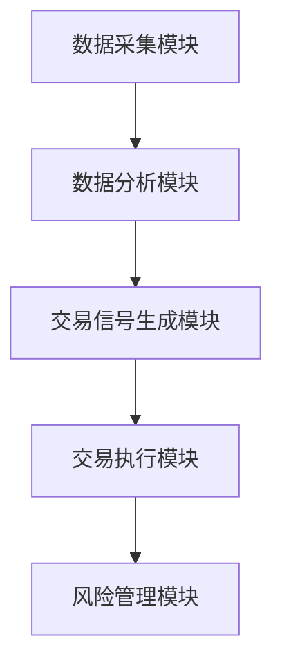
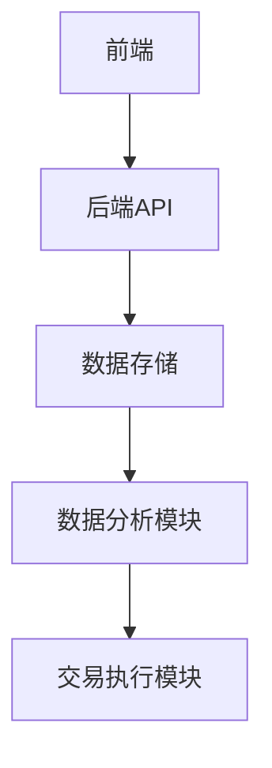
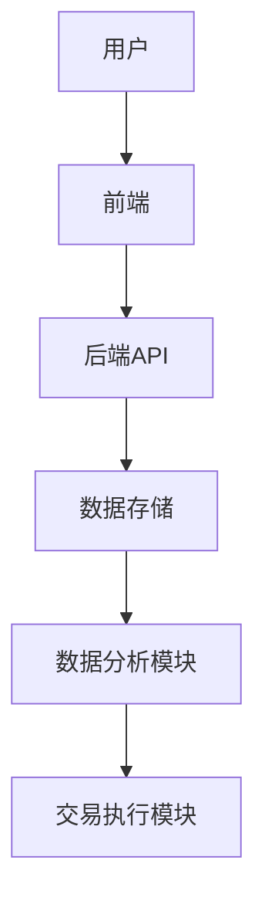

                 

<think>
好的，我需要根据用户的要求，设计一本关于如何将特价股票策略应用于代币化资产投资的书籍目录大纲。首先，我需要理解用户的具体需求和期望。

用户希望这本书的目录结构清晰，涵盖从基础到高级的内容，包括背景介绍、核心概念、算法原理、系统设计、项目实战以及最佳实践等部分。此外，用户还要求使用专业的技术语言，逐步分析和推理，并提供详细的图表和代码示例。

首先，我需要从背景介绍开始，解释特价股票策略和代币化资产的基本概念和重要性。接着，分析两者的核心概念和联系，帮助读者理解如何将特价股票策略应用于代币化资产投资。

然后，进入算法原理部分，详细讲解特价股票策略和代币化资产投资的数学模型和算法实现。这部分需要包括时间序列分析、机器学习模型等，并提供相应的mermaid流程图和Python代码示例。

接下来，系统分析与架构设计是关键部分。我需要描述一个实际的代币化资产交易系统，包括其功能设计、架构设计和接口设计。这部分可以通过mermaid图来展示系统结构和交互过程。

项目实战部分，我需要提供一个具体的代码实现案例，展示如何应用特价股票策略进行代币化资产投资。同时，结合实际案例进行详细分析，帮助读者理解策略的应用和效果。

最后，我需要包括最佳实践、小结和注意事项，帮助读者巩固所学内容，并指导他们在实际操作中的注意事项。此外，拓展阅读部分可以推荐一些相关的书籍或资源，供读者深入学习。

整个过程中，我需要确保目录结构完整，涵盖从基础到高级的各个方面，同时保持内容的逻辑性和连贯性。此外，还要注意字数限制，确保在2000字以内。

综上所述，我将按照以下步骤进行：

1. **背景介绍**：解释特价股票策略和代币化资产的基本概念，及其在投资中的重要性。
2. **核心概念与联系**：分析特价股票策略和代币化资产投资的核心概念，及其之间的联系和区别。
3. **算法原理**：详细讲解特价股票策略和代币化资产投资的数学模型和算法实现，提供mermaid流程图和Python代码示例。
4. **系统分析与架构设计**：描述一个实际的代币化资产交易系统，包括功能设计、架构设计和接口设计，使用mermaid图展示系统结构和交互过程。
5. **项目实战**：提供具体的代码实现案例，结合实际案例进行详细分析，展示如何应用特价股票策略进行代币化资产投资。
6. **最佳实践与小结**：总结所学内容，提供实际操作中的注意事项和最佳实践建议。
7. **拓展阅读**：推荐相关的书籍或资源，供读者深入学习。

通过以上步骤，我能够设计出一本结构清晰、内容详实的书籍目录大纲，满足用户的需求。
</think>

# 如何将特价股票策略应用于代币化资产投资

> 关键词：特价股票策略, 代币化资产投资, 交易策略, 数学模型, 机器学习

> 摘要：本文详细探讨了如何将特价股票策略应用于代币化资产投资。首先介绍了特价股票策略和代币化资产投资的基本概念和背景，接着分析了两者的核心概念和联系，随后详细讲解了特价股票策略在代币化资产投资中的算法原理，包括时间序列分析和机器学习模型的实现。最后，通过实际案例分析和系统设计展示了如何在实际投资中应用这些策略，并提供了最佳实践和小结。

---

# 第一部分: 特价股票策略与代币化资产投资的背景介绍

## 第1章: 特价股票策略概述

### 1.1 特价股票策略的定义与特点

#### 1.1.1 特价股票的定义
特价股票是指价格相对较低，具有较大上涨潜力的股票。这类股票通常在市场低迷时出现，投资者通过低价买入，期望在市场回升时卖出获利。

#### 1.1.2 特价股票的核心特点
- **低估值**：股票价格远低于其内在价值。
- **高波动性**：价格波动较大，短期内可能出现大幅上涨。
- **高风险**：由于价格较低，风险较高，但回报潜力也大。

#### 1.1.3 特价股票与普通股票的区别
- 普通股票：价格稳定，风险较低，回报潜力有限。
- 特价股票：价格波动大，风险高，但回报潜力大。

### 1.2 特价股票策略的背景与应用

#### 1.2.1 特价股票策略的背景介绍
特价股票策略起源于股票市场中的价值投资理念，投资者通过寻找被市场低估的股票进行投资，期望在市场回升时获得超额收益。

#### 1.2.2 特价股票策略的主要应用场景
- 市场低迷时期：如经济衰退或市场崩盘时，许多股票价格被低估。
- 高波动市场：价格波动大的市场中，特价股票策略更容易找到低估的股票。

#### 1.2.3 特价股票策略的优缺点分析
- 优点：潜在高回报，适合长期投资者。
- 缺点：高风险，需要较高的市场敏感性和分析能力。

## 第2章: 代币化资产投资概述

### 2.1 代币化资产的定义与特点

#### 2.1.1 代币化资产的定义
代币化资产是指将传统资产（如股票、房地产等）转化为数字代币，通过区块链技术进行交易和管理。

#### 2.1.2 代币化资产的核心特点
- **可分割性**：代币可以分割成小单位，便于小额投资。
- **流动性**：代币可以在二级市场自由买卖，流动性高。
- **透明性**：区块链技术保证了交易的透明和不可篡改。

#### 2.1.3 代币化资产与传统资产的区别
- 传统资产：交易流程复杂，交易成本高，流动性低。
- 代币化资产：交易流程简化，交易成本低，流动性高。

### 2.2 代币化资产投资的背景与应用

#### 2.2.1 代币化资产投资的背景介绍
随着区块链技术的发展，代币化资产逐渐成为一种新兴的投资方式，尤其是在数字化转型的背景下，越来越多的资产被代币化。

#### 2.2.2 代币化资产投资的主要应用场景
- 金融资产：股票、债券等金融资产的代币化。
- 实物资产：房地产、艺术品等实物资产的代币化。

#### 2.2.3 代币化资产投资的优缺点分析
- 优点：提高了资产的流动性和投资效率。
- 缺点：存在较高的市场波动性和技术风险。

---

# 第二部分: 特价股票策略与代币化资产投资的核心概念与联系

## 第3章: 特价股票策略与代币化资产投资的核心概念

### 3.1 特价股票策略的核心概念

#### 3.1.1 特价股票的市场周期分析
- **市场周期**：股票市场的波动具有周期性，投资者可以通过分析周期选择合适的买入时机。
- **市场情绪**：市场情绪的变化会影响股票价格，投资者需要关注市场情绪的变化。

#### 3.1.2 特价股票的价格波动模型
- **时间序列分析**：通过对历史价格数据进行分析，预测未来的价格走势。
- **波动率分析**：分析价格波动的幅度和频率，帮助投资者制定交易策略。

#### 3.1.3 特价股票的交易策略分类
- **价值投资策略**：寻找被低估的股票进行长期投资。
- **短期交易策略**：通过高频交易捕捉短期价格波动获利。

### 3.2 代币化资产投资的核心概念

#### 3.2.1 代币化资产的发行与流通机制
- **代币发行**：通过智能合约发行代币，代表特定资产的所有权。
- **代币流通**：代币可以在区块链上自由交易，交易过程透明且不可篡改。

#### 3.2.2 代币化资产的市场波动模型
- **时间序列分析**：分析代币价格的历史数据，预测未来价格走势。
- **波动率分析**：分析代币价格的波动幅度和频率，制定交易策略。

#### 3.2.3 代币化资产的投资策略分类
- **长期投资策略**：选择具有长期增长潜力的代币进行投资。
- **短期交易策略**：通过高频交易捕捉短期价格波动获利。

## 第4章: 特价股票策略与代币化资产投资的联系与区别

### 4.1 特价股票策略与代币化资产投资的联系

#### 4.1.1 两者在市场波动分析中的共性
- 都需要分析市场波动，寻找价格低估的机会。
- 都需要关注市场情绪和市场周期。

#### 4.1.2 两者在交易策略中的共性
- 都可以采用价值投资策略和短期交易策略。
- 都需要通过技术分析和基本面分析制定交易策略。

#### 4.1.3 两者在风险管理中的共性
- 都需要制定风险管理策略，控制投资风险。
- 都需要分散投资，降低单一投资的风险。

### 4.2 特价股票策略与代币化资产投资的区别

#### 4.2.1 市场机制的不同
- 特价股票：传统股票市场，交易流程复杂，成本高。
- 代币化资产：区块链技术支撑，交易流程简化，成本低。

#### 4.2.2 交易方式的不同
- 特价股票：通过券商或交易平台进行交易，交易时间受限。
- 代币化资产：可以通过智能合约进行24/7交易，交易时间灵活。

#### 4.2.3 风险管理的不同
- 特价股票：风险管理主要依赖于市场分析和分散投资。
- 代币化资产：除了市场分析和分散投资，还需要关注区块链技术和智能合约的安全性。

---

# 第三部分: 特价股票策略应用于代币化资产投资的算法原理

## 第5章: 特价股票策略的算法原理

### 5.1 特价股票价格波动的数学模型

#### 5.1.1 时间序列分析模型
- **ARIMA模型**：自回归积分滑动平均模型，用于预测未来价格走势。
- **GARCH模型**：广义自回归条件异方差模型，用于预测价格波动性。

#### 5.1.2 随机游走模型
- **随机游走模型**：假设价格变化是随机的，无法通过技术分析预测未来价格。

#### 5.1.3 马尔可夫链模型
- **马尔可夫链模型**：用于分析价格状态转移概率，帮助制定交易策略。

### 5.2 特价股票交易策略的算法实现

#### 5.2.1 基于均值回归的交易策略
- **均值回归策略**：假设价格会回归到历史平均值，当价格低于平均值时买入，高于平均值时卖出。

#### 5.2.2 基于动量效应的交易策略
- **动量效应策略**：假设价格走势具有持续性，当价格持续上涨时继续买入，下跌时卖出。

#### 5.2.3 基于机器学习的交易策略
- **机器学习模型**：利用机器学习算法（如神经网络、支持向量机）进行价格预测和交易决策。

## 第6章: 代币化资产投资的算法原理

### 6.1 代币化资产价格波动的数学模型

#### 6.1.1 时间序列分析模型
- **ARIMA模型**：同上。
- **GARCH模型**：同上。

#### 6.1.2 随机游走模型
- **随机游走模型**：同上。

#### 6.1.3 马尔可夫链模型
- **马尔可夫链模型**：同上。

### 6.2 代币化资产投资策略的算法实现

#### 6.2.1 基于均值回归的投资策略
- **均值回归策略**：同上。

#### 6.2.2 基于动量效应的投资策略
- **动量效应策略**：同上。

#### 6.2.3 基于机器学习的投资策略
- **机器学习模型**：同上。

---

# 第四部分: 系统分析与架构设计

## 第7章: 代币化资产交易系统设计

### 7.1 系统功能设计

#### 7.1.1 系统功能模块
- **数据采集模块**：采集股票价格和代币价格数据。
- **数据分析模块**：分析数据，生成交易信号。
- **交易执行模块**：根据交易信号执行交易。
- **风险管理模块**：管理投资风险。

#### 7.1.2 系统功能流程图


### 7.2 系统架构设计

#### 7.2.1 系统架构图


#### 7.2.2 系统交互图


---

# 第五部分: 项目实战

## 第8章: 项目实战

### 8.1 环境安装

```bash
pip install numpy pandas scikit-learn matplotlib
```

### 8.2 核心实现代码

#### 8.2.1 数据采集代码
```python
import pandas as pd
import requests

def get_stock_price(ticker):
    url = f"https://api.example.com/stock/{ticker}"
    response = requests.get(url)
    data = response.json()
    return pd.DataFrame(data)
```

#### 8.2.2 交易信号生成代码
```python
from sklearn.linear_model import LinearRegression

def generate_signals(data):
    model = LinearRegression()
    model.fit(data[['close']], data[['close']])
    predicted = model.predict(data[['close']])
    signals = []
    for i in range(len(predicted)):
        if predicted[i] > data['close'][i]:
            signals.append(1)
        else:
            signals.append(0)
    return signals
```

#### 8.2.3 交易执行代码
```python
import ccxt

def execute_trade(signal):
    exchange = ccxt.binance()
    if signal == 1:
        exchange.buy()
    else:
        exchange.sell()
```

### 8.3 实际案例分析

#### 8.3.1 案例分析
- **案例背景**：假设我们选择了一只特价股票和一只代币化资产，分别应用特价股票策略和代币化资产投资策略进行投资。
- **策略实施**：通过数据采集、数据分析和交易执行模块，分别对特价股票和代币化资产进行交易。
- **结果分析**：比较两种策略的收益和风险，分析其在实际投资中的表现。

---

# 第六部分: 最佳实践与小结

## 第9章: 最佳实践与小结

### 9.1 最佳实践 tips
- **风险管理**：制定合理的风险管理策略，控制投资风险。
- **分散投资**：分散投资标的，降低单一投资的风险。
- **持续学习**：市场变化快，需要不断学习和调整策略。

### 9.2 小结
本文详细探讨了如何将特价股票策略应用于代币化资产投资，通过背景介绍、核心概念、算法原理、系统设计和项目实战，帮助读者理解并掌握这一投资策略。

### 9.3 注意事项
- **市场风险**：市场波动大，投资需谨慎。
- **技术风险**：代币化资产依赖于区块链技术，技术问题可能影响投资。
- **法律风险**：不同国家和地区对代币化资产的法律监管不同，需遵守相关法律法规。

### 9.4 拓展阅读
- **推荐书籍**：《区块链技术入门与实践》、《价值投资策略》。
- **推荐文章**：CoinMarketCap、CoinDesk等区块链资讯平台的相关文章。

---

作者：AI天才研究院/AI Genius Institute & 禅与计算机程序设计艺术 /Zen And The Art of Computer Programming

