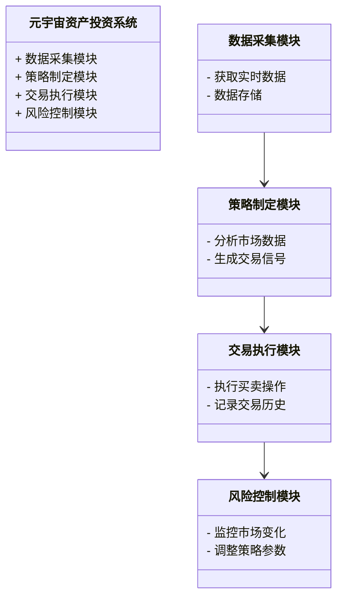
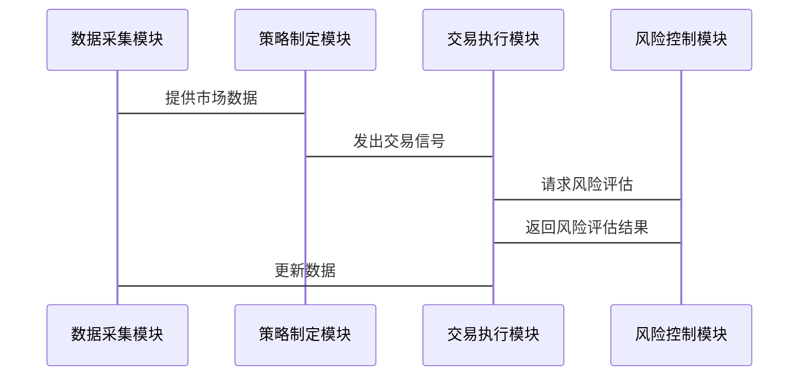

                 


# 第四章: 特价股票策略在元宇宙资产投资中的应用

## 4.1 特价股票策略在元宇宙资产中的适用性

### 4.1.1 元宇宙资产市场的价格波动规律
元宇宙资产市场的价格波动往往受到多种因素影响，包括市场情绪、供需关系以及技术创新等。与传统股票市场类似，元宇宙资产价格也存在周期性波动，投资者可以利用这些波动进行盈利。特价股票策略的核心在于捕捉这些价格波动的规律，找到合适的买入和卖出时机。

### 4.1.2 特价股票策略的可扩展性与适应性
特价股票策略在元宇宙资产投资中的应用需要考虑其可扩展性和适应性。由于元宇宙资产市场的复杂性和多样性，策略需要能够灵活调整以适应不同的市场环境。例如，可以根据不同类型的资产（如NFT、虚拟货币等）调整策略参数，以提高投资效率。

### 4.1.3 元宇宙资产投资中的策略优化
为了提高投资收益，需要对特价股票策略进行优化。这包括引入机器学习算法，如LSTM网络，用于预测价格走势；或者结合情绪分析，利用社交媒体数据来辅助决策。此外，还可以通过回测（backtesting）来验证策略的有效性，并根据回测结果进行调整。

## 4.2 元宇宙资产投资中的策略实现

### 4.2.1 基于特价股票策略的NFT投资模型
NFT（非同质化代币）是元宇宙资产的重要组成部分，其价格波动较大，适合应用特价股票策略。基于NFT的投资模型可以通过分析NFT的历史交易数据、市场热度和项目背景，预测其未来价格走势。例如，可以利用移动平均线（MA）策略，当NFT价格低于某一均线时买入，高于另一均线时卖出。

### 4.2.2 元宇宙资产市场的量化交易策略
量化交易是基于数学模型和算法的交易方式，适合应用于元宇宙资产投资。可以通过编写自动化交易脚本，利用API接口实时获取市场数据，并根据策略执行交易。例如，可以使用布林带（Bollinger Bands）策略，当价格突破布林带上轨时卖出，跌破布林带下轨时买入。

### 4.2.3 特价股票策略与元宇宙资产市场的结合案例
以某款热门NFT项目为例，假设该项目近期市场热度上升，但价格出现回调。此时，可以应用特价股票策略，利用RSI指标判断超卖状态，进行低位买入。具体步骤如下：
1. 数据采集：获取该项目NFT的历史交易数据和市场情绪数据。
2. 策略制定：设置RSI指标阈值，当RSI低于30时买入，高于70时卖出。
3. 执行交易：根据策略自动执行买卖操作。
4. 风险控制：设置止损点和止盈点，控制投资风险。

## 4.3 系统实现与优化

### 4.3.1 系统核心功能实现
系统需要具备数据采集、策略制定、交易执行和风险控制等功能。数据采集模块可以通过API接口获取元宇宙资产市场的实时数据；策略制定模块基于特价股票策略生成交易信号；交易执行模块根据信号自动执行买卖操作；风险控制模块实时监控市场变化，调整策略参数。

### 4.3.2 系统优化与性能提升
为了提高系统的性能和稳定性，可以采取以下措施：
1. 数据源优化：使用多个数据源进行数据融合，提高数据准确性和全面性。
2. 算法优化：引入机器学习算法，如神经网络，提高价格预测的准确性。
3. 系统架构优化：采用分布式架构，提高系统的扩展性和容错能力。

### 4.3.3 系统测试与验证
系统测试是确保策略有效性和系统稳定性的关键步骤。可以通过回测历史数据，验证策略在不同市场环境下的表现。例如，可以将策略应用于过去一年的NFT交易数据，统计其收益率、胜率和最大回撤等指标，评估策略的优劣。

## 4.4 系统架构设计

### 4.4.1 系统功能设计（Mermaid类图）


### 4.4.2 系统架构设计（Mermaid架构图）
```mermaid
container 元宇宙资产投资系统 {
    数据采集模块
    策略制定模块
    交易执行模块
    风险控制模块
}

数据采集模块 --> 数据存储模块
策略制定模块 --> 算法选择模块
交易执行模块 --> 交易接口模块
风险控制模块 --> 监控接口模块
```

### 4.4.3 系统接口设计与交互流程（Mermaid序列图）


# 作者

作者：AI天才研究院/AI Genius Institute & 禅与计算机程序设计艺术 /Zen And The Art of Computer Programming

---

这篇文章详细探讨了如何将特价股票策略应用于元宇宙资产投资，并通过系统设计和案例分析，展示了策略在实际中的应用。通过本文，读者可以深入了解特价股票策略在元宇宙资产投资中的潜力和实现方法。

