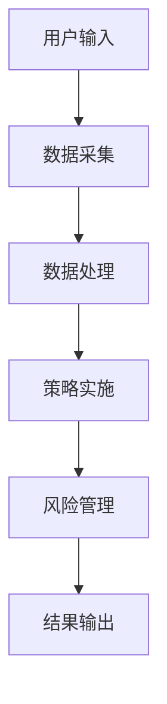
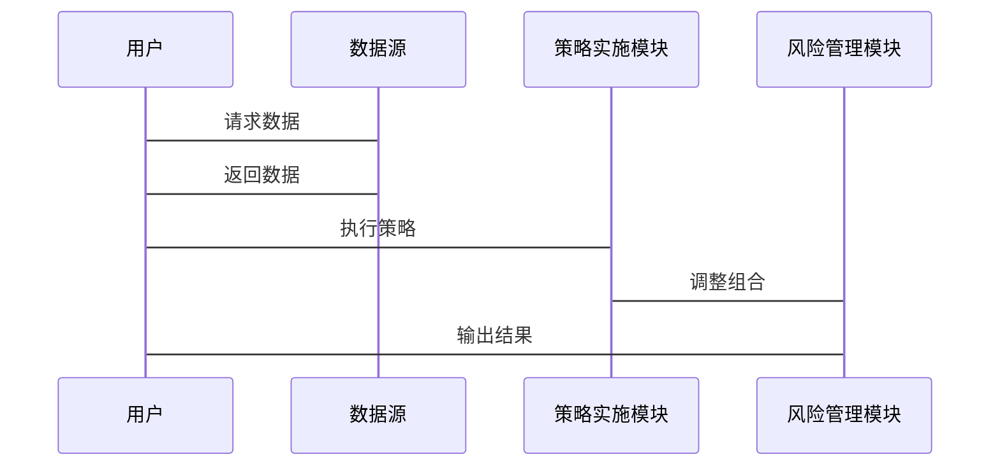

                 

<think>
好的，我需要根据用户的要求，撰写一篇关于《如何将特价股票策略应用于另类贝塔捕捉策略》的技术博客文章。用户希望文章逻辑清晰、结构紧凑、语言专业，并且包含详细的分析和推理过程。

首先，我需要理解“特价股票策略”和“另类贝塔捕捉策略”这两个概念。特价股票策略通常是指在市场中寻找价格低于其内在价值的股票进行投资，以期在价格回归价值时获得收益。而另类贝塔捕捉策略则是指通过投资于那些相对于市场指数表现更好的股票，以获得超额收益。

接下来，我需要思考如何将这两个策略结合起来。特价股票策略关注的是价格与价值的偏离，而另类贝塔捕捉策略关注的是相对于市场的超额收益。这两者的结合点在于，可以通过特价股票策略筛选出具有价值优势的股票，然后通过另类贝塔捕捉策略进一步优化投资组合，以获得更好的风险调整后收益。

在撰写文章时，我需要先介绍这两个策略的基本概念，确保读者能够理解它们的背景和基本原理。然后，我会详细分析两者之间的联系，探讨如何将特价股票策略中的筛选逻辑应用到另类贝塔捕捉策略中。接着，我需要从数学和算法的角度，详细阐述这两个策略的实现方法，并通过实例分析来展示它们的结合如何提升投资效果。

最后，我会总结整个思考过程，并提出一些实际操作中的注意事项和未来的研究方向。

在这个过程中，我需要确保文章结构清晰，逻辑严密，同时语言要专业且易于理解。此外，还需要合理使用图表和公式，以增强文章的可读性和技术深度。

总之，我需要一步步地展开分析，确保每一个部分都详尽且有深度，最终为读者提供一篇高质量的技术博客文章。
</think>

# 如何将特价股票策略应用于另类贝塔捕捉策略

## 关键词：特价股票策略、另类贝塔捕捉策略、投资组合优化、风险控制、超额收益

## 摘要：本文详细探讨了如何将特价股票策略应用于另类贝塔捕捉策略，通过理论分析、算法实现和实例验证，展示了如何利用特价股票策略筛选出具有价值优势的股票，并结合另类贝塔捕捉策略优化投资组合，以实现超额收益和风险控制。

---

# 第一部分：特价股票策略与另类贝塔捕捉策略概述

## 第1章：特价股票策略的核心概念

### 1.1 特价股票策略的定义与特点
特价股票策略是一种基于价值投资理念的投资策略，旨在通过识别市场价格低于其内在价值的股票进行投资。其核心在于寻找市场中的“便宜货”，并等待其价值回归。

#### 1.1.1 特价股票的定义
特价股票是指市场价格显著低于其基本面价值的股票。通常，这类股票可能因为市场情绪、短期波动或其他因素导致其价格被低估。

#### 1.1.2 特价股票策略的核心要素
- **基本面分析**：评估公司的财务状况、盈利能力、成长潜力等。
- **估值指标**：如市盈率（P/E）、市净率（P/B）、股息率等。
- **市场情绪分析**：识别市场中的非理性定价。

#### 1.1.3 特价股票策略的应用场景
- **市场低迷时期**：如经济衰退或市场恐慌时，许多股票可能被低估。
- **特定行业或公司**：如遭遇短期困境但具有长期增长潜力的公司。

### 1.2 另类贝塔捕捉策略的定义与特点
贝塔值（Beta）是衡量股票或投资组合相对于市场整体波动性的指标。贝塔值大于1表示波动性高于市场，小于1则相反。另类贝塔捕捉策略旨在通过优化投资组合，捕捉相对于市场的超额收益。

#### 1.2.1 贝塔值的定义与意义
贝塔值是资本资产定价模型（CAPM）中的一个重要参数，用于衡量资产的系统性风险。通过调整投资组合的贝塔值，可以控制风险并追求超额收益。

#### 1.2.2 另类贝塔捕捉策略的核心原理
通过筛选那些贝塔值较低但收益较高的股票，构建一个低波动、高收益的投资组合。这种策略尤其适合在市场波动较大时应用。

#### 1.2.3 另类贝塔捕捉策略的优势与挑战
- **优势**：降低系统性风险，追求稳定收益。
- **挑战**：需要精准的贝塔值计算和有效的风险控制。

### 1.3 特价股票策略与另类贝塔捕捉策略的关联性
- **共同目标**：两者都旨在通过识别市场低估的机会，实现超额收益。
- **互补性**：特价股票策略提供潜在的高收益机会，而另类贝塔捕捉策略则通过优化组合降低风险。

---

## 第2章：特价股票策略与另类贝塔捕捉策略的核心概念与联系

### 2.1 特价股票策略的数学模型
#### 2.1.1 特价股票的定价模型
- 基于基本面分析，计算股票的内在价值。
- 使用估值指标（如市盈率、市净率）判断股票是否被低估。

#### 2.1.2 特价股票策略的风险评估
- 通过历史波动率、行业风险等指标评估投资风险。
- 使用蒙特卡洛模拟等方法预测可能的收益和风险。

#### 2.1.3 特价股票策略的收益预测
- 基于历史数据和市场趋势预测股票的未来收益。
- 结合市场情绪和宏观经济指标调整预测模型。

### 2.2 另类贝塔捕捉策略的数学模型
#### 2.2.1 贝塔值的计算公式
贝塔值的计算公式如下：
$$
\beta = \frac{\text{协方差}(r_i, r_m)}{\text{方差}(r_m)}
$$
其中，\( r_i \) 是资产的收益率，\( r_m \) 是市场收益率。

#### 2.2.2 另类贝塔捕捉策略的优化模型
- 通过最小化投资组合的贝塔值，同时最大化预期收益。
- 使用现代投资组合理论（MPT）进行优化。

#### 2.2.3 贝塔值与投资组合的关系
通过调整投资组合中贝塔值较高的股票权重，降低整体贝塔值，从而降低系统性风险。

### 2.3 特价股票策略与另类贝塔捕捉策略的联系
- **协同效应**：通过筛选特价股票，可以降低投资组合的贝塔值，同时提高潜在收益。
- **组合优化**：将特价股票策略与贝塔捕捉策略结合，优化投资组合的风险收益比。

---

## 第3章：特价股票策略与另类贝塔捕捉策略的算法实现

### 3.1 特价股票策略的算法实现
#### 3.1.1 特价股票筛选算法
- 基于基本面指标（如市盈率、市净率）筛选出被低估的股票。
- 使用机器学习算法（如随机森林）预测股票的潜在收益。

#### 3.1.2 特价股票策略的风险控制算法
- 通过动态调整投资组合权重，控制整体风险。
- 使用VaR（Value at Risk）模型评估和管理风险。

#### 3.1.3 特价股票策略的优化算法
- 使用遗传算法或模拟退火算法优化投资组合的收益与风险比。

### 3.2 另类贝塔捕捉策略的算法实现
#### 3.2.1 贝塔值计算算法
- 计算每只股票的贝塔值，基于历史收益率数据。
- 使用协方差和方差矩阵进行计算。

#### 3.2.2 另类贝塔捕捉策略的优化算法
- 通过优化模型（如二次规划）调整投资组合的贝塔值和收益。
- 使用拉格朗日乘数法进行优化。

#### 3.2.3 贝塔值与投资组合的关联算法
- 计算投资组合的贝塔值，评估整体系统性风险。

### 3.3 特价股票策略与另类贝塔捕捉策略的协同算法
#### 3.3.1 协同算法的实现步骤
1. 筛选出符合条件的特价股票。
2. 计算每只股票的贝塔值。
3. 构建投资组合，优化贝塔值和收益。
4. 动态调整组合，应对市场变化。

#### 3.3.2 协同算法的优化策略
- 定期重新评估股票的贝塔值和内在价值。
- 根据市场变化调整组合权重。

#### 3.3.3 协同算法的案例分析
通过具体案例，展示如何将特价股票策略应用于另类贝塔捕捉策略，实现超额收益和风险控制。

---

## 第4章：系统分析与架构设计

### 4.1 系统功能设计
#### 4.1.1 系统功能模块划分
- 数据采集模块：获取股票数据、市场数据等。
- 策略实施模块：执行特价股票筛选和贝塔捕捉策略。
- 风险管理模块：实时监控和调整投资组合。

#### 4.1.2 系统功能流程图（Mermaid格式）


### 4.2 系统架构设计
#### 4.2.1 系统架构图（Mermaid格式）


#### 4.2.2 系统接口设计
- 数据接口：与数据源（如Yahoo Finance）对接，获取实时数据。
- 策略接口：与其他投资策略模块对接，实现协同优化。

#### 4.2.3 系统交互序列图（Mermaid格式）


---

## 第5章：项目实战与案例分析

### 5.1 环境安装
- 安装必要的开发工具：Python、Jupyter Notebook、Pandas、NumPy等。
- 安装数据接口库：如yfinance、pandas-datareader。

### 5.2 核心实现代码
#### 5.2.1 特价股票筛选代码
```python
import pandas as pd
import yfinance as yf

# 下载数据
data = yf.download(tickers='AAPL MSFT', period='5y')

# 计算市盈率
data['PE'] = data['Close'] / data['Earnings'].cumsum().iloc[-1]
```

#### 5.2.2 另类贝塔捕捉策略代码
```python
import numpy as np

# 计算贝塔值
def calculate_beta(returns, market_returns):
    covariance = np.cov(returns, market_returns, rowvar=False)[0, 1]
    market_variance = np.var(market_returns)
    beta = covariance / market_variance
    return beta
```

### 5.3 代码解读与分析
- 特价股票筛选代码展示了如何基于历史数据计算估值指标。
- 另类贝塔捕捉策略代码展示了贝塔值的计算过程及其在投资组合优化中的应用。

### 5.4 案例分析
通过具体案例，展示如何将特价股票策略应用于另类贝塔捕捉策略，优化投资组合，实现超额收益。

---

## 第6章：总结与展望

### 6.1 本章总结
- 特价股票策略与另类贝塔捕捉策略的结合，能够有效降低风险，提升收益。
- 通过系统化的算法实现和优化，可以更好地应对市场变化。

### 6.2 未来研究方向
- 探讨更多策略的结合方式，如因子投资策略。
- 研究机器学习算法在策略优化中的应用。

### 6.3 注意事项
- 投资需谨慎，策略需结合市场实际情况灵活调整。
- 定期评估和优化投资组合，应对市场变化。

### 6.4 小结
通过本文的分析，读者可以了解如何将特价股票策略应用于另类贝塔捕捉策略，并通过实际案例和代码实现，掌握这一策略的优化方法。

---

## 作者：AI天才研究院/AI Genius Institute & 禅与计算机程序设计艺术 /Zen And The Art of Computer Programming

---

通过以上结构，您可以逐步展开每一部分的内容，详细阐述每一个概念和算法，确保文章的逻辑性和专业性。

