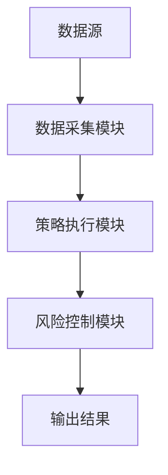

                 

# 如何将特价股票策略应用于商品期货投资

> 关键词：特价股票策略，商品期货投资，量化分析，套利策略，系统设计

> 摘要：本文将详细介绍如何将特价股票策略应用于商品期货投资。通过量化分析、套利策略、系统设计等方法，深入探讨特价股票策略在商品期货投资中的应用前景、策略实施和风险管理。本文旨在为投资者提供一套系统化、可操作的策略框架，帮助他们在商品期货市场中实现稳健投资。

---

# 第1章 特价股票策略概述

## 1.1 特价股票的基本概念
### 1.1.1 特价股票的定义
- 特价股票是指价格低于其内在价值的股票。
- 通常用于市场波动、公司基本面变化或市场情绪影响时的投资机会。

### 1.1.2 特价股票的核心特征
- 价格低估：市场价格 < 内在价值
- 市场情绪：投资者情绪低落或市场恐慌时出现
- 基本面良好：公司财务状况健康，具备长期增长潜力

### 1.1.3 特价股票与商品期货投资的关系
- 特价股票策略的核心是寻找价格低估的资产。
- 商品期货市场中的价格波动为特价股票策略提供了套利机会。

## 1.2 商品期货投资的基本原理
### 1.2.1 商品期货的定义与特点
- 商品期货是以实物商品为标的的标准化合约。
- 具有杠杆效应、高流动性和价格波动大的特点。

### 1.2.2 商品期货市场的运作机制
- 交易所交易：通过交易所进行标准化合约交易。
- 结算所：负责交易的结算和交割。

### 1.2.3 商品期货与股票投资的异同点
- 相同点：都属于金融资产，价格受市场情绪和宏观经济影响。
- 不同点：商品期货具有杠杆效应，股票投资注重公司基本面。

## 1.3 特价股票策略在商品期货中的应用前景
### 1.3.1 套利机会
- 利用商品期货与相关股票市场的价格差异进行套利。
- 例如，利用原油价格与石油公司股票的价格差异。

### 1.3.2 对冲策略
- 通过商品期货对冲股票投资的风险。
- 利用商品期货市场的价格波动进行组合投资。

## 1.4 本章小结
- 特价股票策略的核心是寻找价格低估的资产。
- 商品期货市场提供了丰富的套利和对冲机会。
- 特价股票策略在商品期货投资中的应用前景广阔，但也需要结合市场环境和风险控制。

---

# 第2章 特价股票策略的量化分析

## 2.1 特价股票的量化指标
### 2.1.1 市盈率（P/E）分析
- 市盈率 = 股价 / 每股净利润。
- 低于行业平均水平的市盈率表明股票可能被低估。

### 2.1.2 市净率（P/B）分析
- 市净率 = 股价 / 每股净资产。
- 低于1的市净率通常被视为低估。

### 2.1.3 股息率分析
- 股息率 = 每股股息 / 股价。
- 高股息率的股票可能被低估。

## 2.2 商品期货市场的量化分析
### 2.2.1 商品期货价格波动的统计特征
- 使用时间序列分析模型（如ARIMA）分析价格波动。
- 计算波动率和相关性指标。

### 2.2.2 商品期货市场的技术指标分析
- 移动平均线（MA）：用于判断价格趋势。
- 相对强弱指数（RSI）：用于判断超买超卖状态。

### 2.2.3 宏观经济因素分析
- 利率、汇率、通货膨胀率对商品期货价格的影响。

## 2.3 特价股票策略在商品期货中的量化应用
### 2.3.1 基于量化指标的特价股票筛选
- 使用市盈率、市净率、股息率等指标筛选潜在投资标的。

### 2.3.2 商品期货市场的量化套利策略
- 利用商品期货与相关股票市场的价格差异进行套利。
- 例如，利用原油价格与石油公司股票的价格差异。

### 2.3.3 特价股票与商品期货市场的相关性分析
- 计算商品期货价格与特价股票价格的相关性。
- 通过协方差矩阵分析资产组合的风险。

## 2.4 本章小结
- 量化分析是特价股票策略在商品期货投资中的重要工具。
- 通过统计指标和模型可以有效识别套利机会和对冲风险。

---

# 第3章 商品期货市场的套利策略

## 3.1 商品期货市场的套利原理
### 3.1.1 套利的定义与分类
- 套利：利用不同市场或时间的价格差异获利。
- 分为跨期套利和跨市场套利。

### 3.1.2 套利的基本原理
- 市场价格差异是套利的基础。
- 套利活动有助于市场价差的消失。

### 3.1.3 套利在商品期货市场中的作用
- 提高市场流动性。
- 降低价格波动风险。

## 3.2 跨期套利与跨市场套利
### 3.2.1 跨期套利
- 买入近月合约，卖出远月合约。
- 适用于预期基差变化的投资者。

### 3.2.2 跨市场套利
- 在不同市场之间进行套利。
- 例如，利用国内和国际市场的价格差异。

### 3.2.3 跨期套利与跨市场套利的比较
- 跨期套利风险较低，跨市场套利风险较高。

## 3.3 特价股票策略在套利中的应用
### 3.3.1 跨期套利中的应用
- 利用商品期货不同期限的价格差异。
- 例如，利用原油的月间价差。

### 3.3.2 跨市场套利中的应用
- 利用商品期货在不同市场中的价格差异。
- 例如，利用伦敦和纽约市场的黄金价格差异。

### 3.3.3 风险控制
- 设置止损点。
- 监控市场波动。

## 3.4 本章小结
- 套利是商品期货市场中的重要投资策略。
- 特价股票策略在套利中提供了新的机会。

---

# 第4章 特价股票策略的商品期货交易系统设计

## 4.1 交易系统的需求分析
### 4.1.1 功能需求
- 数据采集：实时采集商品期货价格和特价股票价格。
- 策略执行：自动执行套利策略。
- 风险控制：实时监控和管理风险。

### 4.1.2 性能需求
- 高速数据处理能力。
- 稳定的系统运行环境。

## 4.2 系统架构设计
### 4.2.1 系统模块划分
- 数据采集模块。
- 策略执行模块。
- 风险控制模块。

### 4.2.2 系统架构图

## 4.3 系统接口设计
### 4.3.1 数据接口
- 数据源：商品期货价格和特价股票价格。
- 数据格式：JSON或CSV。

### 4.3.2 策略接口
- 策略类型：套利策略。
- 策略参数：价格阈值、时间窗口等。

## 4.4 本章小结
- 系统设计是实现特价股票策略的关键。
- 通过模块化设计可以提高系统的可维护性和扩展性。

---

# 第5章 实战案例分析

## 5.1 案例背景
### 5.1.1 案例目标
- 利用特价股票策略进行商品期货投资。

### 5.1.2 案例数据
- 数据来源：某商品期货市场和相关股票市场。

## 5.2 策略实施
### 5.2.1 数据分析
- 计算商品期货价格和股票价格的相关性。
- 识别套利机会。

### 5.2.2 策略执行
- 执行套利交易。
- 监控交易过程。

## 5.3 案例结果
### 5.3.1 盈利情况
- 计算套利收益。
- 分析收益来源。

### 5.3.2 风险控制
- 监控市场波动。
- 调整套利策略。

## 5.4 本章小结
- 实战案例验证了特价股票策略的有效性。
- 需要结合市场环境和风险控制进行策略调整。

---

# 第6章 风险管理与投资建议

## 6.1 风险管理
### 6.1.1 风险来源
- 市场风险：商品期货价格波动。
- 操作风险：策略执行中的问题。

### 6.1.2 风险控制方法
- 设置止损点。
- 分散投资。

## 6.2 投资建议
### 6.2.1 策略选择
- 根据市场环境选择合适的策略。
- 定期评估策略的有效性。

### 6.2.2 长期投资建议
- 长期持有特价股票，结合商品期货进行对冲。
- 关注宏观经济指标和市场趋势。

## 6.3 本章小结
- 风险管理是投资成功的关键。
- 投资者应根据市场环境和个人风险承受能力选择合适策略。

---

# 作者信息

作者：AI天才研究院/AI Genius Institute & 禅与计算机程序设计艺术 /Zen And The Art of Computer Programming

---

通过以上目录大纲，您可以根据实际内容进一步扩展每一章的内容，添加具体的分析、公式、图表和代码示例，以满足文章的深度和专业性要求。

