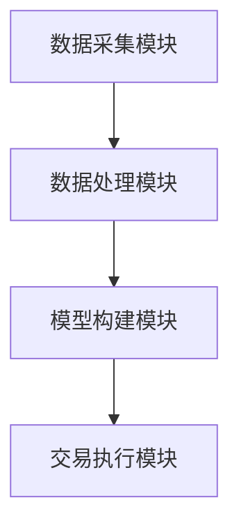
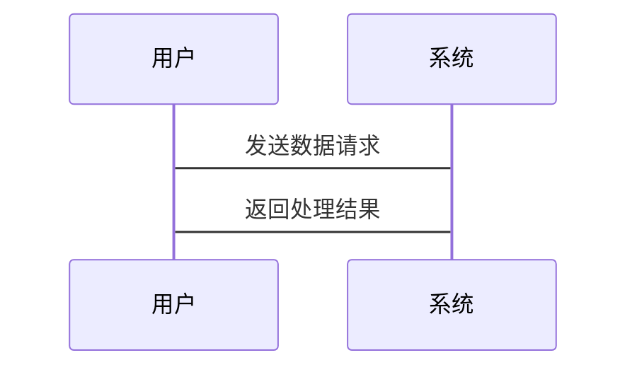

                 

<think>
好，我需要根据用户的要求，写一篇关于《如何将特价股票策略应用于数字另类贝塔捕捉策略》的技术博客文章。首先，我得理解特价股票策略和数字另类贝塔捕捉策略是什么，它们之间有什么联系，以及如何将特价股票策略应用到捕捉另类贝塔的过程中。

首先，特价股票策略主要是指在特定条件下以低于市场价购买股票的策略，通常利用市场中的短期价格波动或者信息不对称来获取超额收益。而数字另类贝塔捕捉策略则是通过大数据和算法来捕捉市场中的一些非传统收益来源，比如利用高频交易、另类数据源或者复杂的数学模型来实现。

接下来，我需要思考如何将特价股票策略的核心思想应用到数字另类贝塔捕捉策略中。可能的关键点在于利用大数据和算法来识别那些符合特价股票条件的股票，并利用这些信息构建一个能够捕捉贝塔收益的投资组合。

在具体实施过程中，我可能会遇到以下问题：如何有效地利用大数据来识别符合特价股票条件的股票？如何构建一个稳定的贝塔捕捉模型？如何在实际操作中进行风险控制和收益最大化？

为了更好地理解和解决这些问题，我需要分步骤进行分析：

1. **理解特价股票策略**：首先，我需要深入理解特价股票策略的定义、核心要素以及其在实际投资中的应用。

2. **理解数字另类贝塔捕捉策略**：接下来，我需要了解数字另类贝塔捕捉策略的基本概念、方法以及其与传统贝塔策略的区别。

3. **分析两者的结合点**：找到特价股票策略和数字另类贝塔捕捉策略之间的共通点和结合点，看看如何将特价股票策略的理念应用到贝塔捕捉策略中。

4. **数据准备与处理**：为了应用特价股票策略到贝塔捕捉策略，我需要收集和处理大量的金融数据，包括股票价格、交易量、市场情绪等。

5. **构建贝塔捕捉模型**：基于特价股票策略的核心思想，我需要构建一个贝塔捕捉模型，可能需要使用因子分析、机器学习等方法。

6. **优化与验证模型**：通过回测和实证分析，验证模型的有效性，并进行必要的优化和调整。

7. **风险管理与策略实施**：在实际应用中，如何控制风险，确保策略的稳定性和收益能力是关键。

在思考过程中，我可能会遇到一些问题，比如如何选择合适的数据源，如何处理噪声数据，如何避免过拟合等。这些问题需要逐一解决，确保最终的策略既有效又可靠。

总结一下，我需要系统地分析特价股票策略和数字另类贝塔捕捉策略的结合，从理论到实践，逐步构建一个能够有效捕捉贝塔收益的投资策略。这需要我在数据处理、模型构建、算法优化等多个方面进行深入研究和实践。
</think>

# 如何将特价股票策略应用于数字另类贝塔捕捉策略

> 关键词：特价股票策略，数字另类贝塔，捕捉策略，大数据，算法，投资组合优化

> 摘要：本文探讨如何将特价股票策略的核心思想应用于数字另类贝塔捕捉策略中，通过大数据和算法构建高效的贝塔捕捉模型，分析其在金融投资中的应用和优势，提供实际操作的步骤和案例。

---

# 第一章：特价股票策略概述

## 1.1 特价股票策略的基本概念

### 1.1.1 特价股票的定义

特价股票是指在特定市场条件下，价格低于其内在价值或市场公允价值的股票。这种价格差异通常源于市场短期波动、信息不对称或投资者情绪变化。

### 1.1.2 特价股票策略的核心要素

- **市场时机选择**：识别市场中的短期价格低估机会。
- **基本面分析**：评估股票的内在价值。
- **交易策略**：制定买入和卖出的具体操作规则。

### 1.1.3 特价股票策略的应用场景

- **短期投资**：利用短期价格波动快速获利。
- **价值投资**：长期持有具有低估潜力的股票。
- **市场套利**：在不同市场间 arbitrage 利差。

---

## 1.2 数字另类贝塔捕捉策略的背景

### 1.2.1 传统贝塔与另类贝塔的定义对比

- **传统贝塔（Beta）**：衡量资产价格与市场指数的相关性，反映系统性风险。
- **另类贝塔（Alternative Beta）**：通过大数据和算法捕捉非传统的收益来源，如高频交易、另类数据源。

### 1.2.2 数字技术在贝塔捕捉中的作用

- **大数据分析**：利用海量数据识别市场趋势。
- **算法交易**：通过算法优化交易时机和价格。

### 1.2.3 另类贝塔捕捉策略的优势

- **非相关性收益**：捕捉传统贝塔之外的收益来源。
- **风险分散**：通过多样化数据源降低风险。

---

# 第二章：另类贝塔的概念与特征

## 2.1 另类贝塔的定义与来源

### 2.1.1 另类贝塔的多维度来源

- **高频交易数据**：利用算法在极短时间内完成交易，捕捉微小价格波动。
- **另类数据源**：如社交媒体情绪数据、卫星图像数据等。

### 2.1.2 另类贝塔与传统贝塔的差异

| 特性 | 传统贝塔 | 另类贝塔 |
|------|----------|----------|
| 数据源 | 市场指数 | 多源数据 |
| 时间框架 | 长期 | 短期高频 |

---

## 2.2 另类贝塔捕捉策略的核心特征

### 2.2.1 数据驱动性

- 利用大数据进行预测和决策，而非传统的人为主观判断。

### 2.2.2 算法复杂性

- 采用复杂的数学模型和机器学习算法进行分析。

### 2.2.3 风险控制能力

- 通过算法优化，实时监控和调整投资组合，降低风险。

---

# 第三章：大数据在金融中的应用

## 3.1 大数据在金融分析中的重要性

### 3.1.1 数据量与数据质量

- 数据量大，但质量高，有助于发现潜在的投资机会。

### 3.1.2 数据多样性与分析深度

- 多样化的数据源提供了更全面的市场视角。

---

## 3.2 金融数据的获取与处理

### 3.2.1 数据源的选择

- 选择可靠的金融数据供应商，确保数据的准确性和及时性。

### 3.2.2 数据清洗与预处理

- 清洗数据中的噪声，处理缺失值和异常值。

### 3.2.3 数据存储与管理

- 使用数据库和大数据平台进行高效存储和管理。

---

# 第四章：算法模型与贝塔捕捉

## 4.1 因子分析模型

### 4.1.1 因子选择与权重分配

- 根据市场特性选择相关因子，并合理分配权重。

### 4.1.2 因子分析的数学模型

$$ r_i = \alpha + \beta_i r_m + \epsilon_i $$

其中，$r_i$ 是资产的收益，$\alpha$ 是截距，$\beta_i$ 是贝塔系数，$r_m$ 是市场收益，$\epsilon_i$ 是残差。

### 4.1.3 因子分析的优缺点

| 优点 | 缺点 |
|------|------|
| 解释性强 | 可能忽略非线性关系 |

---

## 4.2 机器学习算法在贝塔捕捉中的应用

### 4.2.1 常见机器学习算法概述

- **支持向量机（SVM）**：用于分类和回归。
- **随机森林（Random Forest）**：用于特征重要性分析。

### 4.2.2 支持向量机（SVM）的应用

- 通过SVM算法，识别市场中的非线性关系，捕捉潜在收益。

### 4.2.3 神经网络模型的构建

- 使用深度学习模型，如LSTM，捕捉时间序列中的复杂模式。

---

# 第五章：数学模型与贝塔收益计算

## 5.1 贝塔收益的数学公式

### 5.1.1 贝塔系数的计算公式

$$ \beta_i = \frac{Cov(r_i, r_m)}{Var(r_m)} $$

### 5.1.2 贝塔收益的计算公式

$$ r_{\beta} = \beta_i (r_m - r_f) + r_f $$

其中，$r_f$ 是无风险利率。

### 5.1.3 数学公式的实际应用

- 通过贝塔系数，评估资产的系统性风险，指导投资决策。

---

## 5.2 贝塔收益的优化模型

### 5.2.1 线性回归模型的应用

- 使用线性回归，分析资产收益与市场收益的关系。

### 5.2.2 最小二乘法的使用

$$ \hat{\beta} = \frac{\sum (x_i - \bar{x})(y_i - \bar{y})}{\sum (x_i - \bar{x})^2} $$

### 5.2.3 模型优化与参数调整

- 通过交叉验证，选择最优模型参数，提高预测精度。

---

# 第六章：系统设计与架构

## 6.1 系统架构设计

### 6.1.1 系统模块划分

- 数据采集模块：负责收集市场数据。
- 数据处理模块：清洗和预处理数据。
- 模型构建模块：建立贝塔捕捉模型。
- 交易执行模块：根据模型输出执行交易。

### 6.1.2 模块之间的交互关系



---

## 6.2 接口设计与交互流程

### 6.2.1 API接口的设计

- 使用RESTful API，定义清晰的接口规范。

### 6.2.2 接口交互的流程图



---

## 6.3 系统架构的优缺点

| 优点 | 缺点 |
|------|------|
| 高效性 | 复杂性较高 |

---

# 第七章：项目实战与案例分析

## 7.1 环境配置与工具安装

### 7.1.1 开发环境的选择

- 使用Python和相关金融分析库，如Pandas、NumPy。

### 7.1.2 数据库的安装与配置

- 使用MySQL或MongoDB存储金融数据。

### 7.1.3 开发工具的安装

- 安装Jupyter Notebook、Git等工具。

---

## 7.2 核心代码实现

### 7.2.1 数据获取与处理的代码

```python
import pandas as pd
import numpy as np

# 获取数据
data = pd.read_csv('stock_data.csv')

# 数据清洗
data = data.dropna()
```

### 7.2.2 算法模型的实现

```python
from sklearn.svm import SVC

# 训练SVM模型
model = SVC()
model.fit(X_train, y_train)
```

### 7.2.3 系统架构的代码实现

```python
class TradingSystem:
    def __init__(self):
        self.data = []
        self.models = []
```

---

## 7.3 实际案例分析和详细讲解

### 7.3.1 案例背景

- 选取某段时间内的股票数据，分析特价股票策略的应用效果。

### 7.3.2 模型表现分析

- 通过回测，评估模型的收益和风险指标，如夏普比率、最大回撤等。

---

## 7.4 项目小结

- 总结项目实施过程中的关键点和经验教训，为未来优化提供参考。

---

# 第八章：总结与展望

## 8.1 总结

- 本文详细探讨了如何将特价股票策略应用于数字另类贝塔捕捉策略，通过大数据和算法构建高效的贝塔捕捉模型。

## 8.2 未来展望

- 探讨进一步优化模型的可能性，如引入更多数据源和算法，提升模型的预测精度和稳定性。

---

作者：AI天才研究院/AI Genius Institute & 禅与计算机程序设计艺术 /Zen And The Art of Computer Programming

