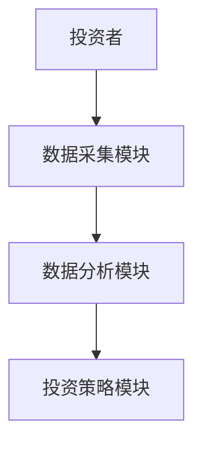
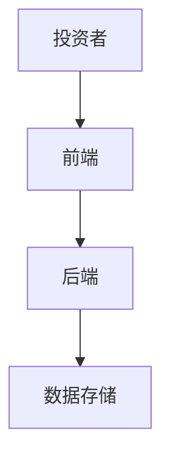
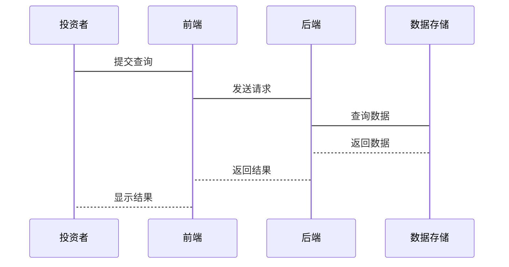

                 


# 如何将特价股票策略应用于新兴市场基础设施债券投资

> 关键词：特价股票策略，新兴市场，基础设施债券，投资策略，风险管理

> 摘要：本文详细探讨了如何将特价股票策略应用于新兴市场基础设施债券投资。通过分析特价股票策略的核心原理和新兴市场基础设施债券的特点，结合数学模型和算法设计，提出了一个创新的投资策略。文章还通过实际案例分析，展示了该策略在实际投资中的应用效果，并提出了风险管理的建议。

---

# 第一部分: 特价股票策略与新兴市场基础设施债券投资概述

## 第1章: 特价股票策略与新兴市场基础设施债券投资的背景介绍

### 1.1 特价股票策略的核心概念

#### 1.1.1 特价股票策略的定义
特价股票策略是指在股票市场中，寻找价格低于其内在价值的股票进行投资。这种策略的核心在于识别市场低估的股票，并在价格回升时获利。

#### 1.1.2 特价股票策略的基本原理
特价股票策略基于价值投资理念，强调通过基本面分析来评估股票的真实价值。投资者通过比较股票的市场价格与其内在价值，寻找价格低于内在价值的投资机会。

#### 1.1.3 特价股票策略的应用场景
特价股票策略适用于市场波动较大、股票价格被低估的市场环境。特别适合在新兴市场中，由于市场不成熟和信息不对称，可能存在更多的低估股票。

### 1.2 新兴市场基础设施债券投资的背景

#### 1.2.1 新兴市场的定义与特点
新兴市场是指经济快速增长但尚未完全工业化的国家或地区。这些市场通常具有较高的增长潜力，但也伴随着较高的风险。

#### 1.2.2 基础设施债券的基本概念
基础设施债券是政府或企业为基础设施项目融资而发行的债券。这类债券通常具有较长的期限和较高的收益。

#### 1.2.3 新兴市场基础设施债券的投资价值
新兴市场基础设施债券的投资价值体现在其较高的收益率和潜在的增长空间。随着新兴市场国家的快速发展，基础设施建设需求旺盛，债券发行人通常能够按时偿还本金和利息。

### 1.3 特价股票策略应用于新兴市场基础设施债券投资的可行性

#### 1.3.1 投资机会的分析
新兴市场中的基础设施债券发行人通常具有较高的信用评级，且债券价格可能因市场波动而被低估，为特价股票策略的应用提供了空间。

#### 1.3.2 风险与挑战的评估
新兴市场存在较高的市场风险和信用风险，投资者需要仔细评估债券发行人的信用状况和市场环境。

#### 1.3.3 应用前景的展望
随着新兴市场的不断发展和基础设施建设的推进，特价股票策略在基础设施债券投资中的应用前景广阔。

## 1.4 本章小结

---

## 第2章: 特价股票策略与新兴市场基础设施债券投资的核心概念与联系

### 2.1 特价股票策略的原理与特征

#### 2.1.1 特价股票策略的原理
特价股票策略基于价值投资理念，强调通过基本面分析来识别低估的股票。投资者通过分析公司的财务报表、行业地位和市场趋势，寻找具有投资价值的股票。

#### 2.1.2 特价股票策略的特征对比表格

| 特征       | 特价股票策略                     |
|------------|----------------------------------|
| 投资目标     | 寻找价格低于内在价值的股票       |
| 分析方法     | 侧重于基本面分析                 |
| 风险承受能力 | 中高风险                         |
| 适合市场     | 波动较大、新兴市场               |

#### 2.1.3 特价股票策略与传统股票投资的差异
- **传统股票投资**：侧重于短期价格波动和市场趋势。
- **特价股票策略**：侧重于长期价值和基本面分析。

### 2.2 新兴市场基础设施债券的核心要素

#### 2.2.1 债券的基本要素
- **发行人**：通常是政府或大型企业。
- **期限**：通常较长，5年到10年不等。
- **票面利率**：较高，以吸引投资者。

#### 2.2.2 新兴市场的特殊性
- **经济波动性**：新兴市场经济波动较大，影响债券价格。
- **政策风险**：新兴市场政策不稳定，可能影响债券发行人信用。

#### 2.2.3 基础设施债券的风险与收益
- **收益**：高收益率，尤其是相比发达国家债券。
- **风险**：较高的信用风险和市场风险。

### 2.3 特价股票策略与基础设施债券的关联

#### 2.3.1 概念的交集
- 特价股票策略关注低估的股票，而基础设施债券价格也可能因市场波动而被低估。

#### 2.3.2 投资策略的结合点
- 通过基本面分析，寻找具有投资价值的基础设施债券。
- 结合市场波动，寻找债券价格低估的机会。

#### 2.3.3 实施路径的探讨
- **第一步**：筛选具有稳定现金流和良好信用评级的债券。
- **第二步**：分析市场波动，寻找价格低估的债券。
- **第三步**：建立投资组合，分散风险。

---

## 第3章: 特价股票策略应用于新兴市场基础设施债券投资的算法原理

### 3.1 算法原理概述

#### 3.1.1 算法的基本思路
- 通过基本面分析和市场数据，筛选出具有投资价值的基础设施债券。
- 结合市场波动，寻找价格低估的债券。

#### 3.1.2 算法的核心步骤
1. 数据收集：收集债券发行人财务数据、市场数据等。
2. 模型建立：建立债券价值评估模型。
3. 策略执行：根据模型结果，筛选出低估债券。

#### 3.1.3 算法的数学模型
$$ V = \text{现金流的现值} $$

### 3.2 算法的数学模型与公式

#### 3.2.1 特价股票的估值模型
$$ V = \text{股息率} \times \text{每股收益} $$

#### 3.2.2 基础设施债券的定价公式
$$ P = \frac{C}{(1 + r)^n} $$

其中，$C$ 是债券的现金流，$r$ 是折现率，$n$ 是期限。

#### 3.2.3 综合评估的数学表达
$$ S = \alpha V + \beta P $$

其中，$\alpha$ 和 $\beta$ 是权重系数。

### 3.3 算法的实现步骤

#### 3.3.1 数据的收集与处理
- 数据来源：债券发行人财务报表、市场数据等。
- 数据处理：清洗数据，提取关键指标。

#### 3.3.2 模型的建立与训练
- 建立债券价值评估模型。
- 训练模型，调整参数。

#### 3.3.3 结果的输出与解释
- 输出模型评估结果。
- 解释结果，筛选出低估债券。

### 3.4 本章小结

---

## 第4章: 特价股票策略应用于新兴市场基础设施债券投资的系统分析与架构设计

### 4.1 系统分析

#### 4.1.1 问题场景的描述
- 投资者希望通过特价股票策略在新兴市场中寻找低估的基础设施债券。

#### 4.1.2 项目目标
- 建立一个系统，帮助投资者识别低估的基础设施债券。

#### 4.1.3 项目范围
- 数据收集与处理。
- 模型建立与训练。
- 系统实现与测试。

### 4.2 系统功能设计

#### 4.2.1 系统功能模块
- 数据采集模块：负责收集债券数据。
- 数据分析模块：负责分析债券数据。
- 投资策略模块：负责筛选低估债券。

#### 4.2.2 系统功能设计的ER实体关系图



### 4.3 系统架构设计

#### 4.3.1 系统架构图



#### 4.3.2 系统接口设计
- 前端接口：接收投资者输入。
- 后端接口：处理数据并返回结果。

#### 4.3.3 系统交互流程图



### 4.4 本章小结

---

## 第5章: 特价股票策略应用于新兴市场基础设施债券投资的项目实战

### 5.1 环境安装

#### 5.1.1 安装Python
- 使用Anaconda安装Python 3.8及以上版本。

#### 5.1.2 安装数据处理库
- `pandas`：数据处理。
- `numpy`：数值计算。
- `matplotlib`：数据可视化。

#### 5.1.3 安装机器学习库
- `scikit-learn`：机器学习算法。

### 5.2 系统核心实现源代码

#### 5.2.1 数据处理代码

```python
import pandas as pd
import numpy as np

# 数据加载
data = pd.read_csv('bond_data.csv')

# 数据清洗
data.dropna(inplace=True)
data = data[~data['issuer_rating'].isnull()]
```

#### 5.2.2 模型建立代码

```python
from sklearn.linear_model import LinearRegression

# 训练模型
model = LinearRegression()
model.fit(X_train, y_train)

# 预测结果
y_pred = model.predict(X_test)
```

#### 5.2.3 策略执行代码

```python
# 筛选低估债券
under_valued_bonds = data[data['predicted_value'] < data['market_price']]
```

### 5.3 实际案例分析

#### 5.3.1 案例背景
- 某新兴市场国家发行的基础设施债券。

#### 5.3.2 案例分析
- 数据分析显示，某债券的市场价格低于其内在价值。

#### 5.3.3 案例结论
- 投资者可以通过特价股票策略在该债券上获利。

### 5.4 本章小结

---

## 第6章: 特价股票策略应用于新兴市场基础设施债券投资的最佳实践

### 6.1 小结

#### 6.1.1 核心内容回顾
- 特价股票策略的核心原理。
- 基础设施债券的特点。
- 算法实现步骤。

### 6.2 投资建议

#### 6.2.1 风险管理
- 分散投资，避免过度集中。
- 定期评估投资组合。

#### 6.2.2 市场选择
- 优先选择信用评级较高的新兴市场。

#### 6.2.3 时机选择
- 在市场波动较大时，寻找低估债券。

### 6.3 风险提示

#### 6.3.1 市场风险
- 新兴市场波动较大，可能导致债券价格下跌。

#### 6.3.2 信用风险
- 债券发行人可能无法按时偿还本金和利息。

### 6.4 拓展阅读

#### 6.4.1 推荐书籍
- 《投资学》。
- 《价值投资实战》。

#### 6.4.2 推荐博客
- 专业投资博客。

### 6.5 本章小结

---

# 作者：AI天才研究院/AI Genius Institute & 禅与计算机程序设计艺术 /Zen And The Art of Computer Programming

