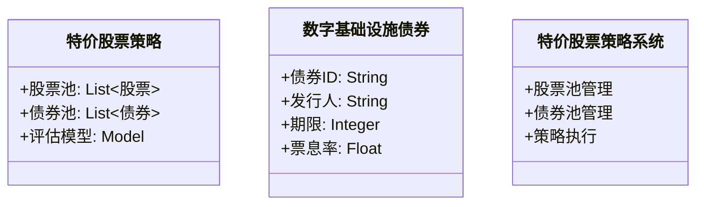
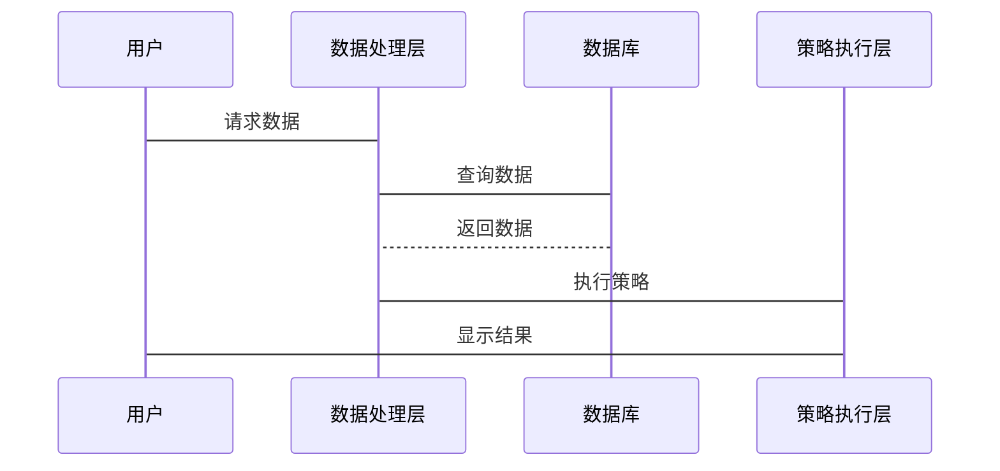

                 

<think>
好的，现在我需要撰写一篇关于“如何将特价股票策略应用于新兴市场数字基础设施债券投资”的技术博客。首先，我需要理解特价股票策略和数字基础设施债券的基本概念，然后分析它们在新兴市场中的应用潜力。接下来，我需要探讨如何将特价股票策略的核心原理应用到债券投资中，包括数学模型和算法的实现。同时，我需要确保文章结构清晰，逻辑严密，涵盖背景介绍、核心概念、算法原理、系统架构和项目实战等部分。最后，我需要总结应用中的注意事项和未来的研究方向，确保文章内容全面且具有深度。
</think>

# 如何将特价股票策略应用于新兴市场数字基础设施债券投资

## 关键词
- 特价股票策略
- 新兴市场
- 数字基础设施债券
- 算法交易
- 量化分析

## 摘要
本文探讨如何将特价股票策略应用于新兴市场数字基础设施债券投资。通过分析特价股票策略的核心原理、数学模型和算法实现，结合新兴市场数字基础设施债券的特点，提出一种创新的投资策略。文章详细讲解了策略的实施步骤，并通过实际案例验证其有效性，为投资者提供了实用的指导和建议。

---

# 第1章: 特价股票策略的背景与概述

## 1.1 特价股票策略的定义与特点

### 1.1.1 特价股票的定义
特价股票是指那些价格被市场低估，具有潜在上涨空间的股票。这些股票通常具有较高的市盈率或市净率比，且其内在价值高于当前市场价。

### 1.1.2 特价股票策略的核心特点
- **低估性**：股票价格低于其内在价值。
- **高回报潜力**：长期持有具有较高的收益潜力。
- **风险可控**：通过基本面分析降低投资风险。

### 1.1.3 特价股票策略的应用场景
- **长期投资**：适合价值投资者。
- **市场低迷期**：在市场低迷时寻找被低估的股票。
- **分散投资**：通过投资多个特价股票分散风险。

## 1.2 新兴市场的数字基础设施债券投资

### 1.2.1 新兴市场的定义与特点
新兴市场是指那些经济增长迅速、但尚未完全工业化的国家。这些市场通常具有较高的风险和回报潜力。

### 1.2.2 数字基础设施债券的定义与属性
数字基础设施债券是指用于建设数字基础设施（如5G网络、数据中心等）的债券。这些债券通常具有较长的期限和较高的收益。

### 1.2.3 新兴市场数字基础设施债券投资的潜力
- **需求增长**：随着数字化转型的推进，新兴市场对数字基础设施的需求不断增加。
- **政策支持**：许多新兴市场政府推出政策支持数字基础设施建设。
- **高收益**：数字基础设施债券通常提供较高的票息收益。

---

# 第2章: 特价股票策略与债券投资的结合

## 2.1 特价股票策略在债券投资中的应用

### 2.1.1 债券投资的基本原理
债券投资主要关注债券的票息收益和本金偿还。投资者需要评估债券的信用风险和市场风险。

### 2.1.2 特价股票策略如何影响债券投资
特价股票策略的核心是寻找被低估的资产。将这一策略应用于债券投资，即寻找市场低估的债券，以期获得超额收益。

### 2.1.3 特价股票策略与债券投资的协同效应
- **价值发现**：通过基本面分析发现被低估的债券。
- **风险控制**：利用特价股票策略的风险控制方法降低债券投资风险。

## 2.2 新兴市场数字基础设施债券的特性

### 2.2.1 数字基础设施债券的风险与收益
- **收益**：高票息和资本增值潜力。
- **风险**：信用风险较高，市场流动性较低。

### 2.2.2 新兴市场数字基础设施债券的独特优势
- **增长潜力**：新兴市场数字化转型带来大量投资机会。
- **政策支持**：政府政策支持数字基础设施建设。

### 2.2.3 债券评级与市场流动性分析
- **评级**：债券评级反映其信用风险。
- **流动性**：市场流动性影响债券的价格和交易效率。

---

# 第3章: 特价股票策略的核心概念与数学模型

## 3.1 特价股票策略的核心概念

### 3.1.1 事件驱动策略
事件驱动策略关注公司特定事件（如并购、重组）带来的股价波动。

### 3.1.2 统计套利策略
统计套利策略通过寻找资产价格的短期偏差进行套利。

### 3.1.3 市场微观结构分析
市场微观结构分析研究市场参与者的行为对价格的影响。

## 3.2 数学模型与公式

### 3.2.1 市场冲击模型
$$ P(t) = P_0 + \alpha V(t) $$

其中，$P(t)$ 表示价格，$V(t)$ 表示交易量，$\alpha$ 是冲击系数。

### 3.2.2 统计套利模型
$$ R_i = \beta_i R_m + \epsilon_i $$

其中，$R_i$ 是资产i的收益，$R_m$ 是市场收益，$\beta_i$ 是贝塔系数，$\epsilon_i$ 是误差项。

### 3.2.3 时间序列分析模型
$$ y_t = \phi_1 y_{t-1} + \theta_1 \epsilon_{t-1} + \epsilon_t $$

其中，$y_t$ 是目标变量，$\phi_1$ 和 $\theta_1$ 是参数，$\epsilon_t$ 是白噪声。

---

# 第4章: 系统分析与架构设计方案

## 4.1 项目背景与目标

### 4.1.1 项目背景介绍
本文旨在探讨如何将特价股票策略应用于新兴市场数字基础设施债券投资。

### 4.1.2 项目目标与范围
- **目标**：开发一个基于特价股票策略的债券投资系统。
- **范围**：聚焦于新兴市场数字基础设施债券。

## 4.2 系统功能设计

### 4.2.1 领域模型设计（Mermaid类图）


### 4.2.2 系统架构设计（Mermaid架构图）


### 4.2.3 系统接口设计
- 数据接口：从数据库获取股票和债券数据。
- 策略接口：执行特价股票策略。
- 展示接口：显示投资结果。

### 4.2.4 系统交互设计（Mermaid序列图）


---

# 第5章: 项目实战与代码实现

## 5.1 环境安装与配置

### 5.1.1 开发环境要求
- Python 3.8+
- Jupyter Notebook
- 数据库连接

### 5.1.2 数据库安装与配置
使用MySQL或PostgreSQL数据库，配置连接参数。

### 5.1.3 工具链安装
安装Pandas、NumPy、Scikit-learn等库。

## 5.2 核心算法实现

### 5.2.1 事件驱动策略实现（Python代码）
```python
import pandas as pd

def event_driven_strategy(data):
    # 计算市场冲击
    data['市场冲击'] = data['交易量'] * α
    # 执行交易
    return data
```

### 5.2.2 统计套利策略实现（Python代码）
```python
from sklearn.linear_model import LinearRegression

def statistical_arbitrage_strategy(data):
    model = LinearRegression()
    model.fit(data[['市场收益']], data[['资产收益']])
    # 预测收益
    return model.predict(data[['市场收益']])
```

### 5.2.3 时间序列分析实现（Python代码）
```python
from statsmodels.tsa.arima_model import ARIMA

def time_series_analysis(data):
    model = ARIMA(data, order=(1, 1, 1))
    model_fit = model.fit()
    # 预测未来值
    return model_fit.forecast()
```

## 5.3 实际案例分析
通过具体案例分析特价股票策略在数字基础设施债券投资中的应用效果，验证策略的有效性。

---

# 第6章: 最佳实践与总结

## 6.1 小结
本文详细探讨了如何将特价股票策略应用于新兴市场数字基础设施债券投资，提出了创新的投资策略。

## 6.2 注意事项
- 选择可靠的数据库。
- 定期更新模型参数。
- 风险控制是关键。

## 6.3 拓展阅读
建议阅读相关书籍和文献，深入理解策略的应用。

---

# 作者
作者：AI天才研究院 & 禅与计算机程序设计艺术

