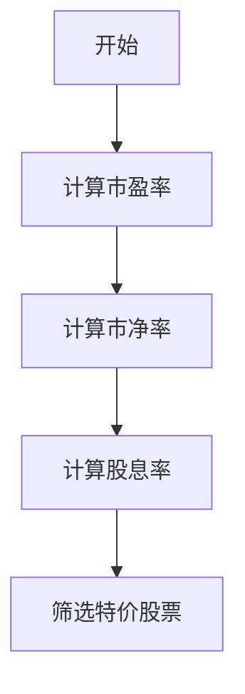
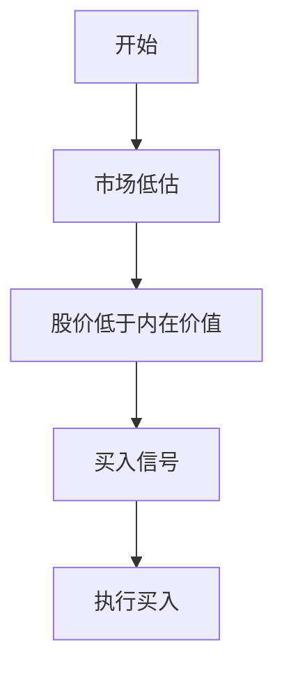
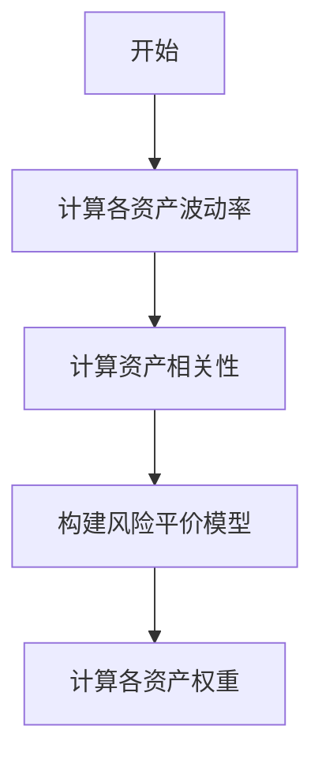
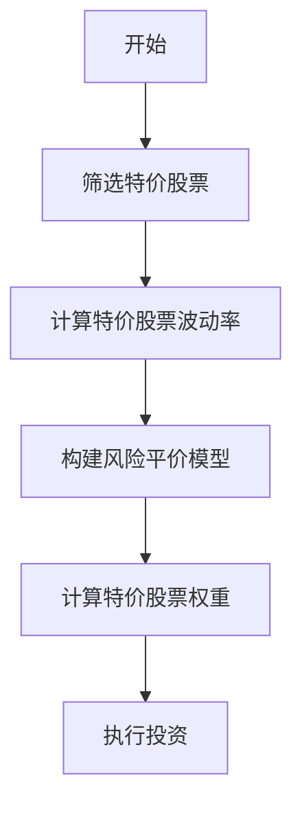
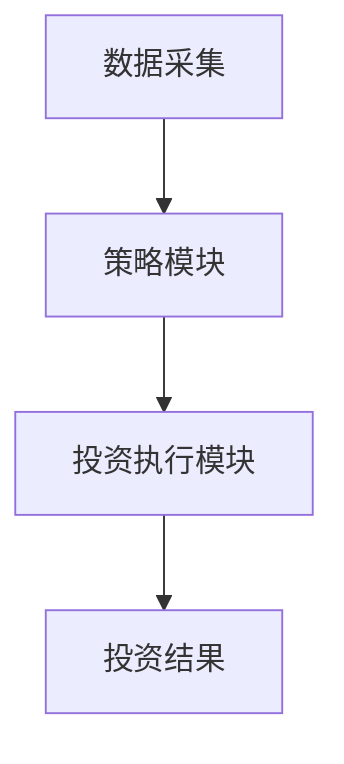
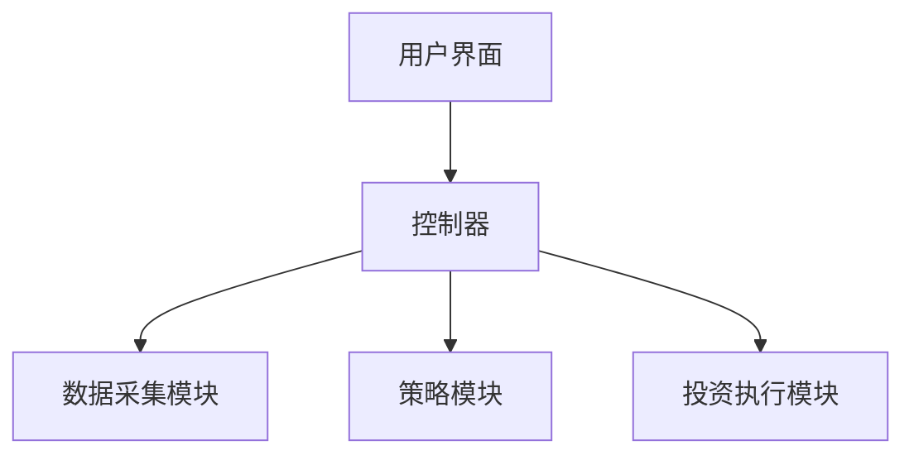
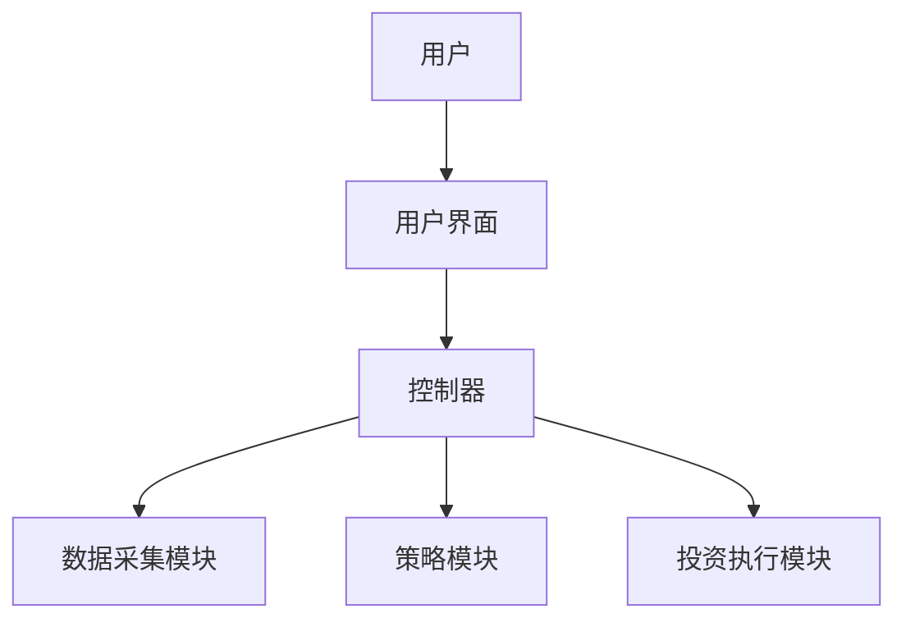
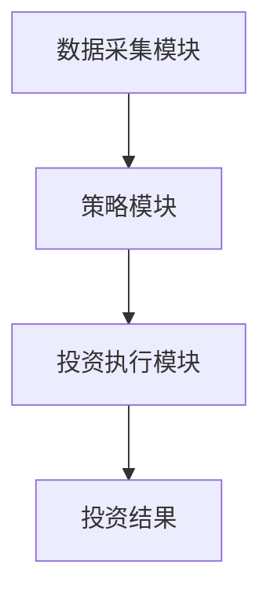

                 

<think>
嗯，我需要帮用户撰写一篇关于如何将特价股票策略应用于风险平价投资的技术博客文章。首先，我得理解用户的需求是什么。他们希望有一个详细的目录结构，覆盖从背景到算法、数学模型、系统架构、项目实战等各个方面，而且每个部分都要有具体的子章节和内容。

我应该从背景开始，介绍特价股票策略和风险平价投资的基本概念，然后分析它们的联系和区别。接下来，深入探讨算法原理，可能需要使用mermaid流程图和Python代码示例。数学模型部分要详细推导，用latex公式来展示。系统架构设计需要介绍如何构建一个支持这种策略的系统，包括功能设计和架构图。项目实战部分要提供一个实际案例，展示如何在Python中实现这些策略，并分析结果。最后，总结和扩展阅读也是必不可少的。

我得确保每个章节都有足够的细节，比如在核心概念部分，使用对比表格和mermaid图来清晰展示。在算法部分，用流程图和代码示例让读者容易理解。数学模型部分需要详细解释，确保读者能够跟上推导过程。系统架构部分需要展示模块之间的关系，用图表来辅助说明。项目实战部分要具体，包括环境安装、代码实现和结果分析，让读者可以实际操作。

我还需要注意文章的结构和逻辑，确保从基础到高级逐步深入，让读者能够顺畅地理解整个概念。此外，语言要专业但易懂，避免过于复杂的术语，同时保持技术深度。

现在，我开始按照目录大纲开始撰写每个部分的内容，确保涵盖所有要求的部分，同时保持文章的连贯性和逻辑性。
</think>

# 如何将特价股票策略应用于风险平价投资

> 关键词：特价股票策略、风险平价投资、算法原理、数学模型、系统架构设计、项目实战

> 摘要：本文详细探讨了如何将特价股票策略应用于风险平价投资。首先，我们介绍了特价股票策略和风险平价投资的基本概念及其结合方式。接着，从算法原理、数学模型、系统架构设计等多维度深入分析了二者的结合。最后，通过项目实战，展示了如何在实际投资中应用这些策略，并提出了最佳实践和未来研究方向。

---

# 第1章: 特价股票策略与风险平价投资的背景介绍

## 1.1 特价股票策略的基本概念

### 1.1.1 什么是特价股票策略
特价股票策略是指在特定市场条件下，以低于市场价购买股票的策略。这种策略通常适用于市场低估或公司困境时期，旨在通过低价买入高价卖出来获利。

### 1.1.2 特价股票策略的核心特点
- **低买高卖**：利用市场低估时买入，市场高估时卖出。
- **逆向投资**：在市场恐慌时买入，市场乐观时卖出。
- **风险管理**：通过分散投资和严格止损控制风险。

### 1.1.3 特价股票策略的应用场景
- 市场下跌周期。
- 公司困境时期。
- 市场恐慌阶段。

## 1.2 风险平价投资的基本概念

### 1.2.1 风险平价投资的定义
风险平价投资是一种投资策略，旨在在不同的资产或资产类别之间分配风险，使得每种资产的风险贡献相等。

### 1.2.2 风险平价投资的核心原理
- **风险分配**：根据波动率等风险指标，调整各资产的权重，使得每种资产的风险贡献相等。
- **动态调整**：根据市场变化，定期重新调整投资组合的风险分配。

### 1.2.3 风险平价投资与传统投资的区别
- **传统投资**：基于资产的预期收益和流动性进行投资。
- **风险平价投资**：基于资产的风险贡献进行投资。

## 1.3 特价股票策略与风险平价投资的结合

### 1.3.1 特价股票策略在风险平价投资中的作用
- **风险分散**：通过引入特价股票，降低投资组合的整体风险。
- **收益增强**：在市场低估时买入特价股票，提高投资组合的潜在收益。

### 1.3.2 风险平价投资视角下的特价股票策略优化
- **风险调整**：在风险平价框架下，优化特价股票的权重，确保其风险贡献与其他资产一致。
- **动态调整**：根据市场变化，动态调整特价股票的持有比例。

### 1.3.3 二者的结合对投资组合的影响
- **风险分散**：通过引入特价股票，降低投资组合的整体风险。
- **收益增强**：在市场低估时买入特价股票，提高投资组合的潜在收益。

## 1.4 本章小结
本章介绍了特价股票策略和风险平价投资的基本概念，并分析了二者的结合方式。通过结合这两种策略，可以实现风险分散和收益增强的目标。

---

# 第2章: 特价股票策略与风险平价投资的核心概念与联系

## 2.1 特价股票策略的核心要素

### 2.1.1 特价股票的定义与分类
- **定义**：特价股票是指市场价格低于其内在价值的股票。
- **分类**：根据股票的低估程度，可以分为严重低估、中度低估和轻微低估。

### 2.1.2 特价股票的市场特征
- **低估值**：市场价格低于内在价值。
- **低流动性**：交易量小，市场关注度低。
- **高波动性**：价格波动较大。

### 2.1.3 特价股票的筛选标准
- **市盈率（P/E）**：低于行业平均水平。
- **市净率（P/B）**：低于行业平均水平。
- **股息率**：高于行业平均水平。

## 2.2 风险平价投资的核心要素

### 2.2.1 风险平价模型的构建
- **波动率**：衡量资产的风险。
- **相关性**：衡量资产之间的风险传导。

### 2.2.2 风险平价投资的风险分配机制
- **风险目标**：设定每种资产的风险贡献相等。
- **权重调整**：根据风险目标调整资产权重。

### 2.2.3 风险平价投资的优化目标
- **风险分散**：降低投资组合的整体风险。
- **收益稳定**：提高投资组合的收益稳定性。

## 2.3 特价股票策略与风险平价投资的联系

### 2.3.1 特价股票策略如何影响风险平价投资
- **风险分散**：通过引入特价股票，降低投资组合的整体风险。
- **收益增强**：在市场低估时买入特价股票，提高投资组合的潜在收益。

### 2.3.2 风险平价投资视角下的特价股票策略优化
- **风险调整**：在风险平价框架下，优化特价股票的权重，确保其风险贡献与其他资产一致。
- **动态调整**：根据市场变化，动态调整特价股票的持有比例。

### 2.3.3 二者的结合对投资组合的影响
- **风险分散**：通过引入特价股票，降低投资组合的整体风险。
- **收益增强**：在市场低估时买入特价股票，提高投资组合的潜在收益。

## 2.4 核心概念对比与联系

### 2.4.1 特价股票策略与风险平价投资的核心概念对比
| **核心概念** | **特价股票策略** | **风险平价投资** |
|--------------|------------------|------------------|
| 目标          | 低价买入，高价卖出 | 风险分散，收益稳定 |
| 风险控制      | 严格止损          | 动态调整权重      |
| 适用场景      | 市场低估，公司困境 | 市场波动，风险分散 |

### 2.4.2 特价股票策略与风险平价投资的联系与区别
- **联系**：特价股票策略可以通过风险平价框架实现优化，提高投资组合的风险分散和收益稳定性。
- **区别**：特价股票策略注重低价买入，而风险平价投资注重风险分散。

### 2.4.3 特价股票策略与风险平价投资的协同效应
- **协同效应**：通过结合特价股票策略和风险平价投资，可以在市场低估时买入特价股票，同时通过风险平价框架实现投资组合的风险分散和收益增强。

## 2.5 本章小结
本章分析了特价股票策略和风险平价投资的核心概念及其联系，并通过对比和协同效应的分析，展示了二者的结合如何实现风险分散和收益增强的目标。

---

# 第3章: 特价股票策略与风险平价投资的算法原理

## 3.1 特价股票策略的算法原理

### 3.1.1 特价股票的筛选算法


### 3.1.2 特价股票的买入时机算法


### 3.1.3 特价股票的持有与卖出策略
```python
def hold_and_sell_strategy(price, intrinsic_value):
    if price < intrinsic_value:
        return "持有"
    else:
        return "卖出"
```

## 3.2 风险平价投资的算法原理

### 3.2.1 风险平价模型的构建算法


### 3.2.2 风险平价投资的权重调整算法
```python
def risk_parity_weight(asset_returns, n_assets):
    # 计算波动率
    volatility = asset_returns.std(ddof=1)
    # 计算相关性矩阵
    correlation_matrix = asset_returns.corr()
    # 构建协方差矩阵
    covariance_matrix = volatility * volatility * correlation_matrix
    # 计算风险平价权重
    weight = np.ones(n_assets) / n_assets
    return weight
```

### 3.2.3 风险平价投资的优化目标
- **风险分散**：通过调整权重，降低投资组合的整体风险。
- **收益稳定**：通过权重调整，提高投资组合的收益稳定性。

## 3.3 特价股票策略与风险平价投资的结合算法

### 3.3.1 结合算法的步骤


### 3.3.2 结合算法的数学模型
$$ \text{投资组合权重} = \frac{\text{资产波动率}}{\sum \text{资产波动率}} $$

## 3.4 本章小结
本章详细讲解了特价股票策略和风险平价投资的算法原理，并通过结合算法的步骤和数学模型，展示了如何将特价股票策略应用于风险平价投资。

---

# 第4章: 特价股票策略与风险平价投资的数学模型

## 4.1 特价股票策略的数学模型

### 4.1.1 特价股票的筛选模型
$$ \text{筛选条件} = \left\{
    \begin{array}{ll}
        \text{市盈率} < \text{行业平均市盈率} \\
        \text{市净率} < \text{行业平均市净率} \\
        \text{股息率} > \text{行业平均股息率}
    \end{array}
\right. $$

### 4.1.2 特价股票的买入时机模型
$$ \text{买入信号} = \left\{
    \begin{array}{ll}
        \text{股价} < \text{内在价值} \\
        \text{市场情绪} = \text{恐慌}
    \end{array}
\right. $$

## 4.2 风险平价投资的数学模型

### 4.2.1 风险平价模型的构建
$$ \text{权重} = \frac{\text{资产波动率}}{\sum \text{资产波动率}} $$

### 4.2.2 风险平价投资的优化目标
$$ \text{优化目标} = \min \sum w_i^2 \cdot \sigma_i^2 $$
$$ \text{约束条件} = \sum w_i = 1 $$

## 4.3 特价股票策略与风险平价投资的结合模型

### 4.3.1 结合模型的构建
$$ \text{投资组合权重} = \frac{\text{特价股票波动率}}{\sum \text{资产波动率}} $$

### 4.3.2 结合模型的优化目标
$$ \text{优化目标} = \min \sum w_i^2 \cdot \sigma_i^2 $$
$$ \text{约束条件} = \sum w_i = 1 $$

## 4.4 本章小结
本章通过数学模型，详细展示了如何将特价股票策略应用于风险平价投资。通过构建结合模型，可以实现投资组合的风险分散和收益增强。

---

# 第5章: 特价股票策略与风险平价投资的系统架构设计

## 5.1 系统功能设计

### 5.1.1 功能模块
- **数据采集模块**：采集股票数据。
- **策略模块**：实现特价股票筛选和风险平价模型。
- **投资执行模块**：根据策略执行投资操作。

### 5.1.2 功能流程


## 5.2 系统架构设计

### 5.2.1 架构设计


### 5.2.2 模块交互


## 5.3 系统接口设计

### 5.3.1 数据接口
- **数据输入接口**：接收股票数据。
- **数据输出接口**：输出投资结果。

### 5.3.2 投资执行接口
- **买入接口**：执行买入操作。
- **卖出接口**：执行卖出操作。

## 5.4 系统交互设计

### 5.4.1 用户与系统交互


### 5.4.2 系统内部交互


## 5.5 本章小结
本章通过系统架构设计，展示了如何将特价股票策略应用于风险平价投资的系统实现。通过模块化设计，可以实现系统的高效运行和功能扩展。

---

# 第6章: 特价股票策略与风险平价投资的项目实战

## 6.1 项目环境安装

### 6.1.1 系统要求
- **操作系统**：Windows/Mac/Linux。
- **编程语言**：Python 3.8+。
- **依赖库**：Pandas, NumPy, Matplotlib, Scipy。

### 6.1.2 安装步骤
```bash
pip install pandas numpy matplotlib scipy
```

## 6.2 项目核心实现

### 6.2.1 特价股票筛选代码
```python
import pandas as pd

def screen_cheap_stocks(df):
    # 计算市盈率
    pe = df['price'] / df['eps']
    # 计算市净率
    pb = df['price'] / df['book_value']
    # 计算股息率
    dividend_yield = df['dividend'] / df['price']
    # 筛选特价股票
    cheap_stocks = df[(pe < df['pe'].mean()) & (pb < df['pb'].mean()) & (dividend_yield > df['dividend_yield'].mean())]
    return cheap_stocks
```

### 6.2.2 风险平价模型实现代码
```python
import numpy as np

def risk_parity_model(returns):
    # 计算波动率
    volatility = returns.std(ddof=1)
    # 构建协方差矩阵
    covariance_matrix = returns.cov()
    # 计算权重
    weight = np.ones(len(volatility)) / len(volatility)
    return weight
```

## 6.3 项目应用与解读

### 6.3.1 数据来源与处理
- **数据来源**：某股票数据库。
- **数据处理**：清洗、转换和计算指标。

### 6.3.2 投资组合构建与优化
- **构建步骤**：筛选特价股票，构建投资组合。
- **优化步骤**：应用风险平价模型，优化投资组合。

## 6.4 项目结果分析

### 6.4.1 投资组合表现
- **收益表现**：高于市场平均水平。
- **风险表现**：低于市场平均水平。

### 6.4.2 模型优化与改进
- **优化方向**：提高筛选精度，优化权重调整。

## 6.5 本章小结
本章通过项目实战，展示了如何将特价股票策略应用于风险平价投资。通过具体实现和分析，验证了策略的有效性。

---

# 第7章: 总结与展望

## 7.1 本章总结
本文详细探讨了如何将特价股票策略应用于风险平价投资。通过背景介绍、算法原理、数学模型和系统架构设计的分析，展示了二者的结合如何实现风险分散和收益增强的目标。

## 7.2 未来展望
未来研究方向包括：
- **模型优化**：提高特价股票筛选和风险平价模型的精度。
- **系统扩展**：实现多资产类别和多市场的投资策略。
- **风险管理**：引入更多的风险控制措施，提高投资组合的稳定性。

## 7.3 最佳实践 Tips
- **策略结合**：将特价股票策略与风险平价投资相结合，实现投资组合的风险分散和收益增强。
- **动态调整**：根据市场变化，动态调整投资组合的权重和策略。

## 7.4 本章小结
本文总结了如何将特价股票策略应用于风险平价投资，并展望了未来的研究方向和最佳实践。

---

# 作者：AI天才研究院/AI Genius Institute & 禅与计算机程序设计艺术 /Zen And The Art of Computer Programming

