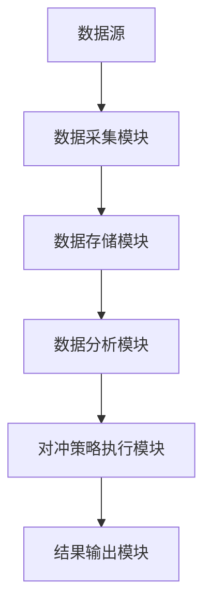
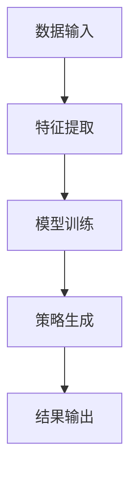

                 


# 如何将特价股票策略融入多元化数字资产对冲组合

## 关键词：特价股票，数字资产，对冲组合，量化交易，风险管理

## 摘要：  
本文详细探讨了如何将特价股票策略融入多元化数字资产对冲组合的策略、方法和实现路径。首先介绍了特价股票策略的基本概念和数字资产对冲的原理，然后分析了两者的结合对投资组合的影响，通过量化分析和数学模型对策略进行深入探讨，最后给出了实际项目实现的步骤和注意事项，帮助读者系统地理解和应用这一策略。

---

# 第1章 特价股票策略与数字资产对冲的基本概念

## 1.1 特价股票策略的定义与特点

### 1.1.1 特价股票的定义  
特价股票是指市场价格低于其内在价值的股票。通常，这些股票被市场低估，具有较高的投资潜力。  

### 1.1.2 特价股票策略的核心特点  
- **低估性**：市场价格低于内在价值。  
- **长期性**：投资目标为长期增值。  
- **选择性**：筛选具有竞争优势的企业。  

### 1.1.3 特价股票策略与传统股票投资的区别  
| 特点 | 特价股票策略 | 传统股票投资 |
|------|--------------|---------------|
| 投资目标 | 追求价值回归 | 追求短期收益 |
| 风险偏好 | 低风险偏好 | 高风险偏好 |
| 策略周期 | 长期 | 短期或中期 |

---

## 1.2 数字资产对冲的基本概念

### 1.2.1 数字资产的定义与分类  
数字资产包括比特币、以太坊等加密货币，以及NFTs（非同质化代币）等。  

### 1.2.2 对冲策略的定义与作用  
对冲策略是指通过同时买入和卖出相关资产，以降低投资组合的波动性和风险。  

### 1.2.3 数字资产对冲与传统金融对冲的对比  
| 对比维度 | 数字资产对冲 | 传统金融对冲 |
|----------|--------------|---------------|
| 资产类型 | 数字货币、NFTs | 股票、债券、外汇 |
| 交易频率 | 高频交易为主 | 可变，取决于策略 |
| 风险控制 | 更依赖技术手段 | 更依赖市场分析 |

---

## 1.3 特价股票策略融入数字资产对冲的意义

### 1.3.1 数字资产对冲的优势  
- **高波动性**：数字资产价格波动大，提供套利机会。  
- **去中心化**：降低交易成本和中间环节。  

### 1.3.2 特价股票策略的潜在收益  
- **价值发现**：发现被市场低估的数字资产。  
- **分散风险**：通过多元化配置降低风险。  

### 1.3.3 两者的结合对投资组合的影响  
- **收益增强**：通过数字资产的高波动性和特价股票的稳定性相结合，提升整体收益。  
- **风险对冲**：利用数字资产的高波动性对冲特价股票的低波动性风险。  

---

## 1.4 本章小结  
本章介绍了特价股票策略和数字资产对冲的基本概念，分析了它们的特点和优势，并探讨了两者结合对投资组合的潜在影响。

---

# 第2章 特价股票策略的核心原理与数学模型

## 2.1 特价股票策略的理论基础

### 2.1.1 价值投资理论  
价值投资理论认为，市场中存在被低估的资产，投资者可以通过长期持有实现收益。  

### 2.1.2 市场无效性理论  
市场无效性理论认为，某些资产的价格无法反映其真实价值，存在套利机会。  

### 2.1.3 特价股票的市场周期分析  
特价股票的市场周期分为以下几个阶段：  
1. **低估阶段**：市场价格低于内在价值。  
2. **价值发现阶段**：投资者开始关注低估资产。  
3. **价值回归阶段**：市场价格回升至合理水平。  

---

## 2.2 特价股票策略的量化分析

### 2.2.1 市盈率（P/E）分析  
市盈率公式：$$ P/E = \frac{Price}{Earnings} $$  
- **低市盈率**：表明股票价格可能被低估。  

### 2.2.2 市净率（P/B）分析  
市净率公式：$$ P/B = \frac{Price}{Book\ Value} $$  
- **低市净率**：表明资产可能被低估。  

### 2.2.3 股息率分析  
股息率公式：$$ Dividend\ Yield = \frac{Dividend}{Price} $$  
- **高股息率**：表明股票可能具有较高的分红收益。  

---

## 2.3 特价股票策略的数学模型

### 2.3.1 市盈率模型  
$$ P/E = \frac{Price}{Earnings} $$  
- 通过比较市盈率与行业平均水平，筛选低估股票。  

### 2.3.2 市净率模型  
$$ P/B = \frac{Price}{Book\ Value} $$  
- 通过比较市净率与行业平均水平，筛选低估股票。  

### 2.3.3 股息率模型  
$$ Dividend\ Yield = \frac{Dividend}{Price} $$  
- 通过比较股息率与行业平均水平，筛选高分红股票。  

---

## 2.4 本章小结  
本章通过量化分析和数学模型，深入探讨了特价股票策略的核心原理，为后续的数字资产对冲策略提供了理论基础。

---

# 第3章 数字资产对冲的系统架构与算法设计

## 3.1 系统功能设计

### 3.1.1 数据采集模块  
- 数据源：数字资产价格数据、市场指标数据。  
- 功能：实时采集数字资产的价格和相关市场数据。  

### 3.1.2 数据分析模块  
- 功能：对数据进行清洗、特征提取和量化分析。  

### 3.1.3 对冲策略执行模块  
- 功能：根据分析结果，执行对冲交易策略。  

---

## 3.2 系统架构设计

### 3.2.1 分层架构图  


---

## 3.3 算法设计

### 3.3.1 基于机器学习的对冲算法  


---

## 3.4 本章小结  
本章详细设计了数字资产对冲的系统架构与算法，为后续的策略实现提供了技术支持。

---

# 第4章 特价股票策略与数字资产对冲的结合

## 4.1 特价股票策略在数字资产对冲中的应用

### 4.1.1 策略选择与优化  
- **策略选择**：结合数字资产的高波动性和特价股票的稳定性，制定对冲策略。  
- **优化方法**：通过回测和风险分析，优化策略参数。  

### 4.1.2 算法实现  
```python
import pandas as pd
import numpy as np

# 示例代码：计算市盈率
def calculate_pe_ratio(price, earnings):
    return price / earnings

# 示例代码：计算市净率
def calculate_pb_ratio(price, book_value):
    return price / book_value

# 示例代码：计算股息率
def calculate_dividend_yield(dividend, price):
    return dividend / price
```

### 4.1.3 风险管理  
- **头寸分配**：根据风险承受能力和资金规模，合理分配头寸。  
- **止损策略**：设定止损点，避免重大损失。  

---

## 4.2 实际案例分析

### 4.2.1 案例背景  
假设我们选择比特币作为数字资产，选择一只低估股票作为对冲标的。  

### 4.2.2 案例分析  
- **比特币价格波动**：比特币价格波动较大，适合短期对冲。  
- **低估股票选择**：选择市盈率和市净率低于行业平均水平的股票。  

### 4.2.3 对冲效果  
- **收益增强**：通过对比特币的高波动性和低估股票的稳定性进行对冲，实现了收益增强和风险分散。  

---

## 4.3 本章小结  
本章通过实际案例分析，展示了如何将特价股票策略融入数字资产对冲组合，并通过算法实现和风险管理，提升了整体投资效果。

---

# 第5章 策略的实证分析与优化

## 5.1 数据收集与预处理

### 5.1.1 数据来源  
- 数字资产价格数据：比特币、以太坊等。  
- 特价股票数据：市盈率、市净率等指标。  

### 5.1.2 数据预处理  
- 数据清洗：去除缺失值和异常值。  
- 特征提取：提取市盈率、市净率等关键指标。  

---

## 5.2 回测分析

### 5.2.1 回测策略  
- **时间窗口**：选择过去1年的数据进行回测。  
- **交易频率**：每天收盘时进行交易。  

### 5.2.2 回测结果  
- **收益对比**：对比对冲组合与单一资产的收益和风险。  

---

## 5.3 策略优化

### 5.3.1 参数优化  
- **滑动窗口长度**：调整滑动窗口长度，优化回测结果。  

### 5.3.2 风险控制  
- **动态调整头寸**：根据市场波动性动态调整头寸大小。  

---

## 5.4 本章小结  
本章通过实证分析和优化，验证了策略的有效性，并提出了进一步优化的方向。

---

# 第6章 总结与展望

## 6.1 总结  
本文详细探讨了如何将特价股票策略融入多元化数字资产对冲组合，通过量化分析和数学模型，提出了具体的实现路径和优化方法。

## 6.2 未来展望  
未来的研究可以进一步探索以下方向：  
1. 更复杂的算法优化。  
2. 更多数字资产的引入与分析。  
3. 更精细的风险管理策略。  

---

## 6.3 最佳实践 tips  
- **风险控制**：始终将风险管理放在首位。  
- **持续学习**：关注市场动态和技术发展，不断优化策略。  

---

## 6.4 注意事项  
- **数据质量**：确保数据来源可靠，避免错误分析。  
- **交易成本**：考虑交易成本对策略的影响。  

---

## 6.5 拓展阅读  
- 推荐阅读《Quantitative Equity Portfolio Management》和《Digital Asset Investment Strategies》。

---

## 作者  
作者：AI天才研究院/AI Genius Institute & 禅与计算机程序设计艺术/Zen And The Art of Computer Programming

---

以上是完整的技术博客文章大纲，涵盖了从理论到实践的各个方面，帮助读者系统地理解和应用特价股票策略在数字资产对冲中的应用。

