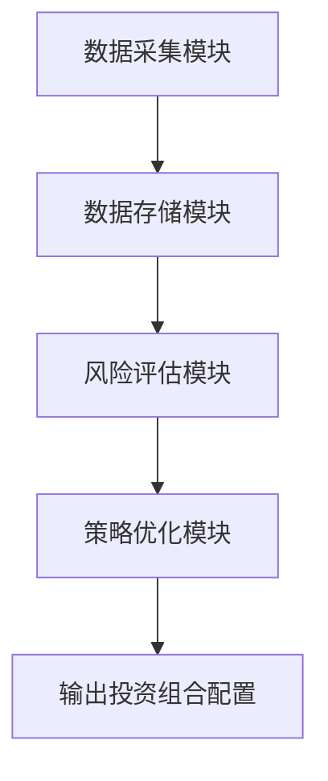
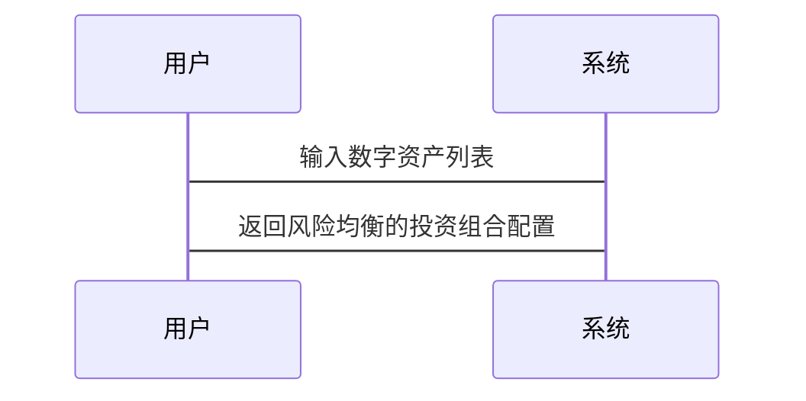

                 

<think>
嗯，我现在需要帮助用户撰写一篇关于如何将特价股票策略融入多元化数字资产风险均衡组合的技术博客文章。首先，我得理解用户的需求，他们需要一个结构清晰、内容详实的文章，涵盖从背景介绍到项目实战的各个方面。

文章标题已经确定是《如何将特价股票策略融入多元化数字资产风险均衡组合》，关键词包括特价股票策略、数字资产、风险均衡、投资组合、量化交易、算法优化、金融建模。摘要部分需要简明扼要地概括文章的核心内容，即如何将特价股票策略与数字资产结合，构建风险均衡的投资组合。

接下来是目录大纲，分为六个部分，每个部分下有具体的章节和小节。我需要确保每个部分都涵盖必要的内容，并且逻辑连贯。例如，背景介绍部分要解释特价股票和数字资产的基本概念，以及为什么将它们结合起来优化投资组合。核心概念部分则需要详细讲解两者的原理和如何相互影响。

在算法原理章节，我需要用数学模型和公式来详细阐述，可能涉及现代投资组合理论（MPT）的应用，以及如何计算风险和收益的平衡点。系统架构部分需要用Mermaid图展示系统的各个部分，比如类图、架构图和交互序列图，帮助读者更好地理解系统设计。

项目实战部分需要提供具体的代码实现，解释每一步的操作和代码的作用。同时，还要分析实际案例，展示如何在实际中应用这些策略。最后，最佳实践部分要总结全书的内容，给出实际操作中的注意事项和未来的发展趋势。

在撰写过程中，我需要确保语言专业且易懂，逻辑清晰，结构紧凑。每个章节都要有详细的讲解和例子，帮助读者一步步理解如何将特价股票策略融入数字资产的风险管理中。此外，文章末尾需要添加作者信息，确保文章的完整性和专业性。

总的来说，我需要按照用户的要求，逐步构建这篇文章，确保每个部分都符合用户的期望，并且内容丰富、结构合理。这将有助于读者全面理解如何优化投资组合，降低风险，同时抓住特价股票的机会。
</think>

# 如何将特价股票策略融入多元化数字资产风险均衡组合

> 关键词：特价股票策略，数字资产，风险均衡，投资组合，量化交易，算法优化，金融建模

> 摘要：本文将详细介绍如何将特价股票策略融入到多元化数字资产的风险均衡组合中。通过分析特价股票策略的核心原理、数字资产的风险特征以及风险均衡的优化方法，结合量化交易和现代投资组合理论，构建一个高效的风险管理框架。文章将涵盖背景介绍、核心概念、算法原理、系统架构、项目实战和最佳实践等多个方面，帮助读者理解如何在数字资产投资中优化风险与收益的平衡。

---

## 第一部分：背景介绍

### 第1章：特价股票策略与数字资产概述

#### 1.1 特价股票策略的定义与特点
- **1.1.1 特价股票的定义**
  - 特价股票是指在特定市场条件下，价格低于其内在价值的股票。
  - 这类股票通常被市场低估，具有较高的上涨潜力。

- **1.1.2 特价股票的核心特点**
  - 价格被低估：相对于公司基本面，股票价格处于较低水平。
  - 高波动性：价格波动较大，提供套利机会。
  - 周期性：通常出现在市场低迷或公司困境时期。

- **1.1.3 特价股票在投资组合中的作用**
  - 提供超额收益：通过低价买入高价卖出，获取超额收益。
  - 投机与价值投资结合：既有短期价格波动的机会，又有长期价值的增长潜力。

#### 1.2 数字资产的基本概念
- **1.2.1 数字资产的定义**
  - 数字资产是指以数字形式存在的资产，包括加密货币（如比特币、以太坊）、代币、NFT等。
  - 数字资产具有去中心化、匿名性、不可篡改等特点。

- **1.2.2 数字资产的主要类型**
  - 加密货币：比特币、以太坊等。
  - 代币：ERC-20、SOLANA等。
  - NFT：非同质化代币，代表独特数字资产。

- **1.2.3 数字资产的特点与优势**
  - 全球化：不受地域限制，可以在全球范围内交易。
  - 高波动性：价格波动剧烈，风险与收益并存。
  - 去中心化：交易不受传统金融机构控制。

#### 1.3 投资组合多元化与风险均衡的重要性
- **1.3.1 投资组合多元化的基本概念**
  - 投资组合多元化是指将资金分配到不同资产类别、行业或地理区域，以降低风险。
  - 多元化可以分散风险，避免单一资产的波动对整体投资组合造成过大影响。

- **1.3.2 风险均衡的定义与目标**
  - 风险均衡是指在投资组合中，各资产的风险贡献相等。
  - 通过调整各资产的权重，使组合中每种资产的风险对整体风险的贡献相等。

- **1.3.3 数字资产在投资组合中的地位**
  - 数字资产具有高风险和高收益特性，适合在投资组合中作为高风险资产配置。
  - 通过与传统资产（如股票、债券）结合，可以实现风险分散和收益优化。

#### 1.4 本章小结
- 本章介绍了特价股票策略和数字资产的基本概念，并分析了投资组合多元化与风险均衡的重要性。通过将特价股票策略融入数字资产投资组合，可以实现风险与收益的优化平衡。

---

## 第二部分：核心概念与联系

### 第2章：特价股票策略的核心原理

#### 2.1 特价股票策略的原理
- **2.1.1 市场时机的选择**
  - 特价股票策略依赖于对市场周期的准确判断，选择在市场低谷期买入股票。
  - 常用的技术分析方法包括K线图、均线、MACD等。

- **2.1.2 价格波动的分析**
  - 特价股票的波动性较高，可以通过波动率指标（如ATR）来选择买入时机。
  - 均值回归策略：假设价格会回归到均值水平。

- **2.1.3 技术分析与基本面分析的结合**
  - 技术分析用于判断价格走势，基本面分析用于评估公司价值。
  - 结合两种方法可以提高选股的准确性。

#### 2.2 特价股票策略的数学模型
- **2.2.1 价格波动的数学表达**
  - 使用时间序列模型（如ARIMA）预测股票价格波动。
  - 波动率可以用标准差或方差来衡量。

- **2.2.2 风险与收益的量化**
  - 收益可以用对数收益率或简单收益率来衡量。
  - 风险可以用方差、VaR（在险价值）或CVaR（条件在险价值）来衡量。

- **2.2.3 特价股票策略的优化算法**
  - 使用均值-方差优化算法调整投资组合权重。
  - 确定特价股票在组合中的最优权重，以最大化收益并最小化风险。

#### 2.3 特价股票策略与数字资产的关联
- **2.3.1 数字资产的价格波动特点**
  - 数字资产价格波动远高于传统股票，适合使用特价股票策略。
  - 市场周期性明显，可以通过技术分析捕捉价格波动机会。

- **2.3.2 特价股票策略在数字资产中的应用**
  - 在数字资产价格低谷期买入，价格回升时卖出。
  - 通过量化交易系统自动执行策略。

- **2.3.3 数字资产的风险特征与特价股票策略的结合**
  - 数字资产高波动性适合特价股票策略的应用。
  - 通过风险均衡优化，降低组合整体风险。

---

## 第三部分：算法原理与数学模型

### 第3章：数字资产风险均衡的原理与方法

#### 3.1 数字资产风险均衡的定义
- **3.1.1 风险均衡的基本概念**
  - 风险均衡是指在投资组合中，每种资产的风险贡献相等。
  - 这种方法可以分散风险，避免单一资产对整体风险的过度影响。

#### 3.2 数字资产风险均衡的实现步骤
- **3.2.1 数据收集**
  - 收集数字资产的历史价格数据。
  - 计算每种资产的收益率和风险指标（如方差）。

- **3.2.2 风险贡献计算**
  - 计算每种资产对整体风险的贡献。
  - 使用方差-协方差矩阵计算资产间的相关性。

- **3.2.3 风险均衡优化**
  - 使用数学优化方法调整资产权重，使每种资产的风险贡献相等。
  - 优化目标是最小化整体风险，同时使每种资产的风险贡献相等。

#### 3.3 数学模型与公式
- **3.3.1 风险贡献公式**
  \[
  \text{风险贡献}_i = w_i^2 \times \sigma_i^2 + 2w_i w_j \times \sigma_i \sigma_j \rho_{ij}
  \]
  其中，\( w_i \) 和 \( w_j \) 是资产 \( i \) 和 \( j \) 的权重，\( \sigma_i \) 和 \( \sigma_j \) 是资产 \( i \) 和 \( j \) 的标准差，\( \rho_{ij} \) 是资产 \( i \) 和 \( j \) 的相关系数。

- **3.3.2 风险均衡优化模型**
  \[
  \min_{w} \sum_{i=1}^n \text{风险贡献}_i
  \]
  \[
  \text{subject to } \sum_{i=1}^n w_i = 1
  \]
  \[
  \text{且所有风险贡献}_i \text{相等}
  \]

---

## 第四部分：系统架构与实现

### 第4章：系统架构设计

#### 4.1 系统功能设计
- **4.1.1 数据采集模块**
  - 从数字资产交易所获取实时价格数据。
  - 数据存储在数据库中，供后续分析使用。

- **4.1.2 风险评估模块**
  - 计算每种数字资产的风险指标（如方差、VaR）。
  - 评估资产之间的相关性。

- **4.1.3 策略优化模块**
  - 使用优化算法调整资产权重，实现风险均衡。
  - 输出最优投资组合配置。

#### 4.2 系统架构图


#### 4.3 交互流程图


---

## 第五部分：项目实战

### 第5章：项目实战与案例分析

#### 5.1 环境安装
- 安装必要的开发工具：
  - Python
  - NumPy、Pandas、Matplotlib
  - Scipy.optimize（用于优化）

#### 5.2 核心代码实现
```python
import numpy as np
from scipy.optimize import minimize

def risk_contribution(weights, covariance_matrix):
    # 计算每种资产的风险贡献
    var_p = np.sum(weights.T @ covariance_matrix @ weights)
    risk_contri = weights.T @ covariance_matrix @ weights / var_p
    return risk_contri

def risk_e

