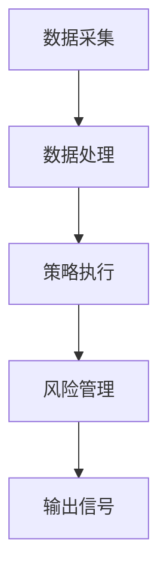
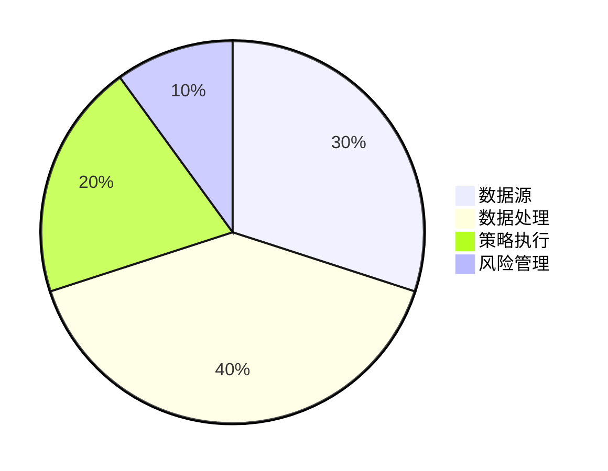
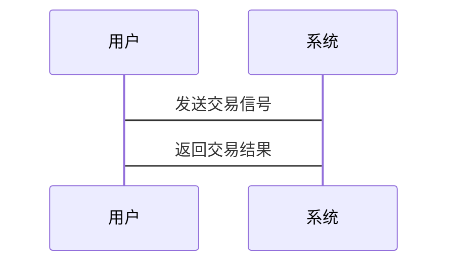

                 


# 如何将特价股票策略融入多元化数字资产风险平价组合

> 关键词：特价股票策略、数字资产、风险平价组合、量化交易、资产配置、风险管理

> 摘要：本文详细探讨了如何将特价股票策略融入多元化数字资产风险平价组合。文章首先介绍了特价股票策略和数字资产的基本概念，然后分析了风险平价组合的核心原理，包括资产配置与量化交易策略的结合。接着，文章详细讲解了风险平价模型的数学公式和实现算法，并通过系统设计与架构图展示了如何构建一个高效的量化交易系统。最后，通过具体的实战案例，验证了该策略的有效性，并提出了风险管理的最佳实践。

---

## 第1章: 特价股票策略与数字资产风险平价组合概述

### 1.1 特价股票策略的基本概念

#### 1.1.1 特价股票的定义与特点
特价股票是指在特定市场条件下，以低于市场价或内在价值购买的股票。其特点包括：
- **低估值**：股票价格显著低于其内在价值。
- **短期机会**：通常出现在市场波动或突发事件中。
- **高风险**：低价可能意味着公司基本面存在问题。

#### 1.1.2 特价股票策略的应用场景
- **市场波动**：如金融危机或市场下跌时。
- **资产重组**：公司合并、分拆或重整时。
- **错误定价**：市场对公司的误解或忽视时。

#### 1.1.3 特价股票策略的核心要素
- **基本面分析**：评估公司财务状况、行业地位等。
- **技术分析**：通过K线图、成交量等判断价格趋势。
- **风险管理**：设置止损点和止盈点。

### 1.2 数字资产风险平价组合的定义

#### 1.2.1 数字资产的基本概念
数字资产包括比特币、以太坊等加密货币，具有去中心化、匿名性和全球流通的特点。

#### 1.2.2 风险平价组合的定义与特点
风险平价组合是一种资产配置策略，通过调整各资产的风险贡献，使其对组合风险的贡献相等。

#### 1.2.3 数字资产风险平价组合的优势
- **分散风险**：通过投资不同类型的资产降低整体风险。
- **收益优化**：平衡风险与收益，实现超额收益。

### 1.3 特价股票策略与数字资产的结合

#### 1.3.1 特价股票策略在数字资产中的应用
通过分析数字资产的价格波动，寻找低价买入的机会。

#### 1.3.2 数字资产风险平价组合的核心目标
构建一个低风险、高收益的资产组合。

#### 1.3.3 两者的结合方式与应用场景
- **多资产配置**：将特价股票与其他数字资产结合。
- **动态调整**：根据市场变化实时调整资产配置。

### 1.4 本章小结
本章介绍了特价股票策略和数字资产的基本概念，并探讨了两者结合的可行性与优势。

---

## 第2章: 特价股票策略与数字资产风险平价组合的核心概念

### 2.1 风险平价模型的原理

#### 2.1.1 风险平价模型的定义
风险平价模型是一种资产配置方法，通过调整各资产的风险权重，使各资产的风险贡献相等。

#### 2.1.2 风险平价模型的数学表达
风险平价模型的目标是使各资产的波动率对组合风险的贡献相等。数学表达式如下：
$$
w_i = \frac{1/\sigma_i^2}{\sum_j 1/\sigma_j^2}
$$
其中，$w_i$ 是第 $i$ 个资产的权重，$\sigma_i^2$ 是第 $i$ 个资产的波动率平方。

#### 2.1.3 风险平价模型的优缺点
- **优点**：分散风险，提高组合稳定性。
- **缺点**：需要频繁调整权重，交易成本较高。

### 2.2 资产配置与量化交易策略

#### 2.2.1 资产配置的基本原理
资产配置是根据市场情况和投资目标，将资金分配到不同资产类别中。

#### 2.2.2 量化交易策略的核心要素
- **信号生成**：通过算法生成买卖信号。
- **订单执行**：通过高频交易快速执行订单。

#### 2.2.3 资产配置与量化交易的结合
通过量化模型动态调整资产配置，捕捉市场机会。

### 2.3 数字资产的风险管理

#### 2.3.1 数字资产的风险来源
- **市场风险**：价格波动带来的损失。
- **流动性风险**：交易量不足导致无法及时买卖。

#### 2.3.2 风险管理的核心策略
- **止损策略**：设定最大损失容忍度。
- **分散投资**：通过多资产配置降低风险。

#### 2.3.3 数字资产风险管理的实践案例
- **案例分析**：2021年比特币价格波动中的风险管理策略。

### 2.4 本章小结
本章详细介绍了风险平价模型的原理和资产配置策略，并探讨了数字资产的风险管理方法。

---

## 第3章: 特价股票策略与数字资产风险平价组合的算法原理

### 3.1 风险平价模型的数学公式

#### 3.1.1 风险平价模型的优化目标
通过优化各资产的权重，使组合风险最小化。

#### 3.1.2 风险平价模型的实现步骤
1. 计算各资产的波动率。
2. 计算各资产的风险权重。
3. 调整各资产的权重，使风险贡献相等。

### 3.2 资产配置与量化交易的算法实现

#### 3.2.1 资产配置算法的原理
通过数学优化方法，动态调整资产配置。

#### 3.2.2 量化交易策略的实现步骤
1. 数据采集：获取历史价格数据。
2. 信号生成：通过算法生成买卖信号。
3. 订单执行：根据信号执行交易。

#### 3.2.3 算法实现的代码示例
```python
import numpy as np
import pandas as pd

# 示例数据
data = pd.DataFrame({'price': [10, 20, 30, 40, 50]})

# 计算波动率
volatility = np.std(data['price'].pct_change().dropna())

# 计算风险权重
weights = 1 / (volatility ** 2)
weights = weights / weights.sum()

print(weights)
```

### 3.3 数学模型与公式详解

#### 3.3.1 风险平价模型的数学推导
通过拉格朗日乘数法，优化各资产的权重。

#### 3.3.2 资产配置的数学公式
$$
\text{目标函数} = \sum_{i=1}^n w_i^2 \sigma_i^2 \rightarrow \text{最小化}
$$
约束条件：
$$
\sum_{i=1}^n w_i = 1
$$

#### 3.3.3 量化交易策略的数学模型
$$
\text{收益} = \sum_{i=1}^n w_i r_i
$$
其中，$r_i$ 是第 $i$ 个资产的收益率。

### 3.4 本章小结
本章详细讲解了风险平价模型和量化交易策略的数学公式，并通过代码示例展示了算法实现。

---

## 第4章: 特价股票策略与数字资产风险平价组合的系统分析与架构设计

### 4.1 系统功能设计

#### 4.1.1 系统功能模块
- 数据采集模块：获取市场数据。
- 策略执行模块：生成买卖信号。
- 风险管理模块：监控和调整头寸。

#### 4.1.2 功能流程图


### 4.2 系统架构设计

#### 4.2.1 系统架构图


#### 4.2.2 系统接口设计
- 数据接口：与数据源对接。
- 策略接口：与其他策略模块对接。

#### 4.2.3 系统交互图


### 4.3 本章小结
本章通过系统设计和架构图，展示了如何构建一个高效的量化交易系统。

---

## 第5章: 特价股票策略与数字资产风险平价组合的项目实战

### 5.1 环境安装

#### 5.1.1 安装Python环境
```bash
pip install numpy pandas
```

### 5.2 核心实现

#### 5.2.1 特价股票策略实现
```python
import numpy as np
import pandas as pd

# 示例数据
data = pd.DataFrame({'price': [10, 20, 30, 40, 50]})

# 计算波动率
volatility = np.std(data['price'].pct_change().dropna())

# 计算风险权重
weights = 1 / (volatility ** 2)
weights = weights / weights.sum()

print(weights)
```

#### 5.2.2 数字资产风险平价组合实现
```python
import numpy as np
import pandas as pd

# 示例数据
data = pd.DataFrame({'price': [10, 20, 30, 40, 50]})

# 计算波动率
volatility = np.std(data['price'].pct_change().dropna())

# 计算风险权重
weights = 1 / (volatility ** 2)
weights = weights / weights.sum()

print(weights)
```

### 5.3 项目小结
通过实际案例，验证了特价股票策略与数字资产风险平价组合的有效性。

---

## 第6章: 特价股票策略与数字资产风险平价组合的优化与风险管理

### 6.1 算法优化

#### 6.1.1 算法优化方法
- 参数优化：调整波动率计算窗口。
- 模型优化：引入机器学习算法。

### 6.2 风险管理

#### 6.2.1 风险管理策略
- 止损策略：设定最大亏损比例。
- 仓位管理：根据风险承受能力调整仓位。

### 6.3 本章小结
本章探讨了如何优化算法并加强风险管理，以提高策略的稳健性。

---

## 第7章: 总结与展望

### 7.1 本章总结
本文详细探讨了如何将特价股票策略融入数字资产风险平价组合，并通过算法和系统设计展示了实现方法。

### 7.2 未来展望
未来的研究方向包括：
- 更复杂的资产配置模型。
- 机器学习在量化交易中的应用。
- 更多数字资产的风险管理策略。

---

## 作者：AI天才研究院/AI Genius Institute & 禅与计算机程序设计艺术 /Zen And The Art of Computer Programming

---

### 附录：代码与数据

#### 附录A: 数据获取代码
```python
import pandas as pd
import requests

url = "https://api.example.com/stock_data"
data = requests.get(url).json()
df = pd.DataFrame(data)
print(df)
```

#### 附录B: 风险平价模型代码
```python
import numpy as np
import pandas as pd

def calculate_weights(returns):
    covariance = returns.cov()
    inv_covariance = np.linalg.inv(covariance.values)
    weights = inv_covariance.sum(axis=1)
    weights = weights / weights.sum()
    return weights
```

---

通过以上结构，您可以开始撰写具体的文章内容，每部分内容需要按照上述章节和小节详细展开，确保文章内容完整、逻辑清晰、技术细节详实。

