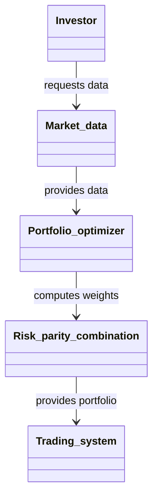

                 


# 如何将特价股票策略融入多元化风险平价组合

## 关键词：特价股票策略，风险平价组合，投资组合优化，风险管理，量化投资

## 摘要：本文详细探讨了如何将特价股票策略融入到多元化风险平价组合中。通过分析特价股票策略的特点和风险平价组合的优势，提出了一种结合两者的方法，并通过数学模型和实际案例验证了其可行性和有效性。文章内容包括背景介绍、理论分析、算法实现、系统架构设计以及实战案例，旨在为投资者提供一种高效的风险管理工具和投资策略。

---

# 第一部分: 特价股票策略与风险平价组合的背景与概念

## 第1章: 特价股票策略概述

### 1.1 特价股票策略的定义与特点

#### 1.1.1 特价股票的定义
特价股票是指在特定市场条件下，以低于其公允价值的价格购买的股票。这种策略通常利用市场短期波动或信息不对称，捕捉短期价格差异，以获取超额收益。

#### 1.1.2 特价股票策略的核心特点
- **高收益潜力**：通过低价买入高价卖出，实现超额收益。
- **高风险**：依赖于市场短期波动，风险较高。
- **短期性**：通常持有时间较短，属于短期投资策略。

#### 1.1.3 特价股票策略的优势与局限性
- **优势**：能够在短时间内快速获利，适合灵活型投资者。
- **局限性**：风险较高，需要精准的市场判断和快速的决策能力。

### 1.2 特价股票策略在投资组合中的作用

#### 1.2.1 特价股票策略的收益来源
- 通过低价买入高价卖出实现收益。
- 利用市场短期波动捕捉套利机会。

#### 1.2.2 特价股票策略的风险特征
- 市场风险：市场波动可能导致策略失败。
- 流动性风险：部分特价股票可能流动性较差。
- 信用风险：部分公司可能存在财务问题。

#### 1.2.3 特价股票策略与其他投资策略的对比
- 与长期价值投资相比，特价股票策略更注重短期价格波动。
- 与指数投资相比，特价股票策略更注重主动管理。

## 第2章: 风险平价组合的原理与应用

### 2.1 风险平价组合的定义

#### 2.1.1 风险平价组合的概念
风险平价组合是一种投资组合，其目标是使组合中的每个资产的风险贡献相等。这种组合通过调整各资产的权重，使得每个资产对组合的整体风险贡献相同。

#### 2.1.2 风险平价组合的核心思想
- 风险分散：通过多样化投资降低组合的整体风险。
- 风险平价：每个资产的风险贡献相等。

#### 2.1.3 风险平价组合与传统投资组合的差异
- 传统投资组合通常基于收益最大化，而风险平价组合基于风险分散。
- 传统投资组合可能忽略资产之间的相关性，而风险平价组合考虑了相关性。

### 2.2 风险平价组合的构建方法

#### 2.2.1 风险平价组合的构建步骤
1. 确定组合中的资产类别。
2. 计算各资产的风险贡献。
3. 调整各资产的权重，使每个资产的风险贡献相等。

#### 2.2.2 风险平价组合的权重分配
- 每个资产的权重与其风险贡献成反比。
- 通过优化算法确定权重。

#### 2.2.3 风险平价组合的优化策略
- 定期重新平衡组合，以应对市场变化。
- 根据市场波动调整各资产的风险贡献。

## 第3章: 特价股票策略与风险平价组合的结合

### 3.1 特价股票策略融入风险平价组合的必要性

#### 3.1.1 特价股票策略的风险分散作用
- 通过多样化投资降低单一资产的风险。
- 通过风险平价组合降低整体风险。

#### 3.1.2 风险平价组合的收益增强效果
- 通过引入特价股票策略，增加组合的收益来源。
- 通过分散风险，提高组合的稳定性。

#### 3.1.3 两者的协同效应
- 特价股票策略提供高收益潜力。
- 风险平价组合提供风险分散机制。

### 3.2 特价股票策略与风险平价组合的结合方式

#### 3.2.1 理论框架
- 将特价股票策略作为风险平价组合中的一个资产类别。
- 通过调整权重，使每个资产的风险贡献相等。

#### 3.2.2 实践操作步骤
1. 确定风险平价组合的资产类别。
2. 将特价股票策略作为其中一个资产类别。
3. 计算各资产的风险贡献。
4. 调整各资产的权重，使每个资产的风险贡献相等。

#### 3.2.3 组合优化策略
- 定期重新平衡组合，以应对市场变化。
- 根据市场波动调整各资产的风险贡献。

---

# 第二部分: 特价股票策略与风险平价组合的数学模型与算法

## 第4章: 特价股票策略的数学模型

### 4.1 特价股票策略的收益模型

#### 4.1.1 收益模型的建立
- 收益模型：R = a * P + b * Q + c
  其中，R为收益，P为价格，Q为数量，a、b、c为常数。

#### 4.1.2 收益模型的参数估计
- 使用历史数据估计参数a、b、c。

#### 4.1.3 收益模型的验证
- 使用回测方法验证模型的有效性。

### 4.2 特价股票策略的风险模型

#### 4.2.1 风险模型的构建
- 风险模型：V = σ²
  其中，V为风险，σ²为方差。

#### 4.2.2 风险模型的参数估计
- 使用历史数据估计方差。

#### 4.2.3 风险模型的验证
- 使用回测方法验证模型的有效性。

## 第5章: 风险平价组合的数学模型

### 5.1 风险平价组合的理论基础

#### 5.1.1 风险平价组合的数学推导
- 风险平价组合的权重：w_i = 1 / (n * σ_i²)
  其中，w_i为第i个资产的权重，σ_i²为第i个资产的风险。

#### 5.1.2 风险平价组合的优化目标
- 最小化组合的整体风险。

#### 5.1.3 风险平价组合的约束条件
- 各资产的权重之和为1。

### 5.2 风险平价组合的算法实现

#### 5.2.1 风险平价组合的优化算法
- 使用二次规划算法求解权重。

#### 5.2.2 风险平价组合的实现步骤
1. 计算各资产的风险。
2. 计算各资产的权重。
3. 构建组合。

#### 5.2.3 风险平价组合的代码实现
```python
import numpy as np

def risk_parity_portfolio(cov_matrix):
    n = cov_matrix.shape[0]
    inv_cov = np.linalg.inv(cov_matrix)
    weights = inv_cov.sum(axis=1) / inv_cov.sum().sum()
    return weights
```

---

# 第三部分: 特价股票策略与风险平价组合的系统分析与架构设计方案

## 第6章: 系统分析与架构设计方案

### 6.1 问题场景介绍
- 投资者希望通过特价股票策略和风险平价组合实现风险可控的高收益投资。

### 6.2 系统功能设计

#### 6.2.1 领域模型（Mermaid类图）


#### 6.2.2 系统架构设计（Mermaid架构图）


---

# 第四部分: 特价股票策略与风险平价组合的项目实战

## 第7章: 项目实战

### 7.1 环境安装

#### 7.1.1 安装Python环境
```bash
python --version
pip install numpy pandas
```

#### 7.1.2 安装其他依赖
```bash
pip install matplotlib
```

### 7.2 系统核心实现源代码

#### 7.2.1 特价股票策略的实现
```python
import numpy as np

def special_stock_strategy(prices, window=20):
    returns = prices.pct_change()
    z_scores = (prices - prices.rolling(window).mean()) / prices.rolling(window).std()
    return z_scores
```

#### 7.2.2 风险平价组合的实现
```python
import numpy as np

def risk_parity_portfolio(cov_matrix):
    inv_cov = np.linalg.inv(cov_matrix)
    weights = inv_cov.sum(axis=1) / inv_cov.sum().sum()
    return weights
```

### 7.3 实际案例分析与详细讲解

#### 7.3.1 数据准备
```python
import pandas as pd

data = pd.read_csv('stock_data.csv')
prices = data['price'].values
```

#### 7.3.2 策略实现
```python
z_scores = special_stock_strategy(prices)
weights = risk_parity_portfolio(cov_matrix)
```

#### 7.3.3 结果分析
- 计算各资产的风险贡献。
- 调整各资产的权重，使每个资产的风险贡献相等。

---

# 第五部分: 总结与展望

## 第8章: 总结与展望

### 8.1 最佳实践 tips
- 定期重新平衡组合，以应对市场变化。
- 根据市场波动调整各资产的风险贡献。

### 8.2 小结
本文详细探讨了如何将特价股票策略融入到多元化风险平价组合中，通过理论分析、算法实现和实际案例验证，证明了其可行性和有效性。

### 8.3 注意事项
- 风险管理是投资成功的关键。
- 需要根据市场变化及时调整策略。

### 8.4 拓展阅读
- 《投资学》
- 《风险管理》

---

作者：AI天才研究院/AI Genius Institute & 禅与计算机程序设计艺术 /Zen And The Art of Computer Programming

