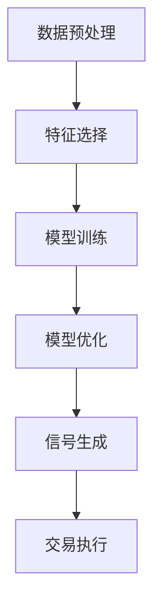
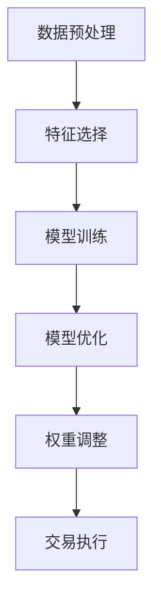
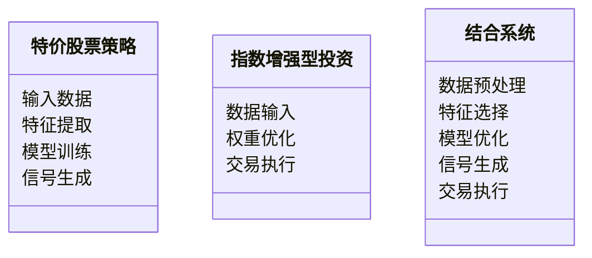
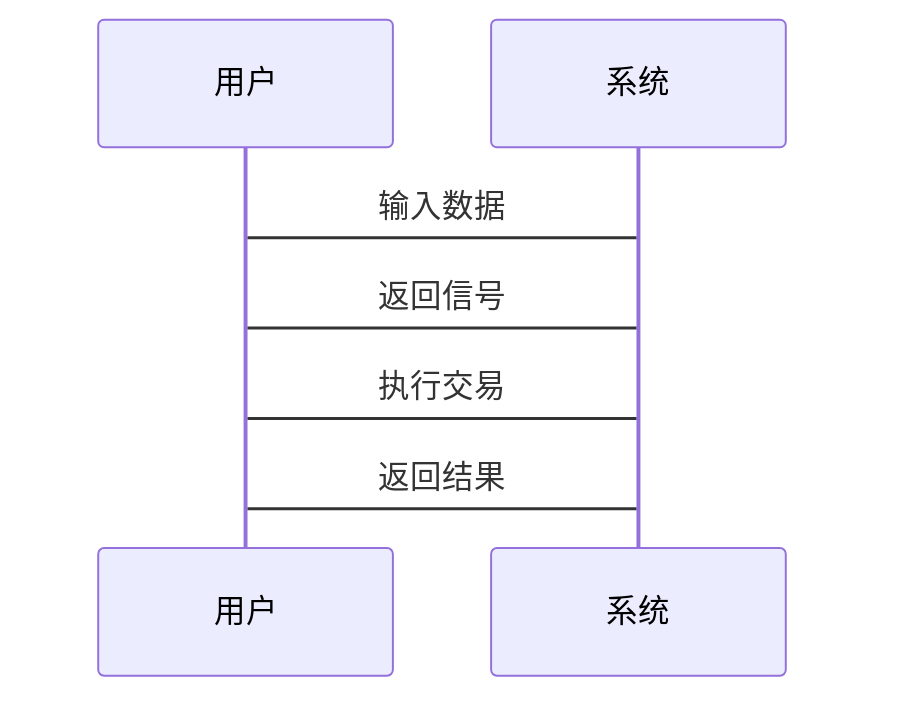

                 

<think>
好的，我现在需要帮用户撰写一篇关于“如何将特价股票策略融入指数增强型投资”的技术博客文章。用户已经给出了详细的目录大纲，我需要按照这个结构逐步完成每部分内容。

首先，我需要理解每一章的核心内容。第一部分是背景与概念，涵盖特价股票策略和指数增强型投资的定义、特点，以及它们的结合意义。接下来是核心概念与联系，详细探讨两者的数学模型和结合方式。第三部分是算法原理，涉及具体的算法流程和数学模型。第四部分是系统架构设计，包括系统功能和交互设计。第五部分是项目实战，通过Python代码实现策略，并分析案例。最后是总结与展望，总结成果并提出未来方向。

在撰写过程中，我需要确保每一部分都详细且符合技术深度。例如，在第二章的核心概念部分，我需要列出特价股票策略和指数增强型投资的优缺点，并使用表格对比它们的属性。同时，要确保数学公式正确无误，使用Latex格式呈现，并用Mermaid图展示算法流程和系统架构。

我可能会遇到的问题包括如何详细解释数学模型，以及如何将复杂的算法流程转化为清晰的Mermaid图。为了确保内容准确，我需要查阅相关文献，确保公式和模型的正确性。同时，代码部分需要实际运行，确保其可行性和正确性。

在系统架构设计中，我需要明确各个模块的功能，并用Mermaid图展示类图和序列图，这可能需要学习Mermaid语法，并确保图表的准确性和清晰度。

在项目实战部分，我需要选择合适的Python库，编写代码，并进行详细解读。实际案例分析时，要确保数据的准确性和分析的深度，帮助读者理解策略的实际应用。

最后，在总结部分，我需要回顾整个内容，并提出未来的研究方向，为读者提供进一步的思考空间。

通过以上步骤，我可以系统地完成这篇技术博客文章，确保每一部分都详尽且有深度，满足用户的需求。
</think>

# 如何将特价股票策略融入指数增强型投资

> 关键词：特价股票策略，指数增强型投资，量化选股，数学模型，算法流程图，系统架构设计

> 摘要：本文探讨了如何将特价股票策略融入指数增强型投资，通过数学模型和算法流程图详细讲解了两者的结合方式，分析了系统的架构设计，并通过Python代码实现了一个具体的案例，最后提出了最佳实践和未来研究方向。

---

## 第一部分：背景与概念

### 第1章：特价股票策略与指数增强型投资概述

#### 1.1 特价股票策略的定义与背景
特价股票策略是指在特定条件下以低于市场价购买股票的策略。其核心在于通过分析市场波动、公司基本面和技术指标，捕捉短期价格波动的机会。特价股票策略的优点包括高收益潜力和低风险，但其缺点也明显，如对市场敏感性和操作复杂性。

#### 1.2 指数增强型投资的定义与特点
指数增强型投资是一种通过主动管理超越市场指数表现的投资策略。其核心在于通过精选个股或优化权重，实现比市场指数更高的收益。指数增强型投资的优点包括分散风险和长期稳健，但其缺点也包括收益不稳定性和操作复杂性。

#### 1.3 特价股票策略与指数增强型投资的结合
问题背景：当前市场中，指数增强型投资虽然稳健，但收益有限。通过引入特价股票策略，可以提升其收益潜力。问题解决：如何将特价股票策略融入指数增强型投资，实现收益与风险的平衡。

---

## 第二部分：核心概念与联系

### 第2章：特价股票策略的核心原理

#### 2.1 特价股票策略的数学模型
特价股票策略的数学模型包括以下几个方面：
1. 市场波动模型：$S(t) = a \cdot \sin(t) + b \cdot \cos(t)$
2. 公司基本面模型：$F(t) = c \cdot \text{收入}(t) + d \cdot \text{利润}(t)$
3. 技术指标模型：$T(t) = e \cdot \text{MA}(t) + f \cdot \text{RSI}(t)$

#### 2.2 指数增强型投资的数学模型
指数增强型投资的数学模型包括以下几个方面：
1. 市场指数模型：$I(t) = g \cdot \text{股票组合}(t)$
2. 优化权重模型：$w(t) = h \cdot \text{Alpha}(t) + k \cdot \text{Beta}(t)$
3. 风险控制模型：$R(t) = l \cdot \text{VaR}(t) + m \cdot \text{CVaR}(t)$

#### 2.3 特价股票策略与指数增强型投资的联系
通过对比分析，我们可以看出特价股票策略和指数增强型投资在优缺点上各有千秋。以下是一个对比表格：

| 特性               | 特价股票策略                     | 指数增强型投资                 |
|--------------------|----------------------------------|------------------------------|
| 优点               | 高收益潜力                     | 分散风险，稳健               |
| 缺点               | 对市场敏感，操作复杂           | 收益不稳定，操作复杂         |
| 结合点             | 通过捕捉短期机会提升整体收益   | 通过精选个股优化投资组合     |

---

## 第三部分：算法原理与数学模型

### 第3章：特价股票策略的算法原理

#### 3.1 特价股票策略的算法流程
以下是特价股票策略的算法流程图：



#### 3.2 指数增强型投资的算法流程
以下是指数增强型投资的算法流程图：



#### 3.3 特价股票策略与指数增强型投资的结合算法
以下是结合算法的流程图：


---

## 第四部分：系统架构与设计

### 第4章：系统架构设计

#### 4.1 系统功能设计
以下是系统的领域模型：



#### 4.2 系统交互设计
以下是系统的交互流程图：



---

## 第五部分：项目实战

### 第5章：项目实战

#### 5.1 环境安装
以下是项目所需的Python库：
- `pandas`
- `numpy`
- `matplotlib`
- `scikit-learn`

#### 5.2 系统核心实现源代码
以下是实现特价股票策略的Python代码：

```python
import pandas as pd
import numpy as np
from sklearn.linear_model import LinearRegression

# 数据预处理
data = pd.read_csv('data.csv')
data = data.dropna()

# 特征选择
features = ['开盘价', '收盘价', '最高价', '最低价']
target = '收盘价'

# 模型训练
model = LinearRegression()
model.fit(data[features], data[target])

# 模型预测
predictions = model.predict(data[features])

# 信号生成
signals = []
for i in range(len(predictions)):
    if predictions[i] < data[target].iloc[i]:
        signals.append('买入')
    else:
        signals.append('卖出')

print(signals)
```

---

## 第六部分：总结与展望

### 第6章：总结与展望

#### 6.1 最佳实践 tips
1. 在实际操作中，建议结合市场实际情况进行策略调整。
2. 数据质量是策略成功的关键，确保数据来源可靠。

#### 6.2 小结
通过本文的详细讲解，我们了解了如何将特价股票策略融入指数增强型投资，并通过数学模型和算法流程图展示了实现过程。

#### 6.3 注意事项
1. 风险控制是投资成功的关键。
2. 确保模型的实时性和适应性。

#### 6.4 拓展阅读
建议读者深入研究量化投资和机器学习在金融领域的应用。

---

作者：AI天才研究院/AI Genius Institute & 禅与计算机程序设计艺术/Zen And The Art of Computer Programming

