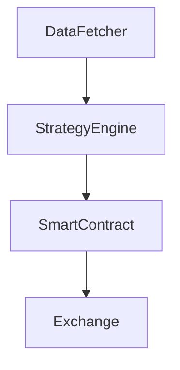
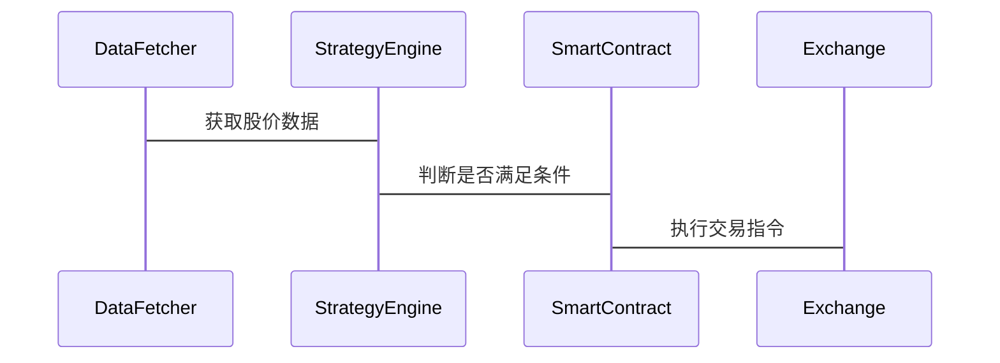

                 


# 如何将特价股票策略融入智能合约自动化投资

> 关键词：智能合约，特价股票策略，自动化投资，Solidity，区块链，算法交易

> 摘要：本文详细探讨了如何将特价股票策略融入智能合约，实现自动化投资。文章从特价股票策略和智能合约的基本概念出发，分析了它们的结合方式，并详细讲解了算法实现、系统架构设计以及项目实战。通过实际案例分析，本文提供了从理论到实践的完整指南，帮助读者掌握如何利用智能合约实现高效的自动化投资策略。

---

## 第1章 特价股票策略的基本概念

### 1.1 特价股票策略的定义与特点

#### 1.1.1 什么是特价股票策略
特价股票策略是一种基于市场波动的投资策略，投资者在特定条件下买入或卖出股票，以捕捉短期价格差异。例如，当股票价格跌破某个均线时买入，反弹后卖出。

#### 1.1.2 特价股票策略的核心特点
- **短期性**：专注于短期价格波动。
- **自动化**：通过预设条件自动执行交易。
- **风险管理**：严格控制每次交易的风险。

#### 1.1.3 特价股票策略的适用场景
适用于波动性较高的市场，如股票、加密货币等。特别适合技术分析型投资者。

### 1.2 智能合约的基本概念

#### 1.2.1 智能合约的定义
智能合约是区块链上的自动执行程序，基于预设条件触发操作，如自动转账或执行交易。

#### 1.2.2 智能合约的核心特点
- **自动化**：无需人工干预。
- **透明性**：代码公开可查。
- **不可篡改**：一旦部署，无法修改。

#### 1.2.3 智能合约的优势与劣势
- **优势**：提高效率，减少人为错误。
- **劣势**：代码错误可能导致重大损失。

---

## 第2章 特价股票策略与智能合约的结合

### 2.1 特价股票策略的自动化需求

#### 2.1.1 手动投资的局限性
- 时间成本高。
- 容易受情绪影响。
- 无法捕捉快速波动的机会。

#### 2.1.2 自动化投资的优势
- 24/7运行，不错过任何机会。
- 严格执行策略，避免人为错误。
- 提高交易效率和准确性。

#### 2.1.3 智能合约在自动化投资中的作用
- 自动触发交易。
- 确保策略严格执行。
- 提供透明和可追溯的交易记录。

### 2.2 智能合约在股票交易中的应用

#### 2.2.1 智能合约的触发条件
- 价格达到指定水平。
- 时间条件，如定期执行。
- 市场事件，如指数下跌触发买入。

#### 2.2.2 智能合约的执行流程
1. 监测市场数据。
2. 判断是否满足触发条件。
3. 自动执行交易指令。

#### 2.2.3 智能合约的安全性与可靠性
- 使用Solidity编写，代码经过严格测试。
- 部署在可靠的区块链平台，如以太坊。

---

## 第3章 智能合约的编程基础

### 3.1 Solidity编程语言简介

#### 3.1.1 Solidity的基本语法
- 变量声明：`uint price;`
- 函数定义：`function getPrice() view returns (uint) { return price; }`
- 合约结构：`contract MyContract { ... }`

#### 3.1.2 Solidity的智能合约结构
- 合约包含状态变量、函数和事件。
- 事件用于记录重要操作，如交易完成。

#### 3.1.3 Solidity的常用功能
- 计时功能：`block.timestamp`
- 随机数生成：`block.number` 和 `uint(keccak256(...))`

### 3.2 智能合约的部署与测试

#### 3.2.1 智能合约的编译与部署
- 使用工具如 Remix 在以太坊上部署合约。
- 编写合约代码并编译为字节码。

#### 3.2.2 智能合约的测试方法
- 使用单元测试框架，如Solidity的Mocha。
- 模拟各种市场情况，测试合约行为。

#### 3.2.3 智能合约的调试技巧
- 查看交易记录，分析合约执行情况。
- 使用日志记录合约状态变化。

---

## 第4章 特价股票策略的算法实现

### 4.1 算法设计的核心思想

#### 4.1.1 策略目标的明确
- 确定投资目标，如追求短期收益。
- 设定风险承受水平。

#### 4.1.2 策略条件的设定
- 价格低于均线时买入。
- 价格高于均线时卖出。

#### 4.1.3 策略执行的流程
1. 获取实时股价数据。
2. 判断是否满足买入或卖出条件。
3. 执行交易指令。

### 4.2 算法实现的关键步骤

#### 4.2.1 数据获取与处理
- 通过API获取实时股价数据。
- 数据清洗和预处理。

#### 4.2.2 策略判断与决策
- 使用技术指标，如移动平均线（MA）。
- 判断价格是否突破关键阻力位。

#### 4.2.3 订单生成与提交
- 自动生成买入或卖出订单。
- 提交订单至交易所API。

---

## 第5章 基于智能合约的策略实现

### 5.1 智能合约的算法实现

#### 5.1.1 策略逻辑的Solidity实现
```solidity
contract StockStrategy {
    uint public targetPrice;
    uint public entryPoint;

    function checkCondition(uint currentPrice) public {
        if (currentPrice < entryPoint) {
            // 执行买入操作
            buyStock();
        } else if (currentPrice > targetPrice) {
            // 执行卖出操作
            sellStock();
        }
    }

    function buyStock() internal {
        // 实现买入逻辑
    }

    function sellStock() internal {
        // 实现卖出逻辑
    }
}
```

#### 5.1.2 策略触发条件的设定
- 当股价低于某个阈值时触发买入。
- 当股价高于某个阈值时触发卖出。

#### 5.1.3 策略执行的自动化流程
1. 实时监测股价数据。
2. 判断是否满足触发条件。
3. 自动执行交易指令。

### 5.2 算法实现的优化与改进

#### 5.2.1 算法效率的优化
- 使用更高效的数据结构。
- 减少不必要的计算。

#### 5.2.2 策略逻辑的灵活调整
- 支持多种策略类型，如均线策略、布林带策略。
- 根据市场变化动态调整参数。

#### 5.2.3 系统的可扩展性设计
- 支持多种资产类型，如股票、加密货币。
- 支持多策略组合，提高投资收益。

---

## 第6章 系统架构设计

### 6.1 系统功能模块划分

#### 6.1.1 数据获取模块
- 负责获取实时股价数据。
- 接口：API调用。

#### 6.1.2 策略引擎模块
- 执行策略判断和决策。
- 接口：接收数据，输出交易指令。

#### 6.1.3 智能合约交互模块
- 负责与智能合约通信。
- 接口：调用智能合约函数。

### 6.2 系统架构设计

#### 6.2.1 系统架构图


#### 6.2.2 系统交互流程
1. 数据获取模块从API获取股价数据。
2. 策略引擎模块分析数据，判断是否触发交易。
3. 智能合约交互模块调用智能合约，执行交易。

### 6.3 系统接口设计

#### 6.3.1 数据获取接口
- REST API：`GET /stock/prices`

#### 6.3.2 智能合约接口
- 函数：`buyStock()` 和 `sellStock()`

### 6.4 系统交互流程

#### 6.4.1 交互流程图


---

## 第7章 项目实战

### 7.1 环境安装

#### 7.1.1 安装Solidity
- 下载Solidity编译器。
- 安装以太坊钱包，如MetaMask。

#### 7.1.2 安装Python
- 安装Python 3.x。
- 安装必要的库，如`web3.py`。

### 7.2 系统核心实现源代码

#### 7.2.1 智能合约代码
```solidity
contract StockStrategy {
    function buy(uint amount) public {
        // 执行买入操作
    }

    function sell(uint amount) public {
        // 执行卖出操作
    }
}
```

#### 7.2.2 Python代码实现
```python
from web3 import Web3, HTTPProvider

# 初始化以太坊节点
w3 = Web3(HTTPProvider('http://localhost:8545'))

# 智能合约地址和ABI
contract_address = '0x...'
contract_abi = [...]

# 创建合约对象
contract = w3.eth.contract(contract_address, abi=contract_abi)

# 执行买入操作
contract.functions.buy(100).transact()
```

### 7.3 实际案例分析

#### 7.3.1 市场情况
假设某股票价格波动较大，适合特价策略。

#### 7.3.2 策略执行
当股价低于均线时，智能合约自动买入；当股价高于均线时，自动卖出。

#### 7.3.3 交易结果
根据市场表现，策略实现盈利。

### 7.4 项目小结

- 系统实现了智能合约与特价策略的结合。
- 通过实际案例验证了系统的可行性。
- 系统具备良好的扩展性和可维护性。

---

## 第8章 最佳实践

### 8.1 投资策略的选择
- 根据市场情况调整策略参数。
- 结合多种策略，降低风险。

### 8.2 风险管理技巧
- 设置止损点。
- 控制每笔交易的风险敞口。

### 8.3 系统维护与优化
- 定期检查智能合约状态。
- 根据市场变化优化策略逻辑。

### 8.4 注意事项
- 选择可靠的交易所和区块链平台。
- 定期备份系统数据。
- 保持对市场的敏感性，及时调整策略。

### 8.5 拓展阅读
- 推荐阅读《智能合约入门与实战》。
- 关注区块链技术的最新发展。

---

## 作者

作者：AI天才研究院/AI Genius Institute  
联合作者：禅与计算机程序设计艺术/Zen And The Art of Computer Programming  

---

**结语**  
通过本文的详细讲解，读者可以掌握如何将特价股票策略融入智能合约，实现自动化投资。从理论到实践，文章提供了完整的解决方案和实际案例，帮助读者在区块链和金融投资领域进一步探索和实践。

