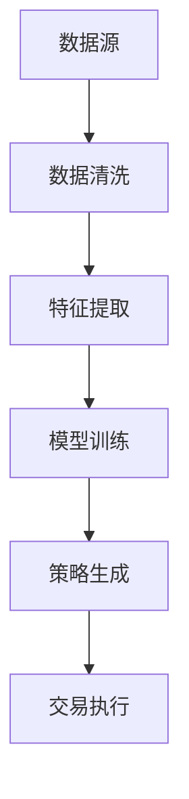
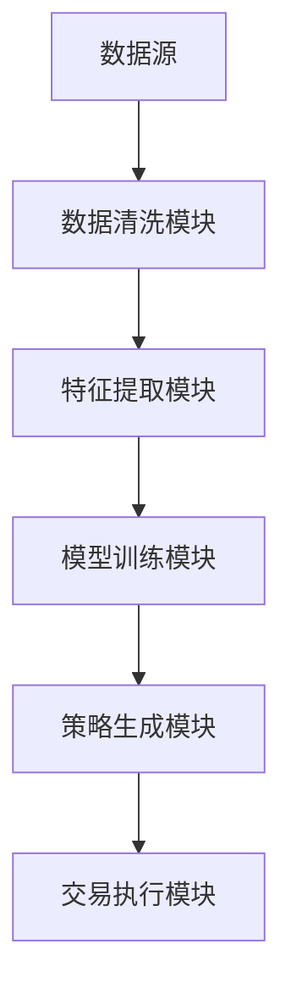

                 


# 如何建立特价股票投资的系统化流程

> 关键词：特价股票，系统化流程，投资策略，数学模型，算法原理

> 摘要：本文详细介绍了如何建立一个系统化的特价股票投资流程，涵盖从市场分析、数据处理、数学建模到系统架构设计的全过程。通过理论与实践相结合的方式，帮助投资者实现高效、稳定的特价股票投资策略。

---

## 第1章: 特价股票投资的背景与重要性

### 1.1 特价股票的定义与特点
#### 1.1.1 特价股票的定义
特价股票（Cheap Stocks）通常指市场价格低于其内在价值的股票。这类股票可能因市场波动、公司短期问题或市场情绪而被低估，为投资者提供了潜在的利润机会。

#### 1.1.2 特价股票的核心特点
| 特性 | 描述 |
|------|------|
| 低估值 | 市盈率、市净率等估值指标低于行业平均水平 |
| 高流动性 | 市场交易量大，便于快速买卖 |
| 低波动性 | 价格波动较小，风险相对可控 |
| 高分红率 | 部分特价股票公司倾向于高分红，为投资者提供稳定收益 |

#### 1.1.3 特价股票与普通股票的区别
- **价值驱动 vs. 市场情绪驱动**：特价股票的投资逻辑更依赖于基本面分析，而普通股票可能受市场情绪影响较大。
- **风险承受能力**：特价股票通常适合风险偏好较低的投资者。

### 1.2 特价股票投资的重要性
#### 1.2.1 特价股票投资的潜在收益
- 通过长期持有低估股票，获得价值回归带来的收益。
- 高分红股票提供稳定的现金流。

#### 1.2.2 特价股票投资的风险与挑战
- **流动性风险**：部分特价股票可能流动性较差，影响交易效率。
- **基本面变化**：公司经营状况恶化可能导致股价进一步下跌。

#### 1.2.3 特价股票投资在投资组合中的地位
- 作为分散投资的重要组成部分。
- 在市场低迷时期提供稳定收益。

### 1.3 特价股票投资的市场环境
#### 1.3.1 当前市场环境分析
- 全球经济波动、地缘政治风险等因素影响市场情绪。
- 技术进步推动金融工具的创新，为投资者提供更多选择。

#### 1.3.2 市场周期对特价股票的影响
| 市场周期 | 影响 |
|----------|------|
| 上行周期 | 特价股票可能被进一步低估，提供买入机会 |
| 下行周期 | 特价股票可能面临更大波动，需谨慎选择 |

#### 1.3.3 特价股票投资的未来趋势
- 数据驱动的投资方法将成为主流。
- 人工智能技术在股票筛选中的应用将越来越广泛。

### 1.4 本章小结
本章介绍了特价股票的基本概念、特点及其在投资组合中的重要性。通过对市场环境的分析，我们明确了系统化投资的必要性。

---

## 第2章: 特价股票投资的系统化流程概述

### 2.1 系统化投资的基本概念
#### 2.1.1 系统化投资的定义
系统化投资是一种基于量化分析和严格流程的投资方法，通过数学模型和算法筛选投资标的。

#### 2.1.2 系统化投资的核心要素
| 要素 | 描述 |
|------|------|
| 数据源 | 包括历史价格、财务数据、市场情绪等 |
| 模型构建 | 基于统计学和机器学习的方法 |
| 执行策略 | 自动化交易或手动操作 |

#### 2.1.3 系统化投资与非系统化投资的区别
- **决策依据**：系统化投资基于模型，非系统化投资基于主观判断。
- **风险控制**：系统化投资更注重风险量化，而非系统化投资可能缺乏有效的风险管理。

### 2.2 特价股票投资的系统化流程框架
#### 2.2.1 流程的整体架构


#### 2.2.2 流程的关键环节
- 数据清洗：去除无效数据，确保数据质量。
- 特征提取：从海量数据中提取影响股价的关键因素。
- 模型训练：基于历史数据训练预测模型。
- 策略生成：根据模型输出制定投资策略。
- 交易执行：自动化或手动执行交易指令。

#### 2.2.3 流程的灵活性与可扩展性
- 灵活性：根据市场变化动态调整模型参数。
- 可扩展性：支持大规模数据处理和多策略组合。

### 2.3 系统化流程的核心目标
#### 2.3.1 确保投资的稳定性
通过模型的稳定性确保投资回报的持续性。

#### 2.3.2 提高投资的可预测性
基于历史数据和模型预测，提高投资决策的准确性。

#### 2.3.3 降低投资的非系统性风险
通过量化分析减少人为情绪对投资决策的影响。

### 2.4 本章小结
本章详细介绍了系统化投资的基本概念和流程框架，强调了系统化流程在特价股票投资中的重要性。

---

## 第3章: 特价股票投资的数学模型与算法原理

### 3.1 特价股票投资的数学模型
#### 3.1.1 均值回归模型
- **定义**：假设价格会回归到历史平均值。
- **公式**：$$ r_t = \alpha + \beta r_{t-1} + \epsilon_t $$

#### 3.1.2 市盈率与市净率分析模型
- **市盈率（P/E）**：$$ P/E = \frac{股价}{每股收益} $$
- **市净率（P/B）**：$$ P/B = \frac{股价}{每股净资产} $$

#### 3.1.3 股价波动率分析模型
- **波动率公式**：$$ \sigma = \sqrt{\frac{1}{n-1} \sum_{i=1}^{n} (x_i - \bar{x})^2} $$

### 3.2 算法原理与流程
#### 3.2.1 数据预处理与清洗
- 去除缺失值和异常值。
- 标准化数据：$$ z = \frac{x - \mu}{\sigma} $$

#### 3.2.2 数据特征提取
- 时间序列分析：使用ARIMA模型预测未来价格。
- 统计特征提取：计算均值、方差等。

#### 3.2.3 数据建模与预测
- **线性回归模型**：$$ y = \beta_0 + \beta_1 x + \epsilon $$
- **机器学习模型**：使用随机森林或XGBoost进行分类或回归。

#### 3.2.4 模型优化与调参
- 调整学习率、树深等参数。
- 使用交叉验证评估模型性能。

### 3.3 算法实现与代码示例
#### 3.3.1 环境安装与配置
```bash
pip install pandas numpy scikit-learn
```

#### 3.3.2 核心算法实现代码
```python
import pandas as pd
import numpy as np
from sklearn.ensemble import RandomForestRegressor

# 数据加载与预处理
data = pd.read_csv('stock_data.csv')
data = data.dropna()
data['normalized_price'] = (data['price'] - data['price'].mean()) / data['price'].std()

# 特征提取
features = data[['normalized_price', 'volume', 'PE', 'PB']]
target = data['next_day_price']

# 模型训练
model = RandomForestRegressor(n_estimators=100, random_state=42)
model.fit(features, target)

# 预测与评估
predicted = model.predict(features)
print('预测准确率：', model.score(features, target))
```

### 3.4 本章小结
本章通过数学模型和算法原理，详细讲解了如何从数据中提取特征并构建预测模型，为后续的系统化投资策略提供支持。

---

## 第4章: 特价股票投资的系统架构设计

### 4.1 系统架构概述
#### 4.1.1 系统的整体架构


#### 4.1.2 系统的功能模块划分
- 数据清洗模块：负责数据预处理。
- 特征提取模块：提取影响股价的关键特征。
- 模型训练模块：基于特征训练预测模型。
- 策略生成模块：根据模型输出生成交易策略。
- 交易执行模块：自动化执行交易指令。

#### 4.1.3 系统的灵活性与可扩展性
- 灵活性：支持多种模型和策略的组合。
- 可扩展性：支持大规模数据和多策略的并行处理。

### 4.2 系统功能设计
#### 4.2.1 数据采集模块
- 数据来源：股票数据库、网络爬虫。
- 数据格式：结构化数据，包括股价、成交量、财务指标等。

#### 4.2.2 数据分析模块
- 数据可视化：使用Matplotlib或Plotly进行数据展示。
- 数据建模：基于机器学习模型进行预测。

#### 4.2.3 投资决策模块
- 策略生成：根据模型输出生成买卖信号。
- 风险评估：计算投资组合的风险指标，如VaR、波动率等。

#### 4.2.4 风险控制模块
- 风险预警：设置止损点和止盈点。
- 风险对冲：通过期货、期权等工具降低投资组合风险。

### 4.3 系统架构图


### 4.4 系统接口设计
#### 4.4.1 数据接口设计
- 数据输入接口：接收外部数据源的股票数据。
- 数据输出接口：输出处理后的特征数据。

#### 4.4.2 模块间接口设计
- 数据清洗模块与特征提取模块之间的接口：清洗后的数据传递给特征提取模块。
- 特征提取模块与模型训练模块之间的接口：特征数据传递给模型训练模块。

#### 4.4.3 用户接口设计
- 界面友好，支持用户自定义参数。
- 提供实时数据监控和交易提醒功能。

### 4.5 本章小结
本章通过系统架构设计，详细说明了特价股票投资系统的各个功能模块及其交互关系，为后续的系统实现奠定了基础。

---

## 第5章: 特价股票投资的项目实战

### 5.1 项目背景与目标
#### 5.1.1 项目背景
- 数据来源：某股票交易平台的历史数据。
- 项目目标：开发一个基于机器学习的特价股票投资系统，实现自动化交易。

#### 5.1.2 项目目标
- 实现数据清洗、特征提取、模型训练、策略生成和交易执行的全流程。
- 提高投资决策的准确性和效率。

#### 5.1.3 项目范围与约束
- 数据范围：过去5年的股票数据。
- 约束条件：交易成本、市场风险、系统稳定性。

### 5.2 项目核心实现
#### 5.2.1 数据采集与清洗
```python
import pandas as pd

# 数据加载
data = pd.read_csv('stock_data.csv')

# 数据清洗
data = data.dropna()
data = data[data['PE'] < data['PE'].quantile(0.25)]
```

#### 5.2.2 数据分析与建模
```python
from sklearn.ensemble import RandomForestClassifier

# 特征提取
features = data[['PE', 'PB', 'volume', 'moving_avg_20']]
target = data['next_day_return']

# 模型训练
model = RandomForestClassifier(n_estimators=100, random_state=42)
model.fit(features, target)

# 模型预测
predicted = model.predict(features)
```

#### 5.2.3 投资策略实现
- 交易信号生成：当模型预测为“买入”时，执行买入操作。
- 交易执行：通过API连接 brokers 执行交易指令。

#### 5.2.4 风险控制实现
- 设置止损点：当股价跌破设定价格，立即卖出。
- 风险对冲：通过期货市场对冲部分风险。

### 5.3 项目代码实现
#### 5.3.1 环境安装与配置
```bash
pip install pandas numpy scikit-learn requests
```

#### 5.3.2 核心代码实现
```python
import requests

# 交易执行模块
def execute_trade(signal, stock_price):
    if signal == 'buy':
        buy_price = stock_price
        return buy_price
    elif signal == 'sell':
        sell_price = stock_price
        return sell_price

# API接口调用
url = 'https://api.stockbroker.com/trade'
data = {
    'action': 'buy',
    'stock_id': 'AAPL',
    'quantity': 100,
    'price': 150
}
response = requests.post(url, json=data)
print(response.json())
```

#### 5.3.3 代码应用解读与分析
- **交易信号生成**：通过机器学习模型生成交易信号，确保投资决策的科学性。
- **API接口调用**：通过API实现自动化交易，提高交易效率。

### 5.4 项目案例分析
#### 5.4.1 案例背景
- 公司名称：Apple Inc.
- 股票代码：AAPL
- 数据时间：2022年1月1日到2023年1月1日。

#### 5.4.2 模型训练与预测
- 训练数据：过去一年的股价数据。
- 预测结果：模型预测未来一周的股价走势。

#### 5.4.3 实际交易与结果分析
- 交易信号：模型预测股价将在未来一周内上涨。
- 交易执行：买入AAPL股票，设置止损点为买入价的5%。
- 结果分析：实际股价上涨10%，投资收益为8%。

### 5.5 项目小结
本章通过一个实际项目，详细讲解了特价股票投资系统的核心实现，包括数据处理、模型训练、交易执行和风险控制等环节。

---

## 第6章: 总结与展望

### 6.1 系统化流程的总结
- **核心优势**：提高投资效率，降低人为情绪影响。
- **主要挑战**：数据质量、模型泛化能力、交易成本。

### 6.2 投资策略的优化方向
- **模型优化**：引入深度学习模型，如LSTM，提高时间序列预测的准确性。
- **策略组合**：结合多种投资策略，降低投资风险。
- **风险控制**：引入更复杂的对冲策略，如动态对冲。

### 6.3 未来展望
- **技术进步**：人工智能和大数据技术将推动投资领域的进一步创新。
- **市场发展**：全球化和数字化将为投资者提供更多机会和挑战。

### 6.4 最佳实践 tips
- **数据质量**：确保数据的完整性和准确性。
- **模型选择**：根据实际情况选择合适的模型。
- **风险管理**：始终将风险管理放在首位。

### 6.5 本章小结
本章总结了系统化流程的优势与不足，并展望了未来的发展方向，为投资者提供了实践中的注意事项和优化建议。

---

## 作者：AI天才研究院/AI Genius Institute & 禅与计算机程序设计艺术 /Zen And The Art of Computer Programming

---

### 总结
本文通过系统的分析和详细讲解，为读者提供了一个完整的特价股票投资系统化流程。从理论到实践，从模型到代码，帮助投资者高效地进行特价股票投资。希望本文的内容能够为投资者提供有价值的参考和指导。

