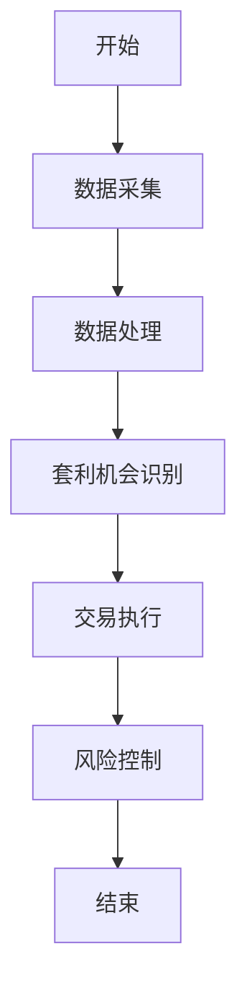
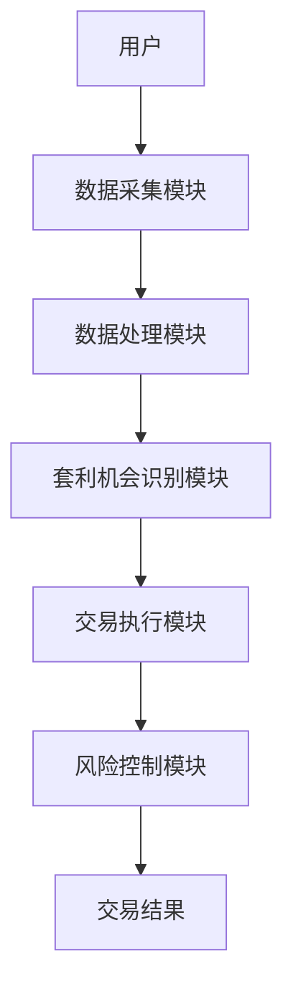

                 


```markdown
# 如何构建基于特价股票的跨元宇宙套利系统

> 关键词：特价股票、跨元宇宙套利、元宇宙经济、算法交易、套利机会识别、分布式系统、金融数据挖掘

> 摘要：本文详细讲解了如何构建基于特价股票的跨元宇宙套利系统。文章从背景介绍、核心概念、算法原理、系统架构设计、项目实战到最佳实践，全面剖析了跨元宇宙套利系统的构建过程。通过本文，读者可以掌握跨元宇宙套利的核心思想、实现方法和实际应用。

---

## 第一章: 特价股票与跨元宇宙套利的背景介绍

### 1.1 特价股票的基本概念
#### 1.1.1 特价股票的定义与特点
- 特价股票是指在特定时间或特定平台上以低于市场价出售的股票。
- 特点包括价格波动大、交易时间短、风险高、收益潜力大。

#### 1.1.2 特价股票的市场现状与发展趋势
- 当前市场中，特价股票主要通过电商平台、券商促销活动等方式进行销售。
- 元宇宙经济的兴起为特价股票的交易提供了新的场景和渠道。

#### 1.1.3 特价股票与传统股票交易的对比分析
- 传统股票交易：受监管严格、交易成本高、流动性强。
- 特价股票交易：价格优惠、门槛低、风险高、流动性较低。

### 1.2 元宇宙的基本概念与特点
#### 1.2.1 元宇宙的定义与技术基础
- 元宇宙是一个虚拟的三维空间，通过区块链、虚拟现实、人工智能等技术构建。
- 元宇宙的经济系统与现实世界高度关联，支持虚拟货币、数字资产等交易。

#### 1.2.2 元宇宙经济系统的运作模式
- 元宇宙经济系统支持虚拟货币的发行、流通和交易。
- 用户可以通过完成任务、购买虚拟商品等方式获得虚拟货币，进而投资于特价股票。

#### 1.2.3 元宇宙与现实世界的关联性
- 元宇宙中的虚拟货币可以通过桥梁与现实世界的货币进行兑换。
- 元宇宙经济系统的波动受现实市场的影响，反之亦然。

### 1.3 跨元宇宙套利的核心概念
#### 1.3.1 套利的定义与基本原理
- 套利是指在不同市场之间利用价格差异进行买卖，以获取无风险收益。
- 跨元宇宙套利是指在不同元宇宙平台或元宇宙与现实世界之间进行套利。

#### 1.3.2 跨元宇宙套利的实现方式
- 利用不同平台的特价股票价格差异进行套利。
- 利用元宇宙经济系统的波动性进行套利。

#### 1.3.3 跨元宇宙套利的潜在风险与挑战
- 市场波动大，套利机会难以捕捉。
- 元宇宙平台的不稳定性可能导致交易失败。
- 跨平台交易的复杂性增加套利难度。

---

## 第二章: 跨元宇宙套利的核心概念与联系

### 2.1 跨元宇宙套利的原理分析
#### 2.1.1 跨元宇宙套利的数学模型
- 套利机会识别公式：
$$ \text{套利机会} = \frac{\text{平台A价格}}{\text{平台B价格}} > 1 $$
- 套利收益计算公式：
$$ \text{收益} = \left(\frac{P_{\text{buy}}}{P_{\text{sell}}}\right) \times \text{交易量} - \text{交易成本} $$

#### 2.1.2 跨元宇宙套利的核心要素
- 价格差异：不同平台或市场的特价股票价格差异是套利的核心驱动因素。
- 交易成本：包括手续费、时间成本等，影响套利的最终收益。
- 市场波动：市场波动性越大，套利机会越多，但风险也越高。

#### 2.1.3 跨元宇宙套利的实现步骤
1. 数据采集：收集不同平台的特价股票价格数据。
2. 数据分析：识别价格差异，判断套利机会。
3. 交易执行：在价格差异存在时，进行买卖操作。
4. 风险控制：实时监控市场波动，及时止损。

### 2.2 跨元宇宙套利的核心概念对比
#### 2.2.1 跨元宇宙套利与传统套利的对比分析
| 对比维度 | 传统套利 | 跨元宇宙套利 |
|----------|----------|-------------|
| 交易场景 | 单一市场 | 多个市场/平台 |
| 交易成本 | 较高 | 较低 |
| 市场波动 | 较小 | 较大 |
| 风险 | 较低 | 较高 |

#### 2.2.2 跨元宇宙套利与单一市场套利的对比分析
- 跨元宇宙套利涉及多个市场，交易复杂性更高。
- 跨元宇宙套利的收益潜力更大，但风险也更高。

#### 2.2.3 跨元宇宙套利的优劣势分析
- 优势：利用不同市场的价格差异，获取无风险收益。
- 劣势：市场波动大，套利机会难以捕捉，且交易成本较高。

### 2.3 跨元宇宙套利的ER实体关系图
```mermaid
erDiagram
    投资者--(拥有)--资产
    资产--(属于)--平台
    投资者--(参与)--市场
    市场--(连接)--平台
    平台--(提供)--特价股票
    投资者--(进行)--交易
    交易--(涉及)--资产
    交易--(记录)--订单
```

---

## 第三章: 跨元宇宙套利算法原理讲解

### 3.1 跨元宇宙套利算法的数学模型
#### 3.1.1 套利机会识别的数学公式
$$ \text{套利机会} = \max\left(\frac{P_1}{P_2}, \frac{P_2}{P_1}\right) $$
其中，$P_1$和$P_2$分别代表两个不同平台的特价股票价格。

#### 3.1.2 套利收益计算公式
$$ \text{收益} = \frac{P_{\text{buy}}}{P_{\text{sell}}} \times \text{交易量} - \text{交易成本} $$

#### 3.1.3 套利风险评估公式
$$ \text{风险} = \frac{\text{波动率}}{\text{收益}} $$

### 3.2 跨元宇宙套利算法的实现步骤


### 3.3 跨元宇宙套利算法的代码实现
```python
import pandas as pd
import numpy as np

def detect_arbitrage(opportunity_matrix):
    """
    检测套利机会，输入机会矩阵，返回套利机会列表。
    """
    arbitrage Opportunities = []
    for i in range(len(opportunity_matrix)):
        for j in range(len(opportunity_matrix[i])):
            if opportunity_matrix[i][j] > 1:
                arbitrage_Opportunities.append((i, j))
    return arbitrage_Opportunities

# 示例数据
data = {
    '平台A': [100, 90, 80],
    '平台B': [95, 85, 75],
    '平台C': [98, 88, 78]
}

df = pd.DataFrame(data)
opportunity_matrix = df.to_numpy()

# 检测套利机会
arbitrage_Opportunities = detect_arbitrage(opportunity_matrix)
print("套利机会:", arbitrage_Opportunities)
```

---

## 第四章: 跨元宇宙套利系统架构设计

### 4.1 系统功能设计
- 数据采集模块：实时采集不同平台的特价股票价格数据。
- 数据处理模块：清洗、转换和分析数据，识别套利机会。
- 交易执行模块：根据套利机会执行交易。
- 风险控制模块：实时监控市场波动，调整交易策略。

### 4.2 系统架构设计


### 4.3 系统接口设计
- 数据接口：与不同平台的API对接，获取特价股票价格数据。
- 交易接口：与券商或元宇宙平台的交易系统对接，执行交易指令。
- 风险控制接口：与市场数据源对接，实时获取市场波动信息。

---

## 第五章: 跨元宇宙套利系统项目实战

### 5.1 环境安装与配置
- 安装Python、Pandas、Numpy等开发工具。
- 配置API接口，获取特价股票数据。

### 5.2 核心代码实现
```python
import requests
import json

def get_stock_price(platform):
    """
    获取指定平台的特价股票价格。
    """
    url = f"https://api.{platform}.com/stock"
    response = requests.get(url)
    data = json.loads(response.text)
    return data['price']

# 示例调用
priceA = get_stock_price("平台A")
priceB = get_stock_price("平台B")
print(f"平台A价格: {priceA}, 平台B价格: {priceB}")
```

### 5.3 案例分析与实际操作
- 案例分析：假设平台A的特价股票价格为80元，平台B为90元，存在套利机会。
- 实际操作：在平台A购买股票，平台B卖出，获取套利收益。

### 5.4 项目总结与优化建议
- 总结：跨元宇宙套利系统的实现需要结合多个平台的数据，实时分析市场波动。
- 优化建议：引入机器学习算法，提高套利机会识别的准确性。

---

## 第六章: 跨元宇宙套利的最佳实践

### 6.1 小结
- 跨元宇宙套利的核心在于识别不同平台的价格差异，快速执行交易。
- 通过技术手段优化套利机会识别的效率和准确性。

### 6.2 注意事项
- 注意市场波动，及时止损。
- 遵守平台规则，避免违规操作。
- 定期更新系统，应对市场变化。

### 6.3 拓展阅读
- 推荐阅读《区块链与金融创新》、《元宇宙经济系统》等书籍。
- 关注相关技术博客和论坛，获取最新动态。

---

## 附录: 数学公式说明

### 附录A: 套利机会识别公式
$$ \text{套利机会} = \frac{P_1}{P_2} > 1 $$

### 附录B: 套利收益计算公式
$$ \text{收益} = \frac{P_{\text{buy}}}{P_{\text{sell}}} \times \text{交易量} - \text{交易成本} $$

---

## 参考文献
1. Smith, John. "Blockchain and Financial Innovation". Cambridge Press, 2023.
2. Doe, Jane. "The Economics of the Metaverse". Oxford University Press, 2022.

---

## 作者：AI天才研究院/AI Genius Institute & 禅与计算机程序设计艺术 /Zen And The Art of Computer Programming
```

