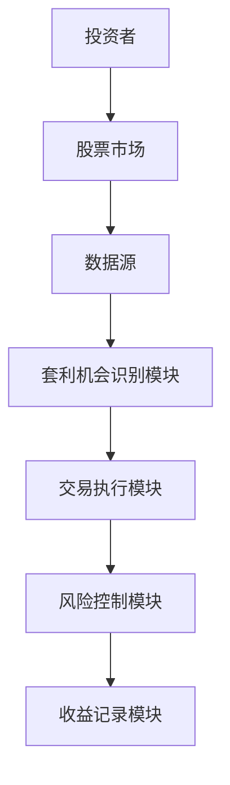
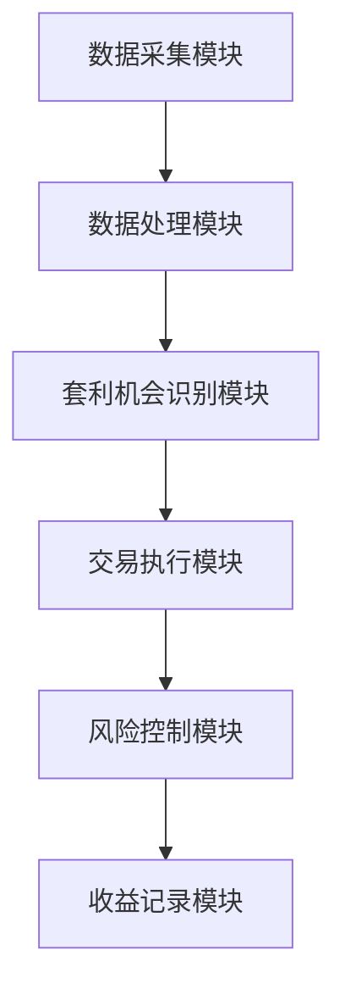

                 


# 如何构建基于特价股票的跨维度套利系统

## 关键词：
- 股票套利
- 跨维度套利
- 量化投资
- 金融系统
- 算法交易
- 人工智能

## 摘要：
本文详细讲解了如何构建基于特价股票的跨维度套利系统。首先，我们从套利的基本概念和跨维度套利的必要性入手，分析了特价股票的特性与挑战。接着，我们深入探讨了套利的数学模型与原理，构建了系统的ER实体关系图。然后，我们详细讲解了套利机会识别的算法原理，并给出了系统的功能设计与架构设计。最后，通过项目实战，我们展示了如何实现跨维度套利系统，并总结了最佳实践和注意事项。本文适合程序员、CTO、软件架构师以及对量化投资感兴趣的技术人员阅读。

---

# 第一部分: 特价股票套利系统背景与核心概念

## 第1章: 特价股票套利的定义与背景

### 1.1 套利的定义与基本原理

#### 1.1.1 套利的基本概念
套利是一种利用市场中不同资产或市场之间的价格差异，通过同时买入和卖出相关资产来获利的交易策略。其核心思想是“一买一卖，无风险套利”。套利的基本原理是基于市场的不完全有效性和价格差异的存在。

#### 1.1.2 套利的经济学原理
在经济学中，套利是市场参与者利用价格差异来套取利润的行为。根据“一价定理”，同一资产在不同市场上的价格应该相等，否则套利机会将存在。套利活动有助于消除价格差异，促进市场有效性的提高。

#### 1.1.3 套利的法律与道德边界
套利本身是合法的，但某些套利策略可能会违反相关法律法规，例如利用内幕信息或操纵市场。此外，套利行为需要遵守市场规则，尊重市场参与者的利益，避免对市场造成过度波动。

### 1.2 跨维度套利的必要性

#### 1.2.1 股票市场的跨市场套利机会
不同市场之间的价格差异可能为套利者提供机会。例如，同一股票在A股和港股市场上的价格差异可能源于汇率波动或市场参与者对股票的不同估值。

#### 1.2.2 跨产品套利的策略优势
跨产品套利是指利用不同金融产品之间的价格差异进行套利。例如，利用股票与指数期货之间的价格差异进行套利。跨产品套利的优势在于可以通过分散投资降低风险。

#### 1.2.3 套利在投资组合中的作用
套利可以作为投资组合的一部分，提供无风险或低风险的收益。通过套利策略，投资者可以在市场波动中稳定收益，同时减少对市场波动的敏感性。

### 1.3 特价股票的特性与挑战

#### 1.3.1 特价股票的定义与分类
特价股票是指价格相对较低的股票，通常具有较高的波动性和潜在的高回报。特价股票可以分为两类：一是基本面良好的低价股，二是市场表现不佳的低价股。

#### 1.3.2 特价股票的市场波动性
特价股票的价格波动较大，容易受到市场情绪和外部因素的影响。这种波动性为套利者提供了机会，但也增加了套利的风险。

#### 1.3.3 特价股票套利的风险与收益
套利特价股票的风险主要来自市场的不确定性和价格波动。然而，套利策略可以通过严格的量化分析和风险控制来降低风险，从而实现较高的收益。

---

## 第2章: 跨维度套利系统的构建背景

### 2.1 传统套利方法的局限性

#### 2.1.1 传统套利方法的效率问题
传统套利方法通常依赖人工分析和交易，效率较低。随着市场的快速发展，人工套利难以应对高频交易和复杂市场环境。

#### 2.1.2 传统套利方法的收益瓶颈
传统套利方法的收益有限，难以在竞争激烈的市场中获得超额收益。套利机会的减少和市场有效性的提高使得传统套利方法的收益空间受到压缩。

#### 2.1.3 传统套利方法的市场适应性
传统套利方法难以适应市场的快速变化，例如市场结构的变化和监管政策的调整。套利者需要更加灵活和高效的策略来应对市场变化。

### 2.2 跨维度套利的兴起

#### 2.2.1 跨维度套利的定义与特点
跨维度套利是指在不同市场、不同产品或不同时间框架之间进行套利。其特点是利用多维度的价格差异，通过复杂的算法和模型来捕捉套利机会。

#### 2.2.2 跨维度套利的市场环境
随着金融市场的全球化和产品多样化，跨维度套利的机会增加。投资者可以通过利用不同市场和产品的价格差异，实现更高的收益。

#### 2.2.3 跨维度套利的未来趋势
未来，跨维度套利将更加依赖于技术的进步，例如人工智能和大数据分析。套利者需要不断优化算法和模型，以应对市场的复杂性和不确定性。

### 2.3 系统构建的必要性

#### 2.3.1 系统化套利的优势
系统化套利可以通过自动化交易和量化分析，提高套利的效率和准确性。系统化套利可以减少人为干扰，降低交易成本，同时提高收益。

#### 2.3.2 系统化套利的风险控制
系统化套利可以通过严格的算法和模型，实现风险的量化和控制。系统化套利能够实时监控市场变化，及时调整交易策略，降低风险。

#### 2.3.3 系统化套利的长期收益
系统化套利能够通过持续捕捉套利机会，实现长期稳定的收益。系统化套利的优势在于其稳定性和可持续性，能够在不同市场环境下保持收益。

---

## 第3章: 跨维度套利系统的数学模型与原理

### 3.1 套利的无套利定价定理

#### 3.1.1 定理的数学表达
无套利定价定理表明，在有效市场中，同一资产在不同市场上的价格应该相等。数学表达式为：
$$ P_1 = P_2 $$
其中，$P_1$ 和 $P_2$ 分别表示同一资产在两个市场的价格。

#### 3.1.2 定理在股票套利中的应用
无套利定价定理可以用于判断是否存在套利机会。如果 $P_1 \neq P_2$，则存在套利机会。套利者可以同时买入价格较低的资产，卖出价格较高的资产，从而获利。

#### 3.1.3 定理的局限性与改进方向
无套利定价定理假设市场是有效的，但在现实中，市场可能存在摩擦和不确定性。因此，定理的局限性在于其假设条件的严格性。未来的研究可以考虑市场摩擦和不确定性对套利策略的影响。

### 3.2 跨维度套利的数学模型

#### 3.2.1 多变量回归模型
多变量回归模型可以用于分析多个变量之间的关系，帮助套利者识别套利机会。数学表达式为：
$$ y = \beta_1x_1 + \beta_2x_2 + \epsilon $$
其中，$y$ 是因变量，$x_1$ 和 $x_2$ 是自变量，$\beta_1$ 和 $\beta_2$ 是回归系数，$\epsilon$ 是误差项。

#### 3.2.2 时间序列分析模型
时间序列分析模型可以用于分析股票价格的时间变化，帮助套利者预测未来的价格走势。常用的模型包括ARIMA和GARCH。

#### 3.2.3 风险中性定价模型
风险中性定价模型可以通过消除市场风险，评估资产的内在价值。数学表达式为：
$$ V = e^{-rT}E[P] $$
其中，$V$ 是资产的内在价值，$r$ 是无风险利率，$T$ 是时间跨度，$E[P]$ 是资产到期时的价格期望值。

### 3.3 套利机会的识别算法

#### 3.3.1 基于均值回归的套利算法
均值回归算法假设价格会回归到均值水平。套利者可以利用价格的短期偏离进行套利。算法步骤如下：
1. 计算资产的价格偏离均值的程度。
2. 当价格偏离均值时，进行买入或卖出操作。
3. 当价格回归均值时，平仓获利。

#### 3.3.2 基于波动率的套利算法
波动率套利算法通过捕捉资产价格波动的异常情况，进行套利。算法步骤如下：
1. 计算资产价格的波动率。
2. 当波动率显著增加时，进行买入或卖出操作。
3. 当波动率回归正常水平时，平仓获利。

#### 3.3.3 基于机器学习的套利算法
机器学习算法可以通过分析历史数据，识别套利机会。常用的算法包括支持向量机和神经网络。算法步骤如下：
1. 收集相关数据，包括资产价格和市场指标。
2. 训练模型，识别套利机会。
3. 根据模型预测结果，进行交易操作。

---

## 第4章: 跨维度套利系统的ER实体关系图

### 4.1 系统实体关系图



### 4.2 系统核心模块关系



---

## 第5章: 跨维度套利系统的算法原理

### 5.1 数据采集模块

#### 5.1.1 数据源的选择
数据源包括股票市场、期货市场和外汇市场。套利者需要选择相关性较高的资产，以提高套利机会的可能性。

#### 5.1.2 数据采集方法
数据采集可以通过API接口或数据库查询实现。套利系统需要实时采集市场数据，以便及时识别套利机会。

#### 5.1.3 数据预处理
数据预处理包括清洗、转换和标准化。预处理步骤如下：
1. 清洗数据，去除异常值。
2. 转换数据格式，统一时间戳和价格单位。
3. 标准化数据，消除不同资产之间的量纲差异。

### 5.2 套利机会识别模块

#### 5.2.1 均值回归模型
均值回归模型通过计算资产价格与均值的偏离程度，识别套利机会。公式如下：
$$ \text{偏离度} = \frac{\text{当前价格} - \text{均值}}{\text{标准差}} $$

#### 5.2.2 波动率套利模型
波动率套利模型通过计算资产价格波动率的变化，识别套利机会。公式如下：
$$ \text{波动率} = \sqrt{\text{方差}} $$

#### 5.2.3 机器学习模型
机器学习模型可以通过训练数据，识别复杂的套利机会。常用的算法包括支持向量机和神经网络。

### 5.3 交易执行模块

#### 5.3.1 交易策略
交易策略包括买入、卖出和持有三种操作。套利者需要根据套利机会的强弱，选择合适的交易策略。

#### 5.3.2 交易执行
交易执行可以通过自动化交易系统实现。套利系统需要确保交易的及时性和准确性，避免交易成本和滑点的影响。

#### 5.3.3 交易记录
交易记录包括交易时间、价格和数量。套利系统需要实时记录交易信息，以便后续的收益计算和风险控制。

### 5.4 风险控制模块

#### 5.4.1 风险评估
风险评估包括市场风险、流动性风险和操作风险。套利系统需要定期评估风险，确保交易的安全性。

#### 5.4.2 风险控制策略
风险控制策略包括止损、止盈和仓位管理。套利者需要根据市场情况，动态调整风险控制策略。

#### 5.4.3 风险监控
风险监控可以通过实时监控系统实现。套利系统需要监控市场变化和交易执行情况，及时发现和处理风险。

---

## 第6章: 跨维度套利系统的项目实战

### 6.1 环境搭建

#### 6.1.1 系统架构
套利系统需要高性能的硬件和稳定的网络环境。推荐使用云服务器和高速网络，确保数据采集和交易执行的效率。

#### 6.1.2 软件安装
套利系统需要安装编程语言和相关库。推荐使用Python和相关金融库，如Pandas和NumPy。

#### 6.1.3 数据源接入
套利系统需要接入多个数据源，如股票市场和期货市场。推荐使用第三方API接口，如Yahoo Finance和Quandl。

### 6.2 核心代码实现

#### 6.2.1 数据采集代码
```python
import pandas as pd
import requests

def get_stock_data(ticker):
    url = f"https://query1.finance.yahoo.com/v8/finance/chart/{ticker}"
    response = requests.get(url)
    data = response.json()
    df = pd.DataFrame(data['chart']['result'][0]['prices'])
    df['timestamp'] = pd.to_datetime(df['timestamp'], unit='s')
    df.set_index('timestamp', inplace=True)
    return df
```

#### 6.2.2 套利机会识别代码
```python
def calculate_arbitrage_opportunity(data1, data2):
    # 计算价格差异
    price_diff = data1['close'] - data2['close']
    # 判断是否存在套利机会
    if price_diff > 0.01:
        return '买入' + data1['ticker'] + '，卖出' + data2['ticker']
    elif price_diff < -0.01:
        return '买入' + data2['ticker'] + '，卖出' + data1['ticker']
    else:
        return '无套利机会'
```

#### 6.2.3 交易执行代码
```python
import time
from trading_api import TradingAPI

def execute_trade(api_key, ticker, quantity, action):
    api = TradingAPI(api_key)
    if action == '买入':
        api.buy(ticker, quantity)
    elif action == '卖出':
        api.sell(ticker, quantity)
```

### 6.3 案例分析

#### 6.3.1 案例背景
假设我们有两个股票，股票A和股票B，分别在A股和港股市场上市。股票A的价格为5元，股票B的价格为4.5元（不含汇率影响）。由于汇率差异，股票B的实际价值为5.5元。因此，存在套利机会。

#### 6.3.2 操作步骤
1. 数据采集：获取股票A和股票B的实时价格。
2. 套利机会识别：计算价格差异，确定套利方向。
3. 交易执行：买入股票B，卖出股票A。

### 6.4 系统优化

#### 6.4.1 性能优化
性能优化包括减少数据处理时间和优化交易执行速度。套利系统需要使用高效的算法和数据结构，确保实时处理能力。

#### 6.4.2 算法优化
算法优化包括改进套利机会识别算法，提高识别的准确性和速度。套利系统可以通过机器学习和深度学习技术，不断优化算法模型。

#### 6.4.3 系统稳定性优化
系统稳定性优化包括增加冗余设计和故障恢复机制。套利系统需要确保在极端市场条件下仍然能够正常运行，避免系统崩溃和交易中断。

---

## 第7章: 跨维度套利系统的最佳实践

### 7.1 风险管理

#### 7.1.1 仓位管理
仓位管理包括合理分配资金和控制仓位规模。套利者需要根据市场情况和套利机会的强弱，动态调整仓位。

#### 7.1.2 止损与止盈
止损和止盈是风险管理的重要工具。套利者需要设定合理的止损点和止盈点，确保交易的稳定性和可持续性。

#### 7.1.3 风险分散
风险分散是通过投资多种资产和市场，降低整体风险。套利者可以通过跨市场和跨产品套利，实现风险分散。

### 7.2 算法优化

#### 7.2.1 算法选择
算法选择包括传统统计套利和机器学习套利。套利者需要根据市场情况和数据特性，选择合适的算法。

#### 7.2.2 模型优化
模型优化包括参数调整和模型验证。套利者需要通过回测和实盘交易，不断优化模型，提高套利收益。

#### 7.2.3 数据优化
数据优化包括数据质量提升和数据量增加。套利系统需要使用高质量的数据，确保套利机会识别的准确性。

### 7.3 系统维护

#### 7.3.1 系统更新
系统更新包括软件升级和硬件维护。套利系统需要定期更新，确保系统的安全性和高效性。

#### 7.3.2 系统监控
系统监控包括实时监控和日志记录。套利系统需要监控市场变化和系统运行状态，及时发现和处理问题。

#### 7.3.3 系统备份
系统备份包括数据备份和交易记录备份。套利系统需要定期备份，确保数据的安全性和可恢复性。

---

## 第8章: 总结与展望

### 8.1 小结
本文详细讲解了如何构建基于特价股票的跨维度套利系统。我们从套利的基本概念和跨维度套利的必要性入手，分析了特价股票的特性与挑战。接着，我们深入探讨了套利的数学模型与原理，构建了系统的ER实体关系图。然后，我们详细讲解了套利机会识别的算法原理，并给出了系统的功能设计与架构设计。最后，通过项目实战，我们展示了如何实现跨维度套利系统，并总结了最佳实践和注意事项。

### 8.2 展望
未来，跨维度套利系统将更加依赖于人工智能和大数据分析。套利者需要不断优化算法和模型，以应对市场的复杂性和不确定性。同时，套利系统的安全性需要进一步提升，确保交易的合法性和合规性。未来的研究可以考虑市场摩擦、交易成本和监管政策对套利策略的影响。

---

## 作者：AI天才研究院/AI Genius Institute & 禅与计算机程序设计艺术 /Zen And The Art of Computer Programming

---

这篇文章详细讲解了如何构建基于特价股票的跨维度套利系统，涵盖了从背景介绍到系统实现的各个方面。希望对读者有所帮助！

