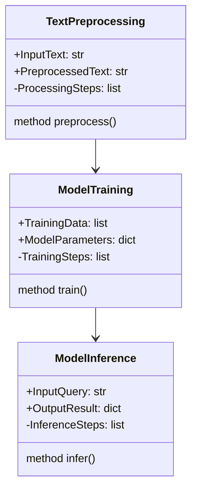
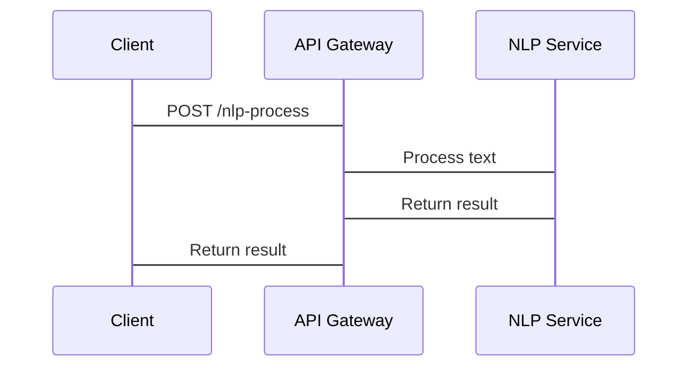

                 


# 如何评估企业的AI驱动的自然语言处理技术

## 关键词：自然语言处理技术，AI驱动，企业评估，系统架构，算法原理，项目实战

## 摘要：  
本文详细探讨了如何评估企业中AI驱动的自然语言处理技术，涵盖了技术背景、核心概念、算法原理、系统架构设计、项目实战以及最佳实践等方面。通过理论分析与实际案例结合，帮助读者全面了解企业NLP技术的评估方法，掌握从基础原理到系统实现的完整流程。

---

# 第四部分: 企业AI驱动的自然语言处理技术的系统架构设计

# 第4章: 企业级NLP系统的架构设计

## 4.1 问题场景介绍
### 4.1.1 企业NLP系统的常见问题
### 4.1.2 系统设计的目标与约束
### 4.1.3 业务场景与技术需求

## 4.2 项目介绍
### 4.2.1 项目背景与目标
### 4.2.2 项目范围与边界
### 4.2.3 项目团队与角色分配

## 4.3 系统功能设计
### 4.3.1 领域模型设计


### 4.3.2 系统架构设计


### 4.3.3 系统接口设计
#### 4.3.3.1 API接口定义
```json
{
  "api": {
    "paths": {
      "/nlp-process": {
        "post": {
          "summary": "Process natural language text",
          "requestBody": {
            "required": true,
            "content": {
              "application/json": {
                "schema": {
                  "$ref": "#/components/schemas/TextInput"
                }
              }
            }
          },
          "responses": {
            "200": {
              "description": "Successfully processed text",
              "content": {
                "application/json": {
                  "$ref": "#/components/schemas/TextOutput"
                }
              }
            }
          }
        }
      }
    }
  }
}
```

#### 4.3.3.2 接口交互流程


## 4.4 系统交互设计
### 4.4.1 交互流程优化
### 4.4.2 系统监控与日志
### 4.4.3 故障排除与容错机制

---

# 第五部分: 企业AI驱动的自然语言处理技术的项目实战

# 第5章: 项目实战与应用案例

## 5.1 项目环境安装与配置
### 5.1.1 系统环境要求
### 5.1.2 Python包安装
```bash
pip install transformers torch numpy
```

## 5.2 系统核心实现源代码
### 5.2.1 文本预处理代码
```python
def preprocess(text):
    # 基本预处理步骤
    text = text.lower()
    text = re.sub(r'[^\w\s]', '', text)
    return text
```

### 5.2.2 模型训练代码
```python
class NLPModel(nn.Module):
    def __init__(self, vocab_size, embedding_dim, hidden_dim):
        super(NLPModel, self).__init__()
        self.embedding = nn.Embedding(vocab_size, embedding_dim)
        self.lstm = nn.LSTM(embedding_dim, hidden_dim)
        self.fc = nn.Linear(hidden_dim, output_size)

    def forward(self, x):
        embeds = self.embedding(x)
        out, _ = self.lstm(embeds)
        out = self.fc(out)
        return out
```

### 5.2.3 推理与预测代码
```python
def predict(model, input_text):
    preprocessed = preprocess(input_text)
    tensor_input = torch.tensor(preprocessed).long()
    with torch.no_grad():
        output = model(tensor_input)
    return output
```

## 5.3 代码应用解读与分析
### 5.3.1 代码功能分析
### 5.3.2 代码优化建议
### 5.3.3 代码维护与更新

## 5.4 实际案例分析
### 5.4.1 案例背景介绍
### 5.4.2 数据准备与处理
### 5.4.3 模型训练与优化
### 5.4.4 模型评估与部署

## 5.5 项目小结
### 5.5.1 项目成果总结
### 5.5.2 经验与教训
### 5.5.3 未来改进方向

---

# 第六部分: 企业AI驱动的自然语言处理技术的最佳实践与总结

# 第6章: 最佳实践与总结

## 6.1 评估与优化建议
### 6.1.1 技术选型建议
### 6.1.2 系统设计优化
### 6.1.3 模型训练技巧

## 6.2 注意事项与风险提示
### 6.2.1 数据隐私与安全
### 6.2.2 模型性能与可解释性
### 6.2.3 系统扩展性与维护性

## 6.3 拓展阅读与深入学习
### 6.3.1 推荐的书籍与论文
### 6.3.2 在线课程与技术博客
### 6.3.3 技术社区与论坛

## 6.4 小结
### 6.4.1 本文核心内容回顾
### 6.4.2 未来研究方向展望
### 6.4.3 致谢与鸣谢

---

# 作者：AI天才研究院（AI Genius Institute） & 禅与计算机程序设计艺术（Zen And The Art of Computer Programming）

邮箱：contact@aigeniusinstitute.com

网址：https://www.aigeniusinstitute.com

