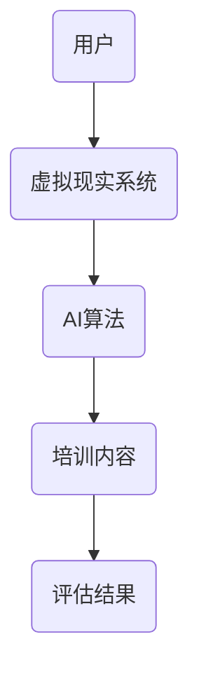
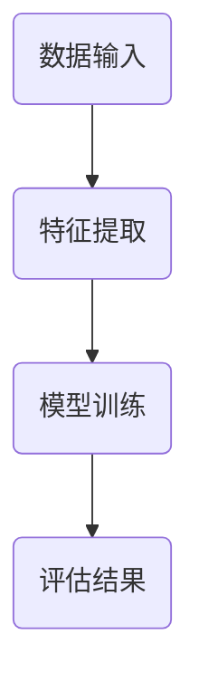
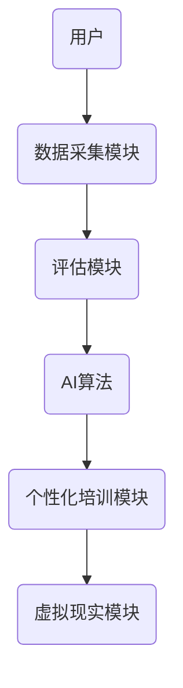
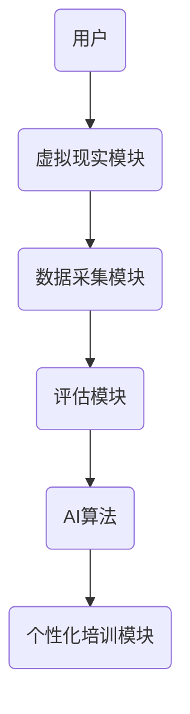

                 


# 如何评估企业的AI驱动的虚拟现实培训系统

## 关键词：AI, 虚拟现实, 企业培训, 系统评估, 算法原理

## 摘要：本文详细探讨了如何评估企业中的AI驱动的虚拟现实培训系统，从系统概述、评估方法、算法原理、系统架构到项目实战，全面分析了该系统的各个方面。通过具体的案例分析和详细的代码实现，帮助读者理解如何在实际中应用这些评估方法，从而提升企业的培训效果和效率。

---

# 第一部分：AI驱动的虚拟现实培训系统概述

## 第1章：AI与虚拟现实技术概述

### 1.1 AI与虚拟现实的基本概念

人工智能（AI）是指模拟人类智能的计算机系统，能够执行学习、推理、感知和决策等任务。虚拟现实（VR）是一种计算机生成的仿真系统，能够提供用户沉浸式的体验，使用户感觉身处虚拟环境中。AI与虚拟现实的结合，使得虚拟现实系统能够根据用户的实时行为和反馈进行动态调整，提供个性化的培训体验。

### 1.2 AI驱动的虚拟现实培训系统的定义

AI驱动的虚拟现实培训系统是一种利用人工智能技术和虚拟现实技术，为企业员工提供沉浸式、个性化培训的系统。该系统通过AI算法分析用户的培训数据，实时调整培训内容和难度，以提高培训效果。其核心功能包括：个性化学习路径、实时反馈与指导、虚拟模拟操作、数据分析与优化。

### 1.3 企业培训系统的发展趋势

传统的企业培训方式通常依赖于课堂教学和纸质材料，存在互动性差、反馈延迟、个性化不足等问题。随着AI和虚拟现实技术的发展，企业培训正在向更加互动化、个性化和数据驱动的方向发展。AI驱动的虚拟现实培训系统能够实时监测用户的培训表现，提供即时反馈，帮助员工快速掌握所需技能，从而显著提升培训效果和效率。

---

## 第2章：AI驱动的虚拟现实培训系统的核心概念与联系

### 2.1 核心概念原理

AI驱动的虚拟现实培训系统的核心在于其算法的实现。系统通过收集用户的培训数据，如操作速度、准确性、错误率等，利用机器学习算法（如支持向量机、随机森林）或深度学习模型（如卷积神经网络、循环神经网络）进行分析和预测，生成个性化的培训计划。同时，虚拟现实技术为用户提供了一个沉浸式的环境，使他们能够在模拟的真实场景中进行操作练习。

### 2.2 核心概念属性特征对比表格

以下是AI、虚拟现实和培训系统在核心概念上的对比：

| 概念       | 输入数据 | 输出结果 | 核心功能 |
|------------|----------|----------|----------|
| AI算法     | 用户行为数据 | 个性化学习建议 | 分析数据，生成个性化培训计划 |
| 虚拟现实    | 用户操作行为 | 沉浸式体验 | 提供模拟操作环境 |
| 培训系统    | 用户需求 | 培训效果评估 | 提供培训服务，优化培训内容 |

### 2.3 ER实体关系图

以下是AI驱动的虚拟现实培训系统的实体关系图：



---

# 第二部分：AI驱动的虚拟现实培训系统的评估方法

## 第3章：评估指标与方法

### 3.1 评估指标

评估AI驱动的虚拟现实培训系统需要考虑以下几个方面：

1. **系统性能**：包括系统响应速度、稳定性、资源消耗等。
2. **用户体验**：包括用户对系统的满意度、操作便捷性、沉浸感等。
3. **培训效果**：包括知识掌握程度、技能提升情况、培训目标达成率等。

### 3.2 评估方法

1. **定量评估**：通过收集用户的行为数据和系统性能数据，利用统计方法进行分析。
2. **定性评估**：通过用户反馈、专家评审等方式，评估系统的优缺点。
3. **综合评估**：将定量和定性评估结果结合起来，形成综合评估报告。

## 第4章：AI驱动的虚拟现实培训系统的算法原理

### 4.1 算法原理

AI驱动的虚拟现实培训系统的核心算法包括：

1. **特征提取**：从用户行为数据中提取关键特征，如操作速度、错误率等。
2. **模型训练**：利用机器学习算法（如随机森林、XGBoost）或深度学习模型（如LSTM）进行模型训练。
3. **预测与优化**：根据训练好的模型，预测用户的培训效果，并优化培训内容和难度。

### 4.2 算法流程图

以下是AI驱动的虚拟现实培训系统的算法流程图：



### 4.3 算法实现代码

以下是AI驱动的虚拟现实培训系统的算法实现代码示例：

```python
import numpy as np
from sklearn.ensemble import RandomForestClassifier

def evaluate_model(data):
    # 特征提取
    features = data[['操作速度', '错误率', '完成时间']]
    # 模型训练
    model = RandomForestClassifier(n_estimators=100, random_state=42)
    model.fit(features, data['标签'])
    # 评估结果
    result = model.predict(features)
    return result
```

---

# 第三部分：系统分析与架构设计

## 第5章：系统分析与架构设计

### 5.1 问题场景介绍

企业通常需要对员工进行技能培训，但传统培训方式存在效率低、成本高等问题。通过AI驱动的虚拟现实培训系统，企业可以实现个性化的培训计划，实时监测员工的学习进度，并根据数据优化培训内容。

### 5.2 项目介绍

本项目旨在开发一个AI驱动的虚拟现实培训系统，用于企业的技能培训。系统通过收集用户的行为数据，利用AI算法生成个性化的培训计划，并通过虚拟现实技术提供沉浸式的培训体验。

### 5.3 系统功能设计

以下是系统的功能设计：

1. **数据采集模块**：收集用户的操作数据，如操作速度、错误率等。
2. **评估模块**：利用AI算法对用户数据进行分析，生成评估报告。
3. **虚拟现实模块**：提供沉浸式的虚拟环境，用户可以在其中进行操作练习。
4. **个性化培训模块**：根据评估结果，生成个性化的培训计划。

### 5.4 系统架构设计

以下是系统的架构设计：



### 5.5 系统接口设计

系统接口设计主要包括：

1. **数据接口**：用户操作数据的采集和传输。
2. **算法接口**：AI算法的调用和数据输入输出接口。
3. **用户接口**：用户与系统的交互界面，包括虚拟现实环境和个性化培训计划的展示。

### 5.6 系统交互流程图

以下是系统的交互流程图：



---

# 第四部分：项目实战

## 第6章：项目实战

### 6.1 环境安装

需要安装以下工具和库：

1. **Python**：用于算法实现和数据处理。
2. **OpenCV**：用于图像处理和虚拟现实环境的构建。
3. **TensorFlow/PyTorch**：用于深度学习模型的训练。
4. **VR开发工具**：如Unity或Unreal Engine，用于构建虚拟现实环境。

### 6.2 系统核心实现源代码

以下是系统的核心实现代码：

```python
import numpy as np
from sklearn.ensemble import RandomForestClassifier
import cv2

def evaluate_model(data):
    # 特征提取
    features = data[['操作速度', '错误率', '完成时间']]
    # 模型训练
    model = RandomForestClassifier(n_estimators=100, random_state=42)
    model.fit(features, data['标签'])
    # 评估结果
    result = model.predict(features)
    return result

def process_image(image):
    # 图像处理
    gray = cv2.cvtColor(image, cv2.COLOR_BGR2GRAY)
    return gray
```

### 6.3 代码应用解读与分析

1. **evaluate_model函数**：该函数接收用户的数据，提取特征后利用随机森林算法进行模型训练，并生成评估结果。
2. **process_image函数**：该函数用于将输入的图像转换为灰度图像，适用于虚拟现实环境中的图像处理。

### 6.4 实际案例分析

假设我们有一个企业需要培训其员工的销售技能。通过AI驱动的虚拟现实培训系统，我们可以收集员工在虚拟现实环境中的销售行为数据，如客户沟通能力、产品推荐准确率等。系统将利用这些数据生成个性化的培训计划，并实时优化培训内容，以提高员工的销售能力。

### 6.5 项目小结

通过本项目的实战，我们了解了AI驱动的虚拟现实培训系统的实现过程，包括数据采集、算法实现、系统设计和虚拟现实环境的构建。这些步骤为我们提供了一个全面的视角，帮助我们更好地理解和应用这一技术。

---

# 第五部分：总结与展望

## 第7章：总结与展望

### 7.1 总结

本文详细探讨了如何评估企业的AI驱动的虚拟现实培训系统，从系统概述、评估方法、算法原理、系统架构到项目实战，全面分析了该系统的各个方面。通过具体的案例分析和详细的代码实现，帮助读者理解如何在实际中应用这些评估方法，从而提升企业的培训效果和效率。

### 7.2 未来展望

随着AI和虚拟现实技术的不断发展，企业培训系统将更加智能化和个性化。未来的AI驱动的虚拟现实培训系统可能会集成更多的传感器和数据源，提供更加沉浸式的体验，并通过实时数据分析实现更加精准的培训优化。

### 7.3 注意事项

企业在实施AI驱动的虚拟现实培训系统时，需要注意数据隐私和安全问题，确保用户数据的安全性和合规性。

### 7.4 最佳实践 Tips

- 在实施AI驱动的虚拟现实培训系统之前，企业需要明确培训目标和需求。
- 确保系统的数据采集和处理能力能够满足实际需求。
- 定期更新和优化系统，以适应不断变化的企业培训需求。

### 7.5 拓展阅读

- 《深度学习实战》
- 《虚拟现实技术与应用》
- 《人工智能在企业培训中的应用》

---

# 作者：AI天才研究院 / AI Genius Institute & 禅与计算机程序设计艺术 / Zen And The Art of Computer Programming

---

通过以上内容，您已经掌握了如何评估企业的AI驱动的虚拟现实培训系统。如果您有任何问题或需要进一步的帮助，请随时与我联系！

