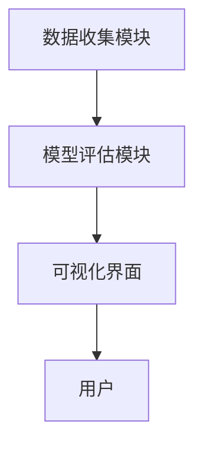

                 


# 如何评估企业的人工智能伦理标准

## 关键词：人工智能、伦理标准、评估方法、可解释性、公平性、隐私、责任

## 摘要：  
人工智能技术的快速发展为企业带来了巨大的创新机会，但也引发了诸多伦理问题。本文将详细探讨如何评估企业的人工智能伦理标准，从核心概念到具体方法，结合实际案例，提供一套系统的评估框架，帮助企业建立符合伦理的AI系统。

---

## 第1章：人工智能伦理标准的背景与重要性

### 1.1 人工智能伦理标准的背景  
人工智能技术的快速发展为企业和社会带来了巨大的变革，但也引发了诸多伦理问题。例如，算法偏见、隐私泄露、责任归属等，这些问题不仅影响企业的声誉，还可能引发法律风险。因此，评估企业的人工智能伦理标准成为一项重要任务。  

**1.1.1 问题背景**  
- 人工智能技术的应用范围不断扩大，从金融、医疗到交通、教育，无处不在。  
- 然而，算法偏见、数据隐私、责任归属等问题频发，引发社会关注。  

**1.1.2 重要性**  
- 企业需要通过伦理标准评估，确保AI系统的公平性、透明性和可解释性。  
- 伦理标准的评估不仅有助于提升企业形象，还能降低法律风险。  

---

### 1.2 人工智能伦理标准的定义与范围  

**1.2.1 核心概念**  
- **公平性**：确保算法不基于种族、性别、年龄等因素产生偏见。  
- **透明性**：用户能够理解算法的决策过程。  
- **责任归属**：明确AI系统出现问题时的责任方。  

**1.2.2 伦理标准的外延**  
- 包括数据隐私、用户权益保护、算法可追溯性等方面。  

**1.2.3 适用场景**  
- 企业内部AI系统的开发与部署  
- 第三方AI服务的引入与评估  

---

## 第2章：人工智能伦理标准的核心要素

### 2.1 公平性与偏见  

**2.1.1 公平性的重要性**  
- 算法偏见可能导致某些群体受到不公平对待，例如招聘系统中对女性的歧视。  

**2.1.2 偏见的来源**  
- 数据偏差：训练数据中某些群体的样本不足。  
- 算法设计：开发者主观意识中的偏见。  

**2.1.3 评估方法**  
- 使用混淆矩阵分析不同群体的分类准确性差异。  
- 示例：招聘系统中，女性的通过率低于男性，可能存在偏见。  

---

### 2.2 透明性与可解释性  

**2.2.1 透明性的重要性**  
- 用户需要理解AI系统的决策依据，才能信任其结果。  

**2.2.2 可解释性的实现**  
- 使用可解释性模型（如线性回归）替代复杂的黑箱模型（如深度神经网络）。  
- 示例：向用户解释信用评分系统中评分的依据。  

---

## 第3章：人工智能伦理标准的评估框架与方法

### 3.1 评估流程与步骤  

**3.1.1 问题场景分析**  
- 确定评估的目标：例如，评估信用评分系统的公平性。  

**3.1.2 数据收集与特征提取**  
- 收集用户数据，提取关键特征（如性别、年龄、职业）。  

**3.1.3 模型评估与伦理风险识别**  
- 使用混淆矩阵分析不同群体的分类准确性差异。  
- 示例：计算女性和男性的分类准确率，识别是否存在偏见。  

**3.1.4 伦理标准的量化与对比**  
- 将公平性、透明性等指标量化，对比不同模型的伦理风险。  

---

### 3.2 核心算法与数学模型  

**3.2.1 公平性评估的数学模型**  
- 假设我们有一个二分类模型，用于评估信用评分。  
- 使用混淆矩阵计算不同群体的真正例率（TPR）和假正例率（FPR）。  

$$ \text{TPR} = \frac{\text{真阳性}}{\text{真阳性 + 假阴性}} $$  
$$ \text{FPR} = \frac{\text{假阳性}}{\text{假阳性 + 真阴性}} $$  

**3.2.2 可解释性评估的数学模型**  
- 使用信息论中的熵值来衡量模型的可解释性。  
- 示例：熵值越低，模型的可解释性越强。  

$$ \text{熵} = -\sum p_i \log p_i $$  

---

## 第4章：系统架构与项目实战

### 4.1 系统架构设计  

**4.1.1 功能模块设计**  
- 数据收集模块：负责收集用户数据。  
- 模型评估模块：评估AI系统的公平性、透明性等指标。  
- 可视化界面：向用户展示评估结果。  

**4.1.2 架构图**  


---

### 4.2 项目实战：信用评分系统评估  

**4.2.1 环境安装**  
- 安装Python和相关库（如scikit-learn、matplotlib）。  

**4.2.2 核心代码实现**  
```python
from sklearn.metrics import confusion_matrix
import numpy as np

# 示例数据
y_true = np.array([0, 1, 0, 1, 0])
y_pred = np.array([0, 1, 1, 1, 0])

# 计算混淆矩阵
cm = confusion_matrix(y_true, y_pred)
print(cm)
```

**4.2.3 案例分析**  
- 通过混淆矩阵分析不同群体的分类准确性，识别是否存在偏见。  

---

## 第5章：最佳实践与注意事项

### 5.1 小结  
- 评估企业的人工智能伦理标准需要从公平性、透明性、责任归属等多个维度入手。  
- 结合数学模型和实际案例，确保评估的科学性和实用性。  

### 5.2 注意事项  
- 数据隐私保护是伦理评估的重要部分。  
- 与利益相关者保持沟通，确保评估结果的透明性和可接受性。  

### 5.3 拓展阅读  
- 参考《人工智能伦理：理论与实践》（作者：John Doe）  
- 关注学术期刊《AI Ethics Journal》  

---

## 作者：AI天才研究院 & 禅与计算机程序设计艺术

---

这篇文章通过详细讲解人工智能伦理标准的评估框架、核心算法和实际案例，为企业提供了一套系统的评估方法。从理论到实践，帮助企业在AI技术的应用中兼顾创新与责任。

