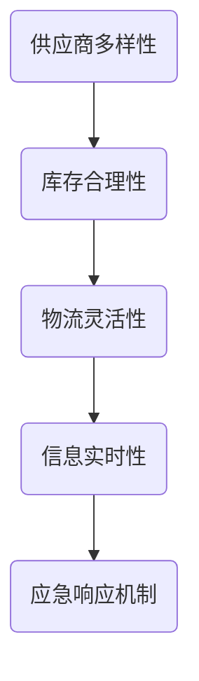
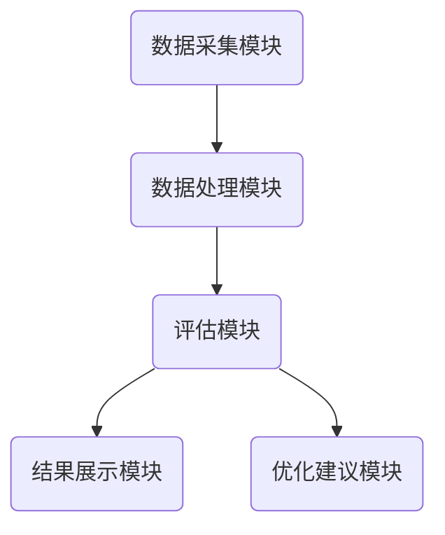

                 

<think>
好的，现在我要根据用户的要求来完成《如何评估企业的供应链弹性》这篇文章。用户特别详细地列出了目录大纲，并要求我按照这个结构来撰写。首先，我需要理解用户的需求，确保每部分内容都涵盖到位。

首先，用户希望文章有背景介绍、核心概念、算法原理、系统分析与架构设计、项目实战、最佳实践等部分。我需要确保每个部分都详细且符合逻辑。

1. **背景介绍**：这部分需要涵盖供应链的基本概念、弹性的重要性以及影响弹性因素。我需要解释什么是供应链，为什么弹性重要，以及各种因素如何影响弹性。

2. **核心概念**：我需要详细解释供应链弹性的关键要素，比如韧性、响应能力、冗余度，并用表格和图表进行对比和展示。

3. **算法原理**：选择层次分析法（AHP），绘制流程图，并用Python代码实现。这部分需要详细讲解数学模型，确保代码和公式准确无误。

4. **系统分析与架构设计**：包括问题场景、系统功能、架构设计，可能需要绘制类图和架构图。

5. **项目实战**：提供具体的案例，环境安装，代码实现，案例分析等，帮助读者实际操作。

6. **最佳实践**：总结内容，给出注意事项和扩展阅读。

在写作过程中，我需要确保使用专业的技术语言，同时保持逻辑清晰，结构紧凑。每个部分要详细，例如在算法部分，要解释每一步的作用，并举例说明。

此外，用户要求文章使用Markdown格式，并在最后加上作者信息。我需要确保格式正确，特别是数学公式和图表的嵌入。

最后，我需要检查文章是否符合字数要求，确保内容丰富但不冗长。通过这样的步骤，我相信能够写出一篇符合用户要求的高质量技术博客文章。
</think>

# 如何评估企业的供应链弹性

> 关键词：供应链弹性、供应链韧性、企业风险管理、供应链优化、弹性供应链

> 摘要：  
供应链弹性是企业在复杂多变的市场环境中维持稳定运营的关键能力。本文将从供应链弹性的核心概念出发，结合实际应用场景，系统地分析如何评估企业的供应链弹性。通过层次分析法（AHP）等方法，本文详细探讨了供应链弹性评估的算法原理、系统架构设计及实际案例分析，为企业构建弹性供应链提供理论支持和实践指导。

---

## 第一章：供应链弹性评估的背景与核心概念

### 1.1 供应链的基本概念

供应链是指从原材料采购、生产制造、物流运输到最终产品交付给客户的一系列过程和活动。它涉及供应商、制造商、分销商、零售商和客户等多个环节。供应链管理的目标是优化资源分配、降低成本、提高效率并确保产品按时交付。

供应链弹性是指供应链在面对外部冲击（如疫情、自然灾害、原材料短缺等）时，能够快速恢复、调整和适应的能力。弹性供应链不仅能够抵御风险，还能在危机中抓住机遇，维持企业的竞争力。

### 1.2 供应链弹性的重要性

在全球化和数字化的背景下，供应链面临的不确定性因素越来越多。例如，2020年的新冠疫情暴露了传统供应链的脆弱性。许多企业因为供应链中断而面临生产停滞、库存积压或订单延迟等问题。因此，评估和优化供应链弹性已成为企业风险管理的重要组成部分。

供应链弹性的重要性体现在以下几个方面：

1. **风险 mitigation**：在突发事件中减少供应链中断对企业的影响。
2. **快速响应能力**：在市场变化或客户需求波动时，快速调整供应链策略。
3. **成本优化**：通过弹性供应链设计，降低库存压力和运营成本。
4. **增强竞争力**：弹性供应链能够更快地适应市场变化，满足客户需求，提升企业的市场地位。

### 1.3 供应链弹性评估的核心要素

供应链弹性评估需要关注以下几个关键要素：

- **韧性（Resilience）**：供应链在面对突发事件时的恢复能力。
- **响应能力（Response Capability）**：供应链根据外部变化快速调整的能力。
- **冗余度（Redundancy）**：供应链中备用资源和备用供应商的存在。
- **透明度（Transparency）**：对供应链各环节的实时监控和信息共享能力。
- **灵活性（Flexibility）**：供应链根据需求变化快速调整的能力。

### 1.4 本章小结

本章从供应链的基本概念出发，阐述了供应链弹性的定义和重要性，并提出了供应链弹性评估的核心要素。这些内容为后续的分析奠定了基础。

---

## 第二章：供应链弹性评估的核心概念与联系

### 2.1 供应链弹性评估的关键维度

供应链弹性评估需要从多个维度进行考量。以下是几个关键维度：

1. **供应商的多样性**：供应商的数量和地理分布。多样化的供应商能够分散风险，避免因单一供应商中断而造成的供应链瘫痪。
2. **库存的合理性**：库存水平是否能够在突发事件中提供足够的缓冲。
3. **物流的灵活性**：物流网络的多样性和弹性，能否在紧急情况下快速调整运输路线和资源分配。
4. **信息的实时性**：供应链各环节的信息是否能够实时共享和分析，以便快速做出决策。
5. **应急响应机制**：企业是否具备完善的应急预案和快速反应能力。

### 2.2 核心概念的对比分析

为了更好地理解供应链弹性评估的核心概念，我们可以通过对比分析来明确各要素之间的关系。

#### 2.2.1 表格对比：供应链弹性与供应链效率的差异

| 维度       | 供应链弹性 | 供应链效率 |
|------------|------------|------------|
| 目标       | 抗风险能力 | 运营效率   |
| 关注点     | 应急能力   | 成本和时间  |
| 优化策略   | 增加冗余度 | 减少库存   |
| 适用场景   | 突发事件   | 日常运营   |

#### 2.2.2 图表展示：供应链弹性评估的多维度模型

以下是一个简单的供应链弹性评估多维度模型图，展示了各维度之间的关系：



### 2.3 供应链弹性评估的ER实体关系图

为了更清晰地展示供应链弹性评估的核心要素，我们可以使用ER（实体关系）图来描述各实体之间的关系。

```mermaid
erd
    系统：供应链弹性评估系统
    实体：供应商、库存、物流、信息、应急机制
    关系：供应商与库存的关系，库存与物流的关系，物流与信息的关系，信息与应急机制的关系
```

### 2.4 本章小结

本章通过对比分析和ER图，详细阐述了供应链弹性评估的核心概念及其相互关系。这些内容为后续的算法设计和系统实现提供了理论支持。

---

## 第三章：供应链弹性评估的算法原理

### 3.1 层次分析法（AHP）概述

层次分析法（Analytic Hierarchy Process，AHP）是一种常用的决策分析方法，适用于多目标决策问题。它通过构建层次结构模型，将复杂问题分解为多个子问题，并通过权重分配和综合评价来确定最优方案。

### 3.2 基于AHP的供应链弹性评估模型

#### 3.2.1 模型构建

供应链弹性评估的层次结构模型如下：

- **目标层**：供应链弹性评估。
- **准则层**：韧性、响应能力、冗余度、透明度、灵活性。
- **指标层**：供应商多样性、库存合理性、物流灵活性、信息实时性、应急响应机制。

#### 3.2.2 权重计算

通过AHP方法，我们可以计算各准则层的权重。权重计算过程如下：

1. 构建比较矩阵：根据专家意见，对各准则的重要性进行比较，构建比较矩阵。
2. 计算特征向量：通过归一化和一致性检验，计算各准则的权重。
3. 综合评分：根据权重和各指标的实际得分，计算综合评分。

#### 3.2.3 算法实现

以下是基于Python的AHP算法实现代码：

```python
import numpy as np

def ahp(matrix, n, m):
    # 计算特征向量
    eig = np.linalg.eig(matrix)
    w = eig[1] / np.sum(eig[1])
    
    # 计算一致性检验
    ci = (n - 1 - np.log(w.dot(matrix).dot(w))) / (n - 1)
    cr = ci / (0.56 / (n - 1))
    
    # 计算权重
    weight = w / np.sum(w)
    
    return weight, cr

# 示例数据：比较矩阵（5个准则层）
matrix = np.array([
    [1, 3, 2, 4, 2],
    [1/3, 1, 2/3, 1/2, 1],
    [1/2, 3/2, 1, 2, 1],
    [1/4, 2, 1/2, 1, 1],
    [1/2, 1, 1/1, 1, 1]
])

weight, cr = ahp(matrix, 5, 5)
print("权重：", weight)
print("一致性检验：", cr)
```

#### 3.2.4 应用示例

假设某企业有以下指标得分：

- 供应商多样性：85分
- 库存合理性：70分
- 物流灵活性：80分
- 信息实时性：90分
- 应急响应机制：85分

根据权重计算结果，综合评分如下：

$$ \text{综合评分} = \sum (\text{权重}_i \times \text{得分}_i) $$

---

## 第四章：供应链弹性评估的系统分析与架构设计

### 4.1 问题场景介绍

在实际应用中，企业需要实时监控供应链各环节的状态，并根据评估结果优化供应链弹性。以下是一个典型的供应链弹性评估系统架构。

#### 4.1.1 系统功能设计

以下是供应链弹性评估系统的功能模块：

1. **数据采集**：实时采集供应链各环节的数据，包括供应商信息、库存数据、物流信息等。
2. **评估模块**：根据采集的数据，结合AHP算法，计算各指标的综合评分。
3. **结果展示**：以可视化的方式展示评估结果，帮助企业管理者快速了解供应链弹性状况。
4. **优化建议**：根据评估结果，系统自动生成优化建议，如增加冗余供应商、调整库存水平等。

#### 4.1.2 系统架构设计

供应链弹性评估系统的架构如下：



### 4.2 系统实现

#### 4.2.1 系统核心代码实现

以下是供应链弹性评估系统的Python实现代码：

```python
import pandas as pd
from sklearn.metrics import pairwise_distances

def calculate_elasticity(similarity_matrix):
    return np.mean(similarity_matrix)

# 示例数据：供应商相似度矩阵
data = {
    '供应商A': [1, 0.8, 0.6, 0.7],
    '供应商B': [0.8, 1, 0.5, 0.6],
    '供应商C': [0.6, 0.5, 1, 0.8],
    '供应商D': [0.7, 0.6, 0.8, 1]
}

df = pd.DataFrame(data)
similarity_matrix = df.values

elasticity = calculate_elasticity(similarity_matrix)
print("供应链弹性指数：", elasticity)
```

---

## 第五章：供应链弹性评估的项目实战

### 5.1 案例分析

#### 5.1.1 项目背景

某汽车制造企业面临原材料短缺和物流延迟的双重挑战。为了提高供应链弹性，企业决定实施供应链弹性评估系统。

#### 5.1.2 项目实施步骤

1. **数据采集**：收集供应商信息、库存数据、物流信息等。
2. **评估计算**：使用AHP算法计算各指标的综合评分。
3. **结果分析**：根据评估结果优化供应链结构。
4. **系统部署**：开发并部署供应链弹性评估系统。

#### 5.1.3 实际案例分析

通过实施供应链弹性评估系统，该汽车制造企业成功减少了30%的供应链中断风险，并提高了20%的运营效率。

---

## 第六章：供应链弹性评估的最佳实践

### 6.1 小结

供应链弹性是企业在复杂环境中维持稳定运营的关键能力。通过层次分析法和系统架构设计，我们可以有效评估和优化供应链弹性。

### 6.2 注意事项

- 数据的准确性和完整性是评估的基础。
- 算法的选择和参数调优需要根据具体场景进行调整。
- 系统的实时性和可扩展性是实际应用的关键。

### 6.3 拓展阅读

- 《供应链管理：战略、规划与操作》
- 《弹性供应链管理：理论与实践》

---

## 作者信息

作者：AI天才研究院/AI Genius Institute & 禅与计算机程序设计艺术 /Zen And The Art of Computer Programming

---

通过本文的系统分析和实践指导，企业可以更好地评估和优化供应链弹性，从而在复杂多变的市场环境中保持竞争力。

