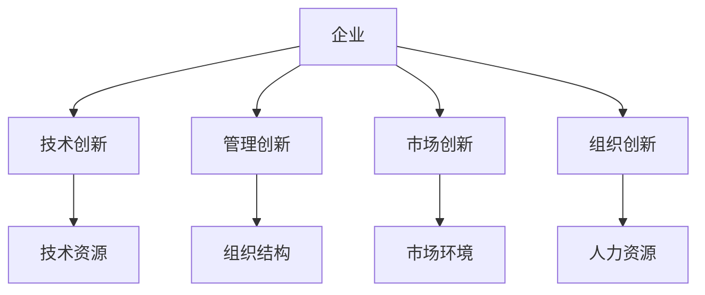
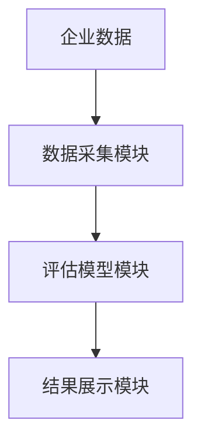
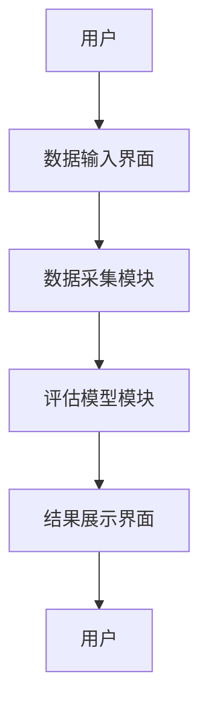

                 

<think>
嗯，我需要写一篇关于如何评估企业创新能力的技术博客。首先，我应该从定义企业创新能力开始，解释它到底是什么，为什么重要。然后，我需要详细分析创新能力的构成，比如技术、管理和市场创新。接着，考虑评估的方法，可能涉及数学模型和工具，比如加权评分和层次分析法。最后，我应该提供实际的案例，让读者更好地理解如何应用这些方法。

我应该确保文章结构清晰，逻辑严谨，每个部分都详细展开，包括图表和公式。同时，语言要专业但易懂，适合技术背景的读者。我还需要加入一些最佳实践和注意事项，帮助读者在实际中应用这些评估方法。

可能会遇到的问题是如何将复杂的理论简化，同时保持专业性。我需要用简单的例子来解释复杂的概念，比如用公司案例来说明创新能力的不同方面。此外，数学公式的使用要准确，避免错误，确保读者能正确理解和应用。

总的来说，我需要一步步分析，从背景到定义，再到评估方法和实际应用，确保每个部分都覆盖到位，帮助读者全面了解如何评估企业的创新能力。
</think>

# 如何评估企业的创新能力

> 关键词：企业创新能力、创新评估、技术创新、管理创新、层次分析法

> 摘要：企业创新能力是企业在市场中保持竞争力的关键因素，涉及技术创新、管理创新、市场创新和组织创新等多个方面。本文系统地分析了企业创新能力的核心要素、评估模型和方法，并通过实际案例展示了如何应用这些方法进行评估。文章还探讨了创新能力和企业生命周期的关系，为读者提供了全面的评估框架和实用的工具。

---

# 第一部分: 企业创新能力评估背景与核心概念

## 第1章: 企业创新能力的定义与背景

### 1.1 企业创新能力的定义
企业创新能力是指企业在市场变化和技术进步中，通过技术创新、管理优化、市场拓展和组织变革等方式，持续创造新价值的能力。它是企业核心竞争力的重要组成部分，直接影响企业的生存和发展。

### 1.2 企业创新的重要性
在数字化时代，企业创新不仅是技术驱动的，还涉及管理、市场和组织等多方面的变革。创新能力决定了企业能否快速响应市场变化，抓住新兴机会，并在竞争中立于不败之地。

### 1.3 企业创新的主要形式
- **技术创新**：通过研发新技术或改进现有技术，提升产品和服务的竞争力。
- **管理创新**：优化管理模式，提高效率和员工满意度。
- **市场创新**：开拓新市场或通过创新营销策略吸引客户。
- **组织创新**：调整组织结构，提升协作效率和创新能力。

---

## 第2章: 企业创新能力评估的核心要素

### 2.1 创新能力的构成维度
企业创新能力由以下几个关键维度构成：
1. **技术能力**：企业的研发能力、技术储备和创新能力。
2. **组织能力**：企业的组织结构、管理效率和团队协作能力。
3. **资源能力**：企业的资金、人才和技术资源。
4. **市场能力**：企业对市场的洞察力和反应速度。

### 2.2 创新能力评估的关键指标
为了全面评估企业创新能力，我们可以从以下几个方面设定指标：
1. **技术创新指标**：研发投入比例、专利数量、新产品推出速度。
2. **管理创新指标**：管理效率提升、员工满意度、流程优化效果。
3. **市场创新指标**：市场份额增长率、客户满意度、市场开拓速度。
4. **组织创新指标**：组织结构调整频率、团队协作效率、创新文化氛围。

### 2.3 创新能力评估的边界与外延
创新能力评估需要明确范围和边界，例如：
- **技术创新**：仅关注技术层面的创新，不涉及管理或其他方面。
- **全面创新**：涵盖技术、管理、市场和组织等多个维度。

---

## 第3章: 企业创新能力评估的核心概念与联系

### 3.1 创新能力的核心概念
1. **技术创新的核心原理**：技术创新是通过引入新技术或改进现有技术来提高产品和服务的性能。
2. **管理创新的组织理论基础**：管理创新依赖于组织结构的优化和管理流程的改进。
3. **市场创新的经济学分析**：市场创新关注企业如何通过新市场策略和定位来获取竞争优势。

### 3.2 创新能力的核心属性对比
| **维度**       | **技术创新**       | **管理创新**       | **市场创新**       | **组织创新**       |
|----------------|-------------------|-------------------|-------------------|-------------------|
| 主要目标       | 提高产品性能       | 提高管理效率       | 拓展市场份额       | 提升协作效率       |
| 关键资源       | 技术研发团队       | 管理层和流程       | 市场团队和策略       | 组织结构和文化       |

### 3.3 创新能力的ER实体关系图


---

## 第4章: 企业创新能力评估的数学模型与公式

### 4.1 创新能力评估的数学模型
我们可以通过加权评分模型来评估企业创新能力：
$$ \text{创新能力评分} = \sum_{i=1}^{n} w_i \times s_i $$
其中，\( w_i \) 是第 \( i \) 个指标的权重，\( s_i \) 是第 \( i \) 个指标的评分。

### 4.2 创新能力评估的层次分析法
层次分析法（AHP）是一种常用的评估方法，其基本步骤如下：
1. **构建层次结构**：将评估指标分为不同层次，如目标层、准则层和方案层。
2. **构造比较矩阵**：根据专家意见，对各指标进行两两比较，构造比较矩阵。
3. **计算权重**：通过计算比较矩阵的最大特征值和特征向量，确定各指标的权重。

### 4.3 层次分析法的数学公式
$$ A = \left[ a_{ij} \right]_{n \times n} $$
其中，\( a_{ij} \) 表示第 \( i \) 个指标相对于第 \( j \) 个指标的重要性。

---

# 第二部分: 企业创新能力评估的系统分析与架构设计

## 第5章: 系统分析与架构设计方案

### 5.1 项目介绍
我们以一家科技公司为例，分析其创新能力。首先，我们需要明确项目目标：通过系统分析和架构设计，构建一个创新能力评估系统。

### 5.2 系统功能设计
1. **数据采集模块**：收集企业技术创新、管理创新、市场创新和组织创新的相关数据。
2. **评估模型模块**：应用层次分析法，计算各指标的权重和评分。
3. **结果展示模块**：生成可视化报告，展示评估结果。

### 5.3 系统架构设计


### 5.4 系统接口设计
- **数据接口**：通过API接口接收企业数据。
- **评估接口**：调用层次分析法模型进行评估。
- **展示接口**：将评估结果返回给用户界面。

### 5.5 系统交互设计


---

# 第三部分: 项目实战与案例分析

## 第6章: 项目实战

### 6.1 环境安装
安装必要的软件和工具，如Python、Matplotlib、Scipy等。

### 6.2 核心实现代码
以下是一个简单的层次分析法实现代码：
```python
import numpy as np
import pandas as pd

# 定义比较矩阵
matrix = np.array([
    [1, 3, 2, 4],
    [1/3, 1, 2, 3],
    [1/2, 1/2, 1, 2],
    [1/4, 1/3, 1/2, 1]
])

# 计算权重
def calculate_weights(matrix):
    eigenvalues, eigenvectors = np.linalg.eig(matrix)
    weights = eigenvectors[:, np.argmax(eigenvalues)] / eigenvectors[:, np.argmax(eigenvalues)].sum()
    return weights

weights = calculate_weights(matrix)
print("权重为:", weights)
```

### 6.3 代码解读与分析
- **矩阵定义**：构建比较矩阵，表示各指标的重要性。
- **权重计算**：通过特征值和特征向量计算各指标的权重。

### 6.4 案例分析
以某科技公司为例，分析其创新能力：
1. **数据收集**：收集技术创新、管理创新、市场创新和组织创新的相关数据。
2. **模型应用**：应用层次分析法，计算各指标的权重和评分。
3. **结果解读**：根据评分结果，提出改进建议。

---

## 第7章: 总结与展望

### 7.1 总结
企业创新能力是企业在市场中保持竞争力的关键因素。本文从多个维度分析了企业创新能力的构成，提出了层次分析法等评估方法，并通过实际案例展示了如何应用这些方法进行评估。

### 7.2 展望
未来，企业创新能力评估将更加依赖于大数据和人工智能技术。我们可以进一步研究如何利用这些技术提高评估的准确性和效率。

---

# 第四部分: 最佳实践与注意事项

## 8.1 最佳实践
1. **数据准确性**：确保数据来源可靠，避免偏差。
2. **模型选择**：根据实际情况选择合适的评估模型。
3. **持续改进**：定期评估并优化创新能力。

## 8.2 注意事项
1. **避免过度简化**：创新能力评估涉及多个维度，不能过于简化。
2. **数据隐私**：在处理企业数据时，要注意隐私保护。

---

# 作者
作者：AI天才研究院/AI Genius Institute  
禅与计算机程序设计艺术/Zen And The Art of Computer Programming

