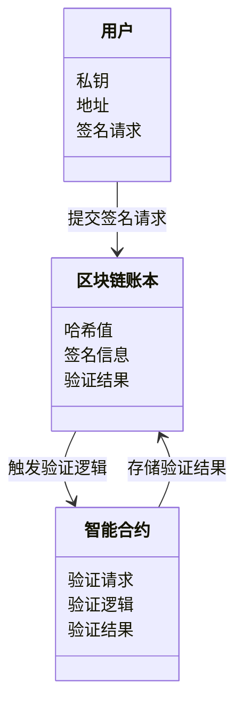
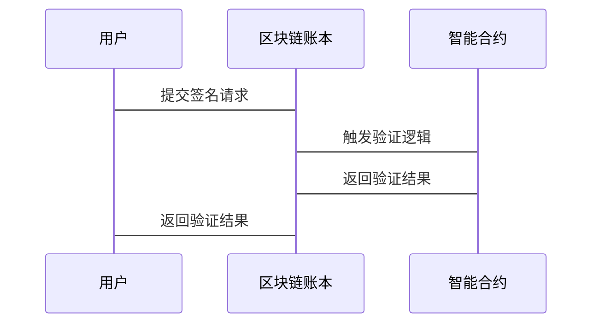

                 

<think>
好的，我现在需要帮助用户设计一个关于评估企业区块链去中心化身份验证平台的书籍目录。用户希望这本书内容详尽，结构清晰，使用技术术语，但又不失逻辑性和可读性。首先，我需要明确用户的需求，确保目录涵盖所有关键部分，包括背景介绍、核心概念、算法原理、系统架构、项目实战、最佳实践等。

我会从背景开始，解释区块链和去中心化身份验证的基本概念，帮助读者理解问题背景。然后，详细介绍核心概念，如哈希函数和签名机制，以及它们在身份验证中的作用。接下来，分析算法原理，使用图表和数学模型来说明共识机制和身份验证流程。系统架构部分需要展示模块之间的关系和交互，确保读者能够理解整体结构。最后，通过实际案例和代码示例，帮助读者将理论应用于实践，并总结关键点和注意事项。

在整个思考过程中，我会确保每个部分都详细且结构紧凑，使用图表和代码示例来增强理解。同时，保持语言的专业性和逻辑性，使读者能够轻松跟上思路。现在，我可以开始构建目录大纲了。
</think>

# 如何评估企业的区块链去中心化身份验证平台

**关键词**：区块链，去中心化身份验证，DID，哈希函数，共识机制，智能合约

**摘要**：本文详细探讨了如何评估企业区块链去中心化身份验证平台，涵盖了背景介绍、核心概念、算法原理、系统架构、项目实战、最佳实践等多个方面。通过逐步分析和详细的技术阐述，帮助读者全面理解并有效评估此类平台的技术优劣和实际应用价值。

---

# 第一部分: 区块链去中心化身份验证平台概述

## 第1章: 区块链与去中心化身份验证概述

### 1.1 区块链技术基础
#### 1.1.1 区块链的基本概念
区块链是一种分布式账本技术，通过去中心化的共识机制记录数据，确保数据的安全性和不可篡改性。其核心特点包括去中心化、去信任化、不可篡改性和可追溯性。

#### 1.1.2 区块链的核心特点
- **去中心化**：通过分布式节点网络实现数据的分布式存储，避免单点故障。
- **去信任化**：通过共识机制确保数据一致性，无需依赖中心化机构。
- **不可篡改性**：数据一旦写入区块链，难以被修改或删除。
- **可追溯性**：区块链上的数据可以通过链式结构进行追踪，确保数据来源的可追溯性。

#### 1.1.3 区块链的分类与应用场景
区块链主要分为公有链、私有链和联盟链。公有链适用于去中心化程度要求高的场景，如加密货币；私有链适用于企业内部数据管理；联盟链适用于多个机构共同参与的场景，如供应链金融。

---

### 1.2 去中心化身份验证的概念
#### 1.2.1 去中心化身份验证的定义
去中心化身份验证（Decentralized Identity Verification，DID）是一种基于区块链的技术，允许用户自主控制自己的身份信息，无需依赖中心化机构。用户可以通过私钥签名来证明自己的身份，确保身份信息的安全性和唯一性。

#### 1.2.2 去中心化身份验证的核心要素
- **用户私钥**：用户通过私钥对数据进行签名，证明数据的合法性和真实性。
- **区块链账本**：存储用户的签名信息和验证结果，确保数据的不可篡改性。
- **智能合约**：用于自动化验证流程，确保验证过程的透明性和公正性。

#### 1.2.3 去中心化身份验证与传统身份验证的区别
| **方面**       | **传统身份验证**                             | **去中心化身份验证**                        |
|----------------|--------------------------------------------|--------------------------------------------|
| **控制权**     | 中心化机构控制用户身份信息                   | 用户自主控制身份信息                       |
| **安全性**     | 易受中心化机构攻击或数据泄露                | 通过区块链技术和私钥签名提高安全性       |
| **透明性**     | 验证过程不透明，依赖机构信任                | 验证过程透明，基于区块链和智能合约       |

---

### 1.3 区块链去中心化身份验证的边界与外延
#### 1.3.1 技术边界
- 区块链技术的核心是去中心化和不可篡改性，但其应用范围受限于数据存储和计算能力。
- 去中心化身份验证主要依赖于哈希函数和签名机制，对数据的完整性和真实性负责。

#### 1.3.2 应用场景的外延
- **金融领域**：身份验证是金融交易的核心，去中心化身份验证可以提高交易的安全性和效率。
- **社交网络**：用户可以通过私钥控制自己的社交数据，实现真正意义上的数据主权。
- **医疗健康**：保护患者隐私的同时，确保医疗数据的真实性和可追溯性。

#### 1.3.3 相关技术的关联性分析
- **哈希函数**：用于生成唯一的数据指纹，确保数据的完整性和唯一性。
- **椭圆曲线加密**：用于生成和验证数字签名，确保数据的合法性和真实性。
- **智能合约**：自动化执行验证流程，确保验证过程的透明性和公正性。

---

### 1.4 本章小结
本章介绍了区块链技术和去中心化身份验证的核心概念，分析了两者的区别和联系，并通过对比表格和实际应用场景，帮助读者理解去中心化身份验证的重要性和优势。

---

# 第二部分: 区块链去中心化身份验证的核心概念与联系

## 第2章: 核心概念与原理

### 2.1 区块链去中心化身份验证的核心原理
#### 2.1.1 哈希函数与签名机制
- **哈希函数**：将任意长度的数据映射为固定长度的哈希值，确保数据的唯一性和完整性。
- **签名机制**：通过私钥对数据进行签名，确保数据的合法性和真实性。

#### 2.1.2 共识机制在身份验证中的作用
- **共识机制**：通过分布式节点的协作，确保区块链账本的一致性和可靠性。
- **工作量证明（PoW）**：比特币使用的共识机制，通过计算哈希值的难度来确保数据的安全性。
- **权益证明（PoS）**：以太坊使用的共识机制，通过持有代币的数量和时间来决定验证权。

#### 2.1.3 智能合约在去中心化身份验证中的应用
- **智能合约**：部署在区块链上的自动执行程序，用于自动化验证流程。
- **验证流程**：用户通过私钥签名请求，智能合约自动验证签名的合法性和有效性。

---

### 2.2 核心概念对比分析
#### 2.2.1 区块链与去中心化身份验证的对比
- 区块链是去中心化身份验证的技术基础，而去中心化身份验证是区块链技术的重要应用之一。

#### 2.2.2 去中心化身份验证与其他身份验证技术的对比
- **传统身份验证**：依赖中心化机构，易受攻击和数据泄露。
- **去中心化身份验证**：用户自主控制身份信息，确保数据的安全性和隐私性。

#### 2.2.3 核心概念的属性特征对比表格
| **属性**           | **区块链**                   | **去中心化身份验证**                |
|--------------------|----------------------------|------------------------------------|
| **数据存储**       | 分布式存储                   | 用户自主存储私钥和签名信息        |
| **数据控制权**     | 中心化机构控制                | 用户自主控制身份信息              |
| **数据安全性**     | 高，基于加密算法和共识机制   | 高，基于私钥签名和区块链技术      |

---

### 2.3 ER实体关系图架构
#### 2.3.1 实体关系图的构建
- **用户**：拥有私钥，通过私钥签名请求验证。
- **区块链账本**：存储用户的签名信息和验证结果。
- **智能合约**：自动化执行验证流程，确保验证过程的透明性和公正性。

#### 2.3.2 实体关系图的分析
- 用户通过私钥签名请求，智能合约接收请求并验证签名。
- 验证结果存储在区块链账本中，确保数据的不可篡改性和可追溯性。

---

### 2.4 本章小结
本章详细分析了区块链去中心化身份验证的核心原理和核心概念，通过对比分析和实体关系图，帮助读者理解去中心化身份验证的技术基础和实现机制。

---

# 第三部分: 区块链去中心化身份验证的算法原理

## 第3章: 区块链去中心化身份验证的算法原理

### 3.1 共识机制的算法原理
#### 3.1.1 工作量证明（PoW）算法
- **工作量证明**：通过计算哈希值的难度来确保数据的安全性。
- **数学模型**：$$ H = \text{Hash}(M) $$
  其中，$M$ 是需要签名的数据，$H$ 是哈希值。

#### 3.1.2 权益证明（PoS）算法
- **权益证明**：通过持有代币的数量和时间来决定验证权。
- **数学模型**：$$ \text{概率} = \frac{\text{代币数量}}{\text{总代币数量}} \times \text{时间} $$

#### 3.1.3 其他共识算法的对比分析
- **RAFT算法**：适用于联盟链，通过选举领导者来实现共识。
- **PBFT算法**：适用于高性能区块链，通过拜占庭容错机制实现共识。

---

### 3.2 身份验证流程的算法原理
#### 3.2.1 身份验证流程
1. **用户签名请求**：用户通过私钥对数据进行签名，生成签名信息。
2. **智能合约验证**：智能合约接收签名信息，验证签名的合法性和有效性。
3. **区块链存储**：验证结果存储在区块链账本中，确保数据的不可篡改性和可追溯性。

#### 3.2.2 数学模型与公式
- **签名过程**：$$ \text{签名} = \text{私钥} \times \text{数据} $$
- **验证过程**：$$ \text{验证结果} = \text{公钥} \times \text{签名} $$

---

### 3.3 本章小结
本章详细分析了共识机制和身份验证流程的算法原理，通过数学模型和公式，帮助读者理解区块链去中心化身份验证的技术实现和优化方向。

---

# 第四部分: 区块链去中心化身份验证的系统分析与架构设计

## 第4章: 区块链去中心化身份验证的系统分析与架构设计

### 4.1 系统功能设计
#### 4.1.1 领域模型类图


#### 4.1.2 系统架构图


#### 4.1.3 系统接口设计
- **用户接口**：提供私钥签名和验证请求的接口。
- **区块链接口**：提供哈希值计算和验证结果存储的接口。
- **智能合约接口**：提供验证逻辑的执行和结果返回的接口。

#### 4.1.4 系统交互流程


---

### 4.2 本章小结
本章通过系统功能设计、架构图和交互流程图，详细分析了区块链去中心化身份验证平台的系统设计和实现过程。

---

# 第五部分: 区块链去中心化身份验证的项目实战

## 第5章: 区块链去中心化身份验证的项目实战

### 5.1 环境安装与配置
- **区块链平台选择**：推荐使用Ethereum、Hyperledger Fabric等开源平台。
- **开发工具安装**：安装Solidity、Geth、Web3.js等开发工具。

### 5.2 系统核心实现源代码
#### 5.2.1 智能合约实现
```solidity
// SPDX-License-Identifier: MIT
pragma solidity ^0.8.0;

contract IdentityVerification {
    function verify(bytes memory signature, bytes memory data) public pure returns (bool) {
        bytes32 hash = keccak256(data);
        return ECDSA.recover(hash, signature) != address(0);
    }
}
```

#### 5.2.2 后端实现
```javascript
const Web3 = require('web3');
const web3 = new Web3(new Web3.providers.HttpProvider('http://localhost:8545'));

async function verifySignature(signature, data) {
    const hash = web3.utils.keccak256(data);
    const publicKey = web3.utils.ecrecover(hash, signature);
    return publicKey !== '0x00000000000000000000000000000000';
}
```

### 5.3 代码应用解读与分析
- **智能合约**：通过ECDSA加密算法对数据进行签名和验证，确保数据的合法性和真实性。
- **后端实现**：通过Web3.js与区块链节点交互，验证签名的合法性和有效性。

### 5.4 实际案例分析
#### 5.4.1 案例背景
假设某企业需要验证用户的身份信息，用户通过私钥签名请求，智能合约自动验证签名的合法性和有效性。

#### 5.4.2 验证流程
1. **用户签名请求**：用户通过私钥对数据进行签名，生成签名信息。
2. **智能合约验证**：智能合约接收签名信息，验证签名的合法性和有效性。
3. **验证结果存储**：验证结果存储在区块链账本中，确保数据的不可篡改性和可追溯性。

---

### 5.5 本章小结
本章通过实际案例和代码实现，帮助读者理解区块链去中心化身份验证平台的实现过程和应用价值。

---

# 第六部分: 区块链去中心化身份验证的最佳实践

## 第6章: 区块链去中心化身份验证的最佳实践

### 6.1 评估与优化建议
- **安全性优化**：通过多重签名和阈签名技术提高签名验证的安全性。
- **性能优化**：通过侧链和状态通道技术提高验证效率。
- **可扩展性优化**：通过分片技术和并行计算提高区块链的可扩展性。

### 6.2 注意事项与风险提示
- **私钥管理**：私钥是用户身份的唯一证明，需妥善保管，避免泄露。
- **智能合约漏洞**：智能合约是验证流程的核心，需经过严格的测试和审计。
- **数据隐私保护**：通过零知识证明和同态加密技术保护用户隐私。

### 6.3 拓展阅读与深入学习
- **推荐书籍**：《区块链：技术与应用》、《智能合约与区块链开发实战》。
- **推荐博客**：https://medium.com/blockchain

---

### 6.4 本章小结
本章总结了区块链去中心化身份验证的最佳实践，包括安全性优化、性能优化、可扩展性优化等方面，并给出了实际应用中的注意事项和拓展阅读建议。

---

# 结语

通过本文的详细讲解，读者可以全面理解区块链去中心化身份验证平台的核心概念、算法原理和系统设计，并能够实际操作和应用相关技术。希望本文能为企业的区块链去中心化身份验证平台的评估和优化提供有价值的参考。

---

**作者：AI天才研究院/AI Genius Institute & 禅与计算机程序设计艺术 /Zen And The Art of Computer Programming**

