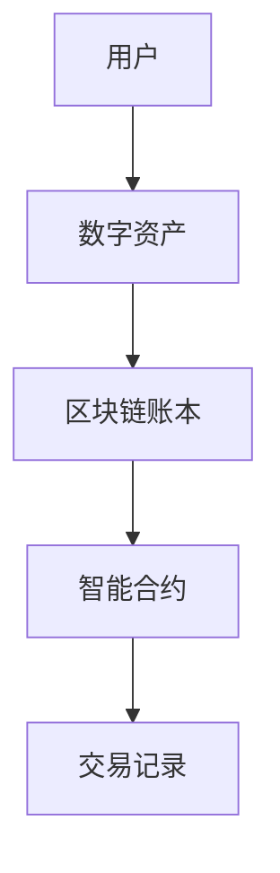
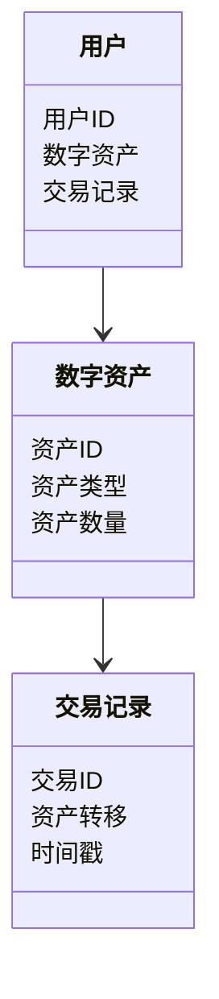
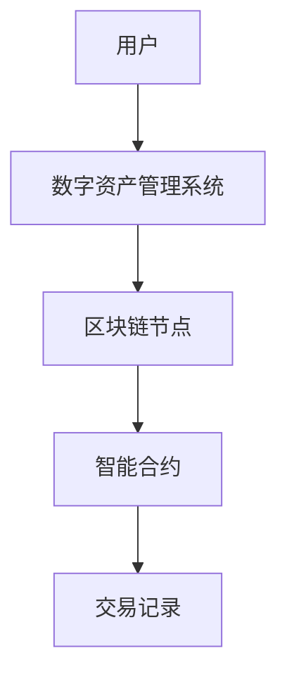

                 


# 如何评估企业的区块链数字资产管理平台

> 关键词：区块链、数字资产管理、平台评估、技术分析、企业应用

> 摘要：本文详细探讨了如何评估企业的区块链数字资产管理平台，从背景介绍、核心概念、算法原理、系统架构设计到项目实战，层层深入分析，结合理论与实践，为企业提供全面的评估方法和建议。

---

## 第一部分: 区块链数字资产管理平台概述

### 第1章: 区块链数字资产管理平台的背景与概念

#### 1.1 区块链技术的背景与现状
区块链技术起源于比特币的白皮书，经过十余年的发展，已从数字货币扩展到多个领域。区块链的分布式账本、去中心化和不可篡改特性，使其在数字资产管理中具有重要价值。

#### 1.2 数字资产管理的概念与重要性
数字资产包括加密货币、NFTs、数字证书等，其管理涉及生成、存储、交易等环节。有效的数字资产管理能确保资产安全，提升企业信任度。

#### 1.3 区块链数字资产管理平台的定义与特点
平台将区块链技术应用于数字资产管理，具有透明、安全、高效等特点。

#### 1.4 平台的边界与外延
平台涵盖资产发行、交易、监管等环节，与其他技术如人工智能的结合进一步扩展其应用。

---

## 第二部分: 区块链数字资产管理的核心概念与联系

### 第2章: 区块链数字资产管理的核心概念

#### 2.1 区块链技术的核心原理
- 分布式账本确保数据一致性，智能合约实现自动化交易，共识机制保证数据可靠性。

#### 2.2 数字资产管理的核心要素
包括资产生成、存储、交易，每一步都需要技术支持。

#### 2.3 平台架构
平台由用户、智能合约、区块链账本、交易记录组成，各部分协同工作。

### 第3章: 核心概念的联系

#### 3.1 区块链与数字资产管理的关系
区块链为数字资产管理提供信任机制，数字资产管理推动区块链应用普及。

#### 3.2 实体关系图


---

## 第三部分: 区块链数字资产管理平台的算法原理

### 第4章: 关键算法

#### 4.1 哈希函数
- 哈希函数确保数据完整性，广泛应用于区块链中。

#### 4.2 数字签名
- 数字签名验证交易合法性，确保数据安全。

#### 4.3 共识算法
- 共识算法保证账本一致性，如比特币的PoW和以太坊的PoS。

### 第5章: 数学模型与公式

#### 5.1 哈希函数
$$H(m) = \text{哈希值}$$

#### 5.2 数字签名
$$\text{签名} = \text{私钥} \times \text{哈希值}$$

#### 5.3 共识算法
$$\text{验证} = \text{多数节点同意}$$

---

## 第四部分: 系统分析与架构设计

### 第6章: 系统功能设计

#### 6.1 领域模型


#### 6.2 系统架构


---

## 第五部分: 项目实战

### 第7章: 实战案例

#### 7.1 环境安装
安装以太坊节点和Solidity编译器。

#### 7.2 核心代码实现
```solidity
contract DigitalAsset {
    mapping(address => uint) public balances;

    function mint(address _to, uint _amount) public {
        balances[_to] += _amount;
    }

    function transfer(address _from, address _to, uint _amount) public {
        require(balances[_from] >= _amount, "Insufficient balance");
        balances[_from] -= _amount;
        balances[_to] += _amount;
    }
}
```

#### 7.3 案例分析
通过实际案例分析平台的功能和性能，优化系统架构。

---

## 第六部分: 总结与展望

### 第8章: 总结与注意事项

#### 8.1 评估总结
从技术、安全、性能等方面全面评估平台。

#### 8.2 注意事项
选择合适的技术方案，确保合规性，重视用户体验。

### 第9章: 未来展望

#### 9.1 技术趋势
向联盟链和跨链技术发展。

#### 9.2 应用场景
扩展至供应链、金融等多个领域。

---

## 作者

作者：AI天才研究院 & 禅与计算机程序设计艺术

---

通过以上结构，文章详细分析了区块链数字资产管理平台的各个方面，结合理论与实践，为企业提供全面的评估方法和建议。

