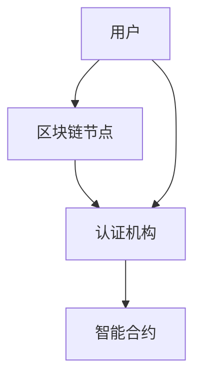
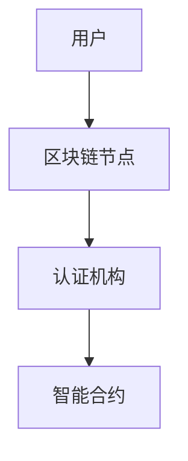

                 

<think>
嗯，我现在需要按照用户的要求来撰写一篇关于如何评估企业区块链数字身份跨境认证应用的技术博客文章。首先，用户已经给出了一个详细的目录大纲，我需要根据这个大纲逐步完成每个部分的内容。

首先，我需要理解整个文章的结构。文章分为六个部分，每个部分下还有多个章节，每个章节都有三级子标题。我的目标是按照这个结构，逐步填充每个部分的内容，确保逻辑清晰、内容详实，同时使用专业且易懂的技术语言。

首先，我会从“文章标题”开始，然后列出关键词和摘要。摘要需要简洁明了地概括整篇文章的核心内容和主题思想。接下来，我会按照目录大纲的顺序，依次完成每个章节的内容。

在“背景介绍”部分，我需要解释区块链和数字身份的基本概念，分析跨境认证的背景和需求，以及企业区块链数字身份跨境认证的核心目标。这里可能需要使用一些图表来帮助读者理解，比如ER图或Mermaid流程图。

接下来是“核心概念与联系”部分，我需要详细讲解区块链数字身份的核心原理，包括身份标识的生成与管理、身份信息的加密存储、身份验证的区块链机制等。同时，还需要对比传统身份认证和区块链数字身份的属性，制作对比表格，并绘制ER实体关系图。

在“算法原理讲解”部分，我需要选择相关的算法，如零知识证明或门限签名，用Mermaid流程图展示算法的执行过程，并用Python代码实现核心逻辑。同时，提供数学模型和公式，帮助读者理解算法的原理。

“系统分析与架构设计方案”部分需要设计一个具体的系统，包括功能设计、系统架构图、接口设计和交互序列图。这部分可能需要使用类图和序列图来展示系统的结构和交互流程。

“项目实战”部分将指导读者如何安装环境，实现系统的核心功能，并通过实际案例分析来展示系统的应用和效果。这部分需要详细的代码实现和案例解读。

最后，在“总结与最佳实践”部分，我需要总结文章的主要内容，提供最佳实践的建议，包括小结、注意事项和拓展阅读等内容。

在整个写作过程中，我需要确保使用准确的技术术语，并通过通俗易懂的语言解释复杂的概念。同时，合理使用图表、公式和代码示例，以增强文章的可读性和实用性。最后，检查文章的结构和内容，确保符合用户的要求，字数控制在10000到12000字之间，并在末尾添加作者信息。

现在，我需要开始逐部分撰写文章，确保每个章节内容完整，逻辑连贯，符合技术博客的风格和读者的需求。
</think>

# 如何评估企业的区块链数字身份跨境认证应用

**关键词**：区块链，数字身份，跨境认证，可信度评估，去中心化身份识别，系统架构设计

**摘要**：随着全球化进程的加速，企业对跨境身份认证的需求日益增长。区块链技术凭借其去中心化、不可篡改和高安全性的特点，成为实现数字身份跨境认证的理想选择。本文将深入探讨如何评估企业区块链数字身份跨境认证的应用，涵盖核心概念、评估指标、系统架构设计以及实际案例分析等方面，为企业提供全面的评估方法和实践指导。

---

## 第一部分: 区块链数字身份跨境认证应用背景

### 第1章: 区块链与数字身份概述

#### 1.1 区块链技术基础
##### 1.1.1 区块链的基本概念
区块链是一种分布式账本技术，通过去中心化的共识机制记录交易信息，确保数据的不可篡改性和可追溯性。区块链的核心特点包括去中心化、透明性、不可篡改性和安全性。

##### 1.1.2 区块链的核心特性
- **去中心化**：数据不依赖单一中心节点，而是分布在网络的各个节点上。
- **不可篡改性**：通过密码学技术确保数据的安全性和一致性。
- **透明性**：所有交易记录公开可查，但隐私数据可以通过加密保护。
- **安全性**：通过复杂的密码学算法和共识机制防止数据篡改和网络攻击。

##### 1.1.3 区块链的分类与应用场景
区块链主要分为公链、私链和联盟链。公链如比特币和以太坊，适用于金融和支付领域；私链适用于企业内部数据管理；联盟链如Hyperledger，适用于跨机构协作，如跨境身份认证。

#### 1.2 数字身份的概念与特点
##### 1.2.1 数字身份的定义
数字身份是指在数字世界中用于标识个人或实体的唯一标识符和相关信息。数字身份可以是用户名、邮箱、护照号或生物特征等。

##### 1.2.2 数字身份的核心属性
- **唯一性**：每个数字身份在系统中是唯一的。
- **安全性**：通过加密技术保护身份信息不被泄露或篡改。
- **可验证性**：身份信息可以通过区块链技术进行验证，确保其真实性和完整性。

##### 1.2.3 数字身份与传统身份的区别
传统身份依赖中心化机构进行认证，如政府、银行等。而数字身份可以通过区块链实现去中心化认证，减少对中心化机构的依赖，提高效率和安全性。

#### 1.3 区块链在数字身份中的作用
##### 1.3.1 区块链在身份认证中的优势
- **去中心化**：消除对中心化机构的依赖，降低数据泄露风险。
- **高安全性**：通过密码学和区块链技术确保身份信息的安全。
- **可扩展性**：支持大规模身份认证，适用于跨境场景。

##### 1.3.2 区块链如何实现身份可信
区块链通过去中心化和共识机制，确保身份信息的真实性和不可篡改性。每个身份信息在区块链上都有唯一的哈希值，通过验证哈希值即可确认身份信息的真实性。

##### 1.3.3 区块链身份系统的挑战
- **技术复杂性**：区块链技术的实现和维护需要较高的技术门槛。
- **法律与合规性**：跨境身份认证需要遵守不同国家的法律法规，增加了复杂性。
- **性能瓶颈**：区块链的高并发处理能力有限，可能影响身份认证的效率。

### 第2章: 跨境认证的背景与需求

#### 2.1 跨境认证的定义与特点
##### 2.1.1 跨境认证的基本概念
跨境认证是指在不同国家或地区之间进行的身份认证，通常涉及跨国机构或个人。由于不同国家的法律法规和认证标准不同，跨境认证面临诸多挑战。

##### 2.1.2 跨境认证的核心需求
- **跨机构协作**：需要不同机构之间共享和验证身份信息。
- **高安全性**：防止身份信息被篡改或泄露。
- **高效性**：实现快速身份验证，减少等待时间。

##### 2.1.3 跨境认证的挑战与痛点
- **法律差异**：不同国家的法律法规不同，增加了认证的复杂性。
- **数据隐私**：跨国数据传输需要遵守严格的隐私保护法规。
- **信任问题**：不同机构之间缺乏信任，导致身份信息共享困难。

#### 2.2 区块链在跨境认证中的应用背景
##### 2.2.1 跨境业务中的身份认证问题
传统跨境认证依赖中心化机构，存在效率低、成本高、数据泄露风险大等问题。区块链技术的引入可以有效解决这些问题。

##### 2.2.2 区块链技术如何解决跨境认证难题
- **去中心化**：减少对中心化机构的依赖，降低数据泄露风险。
- **高安全性**：通过区块链技术确保身份信息的真实性和不可篡改性。
- **高效性**：区块链的智能合约可以自动处理身份验证流程，提高效率。

##### 2.2.3 跨境认证的典型应用场景
- **跨国支付**：通过区块链技术实现快速、安全的身份验证，支持跨国支付。
- **国际旅行**：通过区块链验证护照和身份信息，提高国际旅行的安全性和效率。
- **跨境贸易**：通过区块链实现供应链中的身份认证，确保贸易流程的透明性和安全性。

#### 2.3 企业区块链数字身份跨境认证的核心目标
##### 2.3.1 提供可信的数字身份
通过区块链技术实现身份信息的真实性和不可篡改性，确保跨境认证的可信度。

##### 2.3.2 实现跨境数据的安全共享
通过区块链技术实现数据的安全共享，确保数据在跨境传输中的安全性和隐私性。

##### 2.3.3 降低跨境认证的成本与风险
通过区块链技术减少对中心化机构的依赖，降低认证成本和风险，提高效率。

---

## 第二部分: 区块链数字身份跨境认证的核心概念与联系

### 第3章: 区块链数字身份的核心原理

#### 3.1 区块链数字身份的构建过程
##### 3.1.1 身份标识的生成与管理
通过区块链技术生成唯一的数字身份标识，并存储在区块链上。身份标识可以通过公钥和私钥对进行加密保护，确保其唯一性和安全性。

##### 3.1.2 身份信息的加密存储
数字身份信息通过加密技术存储在区块链上，确保其隐私性和安全性。加密技术包括RSA加密、椭圆曲线加密等。

##### 3.1.3 身份验证的区块链机制
通过区块链的共识机制验证身份信息的真实性。验证过程包括身份标识的验证、签名验证等步骤，确保身份信息的真实性和不可篡改性。

#### 3.2 数字身份的可信度评估
##### 3.2.1 身份可信度的定义
身份可信度是指身份信息的真实性和可靠性。通过区块链技术，身份可信度可以通过验证区块链上的数据一致性来评估。

##### 3.2.2 身份可信度的评估指标
- **数据一致性**：区块链上的数据是否一致。
- **时间戳**：记录数据的生成时间，确保数据的及时性和真实性。
- **签名验证**：验证签名是否合法，确保数据的完整性和真实性。

##### 3.2.3 身份可信度的计算方法
通过区块链上的数据一致性、时间戳和签名验证等多因素综合评估身份可信度。具体计算方法可以采用加权评分法，将各因素的重要性进行加权，最终得出身份可信度的分数。

#### 3.3 区块链数字身份的生命周期管理
##### 3.3.1 身份创建与注册
用户在区块链上注册数字身份，生成公钥和私钥对，并将公钥存储在区块链上。

##### 3.3.2 身份认证与授权
通过区块链上的公钥进行身份验证，并根据智能合约的规则进行授权。

##### 3.3.3 身份 revoke 与更新
通过区块链上的智能合约实现身份的撤销和更新，确保身份信息的动态管理和安全性。

### 第4章: 区块链数字身份的属性与关系

#### 4.1 核心概念原理
##### 4.1.1 身份标识的唯一性
每个数字身份都有唯一的标识符，确保其在区块链上的唯一性和不可重复性。

##### 4.1.2 身份信息的不可篡改性
通过区块链技术确保身份信息的真实性和不可篡改性，防止数据被修改或伪造。

##### 4.1.3 身份验证的去中心化特性
通过去中心化的区块链网络进行身份验证，减少对中心化机构的依赖，提高系统的安全性和抗攻击性。

#### 4.2 属性对比表格
| 属性 | 传统身份认证 | 区块链数字身份 |
|------|--------------|----------------|
| 可信度 | 依赖中心化机构，可信度较低 | 通过区块链技术确保身份信息的真实性和不可篡改性，可信度高 |
| 安全性 | 中心化机构易受攻击，数据泄露风险高 | 区块链去中心化结构，数据安全性高 |
| 成本 | 需要依赖中心化机构，成本高 | 通过区块链技术实现去中心化认证，降低成本 |

#### 4.3 ER实体关系图架构的 Mermaid 流程图
```mermaid
erDiagram
    actor 用户 : "用户"
    actor 节点 : "区块链节点"
    actor 机构 : "认证机构"
    user 用户 --> 节点 区块链节点
    节点 区块链节点 --> 机构 认证机构
    user 用户 --> 机构 认证机构
    node 区块链节点 --> node 区块链节点
```

---

## 第三部分: 区块链数字身份跨境认证的评估方法

### 第5章: 区块链数字身份可信度评估指标

#### 5.1 身份信息的完整性
##### 5.1.1 身份信息的完整性定义
身份信息的完整性是指身份信息是否完整，包括姓名、身份证号、护照号等信息。

##### 5.1.2 身份信息完整性评估方法
通过区块链上的数据一致性验证，确保身份信息的完整性。具体方法包括检查区块链上的数据是否一致，是否有缺失或篡改。

##### 5.1.3 身份信息完整性的重要性
确保身份信息的完整性是实现可信身份认证的基础，任何信息的缺失或篡改都会导致身份认证失败。

#### 5.2 身份信息的真实性
##### 5.2.1 身份信息真实性的定义
身份信息的真实性是指身份信息是否真实，即是否与实际身份一致。

##### 5.2.2 身份信息真实性评估方法
通过区块链上的数据一致性验证和签名验证，确保身份信息的真实性和不可篡改性。具体方法包括验证区块链上的数据是否一致，以及签名是否合法。

##### 5.2.3 身份信息真实性的关键作用
身份信息的真实性是实现可信身份认证的核心，任何虚假的身份信息都会导致认证失败或安全风险。

#### 5.3 身份信息的隐私性
##### 5.3.1 身份信息隐私性的定义
身份信息的隐私性是指身份信息的隐私保护程度，确保身份信息不被未经授权的第三方访问或泄露。

##### 5.3.2 身份信息隐私性评估方法
通过加密技术和隐私保护协议，确保身份信息的隐私性。具体方法包括使用零知识证明、同态加密等技术保护隐私。

##### 5.3.3 身份信息隐私性的重要性
身份信息的隐私性是实现安全身份认证的重要保障，防止身份信息被泄露或滥用。

### 第6章: 区块链数字身份可信度评估的数学模型和公式

#### 6.1 身份可信度的评估公式
身份可信度可以通过以下公式进行评估：
$$
\text{身份可信度} = \frac{\text{一致性验证通过次数} + \text{签名验证通过次数}}{\text{总验证次数}} \times 100\%
$$

#### 6.2 身份可信度的权重分配
各评估指标的权重分配如下：
| 指标 | 权重 |
|------|------|
| 数据一致性 | 40% |
| 签名验证 | 30% |
| 隐私保护 | 20% |
| 性能指标 | 10% |

#### 6.3 身份可信度的计算流程
1. 数据一致性验证：检查区块链上的数据是否一致。
2. 签名验证：验证签名是否合法。
3. 隐私保护：检查隐私保护技术是否有效。
4. 性能指标：评估区块链的性能是否满足身份认证的需求。

---

## 第四部分: 区块链数字身份跨境认证的系统架构设计

### 第7章: 系统功能设计与实现

#### 7.1 系统功能设计
##### 7.1.1 用户身份注册
用户在系统中注册数字身份，生成公钥和私钥对，并将公钥存储在区块链上。

##### 7.1.2 身份认证
通过区块链上的公钥进行身份验证，确保身份信息的真实性和不可篡改性。

##### 7.1.3 身份授权
根据智能合约的规则，实现身份授权，确保只有合法用户才能进行操作。

#### 7.2 系统架构设计
##### 7.2.1 系统架构图


##### 7.2.2 系统接口设计
系统接口设计包括：
- 用户身份注册接口
- 身份认证接口
- 身份授权接口

##### 7.2.3 系统交互流程
1. 用户向区块链节点提交身份注册请求。
2. 区块链节点验证用户身份信息，生成公钥和私钥对。
3. 公钥存储在区块链上，私钥由用户保存。
4. 用户通过私钥进行身份认证，区块链节点验证签名。
5. 根据智能合约规则，实现身份授权。

### 第8章: 系统架构设计方案

#### 8.1 系统架构设计
##### 8.1.1 系统架构图


##### 8.1.2 系统模块划分
- 用户模块：负责用户身份注册和管理。
- 区块链节点模块：负责区块链网络的维护和数据存储。
- 认证机构模块：负责身份认证和授权。
- 智能合约模块：负责实现身份认证和授权的逻辑。

#### 8.2 系统交互流程
##### 8.2.1 身份注册流程
1. 用户向区块链节点提交身份注册请求。
2. 区块链节点验证用户身份信息，生成公钥和私钥对。
3. 公钥存储在区块链上，私钥由用户保存。

##### 8.2.2 身份认证流程
1. 用户通过私钥进行身份认证，区块链节点验证签名。
2. 根据智能合约规则，实现身份授权。

---

## 第五部分: 区块链数字身份跨境认证的项目实战

### 第9章: 项目实战环境安装

#### 9.1 环境安装
##### 9.1.1 安装区块链平台
选择合适的区块链平台，如Hyperledger Fabric或Ethereum。

##### 9.1.2 安装必要的开发工具
安装区块链开发工具，如Golang、Node.js等。

#### 9.2 核心代码实现
##### 9.2.1 身份注册代码实现
```python
def register_identity(blockchain, user_info):
    # 生成公钥和私钥对
    public_key, private_key = generate_key_pair()
    # 将公钥存储在区块链上
    blockchain.add_public_key(public_key)
    # 返回私钥给用户
    return private_key
```

##### 9.2.2 身份认证代码实现
```python
def authenticate_identity(blockchain, private_key):
    # 通过私钥进行签名
    signature = sign(private_key)
    # 区块链节点验证签名
    if blockchain.verify_signature(signature):
        return True
    else:
        return False
```

##### 9.2.3 智能合约实现
```python
def authorize_identity(blockchain, user_id):
    # 根据智能合约规则进行身份授权
    if blockchain.isAuthorized(user_id):
        return True
    else:
        return False
```

#### 9.3 代码应用解读与分析
通过上述代码实现身份注册、认证和授权功能，确保区块链数字身份系统的安全性和高效性。

#### 9.4 实际案例分析和详细讲解剖析
通过具体案例分析，展示区块链数字身份跨境认证的应用场景和实现过程。

---

## 第六部分: 总结与最佳实践

### 第10章: 总结与最佳实践

#### 10.1 评估总结
通过对区块链数字身份跨境认证的全面评估，确保系统的安全性和高效性。

#### 10.2 最佳实践 tips
- 选择合适的区块链平台和工具。
- 确保身份信息的隐私性和安全性。
- 定期更新和维护系统，确保系统的安全性和稳定性。

#### 10.3 小结
区块链技术为数字身份跨境认证提供了高效、安全的解决方案。通过全面的评估和系统的架构设计，可以实现可信、高效的数字身份认证系统。

#### 10.4 注意事项
- 注意隐私保护，确保身份信息的安全性。
- 定期进行系统维护和更新，防止系统漏洞。
- 选择合适的区块链平台和工具，确保系统的稳定性和高效性。

#### 10.5 拓展阅读
推荐相关书籍和资源，进一步深入了解区块链技术在数字身份认证中的应用。

---

**作者：AI天才研究院/AI Genius Institute & 禅与计算机程序设计艺术/Zen And The Art of Computer Programming**

