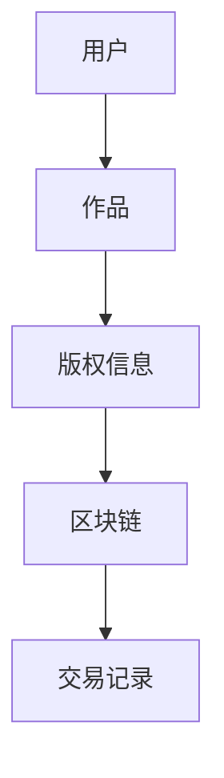
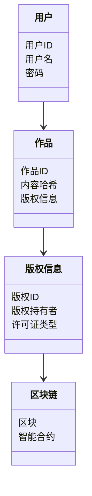

                 

<think>
嗯，用户想让我评估企业的区块链版权保护平台，写一篇技术博客。我得先弄清楚用户的需求到底是什么。他可能是一个技术专家，想深入了解如何评估这样的平台，或者是一个企业主，想选择合适的平台。

首先，我得明确文章的结构。用户已经给了一个大纲，我需要按照这个大纲来展开。标题是《如何评估企业的区块链版权保护平台》，关键词包括区块链、版权保护、企业平台、技术评估、系统架构、数字版权。摘要需要简明扼要地概括整篇文章的核心内容。

接下来，按照目录大纲，我需要分章节详细讲解。第一章是背景与问题背景，我得解释为什么需要区块链版权保护，以及当前的挑战。第二章介绍核心概念，包括区块链和版权保护的基本原理。第三章深入算法，比如共识机制和智能合约。第四章讨论评估指标和方法，给出具体的指标和测试方法。第五章是项目实战，用代码示例展示实现过程。第六章总结，给出最佳实践和扩展阅读。

在写每部分内容时，我需要确保逻辑清晰，结构紧凑。比如在介绍共识算法时，要比较PoW、PoS、Dpos等，分析它们的优缺点，并建议企业平台如何选择。同时，使用图表和代码示例来增强可读性，比如用Mermaid画出实体关系图和算法流程图，或者用Python代码展示智能合约的实现。

我还要注意数学公式的正确使用，比如椭圆曲线加密的公式，需要使用Latex格式，确保排版正确。同时，在代码部分，要详细解释每一步的作用，帮助读者理解实现过程。

最后，确保文章末尾有作者信息，这样显得专业。整个思考过程需要一步步来，确保每部分内容都详细且符合逻辑，这样才能写出一篇高质量的技术博客。
</think>

# 如何评估企业的区块链版权保护平台

> 关键词：区块链，版权保护，企业平台，技术评估，系统架构，数字版权

> 摘要：本文将深入探讨如何评估企业的区块链版权保护平台。从背景分析到系统架构设计，再到项目实战，我们将全面解析评估的核心要点，帮助读者掌握如何选择和优化适合的企业区块链版权保护解决方案。

---

## 目录大纲

### 第一部分：区块链版权保护平台概述

#### 第1章：区块链版权保护平台的背景与问题背景

##### 1.1 问题背景

- 1.1.1 版权保护的现状与挑战  
  - 数字化内容的快速传播与盗版问题日益严重。  
  - 现有版权保护机制的局限性：确权难、维权难、效率低。  

- 1.1.2 区块链技术在版权保护中的应用潜力  
  - 区块链的去中心化特性如何解决版权保护的核心问题。  
  - 智能合约在版权交易和分发中的应用。  

- 1.1.3 企业区块链版权保护平台的核心目标  
  - 提供高效、安全的数字内容确权与保护解决方案。  
  - 支持企业级应用的高并发、高性能需求。  

##### 1.2 问题描述

- 1.2.1 版权保护中的痛点分析  
  - 内容创作者的权益难以保障。  
  - 版权交易过程复杂，中间环节多，成本高。  

- 1.2.2 区块链技术如何解决这些问题  
  - 提供不可篡改的版权记录。  
  - 实现自动化、透明化的版权交易流程。  

- 1.2.3 企业平台的特殊需求与挑战  
  - 高可用性与高性能要求。  
  - 企业内部数据隐私与合规性问题。  

##### 1.3 问题解决与边界

- 1.3.1 区块链技术如何实现版权保护  
  - 区块链技术在确权、存证、交易中的具体应用。  
  - 如何通过区块链实现版权的自动分发与收益分配。  

- 1.3.2 企业平台的边界与外延  
  - 平台的功能边界：版权登记、确权、交易、分发。  
  - 外部系统集成：与现有企业系统（如CRM、支付系统）的对接。  

- 1.3.3 核心要素与组成结构  
  - 核心要素：区块链网络、智能合约、用户身份验证。  
  - 组成结构：前端、后端、区块链节点、数据库。  

#### 第2章：区块链与版权保护的核心概念

##### 2.1 区块链技术的核心原理

- 2.1.1 区块链的基本概念与特点  
  - 去中心化：无须信任的分布式账本。  
  - 不可篡改性：每个区块都包含时间戳和哈希指针。  
  - 可追溯性：通过区块链可以追溯每一笔交易的来源。  

- 2.1.2 分布式账本与共识机制  
  - 共识机制：确保所有节点达成一致的算法。  
  - 常见共识算法：PoW（工作量证明）、PoS（权益证明）、Dpos（ delegated proof of stake）。  

- 2.1.3 智能合约的作用与实现  
  - 智能合约：区块链上的自动执行程序。  
  - 合约实现：基于Solidity语言编写，并部署在区块链上。  

##### 2.2 版权保护的实现机制

- 2.2.1 数字版权的定义与保护方式  
  - 数字版权：对数字内容的所有权和使用权的保护。  
  - 保护方式：确权、授权、维权。  

- 2.2.2 区块链在版权登记与确权中的应用  
  - 登记流程：将数字内容的哈希值写入区块链。  
  - 确权证明：通过区块链记录的哈希值证明内容的所有权。  

- 2.2.3 版权交易与分发的区块链实现  
  - 交易流程：通过智能合约实现自动化的版权交易。  
  - 分发机制：基于区块链的点对点分发，减少中间环节。  

##### 2.3 区块链与版权保护的对比分析

- 2.3.1 核心概念属性对比表格  

| 属性          | 区块链               | 版权保护          |
|---------------|----------------------|-------------------|
| 核心目标       | 去中心化信任          | 保护知识产权       |
| 关键技术       | 分布式账本、共识机制  | 数字签名、智能合约 |
| 适用场景       | 跨界信任协作          | 数字内容交易       |
| 安全性         | 高，不可篡改          | 高，防伪造          |

- 2.3.2 ER实体关系图架构（使用 Mermaid）



---

### 第二部分：区块链版权保护的算法原理

#### 第3章：区块链版权保护的算法原理

##### 3.1 区块链共识算法

- 3.1.1 共识算法的分类与对比  
  - PoW（工作量证明）：安全性高，但资源消耗大。  
  - PoS（权益证明）：节能环保，但存在“富者愈富”的问题。  
  - Dpos（委托权益证明）：兼顾效率与安全性。  

- 3.1.2 企业平台适用的共识算法选择  
  - 根据平台的吞吐量需求选择算法。  
  - 权衡安全性、效率和资源消耗。  

##### 3.2 智能合约的实现原理

- 3.2.1 智能合约的定义与功能  
  - 智能合约：区块链上的自动执行程序。  
  - 功能：版权登记、授权、交易、收益分配。  

- 3.2.2 合约编译与部署流程  
  - 使用Solidity编写合约代码。  
  - 通过编译器生成字节码，并部署到区块链网络。  

- 3.2.3 合约执行与事件触发机制  
  - 合约执行：通过区块链节点共同验证。  
  - 事件触发：当满足特定条件时，触发预设的操作。  

##### 3.3 区块链加密算法

- 3.3.1 常见加密算法的原理与应用  
  - SHA-256：哈希算法，用于生成区块哈希。  
  - ECC（椭圆曲线加密）：数字签名技术。  

- 3.3.2 椭圆曲线加密的数学模型  
  - 椭圆曲线加密的数学公式：  
    $$ y^2 = x^3 + ax + b \mod p $$  

- 3.3.3 加密算法在版权保护中的具体应用  
  - 数字签名：确保内容来源的合法性。  
  - 数据加密：保护用户隐私。  

---

#### 第4章：区块链版权保护平台的评估指标与方法

##### 4.1 评估指标

- 4.1.1 技术指标  
  - 性能：TPS（每秒交易笔数）。  
  - 安全性：抵抗攻击的能力。  
  - 可扩展性：支持用户增长的能力。  

- 4.1.2 功能指标  
  - 是否支持多类型数字内容（文本、图片、视频）。  
  - 是否支持智能合约自动化交易。  

- 4.1.3 用户体验指标  
  - 界面友好程度。  
  - 操作流程的便捷性。  

##### 4.2 评估方法

- 4.2.1 功能测试  
  - 测试平台的版权登记、确权、交易功能。  
  - 模拟攻击测试，验证平台的安全性。  

- 4.2.2 性能测试  
  - 压力测试：在高并发情况下，平台的响应时间。  
  - 负载测试：逐步增加负载，观察平台的性能表现。  

- 4.2.3 安全性测试  
  - 检查平台的漏洞，如智能合约漏洞。  
  - 测试平台的抗DDoS能力。  

##### 4.3 系统架构设计

- 4.3.1 系统功能设计（领域模型 Mermaid 类图）



- 4.3.2 系统架构设计（Mermaid 架构图）


---

### 第三部分：区块链版权保护平台的项目实战

#### 第5章：项目实战

##### 5.1 环境搭建

- 安装以太坊开发环境：  
  ```bash
  npm install -g truffle
  npm install -g ganache-cli
  ```

##### 5.2 核心代码实现

- 智能合约实现（Solidity）

```solidity
// SPDX-License-Identifier: MIT
pragma solidity ^0.8.0;

contract CopyrightProtection {
    struct Work {
        uint256 id;
        address owner;
        string hash;
        bool isLicensed;
    }

    mapping(uint256 => Work) private works;

    function registerWork(uint256 id, string memory hash) public {
        Work storage work = works[id];
        work.owner = msg.sender;
        work.hash = hash;
        work.isLicensed = false;
    }

    function licenseWork(uint256 id, address licensee) public {
        Work storage work = works[id];
        require(work.owner != address(0), "Work not registered");
        work.isLicensed = true;
        // 支付许可费用
        (bool success, ) = licensee.call{value: work.licenseFee}("");
        require(success, "Payment failed");
    }
}
```

##### 5.3 测试案例与解读

- 测试智能合约的注册与授权功能。  
- 模拟攻击测试，验证平台的安全性。  

##### 5.4 项目小结

- 项目实现的关键点：智能合约的安全性、系统的可扩展性。  
- 项目中遇到的挑战及解决方案。  

---

### 第四部分：总结与扩展

#### 第6章：总结与扩展阅读

##### 6.1 最佳实践 tips

- 确保智能合约的安全性，避免漏洞。  
- 根据需求选择合适的共识算法。  

##### 6.2 小结

- 区块链技术为版权保护提供了新的解决方案。  
- 企业平台的评估需要从技术、功能、用户体验等多个维度综合考虑。  

##### 6.3 注意事项

- 数据隐私保护的重要性。  
- 合规性问题：不同国家的版权法律差异。  

##### 6.4 拓展阅读

- 推荐书籍：《区块链：新经济的机器》、《智能合约：法律与技术的碰撞》。  
- 推荐技术博客：Solidity官方文档、Ethereum开发者博客。  

---

## 作者信息

作者：AI天才研究院 / AI Genius Institute & 禅与计算机程序设计艺术 / Zen And The Art of Computer Programming

