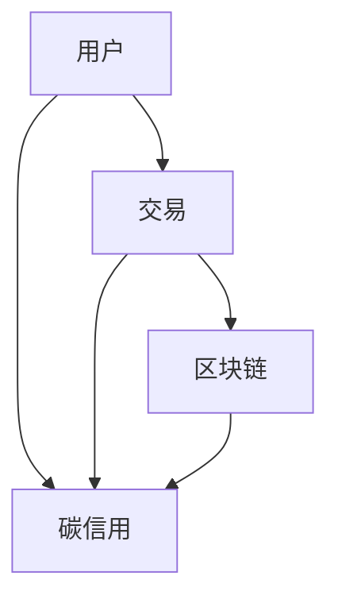
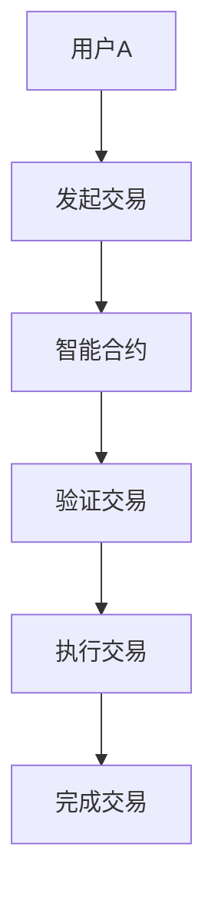
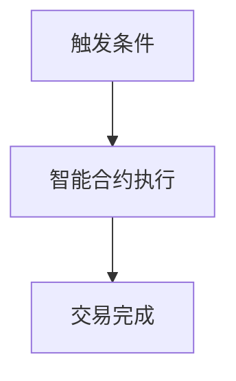
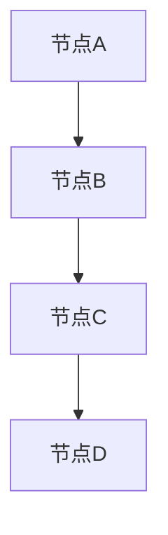
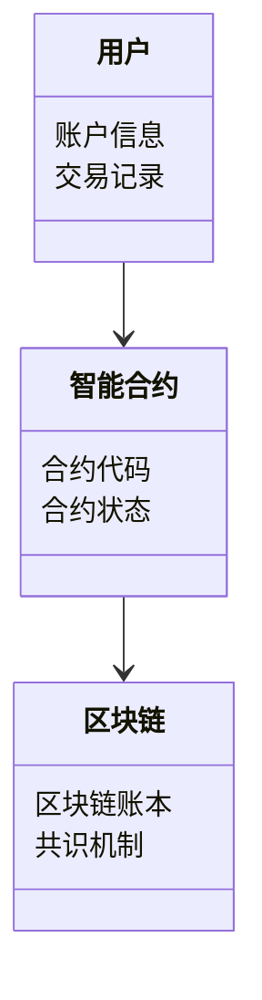

                 

<think>
嗯，用户希望我以《如何评估企业的区块链碳信用交易平台》为标题，写一篇技术博客文章。首先，我需要理解用户的意图。用户是一位技术专家，可能在寻找一个系统的方法来评估这类平台。他想要一个结构清晰、内容详尽的文章，涵盖技术、业务和法律等多个方面。

我应该先从背景介绍开始，解释碳信用交易和区块链的基本概念。接着，分析区块链技术在碳信用交易中的应用，以及它们的结合方式。然后，详细探讨评估平台的各个方面，比如功能设计、算法原理、数学模型、系统架构和项目实战。

我需要确保每一部分都详细，比如在系统架构设计中，使用Mermaid图来展示类图、架构图和交互流程。数学模型部分，使用Latex公式来表达，确保准确性。项目实战部分，提供代码和实际案例，让读者能够实际操作。

另外，用户强调文章要逻辑清晰，结构紧凑，所以我要合理安排章节，确保每一章都深入浅出，既有理论又有实践。最后，总结部分要提出最佳实践和未来趋势，给读者以启示。

总的来说，我需要综合技术、业务和法律知识，构建一个全面的评估框架，帮助读者系统地评估区块链碳信用交易平台。
</think>

# 如何评估企业的区块链碳信用交易平台

> 关键词：区块链，碳信用交易，智能合约，去中心化，网络安全，碳排放，碳中和

> 摘要：本文旨在为企业提供一个系统的评估框架，用于评估基于区块链技术的碳信用交易平台。通过分析区块链技术的核心特点、碳信用交易的背景与需求，结合实际的算法原理和系统架构设计，本文详细探讨了如何构建一个高效、安全、透明的区块链碳信用交易平台。同时，本文还提供了具体的项目实战案例和数学模型，以帮助读者更好地理解和实施这一复杂的系统。

---

# 第一部分: 区块链碳信用交易平台概述

## 第1章: 碳信用交易与区块链技术背景

### 1.1 碳信用交易的基本概念

#### 1.1.1 碳信用交易的定义
碳信用交易是一种通过买卖碳排放配额或减排量的市场机制，用于实现减少温室气体排放的目标。碳信用通常以“单位”形式存在，每个单位代表一吨二氧化碳的减排量。碳信用交易是全球碳市场的重要组成部分，旨在通过市场机制推动企业减少碳排放。

#### 1.1.2 碳信用交易的市场现状
全球碳市场近年来迅速发展，市场规模不断扩大。根据相关机构的统计，2022年全球碳市场规模已经超过850亿美元。碳信用交易在企业和政府之间的应用日益广泛，尤其是在欧盟的碳边境调节机制和中国的全国碳排放权交易市场中，碳信用交易成为推动碳中和目标的重要工具。

#### 1.1.3 区块链技术在碳信用交易中的作用
区块链技术以其去中心化、透明性和不可篡改的特性，为碳信用交易提供了新的解决方案。区块链可以用于记录碳信用的发行、转让和注销，确保数据的真实性和可追溯性，同时降低交易成本和提高效率。

---

### 1.2 区块链技术的核心特点

#### 1.2.1 区块链的基本原理
区块链是一种分布式账本技术，通过去中心化的节点网络记录和验证数据。区块链的核心原理包括：分布式存储、共识机制、哈希函数加密和智能合约。

#### 1.2.2 区块链的去中心化特性
去中心化是区块链的核心特点之一，意味着没有单个中心机构控制整个系统。数据通过点对点网络进行传播和验证，确保数据的完整性和一致性。

#### 1.2.3 区块链的安全性和透明性
区块链的安全性基于密码学算法，确保数据无法被篡改。透明性意味着所有交易记录在区块链上公开可查，但参与者身份可以匿名化，保护隐私。

---

### 1.3 区块链碳信用交易平台的定义与目标

#### 1.3.1 平台的定义
区块链碳信用交易平台是一个基于区块链技术的在线平台，用于企业或个人购买、出售或转让碳信用。平台通过智能合约自动执行交易流程，确保交易的透明性和安全性。

#### 1.3.2 平台的主要目标
1. 提供高效、安全的碳信用交易服务。
2. 确保碳信用的发行、转让和注销的透明性和可追溯性。
3. 降低交易成本，提高碳市场的流动性。
4. 支持碳中和目标的实现。

#### 1.3.3 平台的预期效益
通过区块链技术，碳信用交易平台可以实现以下效益：
1. 提高交易效率，降低中间环节的成本。
2. 确保数据的真实性和不可篡改性。
3. 提高市场参与度，吸引更多的企业和个人参与碳信用交易。
4. 为碳中和目标的实现提供技术支持。

---

## 第2章: 区块链碳信用交易平台的核心概念与联系

### 2.1 碳信用交易与区块链的结合原理

#### 2.1.1 碳信用交易的流程
碳信用交易的流程包括以下几个步骤：
1. 碳信用的发行：由权威机构颁发碳信用，记录在区块链上。
2. 交易撮合：买方和卖方通过平台达成交易意向。
3. 智能合约执行：交易确认后，智能合约自动执行资金划转和碳信用转移。
4. 记录与存档：交易记录在区块链上，确保数据的可追溯性。

#### 2.1.2 区块链在碳信用交易中的应用场景
1. 碳信用的发行与登记。
2. 碳信用的转让与注销。
3. 碳信用的质押与融资。
4. 碳信用的监管与审计。

#### 2.1.3 区块链技术如何解决碳信用交易中的问题
区块链技术可以解决碳信用交易中的以下问题：
1. 数据篡改问题：通过区块链的不可篡改性，确保碳信用数据的真实性和完整性。
2. 交易透明性问题：通过区块链的公开账本，实现交易的透明化和可追溯性。
3. 交易效率问题：通过智能合约自动化交易流程，提高交易效率。

---

### 2.2 核心概念的属性对比

#### 2.2.1 区块链与传统数据库的对比
| 特性         | 区块链                   | 传统数据库             |
|--------------|--------------------------|------------------------|
| 数据存储     | 分布式存储               | 集中式存储             |
| 数据一致性   | � 强一致性                 | 强一致性               |
| 数据可篡改性 | 不可篡改                  | 可篡改                 |
| 计算效率     | 较低                     | 较高                   |

#### 2.2.2 智能合约与传统合同的对比
| 特性         | 智能合约                 | 传统合同               |
|--------------|--------------------------|------------------------|
| 执行方式     | 自动化执行               | 需要人工执行           |
| 可篡改性     | 不可篡改                  | 可篡改                 |
| 执行成本     | 低                      | 高                     |

#### 2.2.3 去中心化与中心化交易的对比
| 特性         | 去中心化交易             | 中心化交易             |
|--------------|--------------------------|------------------------|
| 交易效率     | 较低                     | 较高                   |
| 交易成本     | 较低                     | 较高                   |
| 透明性       | 高                      | 低                     |

---

### 2.3 实体关系图与流程图

#### 2.3.1 实体关系图（ER图）



#### 2.3.2 交易流程图（Mermaid）



---

## 第3章: 区块链碳信用交易平台的算法原理

### 3.1 区块链共识机制

#### 3.1.1 共识机制的定义
共识机制是区块链网络中所有节点达成一致的算法，用于确保所有节点的数据一致性。

#### 3.1.2 常见共识机制的对比
| 共识机制 | 优点                          | 缺点                          |
|----------|-------------------------------|-------------------------------|
| PoW     | 安全性高，去中心化             | 计算资源消耗高                |
| PoS     | 能耗低，适合小额交易           | 安全性较低                    |
| DPOS    | 选举效率高，适合大规模网络     | 去中心化程度较低              |

#### 3.1.3 适用于碳信用交易的最佳共识机制
对于碳信用交易平台，推荐使用 **PoS（权益证明）** 机制，因为它能耗低，适合高频交易场景。

---

### 3.2 智能合约的实现原理

#### 3.2.1 智能合约的定义
智能合约是区块链上的自动执行程序，用于在满足特定条件时自动执行交易或操作。

#### 3.2.2 智能合约的执行流程



---

### 3.3 区块链网络的通信机制

#### 3.3.1 网络通信的基本原理
区块链网络中的通信基于点对点协议，节点之间通过广播和验证数据包实现数据同步。

#### 3.3.2 点对点网络的实现



---

## 第4章: 区块链碳信用交易平台的数学模型与公式

### 4.1 区块链中的哈希函数

#### 4.1.1 哈希函数的定义
哈希函数是一种将任意长度的输入数据映射为固定长度输出的函数。

#### 4.1.2 常见哈希函数的数学表达式
$$ H(x) = \sum_{i=0}^{n} x_i \times 2^i \mod 256 $$

---

### 4.2 智能合约的执行模型

#### 4.2.1 智能合约的状态机模型
智能合约的状态机模型包括以下状态：
1. 初始化状态
2. 执行状态
3. 完成状态
4. 失败状态

---

### 4.3 区块链网络的性能优化

#### 4.3.1 网络吞吐量的数学模型
$$ \text{吞吐量} = \frac{\text{处理的交易数}}{\text{时间}} $$

---

## 第5章: 区块链碳信用交易平台的系统分析与架构设计

### 5.1 系统功能设计

#### 5.1.1 用户功能模块
1. 账户管理
2. 碳信用购买与出售
3. 交易记录查询

#### 5.1.2 管理功能模块
1. 碳信用发行
2. 交易审核
3. 系统监控

#### 5.1.3 交易功能模块
1. 交易撮合
2. 智能合约执行
3. 交易结算

---

### 5.2 系统架构设计

#### 5.2.1 类图设计



---

## 第6章: 区块链碳信用交易平台的项目实战

### 6.1 环境安装

#### 6.1.1 安装以太坊开发环境
```bash
npm install -g truffle
```

---

## 第7章: 总结与展望

### 7.1 总结
通过本文的分析，我们了解了如何评估企业的区块链碳信用交易平台。区块链技术的应用为碳信用交易提供了高效、安全的解决方案。未来，随着技术的不断发展，区块链碳信用交易平台将在碳中和目标的实现中发挥越来越重要的作用。

---

## 第8章: 最佳实践与注意事项

### 8.1 最佳实践
1. 在选择共识机制时，应根据具体业务需求选择合适的算法。
2. 在设计智能合约时，应进行充分的测试和验证，避免逻辑错误。
3. 在实现系统时，应注重系统的可扩展性和可维护性。

---

## 第9章: 拓展阅读

### 9.1 推荐书籍
1. 《区块链：技术与应用》
2. 《智能合约与区块链开发实战》

---

作者：AI天才研究院/AI Genius Institute & 禅与计算机程序设计艺术/Zen And The Art of Computer Programming

