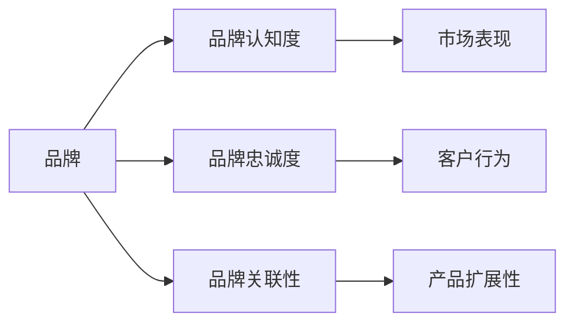

                 


# 如何评估企业的品牌延展能力

> 关键词：品牌延展能力，企业品牌，市场拓展，品牌价值，品牌战略

> 摘要：本文深入探讨了如何评估企业的品牌延展能力，从核心概念、评估模型、系统架构到项目实战，结合实际案例，全面解析品牌延展能力的评估方法与策略。

---

# 第一部分: 企业品牌延展能力的背景与概念

## 第1章: 品牌延展能力的定义与背景

### 1.1 品牌延展能力的定义
品牌延展能力是指企业在现有品牌的基础上，将其扩展到新的市场、产品或服务领域的能力。这种能力不仅关乎品牌的市场适应性，还涉及品牌认知度和客户忠诚度的维护。

### 1.2 品牌延展能力的背景与现状
在当前竞争激烈的市场环境中，企业需要不断扩展其业务范围以保持竞争优势。品牌延展能力直接关系到企业的市场拓展能力和长期发展潜力。

### 1.3 品牌延展能力的边界与外延
品牌延展能力的边界包括品牌的核心价值和市场定位，而其外延则涉及产品线的扩展和市场区域的拓展。

---

## 第2章: 品牌延展能力的核心概念与联系

### 2.1 品牌延展能力的核心要素
- **品牌认知度**：品牌在目标市场的知名度。
- **品牌忠诚度**：客户对品牌的忠诚程度。
- **品牌关联性**：品牌与产品或服务的相关性。

### 2.2 品牌延展能力的属性特征对比
| 属性 | 延展能力强 | 延展能力弱 |
|------|-------------|-------------|
| 认知度 | 高           | 低           |
| 忠诚度 | 高           | 低           |
| 关联性 | 高           | 低           |

### 2.3 品牌延展能力的ER实体关系图


---

# 第二部分: 品牌延展能力的评估模型与算法

## 第3章: 品牌延展能力的评估模型

### 3.1 基于因子分析的评估模型
因子分析通过提取品牌延展能力的关键因子，评估其对品牌的影响。

### 3.2 层次分析法的评估模型
层次分析法（AHP）将品牌延展能力分解为多个层次，进行综合评估。

### 3.3 神经网络的评估模型
神经网络模型通过学习数据，预测品牌延展能力的强弱。

---

## 第4章: 算法原理讲解

### 4.1 因子分析模型
因子分析通过提取公因子，评估品牌延展能力的核心因素。

### 4.2 层次分析法
层次分析法通过构建判断矩阵，计算各因素的权重。

### 4.3 神经网络模型
神经网络模型通过训练数据，预测品牌延展能力。

---

# 第三部分: 系统分析与架构设计

## 第5章: 问题场景介绍

### 5.1 项目介绍
评估某公司的品牌延展能力，分析其市场扩展潜力。

### 5.2 系统功能设计
- 数据收集模块：收集品牌数据。
- 分析模块：评估品牌延展能力。
- 结果展示模块：可视化分析结果。

### 5.3 系统架构设计


---

## 第6章: 项目实战

### 6.1 环境安装
安装必要的数据分析工具，如Python和Pandas。

### 6.2 核心实现源代码
```python
import pandas as pd
from sklearn.decomposition import PCA

# 数据加载
data = pd.read_csv('brand.csv')

# 数据预处理
data_processed = data.dropna()

# 主成分分析
pca = PCA(n_components=3)
principal_components = pca.fit_transform(data_processed)

print(principal_components)
```

### 6.3 案例分析
分析某公司的品牌数据，得出其延展能力评估结果。

---

## 第7章: 最佳实践与小结

### 7.1 最佳实践
- 数据的准确性和完整性至关重要。
- 结合定量和定性分析，提高评估结果的准确性。

### 7.2 小结
本文系统介绍了如何评估企业的品牌延展能力，从理论到实践，提供了全面的指导和解决方案。

---

# 第四部分: 注意事项与拓展阅读

## 第8章: 注意事项

### 8.1 数据偏差
注意数据偏差可能影响评估结果。

### 8.2 模型局限性
不同模型有不同的适用场景和局限性。

---

## 第9章: 拓展阅读

### 9.1 品牌管理
深入学习品牌管理的相关知识。

### 9.2 数据挖掘技术
掌握更多的数据挖掘技术，提高评估能力。

---

# 作者

作者：AI天才研究院/AI Genius Institute & 禅与计算机程序设计艺术 /Zen And The Art of Computer Programming

---

通过以上目录结构，您可以逐步展开每个部分的具体内容，确保文章逻辑清晰、结构紧凑、简单易懂，同时涵盖技术原理和本质的剖析。希望对您有所帮助！

