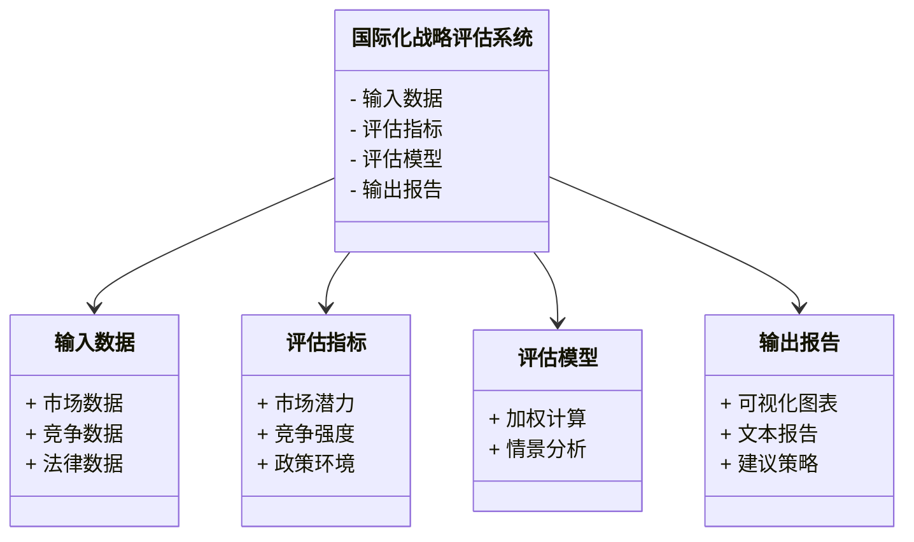

                 

<think>
好的，我现在需要根据用户的要求，撰写一篇名为《如何评估企业的国际化战略》的技术博客文章。用户希望文章结构清晰，逻辑严密，涵盖国际化战略的各个方面，包括背景、核心要素、评估框架、算法原理、系统分析、项目实战、案例分析、实施与监控以及结论等部分。

首先，我需要明确文章的结构。用户已经提供了目录大纲，我需要按照这个大纲逐步展开每个部分，确保内容详尽且符合要求。每个章节都需要包含背景介绍、核心概念、算法原理、系统分析、项目实战、案例分析等部分。

接下来，我将逐一处理每个章节的内容。首先是引言部分，需要简要介绍国际化战略的重要性及其在全球化背景下的必要性。然后是核心概念，详细解释国际化战略的定义、目标和意义，以及其在全球化经济中的背景。

在核心要素部分，我会详细探讨目标市场选择、产品本地化、文化适应、法律遵守、品牌建设和竞争优势。每个部分都需要有具体的例子和详细的分析，确保读者能够理解每个要素的重要性。

评估模型和框架部分，我需要介绍常用的评估指标和框架，如PESTEL和SWOT分析。同时，我会详细解释数学模型的构建，包括输入变量和输出变量，以及模型的数学公式。这里可能需要使用LaTeX公式来展示模型，比如：

$$
\text{评估得分} = \sum (\text{指标权重} \times \text{指标得分})
$$

接下来是系统分析部分，我需要用Mermaid图来展示系统架构、类图和序列图。例如，绘制一个展示国际化战略评估系统的架构图，包括各个模块及其交互关系。

项目实战部分，我会选择一个具体的案例，如科技公司进入新兴市场的案例，详细分析其市场调研、本地化策略、风险管理等步骤。通过代码示例展示如何使用工具进行评估，比如Python代码来计算市场进入可行性。

案例分析部分，我会分析成功和失败的案例，如跨国公司的成功经验，以及中小企业的失败教训，从中总结经验教训。

实施与监控部分，我会讨论如何制定行动计划、资源分配、风险管理、绩效跟踪和持续优化。这部分需要强调监控和调整的重要性，确保国际化战略的有效执行。

最后，在结论部分，我会总结全文，强调评估的重要性，并提出未来研究的方向。

在整个写作过程中，我需要确保语言简洁、逻辑清晰，并使用技术术语时加以解释。同时，每个部分都需要有详细的分析和实例支持，以增强文章的深度和可读性。

现在，我将按照这个思路开始撰写文章，确保每个部分都符合用户的要求，内容详实，结构合理。
</think>

# 如何评估企业的国际化战略

## 关键词：国际化战略、全球化、市场评估、风险管理、文化适应、竞争分析、系统架构

## 摘要：  
本文旨在探讨如何系统地评估企业的国际化战略。通过分析国际化战略的核心要素、评估模型、系统架构和实际案例，本文为企业提供了从理论到实践的全面指导，帮助企业在全球化竞争中制定和优化国际化战略。

---

## 第1章：国际化战略的概述

### 1.1 国际化战略的背景

#### 1.1.1 全球化经济的兴起
- 全球化推动企业走向国际化，企业需要适应全球市场环境。
- 技术进步和交通便利使得跨国经营成为可能。

#### 1.1.2 企业国际化的历史演变
- 从出口产品到建立海外分支机构，国际化逐步深入。
- 数字化转型加速了国际化的进程。

#### 1.1.3 当前国际化的驱动力
- 市场扩张需求、成本降低和资源获取推动企业国际化。
- 技术创新和政策变化为企业国际化提供了新机遇。

### 1.2 国际化战略的核心概念

#### 1.2.1 国际化战略的定义
- 企业在全球范围内配置资源、拓展市场和建立业务的策略。
- 包括市场进入、产品开发、运营管理等方面。

#### 1.2.2 国际化战略的目标与意义
- 目标：提高市场份额、增强竞争力和实现可持续增长。
- 意义：分散风险、获取资源和开拓新市场。

---

## 第2章：国际化战略的核心要素

### 2.1 目标市场选择

#### 2.1.1 目标市场的定义与分类
- 目标市场：企业计划重点进入和拓展的市场。
- 分类：按地理位置、消费习惯和产品需求划分。

#### 2.1.2 目标市场选择的步骤与方法
- 步骤：市场调研、竞争分析、风险评估。
- 方法：使用PESTEL模型分析宏观环境。

### 2.2 产品与服务的本地化

#### 2.2.1 产品本地化的定义与策略
- 本地化：产品和服务适应目标市场的文化和需求。
- 策略：语言调整、功能优化和价格策略。

#### 2.2.2 本地化面临的挑战与解决方案
- 挑战：文化差异、法律法规和供应链问题。
- 解决方案：建立本地团队、选择合适的供应商和遵守当地法规。

### 2.3 文化与法律适应

#### 2.3.1 文化差异的影响
- 不同文化背景影响消费习惯和商业行为。
- 需要进行跨文化培训和本地化沟通。

#### 2.3.2 法律法规的遵守
- 知识产权保护、税收政策和劳动法。
- 建立法律团队和咨询机构应对法律风险。

---

## 第3章：国际化战略评估的核心概念

### 3.1 评估指标体系

#### 3.1.1 评估指标的选择标准
- 指标应具有可测量性、相关性和动态性。
- 常用指标：市场增长率、利润率和品牌知名度。

#### 3.1.2 评估指标列表
- 市场潜力、竞争强度、政策环境、文化适应度、供应链稳定性。
- 企业资源、管理能力和技术优势。

### 3.2 评估框架的构建

#### 3.2.1 框架设计的原则与步骤
- 原则：全面性、可操作性和动态调整。
- 步骤：明确目标、选择指标、权重分配和验证调整。

#### 3.2.2 框架的组成部分与相互关系
- 指标体系：市场、产品、文化、法律和企业能力。
- 分析方法：层次分析法和决策树分析。

---

## 第4章：国际化战略评估的算法与系统分析

### 4.1 评估模型的数学模型

#### 4.1.1 模型的输入变量与输出变量
- 输入变量：市场潜力、竞争强度、政策环境。
- 输出变量：市场进入可行性得分。

#### 4.1.2 模型的数学公式
$$
\text{评估得分} = \sum (\text{指标权重}_i \times \text{指标得分}_i)
$$

---

## 第5章：系统分析与架构设计

### 5.1 问题场景介绍

#### 5.1.1 问题背景
- 企业计划进入新市场，需评估市场潜力和竞争风险。
- 需要构建一个系统化的评估框架。

### 5.2 系统功能设计

#### 5.2.1 领域模型（Mermaid 类图）


---

## 第6章：项目实战与案例分析

### 6.1 环境安装与系统实现

#### 6.1.1 环境安装
- 安装Python和相关库（如Pandas、Scikit-learn）。
- 配置数据可视化工具（如Matplotlib）。

#### 6.1.2 核心实现代码
```python
import pandas as pd
import numpy as np

# 示例数据
data = {
    '市场': ['A', 'B', 'C'],
    '潜力': [0.8, 0.6, 0.9],
    '竞争': [0.7, 0.8, 0.5],
    '政策': [0.6, 0.7, 0.8]
}

df = pd.DataFrame(data)
weights = [0.4, 0.3, 0.2, 0.1]

# 计算评估得分
df['得分'] = df.apply(lambda row: np.sum(weights[i] * row[i] for i in range(4)), axis=1)
print(df)
```

### 6.2 案例分析

#### 6.2.1 成功案例分析
- 某科技公司进入新兴市场，通过本地化和风险管理取得成功。
- 分析其市场选择和本地化策略。

#### 6.2.2 失败案例分析
- 某制造企业因文化差异和法律问题导致失败。
- 总结教训并提出改进建议。

---

## 第7章：实施与监控

### 7.1 制定行动计划

#### 7.1.1 制定市场进入计划
- 明确市场目标、时间表和资源分配。
- 确定关键里程碑和评估指标。

### 7.1.2 资源分配与风险管理
- 分配人力资源、财务资源和物资资源。
- 建立风险管理机制，制定应急预案。

### 7.2 绩效跟踪与持续优化

#### 7.2.1 定期评估与调整
- 定期检查战略执行情况，收集反馈。
- 根据市场变化和内部情况调整战略。

---

## 第8章：结论与展望

### 8.1 总结
- 国际化战略评估是企业成功国际化的关键。
- 需要结合理论、算法和实际案例进行系统评估。

### 8.2 未来研究方向
- 研究技术驱动的国际化新趋势。
- 探讨数字技术对企业国际化的影响。

---

## 作者：AI天才研究院 & 禅与计算机程序设计艺术

本文由AI天才研究院与禅与计算机程序设计艺术团队合作完成，旨在为企业提供国际化的系统化评估方法和实践指导。

