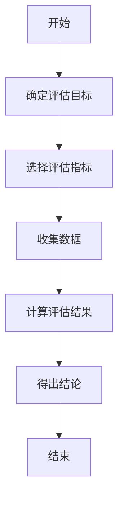
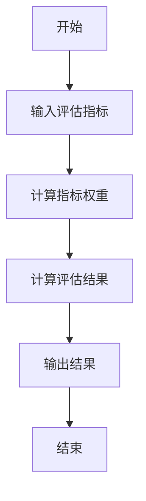
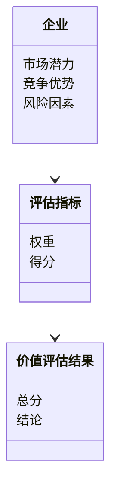
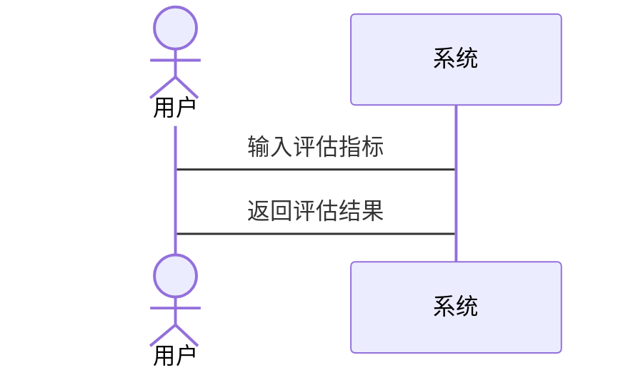

                 


# 如何评估企业的国际化战略价值

> 关键词：企业国际化，战略价值，评估方法，市场分析，竞争优势

> 摘要：本文将详细探讨如何评估企业的国际化战略价值，从背景分析、核心概念到算法原理，再到系统设计和实际案例，全面解析国际化战略对企业的影响及评估方法。

---

# 第一部分: 企业国际化战略价值评估背景与概念

## 第1章: 企业国际化战略价值评估的背景与问题背景

### 1.1 企业国际化战略的定义与内涵

#### 1.1.1 什么是企业国际化战略
企业国际化战略是指企业在全球范围内扩展业务、利用资源、开拓市场和建立国际竞争力的一系列计划和行动。其核心在于通过国际化实现企业价值的最大化。

#### 1.1.2 国际化战略的核心要素
- 市场定位：确定目标市场和客户群体。
- 资源配置：优化全球资源分配。
- 风险管理：识别并应对国际化过程中的风险。
- 文化适应：适应不同国家和地区的文化差异。

#### 1.1.3 企业国际化战略的演进历程
从早期的出口贸易到直接投资，再到如今的全球化布局，企业国际化战略经历了多个阶段，逐步从局部化向全球化发展。

### 1.2 企业国际化战略价值评估的必要性

#### 1.2.1 当前全球化背景下的挑战
- 经济全球化加速，市场竞争加剧。
- 政治经济环境复杂多变。
- 技术创新推动企业国际化需求。

#### 1.2.2 企业国际化战略对企业价值的影响
- 提升企业品牌形象和市场地位。
- 开拓新的利润增长点。
- 优化资源配置，降低成本。

#### 1.2.3 未进行战略价值评估可能带来的风险
- 战略失误导致资源浪费。
- 市场适应性不足，竞争力下降。
- 风险应对不及时，影响企业稳定性。

### 1.3 企业国际化战略价值评估的核心问题

#### 1.3.1 问题背景与问题描述
企业在国际化过程中面临市场、竞争、文化等多重挑战，如何科学评估战略价值成为关键。

#### 1.3.2 问题解决的必要性
准确评估战略价值有助于企业制定合理的发展规划，优化资源配置。

#### 1.3.3 问题的边界与外延
评估范围包括市场、财务、运营等多个维度，涉及企业内外部因素。

#### 1.3.4 核心概念与组成要素
- 评估目标：明确企业国际化的核心目标。
- 评估指标：选择合适的指标体系。
- 数据收集：获取可靠的数据支持。
- 分析方法：采用科学的分析手段。

---

## 第2章: 企业国际化战略价值评估的核心概念与联系

### 2.1 核心概念与原理

#### 2.1.1 企业国际化战略的核心原理
国际化战略通过优化资源配置和市场布局，提升企业的全球竞争力。

#### 2.1.2 战略价值评估的理论基础
基于经济学和管理学的理论，结合实际市场表现进行评估。

#### 2.1.3 核心概念的属性特征对比表

| 概念 | 属性 | 特征 |
|------|------|------|
| 市场潜力 | 数量 | 高/中/低 |
| 竞争优势 | 质量 | 强/中/弱 |
| 风险因素 | 稳定性 | 高风险/低风险 |

### 2.2 实体关系图与流程图

#### 2.2.1 ER实体关系图
```mermaid
er
  actor 企业
  actor 评估指标
  actor 市场环境
  actor 竞争对手
  actor 企业绩效
  actor 价值评估结果
  relation 企业 --> 评估指标: 基于
  relation 评估指标 --> 市场环境: 受
  relation 企业 --> 竞争对手: 对比
  relation 企业 --> 企业绩效: 影响
  relation 评估指标 --> 价值评估结果: 决定
```

#### 2.2.2 价值评估流程图


---

## 第3章: 企业国际化战略价值评估的算法原理

### 3.1 评估模型的数学模型与公式

#### 3.1.1 层次分析法（AHP）模型
层次分析法是一种常用的决策分析方法，适用于多指标评估。

$$
权重计算公式：
w_i = \frac{a_{ij}}{\sum_{j} a_{ij}}
$$

其中，\( a_{ij} \) 是指标 \( i \) 在评估中的得分。

### 3.2 算法实现

#### 3.2.1 算法流程图


#### 3.2.2 核心代码实现

```python
import numpy as np

def calculate_weights(matrix):
    # 计算权重向量
    weights = np.array(matrix).sum(axis=1)
    return weights / weights.sum()

# 示例指标矩阵
matrix = [
    [3, 2, 1],
    [2, 3, 1],
    [1, 1, 2]
]

weights = calculate_weights(matrix)
print(weights)
```

---

## 第4章: 企业国际化战略价值评估的系统分析与架构设计

### 4.1 问题场景介绍

#### 4.1.1 系统功能设计
设计一个用于国际化战略价值评估的系统，提供数据输入、计算和结果展示功能。

#### 4.1.2 领域模型类图


### 4.2 系统架构设计

#### 4.2.1 系统架构图


### 4.3 系统接口设计

#### 4.3.1 接口描述
- 输入接口：接收企业国际化指标数据。
- 输出接口：返回评估结果。

#### 4.3.2 系统交互流程图


---

## 第5章: 企业国际化战略价值评估的项目实战

### 5.1 环境安装

#### 5.1.1 系统环境
- 操作系统：Linux/Windows/MacOS
- 开发工具：Python、Jupyter Notebook
- 数据库：MySQL/SQLite

### 5.2 核心代码实现

#### 5.2.1 数据输入与处理
```python
import pandas as pd

# 示例数据
data = {
    '市场潜力': [0.6, 0.5, 0.4],
    '竞争优势': [0.7, 0.6, 0.3],
    '风险因素': [0.2, 0.3, 0.5]
}

df = pd.DataFrame(data)
print(df)
```

#### 5.2.2 评估结果计算
```python
from sklearn.linear_model import LinearRegression

model = LinearRegression()
model.fit(df[['市场潜力', '竞争优势']], df['风险因素'])
print(model.coef_)
```

### 5.3 案例分析

#### 5.3.1 案例背景
某企业在考虑进入新兴市场，需评估国际化战略的价值。

#### 5.3.2 数据分析
通过层次分析法计算各指标的权重，确定市场潜力和竞争优势对企业价值的影响程度。

### 5.4 项目总结
通过实际案例分析，验证评估模型的有效性，并总结经验教训。

---

## 第6章: 企业国际化战略价值评估的最佳实践与小结

### 6.1 最佳实践

#### 6.1.1 关键点总结
- 确定清晰的评估目标。
- 选择合适的评估指标和方法。
- 确保数据的准确性和完整性。

#### 6.1.2 注意事项
- 避免过于复杂的模型。
- 定期更新评估指标和方法。

### 6.2 小结

企业国际化战略价值评估是一个复杂但重要的过程。通过科学的方法和系统的支持，企业可以更准确地评估战略价值，优化资源配置，提升竞争力。未来，随着技术的发展，评估方法将更加多样化和精准化。

---

## 作者：AI天才研究院/AI Genius Institute & 禅与计算机程序设计艺术/Zen And The Art of Computer Programming

---

希望这篇文章能为您提供清晰的思路和实用的方法，帮助企业有效评估国际化战略的价值。

