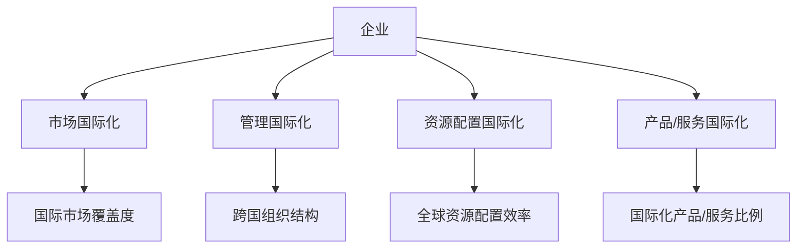
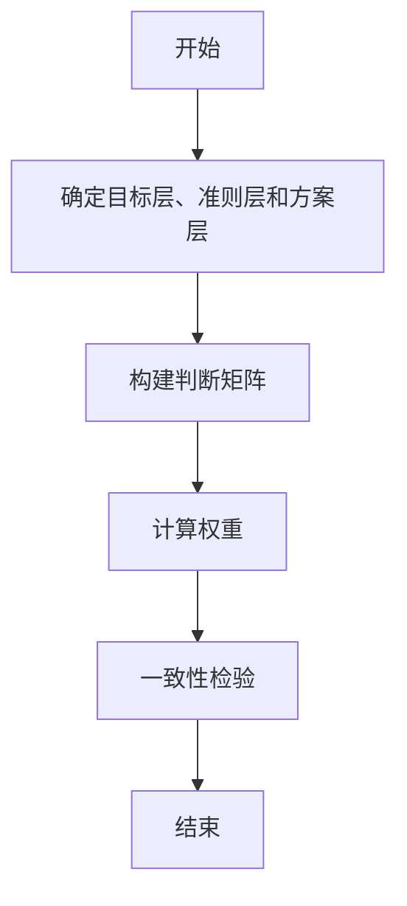
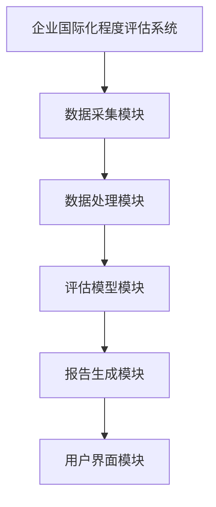
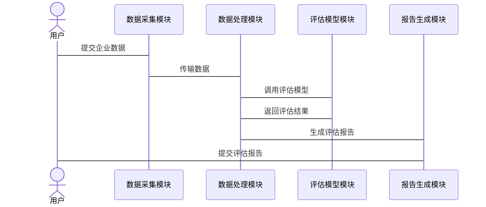

                 


# 如何评估企业的国际化程度价值

## 关键词：企业国际化、国际化程度、评估模型、全球化、企业价值

## 摘要：本文详细阐述了如何评估企业的国际化程度价值，从背景、核心概念、评估模型、系统分析到项目实战，逐步分析，为企业提供科学的评估方法和实践指导。

---

# 第1章: 企业国际化程度评估的背景与问题定义

## 1.1 企业国际化的基本概念

### 1.1.1 什么是企业国际化

企业国际化是指企业在跨越国界进行市场拓展、资源配置、组织管理等活动中所表现出的程度和能力。它不仅包括企业在海外市场的扩展，还包括企业在全球范围内的资源整合、文化适应和跨文化管理能力。

### 1.1.2 企业国际化的核心特征

企业国际化的核心特征包括：市场全球化、组织结构多元化、资源配置国际化、产品/服务标准化以及跨文化管理能力。

### 1.1.3 企业国际化的驱动因素

企业国际化的驱动因素主要包括：市场需求、成本优势、资源获取、品牌影响力以及全球化战略。

## 1.2 企业国际化程度评估的必要性

### 1.2.1 全球化经济的趋势分析

随着经济全球化的发展，企业国际化程度成为衡量企业竞争力的重要指标。

### 1.2.2 企业国际化程度对企业价值的影响

企业国际化程度直接影响企业的市场占有率、利润率和品牌价值。

### 1.2.3 企业国际化程度评估的现实意义

评估企业国际化程度有助于企业制定全球化战略，优化资源配置，提升竞争力。

## 1.3 企业国际化程度评估的边界与外延

### 1.3.1 企业国际化程度的边界条件

企业国际化程度的评估需要考虑企业的行业特点、发展阶段和国际环境。

### 1.3.2 企业国际化程度的外延范围

企业国际化程度的外延包括国际市场覆盖度、组织结构复杂度、资源配置效率和产品/服务国际化水平。

### 1.3.3 与相关概念的区分（如全球化、本地化）

全球化是指全球经济一体化，而企业国际化是全球化的一个具体表现。本地化是企业国际化过程中的一个阶段。

## 1.4 企业国际化程度评估的核心要素

### 1.4.1 市场国际化程度

包括国际市场覆盖度、市场份额和市场渗透率。

### 1.4.2 管理国际化程度

包括跨国组织结构、国际化人才配置和跨文化管理能力。

### 1.4.3 资源配置国际化程度

包括全球资源配置效率、国际供应链管理和跨国并购能力。

### 1.4.4 产品/服务国际化程度

包括国际化产品/服务比例、产品/服务标准化程度和技术创新能力。

## 1.5 本章小结

本章从企业国际化的定义、特征、驱动因素以及评估的必要性等方面进行了分析，明确了企业国际化程度评估的核心要素和边界条件。

---

# 第2章: 企业国际化程度评估的核心概念与联系

## 2.1 企业国际化程度的属性特征

### 2.1.1 市场覆盖度

市场覆盖度是指企业在国际市场上的覆盖范围和市场份额。

### 2.1.2 组织结构复杂度

组织结构复杂度反映了企业在跨国经营中的组织架构和管理层次。

### 2.1.3 跨文化管理能力

跨文化管理能力是指企业在不同文化背景下进行有效管理的能力。

### 2.1.4 资源配置效率

资源配置效率是指企业在全球范围内优化配置资源的能力。

## 2.2 核心概念的对比分析

### 2.2.1 市场国际化与管理国际化的区别与联系

市场国际化侧重于企业的市场覆盖范围，而管理国际化侧重于企业的组织结构和管理能力。两者相辅相成，共同影响企业的国际化程度。

### 2.2.2 资源配置国际化与产品/服务国际化的区别与联系

资源配置国际化侧重于企业在全球范围内的资源分配，而产品/服务国际化侧重于企业的产品/服务在国际市场的适应性和标准化程度。

## 2.3 实体关系图（ER图）



---

# 第3章: 企业国际化程度评估模型的构建

## 3.1 评估模型的设计思路

### 3.1.1 确定评估维度

基于企业的市场、管理、资源和产品/服务四个维度进行评估。

### 3.1.2 设计权重分配

采用层次分析法（AHP）对各维度进行权重分配。

### 3.1.3 构建评估指标体系

构建包括国际市场覆盖度、跨国组织结构、全球资源配置效率和国际化产品/服务比例等指标的评估体系。

## 3.2 评估模型的数学表达

### 3.2.1 层次分析法（AHP）的应用

权重计算公式：

$$
w_i = \frac{\sum_{j=1}^{n} a_{ij}}{\sum_{i=1}^{m} \sum_{j=1}^{n} a_{ij}}
$$

### 3.2.2 综合评分公式

$$
S_i = \sum_{k=1}^{n} w_k \cdot x_{ik}
$$

---

# 第4章: 企业国际化程度评估的算法原理

## 4.1 层次分析法（AHP）的实现步骤

### 4.1.1 确定目标层、准则层和方案层

目标层：企业国际化程度。

准则层：市场国际化、管理国际化、资源配置国际化、产品/服务国际化。

方案层：具体的企业国际化程度。

### 4.1.2 构建判断矩阵

构建准则层之间的判断矩阵，进行一致性检验。

### 4.1.3 计算权重并进行一致性检验

计算各维度的权重，并对一致性进行检验。

## 4.2 算法流程图



---

# 第5章: 系统分析与架构设计方案

## 5.1 问题场景介绍

企业需要评估其国际化程度，以制定全球化战略和优化资源配置。

## 5.2 系统功能设计

### 5.2.1 领域模型设计

```mermaid
classDiagram
    class 企业 {
        市场国际化
        管理国际化
        资源配置国际化
        产品/服务国际化
    }
    class 市场国际化 {
        国际市场覆盖度
        市场份额
        市场渗透率
    }
    class 管理国际化 {
        跨文化管理能力
        跨国组织结构
        国际化人才配置
    }
    class 资源配置国际化 {
        全球资源配置效率
        国际供应链管理
        跨国并购能力
    }
    class 产品/服务国际化 {
        国际化产品/服务比例
        产品/服务标准化程度
        技术创新能力
    }
```

### 5.2.2 系统架构设计



### 5.2.3 系统接口设计

定义系统接口，包括数据输入、数据处理、评估结果输出等。

### 5.2.4 系统交互设计



---

# 第6章: 项目实战

## 6.1 环境安装

安装必要的软件和工具，如Python、Mermaid、层次分析法（AHP）工具等。

## 6.2 系统核心实现源代码

```python
import numpy as np

def calculate_weights(matrix):
    # 计算判断矩阵的最大特征值及其对应的特征向量
    eigenvalues, eigenvectors = np.linalg.eig(matrix)
    max_eigenvalue = eigenvalues.max()
    corresponding_eigenvector = eigenvectors[:, np.argmax(eigenvalues)]
    
    # 计算权重向量
    weights = corresponding_eigenvector / corresponding_eigenvector.sum()
    return weights

# 示例判断矩阵
matrix = np.array([
    [1, 2, 3, 4],
    [1/2, 1, 2, 3],
    [1/3, 1/2, 1, 2],
    [1/4, 1/3, 1/2, 1]
])

weights = calculate_weights(matrix)
print("权重向量为：", weights)
```

## 6.3 代码应用解读与分析

以上代码实现了层次分析法中判断矩阵权重的计算，展示了如何通过线性代数的方法计算权重向量。

## 6.4 实际案例分析

以一家科技公司为例，详细分析其国际化程度的评估过程，包括数据采集、模型计算和结果解读。

## 6.5 项目小结

总结项目实施过程中的关键步骤和经验教训，提出改进建议。

---

# 第7章: 总结与展望

## 7.1 总结

本文详细介绍了企业国际化程度的评估方法，包括核心概念、评估模型和系统设计，并通过项目实战展示了评估过程。

## 7.2 展望

未来可以进一步研究动态调整的评估模型，结合实时数据和反馈优化评估结果。

## 7.3 最佳实践 Tips

- 选择合适的评估模型和工具
- 确保数据的准确性和完整性
- 定期更新评估结果

---

作者：AI天才研究院/AI Genius Institute & 禅与计算机程序设计艺术 /Zen And The Art of Computer Programming

