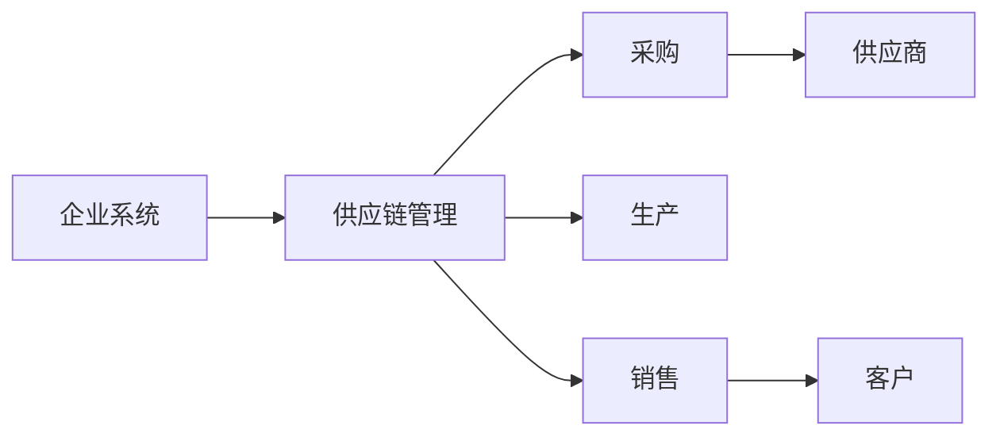
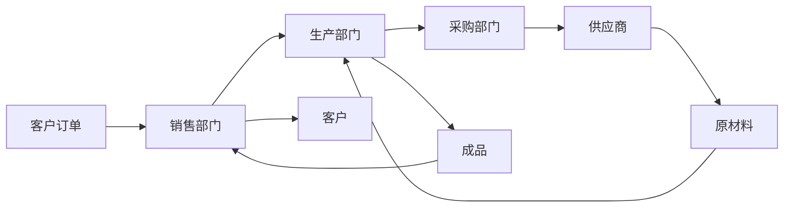
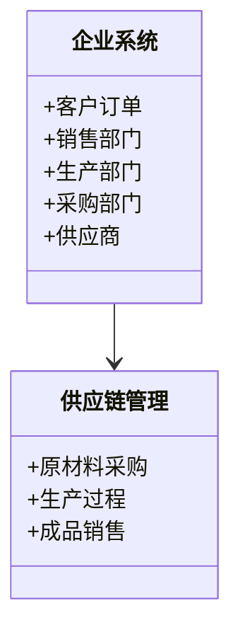
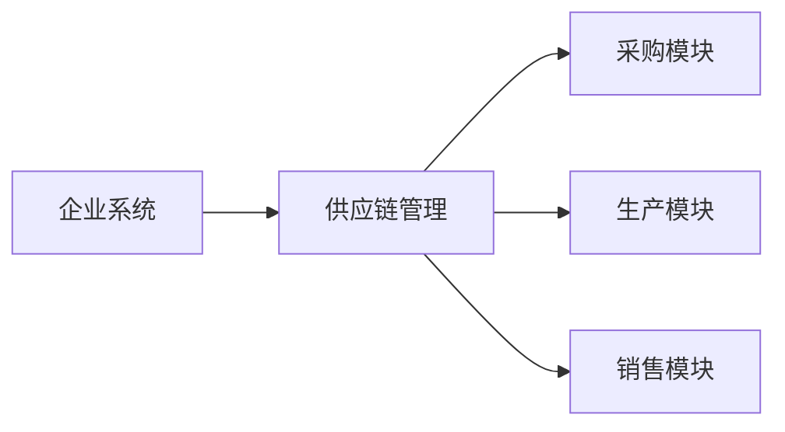

                 


# 如何评估企业的垂直整合价值

> 关键词：企业整合，垂直整合，供应链管理，价值评估，系统架构，成本优化

> 摘要：本文详细探讨了如何评估企业的垂直整合价值，从概念到实践，结合实际案例和系统架构设计，分析了垂直整合的优势、挑战及评估方法。通过系统化的分析和方法论的介绍，为读者提供了全面的评估框架。

---

## 第一部分：垂直整合的背景与概念

### 第1章：垂直整合的定义与背景

#### 1.1 垂直整合的定义与背景

垂直整合是指企业通过整合其上游供应商和下游客户的资源，将整个价值链从原材料采购、生产制造、分销到最终客户服务等环节，全部纳入企业内部管理的模式。这种整合方式可以帮助企业更好地控制成本、优化流程、提高效率和市场响应能力。

##### 1.1.1 垂直整合的核心概念

- **前向整合**：企业整合下游渠道，如分销商、零售商或客户，直接面对终端市场。
- **后向整合**：企业整合上游供应商，直接控制原材料采购和生产过程。
- **横向整合**：在同一生产阶段整合资源，扩大生产规模或覆盖范围。

##### 1.1.2 垂直整合的背景与重要性

- **全球化竞争加剧**：企业需要快速响应市场需求，降低供应链风险。
- **技术进步推动**：信息化和数字化技术为企业整合提供了新的可能性。
- **成本压力**：通过整合供应链，企业可以降低采购成本和生产成本。

#### 1.2 垂直整合的优势与挑战

##### 1.2.1 优势

- **成本优化**：通过内部化采购和生产，减少中间环节，降低成本。
- **效率提升**：垂直整合可以减少外部协作的复杂性，提高整体效率。
- **控制力增强**：企业可以更好地控制产品质量和服务水平。

##### 1.2.2 挑战

- **初期投资大**：整合上下游需要大量的资金投入。
- **管理复杂性**：跨环节的管理需要更高的协调能力和资源分配效率。
- **市场风险**：垂直整合可能导致企业过度依赖内部资源，影响灵活性。

#### 1.3 垂直整合的应用场景

##### 1.3.1 制造业中的垂直整合

- 例如，汽车制造商整合零部件供应商和经销商，形成完整的生产链。

##### 1.3.2 服务业中的垂直整合

- 例如，物流公司整合运输工具和仓储资源，形成完整的物流链。

##### 1.3.3 零售业中的垂直整合

- 例如，零售企业整合供应链，从采购到销售全部自营。

---

### 第2章：垂直整合的价值链分析

#### 2.1 企业价值链的构成

企业价值链包括以下几个关键环节：

- **原材料采购**：获取生产所需的基本材料。
- **生产过程**：将原材料转化为最终产品。
- **分销与销售**：将产品送达客户手中。
- **客户服务**：提供售后支持和服务。

#### 2.2 垂直整合对价值链的影响

##### 2.2.1 价值链的优化

通过垂直整合，企业可以优化每个环节的效率，减少浪费，提高整体竞争力。

##### 2.2.2 价值链的延伸

企业可以通过整合上下游资源，延长价值链，形成闭环生态。

#### 2.3 垂直整合与企业竞争力

##### 2.3.1 垂直整合对企业竞争力的提升

- 提高市场响应速度。
- 增强成本控制能力。
- 提升产品质量和服务水平。

##### 2.3.2 垂直整合与市场响应速度

通过垂直整合，企业可以更快速地调整生产和销售策略，更好地适应市场变化。

---

## 第二部分：垂直整合的价值评估方法

### 第3章：垂直整合的价值评估模型

#### 3.1 垂直整合的经济效益分析

##### 3.1.1 成本节约分析

- 通过内部化采购和生产，减少外部采购成本和管理费用。

##### 3.1.2 效益提升分析

- 通过优化生产流程，提高生产效率和产品质量。

#### 3.2 垂直整合的市场价值分析

##### 3.2.1 市场竞争力分析

- 通过整合上下游资源，增强企业的市场地位和竞争力。

##### 3.2.2 市场风险分析

- 垂直整合可能导致企业对单一市场依赖度过高，增加市场风险。

#### 3.3 垂直整合的长期价值评估

##### 3.3.1 投资回报周期分析

- 垂直整合需要长期投入，但可以通过规模效应和成本节约逐步实现回报。

##### 3.3.2 资产增值分析

- 通过垂直整合，企业可以实现资产的优化配置和价值提升。

#### 3.4 垂直整合的价值评估模型

##### 3.4.1 净现值法（Net Present Value, NPV）

使用净现值法评估垂直整合项目的经济效益：

$$ NPV = \sum_{t=0}^{n} \frac{C_t}{(1+r)^t} $$

其中，\( C_t \) 是第 \( t \) 年的现金流，\( r \) 是折现率。

##### 3.4.2 投资回收期法（Payback Period）

通过计算投资回收期来评估垂直整合项目的可行性：

$$ \text{投资回收期} = \frac{\text{初始投资}}{\text{年均净现金流}} $$

---

### 第4章：垂直整合的评估指标与方法

#### 4.1 垂直整合的财务指标

##### 4.1.1 净利润增长率

$$ \text{净利润增长率} = \frac{\text{整合后的净利润} - \text{整合前的净利润}}{\text{整合前的净利润}} \times 100\% $$

##### 4.1.2 投资回报率（ROI）

$$ ROI = \frac{\text{净收益}}{\text{初始投资}} \times 100\% $$

##### 4.1.3 成本节约率

$$ \text{成本节约率} = \frac{\text{整合前成本} - \text{整合后成本}}{\text{整合前成本}} \times 100\% $$

#### 4.2 垂直整合的非财务指标

##### 4.2.1 市场份额

- 通过垂直整合，企业可以更好地控制市场，提高市场份额。

##### 4.2.2 客户满意度

- 垂直整合可以提高客户服务质量，增强客户满意度。

##### 4.2.3 供应链稳定性

- 垂直整合可以减少供应链中断的风险，提高供应链稳定性。

#### 4.3 垂直整合的综合评估方法

##### 4.3.1 加权评分法

根据各项指标的重要性进行加权评分，得出综合评估结果。

##### 4.3.2 战略契合度分析

分析垂直整合是否符合企业长期发展战略。

##### 4.3.3 情景分析法

通过情景分析，评估不同市场条件下垂直整合的可行性和价值。

---

## 第三部分：垂直整合的系统分析与架构设计

### 第5章：垂直整合的系统分析

#### 5.1 企业系统架构分析

##### 5.1.1 企业系统架构图



##### 5.1.2 企业业务流程图



#### 5.2 垂直整合的系统功能设计

##### 5.2.1 领域模型设计



##### 5.2.2 功能模块划分

- **采购模块**：管理原材料采购和供应商关系。
- **生产模块**：监控生产过程和产品质量。
- **销售模块**：管理销售订单和客户关系。
- **供应链模块**：优化供应链流程和资源分配。

#### 5.3 垂直整合的系统架构设计

##### 5.3.1 系统架构图



##### 5.3.2 模块交互图


---

### 第6章：垂直整合的系统接口与数据流

#### 6.1 系统接口设计

##### 6.1.1 API接口设计

- **采购模块API**：提供原材料采购数据接口。
- **生产模块API**：提供生产过程数据接口。
- **销售模块API**：提供销售订单数据接口。

##### 6.1.2 数据交换格式

- 使用JSON格式进行数据交换。

#### 6.2 数据流分析

##### 6.2.1 数据流向图


##### 6.2.2 数据处理流程

1. 采购模块接收原材料采购请求。
2. 生产模块处理原材料，生成成品。
3. 销售模块接收销售订单，完成销售流程。

---

## 第四部分：项目实战与总结

### 第7章：垂直整合的项目实战

#### 7.1 项目介绍

假设某制造企业计划整合其供应链，从原材料采购到生产再到销售，全部自营。

#### 7.2 需求分析

- 需要整合原材料供应商和下游分销商。
- 需要优化生产流程和供应链管理。

#### 7.3 系统设计

##### 7.3.1 系统功能设计

- **采购模块**：管理供应商和原材料采购。
- **生产模块**：监控生产过程和产品质量。
- **销售模块**：管理销售订单和客户关系。

##### 7.3.2 系统架构设计


#### 7.4 系统实现

##### 7.4.1 采购模块实现

```python
class Supplier:
    def __init__(self, name):
        self.name = name
        self.raw_materials = []

    def add_material(self, material):
        self.raw_materials.append(material)

class Procurement:
    def __init__(self):
        self.suppliers = []

    def add_supplier(self, supplier):
        self.suppliers.append(supplier)

    def采购材料(self):
        for supplier in self.suppliers:
            supplier.add_material("原材料")
```

##### 7.4.2 生产模块实现

```python
class Production:
    def __init__(self):
        self.raw_materials = []
        self成品 = []

    def生产(self):
        for material in self.raw_materials:
            self成品.append(material)
```

##### 7.4.3 销售模块实现

```python
class Sales:
    def __init__(self):
        self.orders = []

    def add_order(self, order):
        self.orders.append(order)

    def fulfill_order(self):
        for order in self.orders:
            print(f"完成订单：{order}")
```

#### 7.5 项目总结

通过垂直整合，企业实现了供应链的优化，提高了效率和成本节约，增强了市场竞争力。

---

## 第五部分：总结与展望

### 第8章：总结与展望

#### 8.1 总结

本文详细探讨了如何评估企业的垂直整合价值，从概念到实践，结合实际案例和系统架构设计，分析了垂直整合的优势、挑战及评估方法。通过系统化的分析和方法论的介绍，为读者提供了全面的评估框架。

#### 8.2 展望

随着技术的进步和全球化的深入，垂直整合将继续在企业中发挥重要作用。未来，企业可以通过数字化和智能化技术进一步优化垂直整合，提升竞争力和市场响应能力。

---

作者：AI天才研究院/AI Genius Institute & 禅与计算机程序设计艺术 /Zen And The Art of Computer Programming

---

### 注意事项与最佳实践 Tips

- **数据安全**：在垂直整合过程中，企业需要确保数据的安全性和隐私性。
- **风险管理**：企业应制定有效的风险管理策略，以应对垂直整合中的潜在风险。
- **灵活性**：在垂直整合过程中，企业需要保持一定的灵活性，以适应市场变化。

---

### 小结

通过本文的系统分析和方法论介绍，读者可以全面了解如何评估企业的垂直整合价值，并在实际项目中应用这些方法和技巧。垂直整合不仅是企业优化供应链的重要手段，也是提升企业竞争力的关键策略。

---

### 拓展阅读

- 建议读者进一步阅读《企业供应链管理》和《垂直整合战略》等相关书籍，以深入了解垂直整合的理论与实践。

---

### 结语

垂直整合是企业优化供应链、降低成本、提高效率的重要手段。通过科学的评估和系统的实施，企业可以更好地实现垂直整合，增强市场竞争力，应对全球化挑战。

