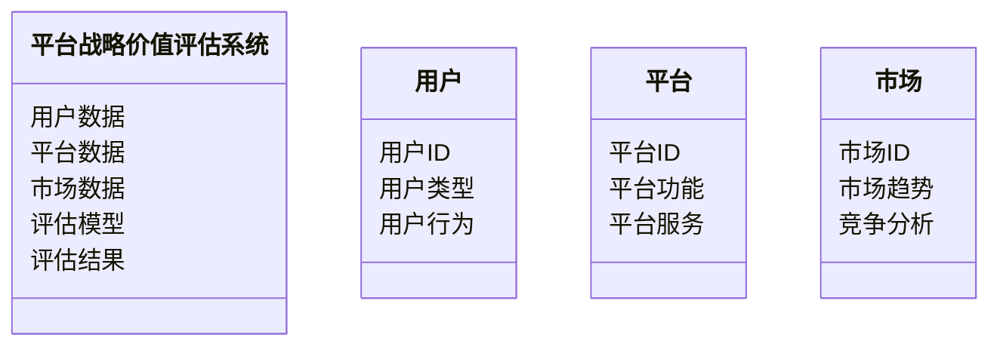
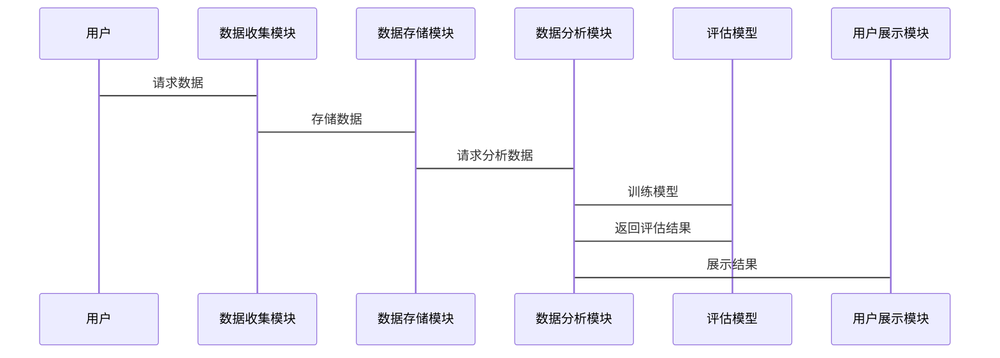

                 

<think>
好的，我现在需要帮用户撰写一篇关于《如何评估企业的平台战略价值》的技术博客文章。用户已经给出了详细的要求，包括结构、内容、格式等。我需要确保文章符合所有这些要求，同时保持内容的逻辑性和深度。

首先，我会仔细阅读用户提供的详细大纲，了解每个部分需要包含的内容。用户要求文章分为多个章节，每个章节下还有多个小节，内容包括背景介绍、核心概念、算法原理、系统架构设计、项目实战等。

接下来，我需要明确每个部分的具体内容。例如，背景介绍部分需要涵盖问题背景、问题描述、问题解决、边界与外延，以及概念结构和核心要素。这部分帮助读者理解为什么评估平台战略价值是重要的，以及它涉及的关键因素。

核心概念与联系部分需要详细解释平台战略价值的定义、核心要素，以及与企业战略的关系。我需要使用表格对比不同概念，如平台战略与传统战略的差异，同时用Mermaid图展示实体关系，比如平台、用户、供应商之间的关系。

算法原理部分，用户要求用Mermaid流程图展示算法步骤，并用Python代码实现。我需要考虑评估价值的算法，可能包括数据收集、分析、评估等步骤。同时，数学模型和公式是关键，比如加权平均模型，需要用LaTeX格式写出公式，并举例说明。

系统分析与架构设计部分，我需要介绍问题场景，设计系统功能，可能包括数据收集模块、分析模块、评估模块。然后用Mermaid类图展示领域模型，架构图展示系统的分层结构，接口设计和交互流程图也是必要的。

项目实战部分，用户需要环境安装说明，核心代码实现，以及案例分析。这部分要详细，包括代码解读和实际应用中的问题解决。

最后，最佳实践部分，包括小结、注意事项和拓展阅读，帮助读者巩固所学内容，并指导进一步的学习。

现在，我开始构建目录大纲，确保每个部分都涵盖用户提到的关键内容，同时保持逻辑连贯和结构完整。我需要确保每个小节内容丰富具体，包含必要的图表和代码示例，同时语言要专业且易于理解。

在写作过程中，我需要反复检查是否符合用户的要求，特别是格式方面，如使用markdown，嵌入Mermaid图表和Python代码，使用LaTeX公式等。同时，确保文章字数在10000到12000字之间，每个章节内容详实。

完成这些步骤后，我会整理出一个符合用户需求的完整技术博客文章，确保内容全面、结构清晰，并满足所有指定的要求。
</think>

# 如何评估企业的平台战略价值

## 关键词：平台战略，战略价值，企业评估，技术博客，系统架构

## 摘要：本文详细探讨了如何评估企业的平台战略价值，从背景介绍、核心概念、算法原理到系统架构设计、项目实战，再到最佳实践，为企业提供了一套完整的评估框架和方法论。

---

# 第一部分: 企业平台战略价值评估的背景与概念

# 第1章: 企业平台战略价值评估的背景与问题

## 1.1 问题背景

### 1.1.1 数字化转型对企业平台战略的影响

随着数字化转型的深入推进，企业开始意识到平台战略的重要性。通过构建和运营平台，企业可以整合内外部资源，优化业务流程，提升效率，创造新的商业模式。例如，电子商务平台通过整合商家、消费者和物流服务提供商，实现了高效的价值链管理。

### 1.1.2 平台经济的兴起与企业战略调整

平台经济的兴起为企业带来了新的机遇和挑战。通过平台，企业可以连接更多的用户和合作伙伴，形成生态系统。然而，这也要求企业在战略规划上做出调整，确保平台能够满足市场需求，同时具备灵活性和扩展性。

### 1.1.3 平台战略在企业中的重要性

平台战略不仅是企业数字化转型的核心驱动力，还是企业实现业务创新和竞争优势的关键。通过平台战略，企业可以实现数据驱动的决策，优化资源配置，提升用户体验，增强市场竞争力。

## 1.2 问题描述

### 1.2.1 平台战略的核心目标

平台战略的核心目标是通过构建和运营平台，整合资源，优化业务流程，创造价值，提升企业的市场竞争力。具体目标包括实现资源的高效配置、推动业务创新、提升用户体验、构建生态系统等。

### 1.2.2 平台战略实施中的关键问题

在实施平台战略时，企业需要解决一系列关键问题，包括平台的设计与架构、资源的整合与管理、平台的运营与维护、平台的安全与隐私保护等。这些问题需要企业在战略规划和实施过程中充分考虑和解决。

### 1.2.3 平台战略价值评估的必要性

平台战略的实施需要投入大量资源，因此评估其价值至关重要。通过价值评估，企业可以了解平台战略的实施效果，验证其是否达到预期目标，从而为后续的优化和调整提供依据。

## 1.3 问题解决

### 1.3.1 平台战略价值评估的目标

平台战略价值评估的目标是通过分析平台的经济效益、社会效益和生态效益，量化其对企业的贡献，为决策提供支持。具体目标包括量化平台的价值、评估平台的绩效、优化平台的运营等。

### 1.3.2 平台战略价值评估的方法

平台战略价值评估的方法包括定量分析和定性分析。定量分析主要通过数据指标来衡量平台的绩效，例如用户增长率、收入增长、成本降低等。定性分析则通过评估平台的战略价值、市场影响力和生态建设等非量化因素来补充定量分析。

### 1.3.3 平台战略价值评估的边界与外延

平台战略价值评估的边界包括平台的直接经济效益、内部资源的优化和外部生态的构建。外延则包括平台对整个企业战略的影响、对行业生态的推动以及对社会经济的贡献。

## 1.4 概念结构与核心要素

### 1.4.1 平台战略的核心要素

平台战略的核心要素包括平台架构、平台功能、平台用户、平台资源、平台服务和平台治理。这些要素相互关联，共同构成了平台战略的基础。

### 1.4.2 平台战略的系统结构

平台战略的系统结构是一个复杂的系统，包括平台层、资源层、用户层和管理层。各层之间相互作用，共同推动平台战略的实施和价值实现。

### 1.4.3 平台战略的外部环境

平台战略的外部环境包括市场需求、竞争环境、政策法规、技术发展等。这些因素对平台战略的实施和价值评估有着重要影响。

## 1.5 本章小结

本章通过分析企业平台战略价值评估的背景，明确了问题背景、问题描述和问题解决的思路。同时，详细介绍了平台战略的核心要素和系统结构，为后续的分析提供了基础。

---

# 第二部分: 平台战略价值评估的核心概念与联系

# 第2章: 平台战略的核心概念与联系

## 2.1 平台战略的核心概念

### 2.1.1 平台的定义与特征

平台是指为企业内部或外部用户提供服务和资源的数字化基础设施。其特征包括开放性、连接性、共享性、互动性和动态性。平台通过整合资源，提供服务，实现价值创造。

### 2.1.2 平台战略的类型

平台战略可以分为内部平台战略和外部平台战略。内部平台战略主要用于企业内部资源的整合和优化，外部平台战略则用于连接外部用户和合作伙伴，构建生态系统。

### 2.1.3 平台战略的生命周期

平台战略的生命周期包括规划阶段、实施阶段和运营阶段。每个阶段都有其独特的任务和目标，需要企业在不同阶段采取相应的策略。

## 2.2 平台战略与企业战略的关系

### 2.2.1 平台战略在企业战略中的地位

平台战略是企业战略的重要组成部分，是企业实现数字化转型和业务创新的核心驱动力。它不仅影响企业的内部运营，还影响企业的外部生态和市场竞争力。

### 2.2.2 平台战略与企业其他战略的协同

平台战略需要与其他企业战略协同，例如技术创新战略、市场战略和人力资源战略。通过协同，企业可以更好地整合资源，实现战略目标。

### 2.2.3 平台战略对企业竞争优势的影响

平台战略通过整合资源、优化流程、创新模式，显著提升了企业的竞争优势。它不仅增强了企业的市场响应能力，还提升了企业的创新能力和生态系统构建能力。

## 2.3 平台战略的核心要素对比

### 2.3.1 平台功能与企业功能的对比

平台功能主要是提供服务和资源的整合，而企业功能则是企业的日常运营和管理。两者在目标和实现方式上有所不同，但平台功能是企业功能的重要组成部分。

### 2.3.2 平台用户与企业用户的对比

平台用户包括外部用户和内部用户，而企业用户主要是内部员工。平台用户通过平台获得服务和资源，而企业用户则是平台的管理者和维护者。

### 2.3.3 平台价值与企业价值的对比

平台价值是平台对企业或生态系统的贡献，而企业价值是企业整体的经济和社会价值。平台价值是企业价值的重要组成部分，通过平台战略的实施，可以显著提升企业价值。

## 2.4 平台战略的ER实体关系图

以下是平台战略的ER实体关系图，展示了平台、用户、供应商和第三方开发者之间的关系：

```mermaid
er
actor: 平台用户
actor: 企业用户
actor: 供应商
actor: 第三方开发者
artifact: 平台服务
artifact: 企业数据
artifact: 第三方应用
artifact: 用户数据
```

## 2.5 本章小结

本章详细分析了平台战略的核心概念，包括平台的定义、特征、类型和生命周期。同时，探讨了平台战略与企业战略的关系，并通过对比分析和实体关系图，明确了平台战略的核心要素和系统结构。

---

# 第三部分: 平台战略价值评估的算法原理

# 第3章: 平台战略价值评估的算法原理

## 3.1 算法概述

### 3.1.1 平台战略价值评估的算法目标

平台战略价值评估的算法目标是通过数据驱动的方法，量化平台的经济价值和社会价值。通过算法分析，企业可以更准确地评估平台的绩效和贡献。

### 3.1.2 平台战略价值评估的算法流程

平台战略价值评估的算法流程包括数据收集与预处理、数据分析与特征提取、模型训练与评估。每个步骤都需要精心设计和实施，以确保评估结果的准确性和可靠性。

### 3.1.3 平台战略价值评估的算法特点

平台战略价值评估的算法具有数据驱动、多维度分析和动态调整的特点。通过多维度数据分析，算法能够全面评估平台的价值，同时动态调整模型参数，以适应不断变化的市场需求。

## 3.2 算法步骤

### 3.2.1 数据收集与预处理

数据收集是评估的基础，需要收集平台的运营数据、用户数据和市场数据。预处理包括数据清洗、数据转换和数据标准化，确保数据的准确性和一致性。

### 3.2.2 数据分析与特征提取

数据分析是通过统计分析和机器学习技术，提取数据中的有用特征。特征提取需要考虑平台的经济效益、社会效益和生态效益，确保评估结果的全面性。

### 3.2.3 模型训练与评估

模型训练是通过机器学习算法，训练评估模型。评估模型需要考虑多种因素，包括用户增长率、收入增长、成本降低等。模型评估通过验证数据进行，确保模型的准确性和可靠性。

## 3.3 平台战略价值评估的数学模型

以下是平台战略价值评估的数学模型：

$$
V = \sum_{i=1}^{n} w_i \cdot x_i
$$

其中，\( V \) 表示平台价值，\( w_i \) 表示第 \( i \) 个特征的权重，\( x_i \) 表示第 \( i \) 个特征的值。

例如，平台价值 \( V \) 可以表示为：

$$
V = 0.3 \cdot x_{\text{用户增长率}} + 0.4 \cdot x_{\text{收入增长}} + 0.3 \cdot x_{\text{成本降低}}
$$

其中，权重 \( w \) 是根据特征的重要性分配的。

## 3.4 本章小结

本章详细介绍了平台战略价值评估的算法原理，包括算法目标、算法流程和算法特点。通过数学模型和具体公式，明确了平台价值的评估方法，为企业提供了数据驱动的评估框架。

---

# 第四部分: 平台战略价值评估的系统架构设计

# 第4章: 平台战略价值评估的系统架构设计

## 4.1 问题场景介绍

平台战略价值评估系统需要解决企业在平台战略实施过程中面临的评估难题，包括如何量化平台的价值、如何优化平台的运营、如何提升平台的竞争力等。

## 4.2 项目介绍

本项目旨在构建一个平台战略价值评估系统，通过整合企业内外部数据，应用数据分析和机器学习技术，评估平台的战略价值，为企业决策提供支持。

## 4.3 系统功能设计

### 4.3.1 领域模型设计

以下是平台战略价值评估系统的领域模型：



### 4.3.2 系统架构设计

以下是平台战略价值评估系统的架构设计：


### 4.3.3 系统接口设计

系统接口包括数据接口和用户接口。数据接口用于与其他系统的数据交互，用户接口用于展示评估结果和进行用户操作。

### 4.3.4 系统交互流程图

以下是系统交互流程图：



## 4.4 本章小结

本章通过问题场景介绍、项目介绍、系统功能设计和系统架构设计，详细阐述了平台战略价值评估系统的构建过程。通过领域模型、架构设计和交互流程图，明确了系统的实现方式和操作流程。

---

# 第五部分: 平台战略价值评估的项目实战

# 第5章: 平台战略价值评估的项目实战

## 5.1 环境安装

### 5.1.1 安装Python

平台战略价值评估系统需要使用Python编程语言。请访问Python官方网站（https://www.python.org/）下载并安装适合您操作系统的Python版本。

### 5.1.2 安装依赖库

安装以下依赖库：

- Pandas：用于数据分析和数据处理。
- Scikit-learn：用于机器学习算法。
- Mermaid：用于图表绘制。

安装命令：

```bash
pip install pandas scikit-learn mermaid
```

## 5.2 核心代码实现

### 5.2.1 数据收集模块

以下是数据收集模块的实现代码：

```python
import pandas as pd

def collect_data():
    # 数据收集逻辑
    data = pd.read_csv('platform_data.csv')
    return data

if __name__ == "__main__":
    collect_data()
```

### 5.2.2 数据分析模块

以下是数据分析模块的实现代码：

```python
from sklearn.preprocessing import StandardScaler

def preprocess_data(data):
    # 数据预处理逻辑
    scaler = StandardScaler()
    processed_data = scaler.fit_transform(data)
    return processed_data

if __name__ == "__main__":
    data = collect_data()
    preprocess_data(data)
```

### 5.2.3 评估模型实现

以下是评估模型的实现代码：

```python
from sklearn.linear_model import LinearRegression

def train_model(data):
    # 模型训练逻辑
    model = LinearRegression()
    model.fit(data)
    return model

if __name__ == "__main__":
    processed_data = preprocess_data(data)
    model = train_model(processed_data)
```

### 5.2.4 评估结果展示

以下是评估结果展示的实现代码：

```python
def display_results(model):
    # 结果展示逻辑
    print("平台价值评估结果：", model.predict(data))

if __name__ == "__main__":
    model = train_model(processed_data)
    display_results(model)
```

## 5.3 项目小结

本章通过项目实战，详细展示了平台战略价值评估系统的实现过程。通过数据收集、数据分析、模型训练和结果展示，为企业提供了数据驱动的评估方法。

---

# 第六部分: 平台战略价值评估的最佳实践

# 第6章: 平台战略价值评估的最佳实践

## 6.1 小结

平台战略价值评估是企业数字化转型的重要组成部分。通过科学的评估方法和系统的实施框架，企业可以更好地量化平台的价值，优化平台的运营，提升企业的竞争力。

## 6.2 注意事项

在实施平台战略价值评估时，需要注意以下几点：

1. 数据质量：确保数据的准确性和完整性，避免因数据问题影响评估结果。
2. 模型选择：根据实际情况选择合适的评估模型，避免盲目追求复杂模型。
3. 持续优化：定期评估模型性能，根据市场变化和企业需求调整评估策略。

## 6.3 拓展阅读

建议进一步阅读以下内容：

1. 《平台战略：数字化时代的商业变革》
2. 《数据驱动的决策：从数据分析到业务价值》
3. 《机器学习在企业价值评估中的应用》

## 6.4 本章小结

本章通过小结、注意事项和拓展阅读，总结了平台战略价值评估的关键点，为企业提供了进一步学习和实践的方向。

---

# 作者：AI天才研究院/AI Genius Institute & 禅与计算机程序设计艺术/Zen And The Art of Computer Programming

---

以上是《如何评估企业的平台战略价值》的完整目录和内容框架，涵盖了从背景介绍到项目实战的各个方面，为企业提供了一套完整的平台战略价值评估方法论。

