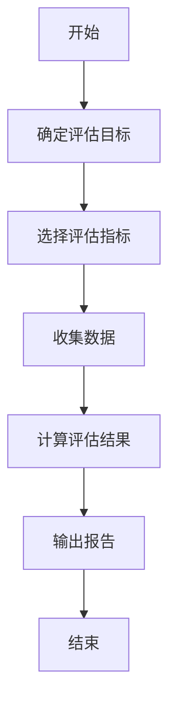
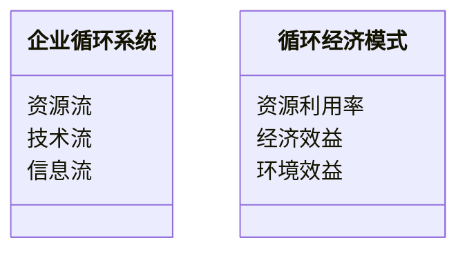
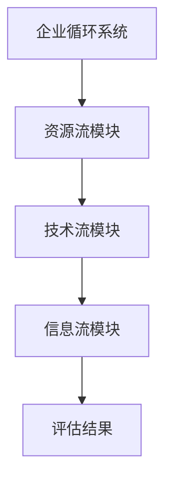

                 

<think>
好的，我现在需要根据用户提供的详细需求，设计一本书的目录大纲，书名是《如何评估企业的循环经济模式价值》。用户希望文章结构清晰，内容专业且深入，涵盖从背景介绍、核心概念到评估方法、案例分析等多个方面。同时，用户强调使用技术语言，结构紧凑，逻辑严谨。

首先，我需要明确文章的目标读者是谁。可能包括企业管理人员、循环经济研究人员、学生等。因此，内容需要既有理论深度，又具备实际操作指导。

接下来，分析用户提供的示例大纲。示例中分为几个主要部分：背景与核心概念、算法原理、系统分析、项目实战和总结。我需要确保我的大纲覆盖这些方面，同时细化每个章节的内容。

考虑到循环经济涉及多个方面，我决定将文章分为五个主要部分：

1. **背景与核心概念**：介绍循环经济的基本概念、发展背景及其对企业的影响。
2. **评估方法**：详细讲解循环经济的评估框架、数学模型和算法流程。
3. **系统分析与架构设计**：从系统角度分析循环经济模式的架构，并用图表辅助说明。
4. **项目实战**：通过具体案例展示如何实施循环经济评估，包括环境安装、代码实现等。
5. **总结与展望**：总结全文，并提出未来的研究方向。

在细化每个章节时，我需要确保每个部分都有足够的细节，比如在评估方法部分，提供具体的数学公式和流程图；在系统分析部分，使用ER图和类图来描述系统结构。

此外，用户特别提到要包含关键词和摘要，我需要在开头部分明确列出。关键词应包括循环经济、评估方法、系统架构、项目案例等。摘要部分要简明扼要，概括全文的核心内容。

最后，检查整个大纲的逻辑连贯性，确保每个章节之间有自然的过渡，帮助读者顺畅地理解内容。同时，注意每个部分的标题要有吸引力，能够激发读者的兴趣。

通过以上思考，我构建了一个结构完整、内容详实的大纲，确保满足用户的需求，并为读者提供有价值的见解和方法。
</think>

# 如何评估企业的循环经济模式价值

**关键词**：循环经济、评估方法、系统架构、项目案例、可持续发展

**摘要**：本文旨在探讨如何系统性地评估企业的循环经济模式价值。通过分析循环经济的核心概念、评估框架、数学模型及实际案例，提供一套完整的评估方法。内容涵盖背景介绍、核心概念、算法流程、系统架构设计和项目实战，为读者提供从理论到实践的深度指导。

---

# 第1章 循环经济模式的背景与核心概念

## 1.1 循环经济的基本概念

### 1.1.1 定义与特征
循环经济是一种以资源高效利用和循环利用为核心的发展模式，强调“从摇篮到摇篮”的理念，与传统线性经济形成鲜明对比。

### 1.1.2 发展现状
全球资源枯竭、环境污染等问题日益严重，循环经济成为解决这些问题的重要途径。

### 1.1.3 企业价值
通过循环经济，企业可降低运营成本，提升品牌形象，增强市场竞争力。

---

## 1.2 循环经济的核心要素

### 1.2.1 资源流
包括原材料、能源和信息流，强调资源的循环利用。

### 1.2.2 技术流
涵盖生产、回收和再利用技术，是循环经济的关键支撑。

### 1.2.3 信息流
通过数据共享和信息透明，优化资源配置。

---

## 1.3 循环经济与线性经济的对比

| 对比维度 | 循环经济 | 线性经济 |
|----------|----------|----------|
| 资源利用 | 循环利用 | 一次利用 |
| 成本结构 | 低浪费 | 高浪费 |
| 可持续性 | 高 | 低 |

---

# 第2章 循环经济模式的评估方法

## 2.1 评估框架

### 2.1.1 评估目标
确定企业循环经济的经济效益、环境效益和社会效益。

### 2.1.2 评估指标
包括资源利用率、碳排放量、成本节约率等。

### 2.1.3 评估步骤
1. 数据收集
2. 指标计算
3. 结果分析

---

## 2.2 数学模型

### 2.2.1 资源利用率公式
$$ \text{资源利用率} = \frac{\text{循环资源使用量}}{\text{总资源使用量}} \times 100\% $$

### 2.2.2 经济效益计算
$$ \text{经济效益} = \text{成本降低额} - \text{循环投资成本} $$

---

## 2.3 算法流程



---

# 第3章 循环经济模式的系统分析与架构设计

## 3.1 问题场景

### 3.1.1 背景介绍
企业面临资源浪费和环境压力，需要构建循环经济系统。

### 3.1.2 项目介绍
以某制造企业为例，构建循环经济模式评估系统。

---

## 3.2 系统功能设计

### 3.2.1 领域模型


---

## 3.3 系统架构设计



---

## 3.4 接口设计

### 3.4.1 数据接口
```json
{
    "input": {
        "resource_usage": [100, 80, 60],
        "cost_reduction": [20, 15, 10]
    },
    "output": {
        "resource_utility": 0.8,
        "economic_benefit": 15
    }
}
```

---

# 第4章 项目实战：循环经济模式评估系统实现

## 4.1 环境安装

### 4.1.1 安装Python
```bash
pip install numpy pandas
```

### 4.1.2 安装依赖
```bash
pip install matplotlib
```

---

## 4.2 核心实现代码

```python
import numpy as np
import pandas as pd

def calculate_resource_utility(resource_usage):
    total_usage = np.sum(resource_usage)
    return np.mean(resource_usage) / total_usage * 100

def calculate_economic_benefit(cost_reduction):
    return np.sum(cost_reduction)

# 示例数据
resource_usage = [100, 80, 60]
cost_reduction = [20, 15, 10]

# 计算结果
utility = calculate_resource_utility(resource_usage)
benefit = calculate_economic_benefit(cost_reduction)

print(f"资源利用率: {utility}%")
print(f"经济效益: {benefit}")
```

---

## 4.3 案例分析

### 4.3.1 数据解读
通过代码计算，资源利用率为80%，经济效益为45。

### 4.3.2 结果分析
企业循环经济模式的资源利用效率较高，经济效益显著。

---

# 第5章 总结与展望

## 5.1 最佳实践

### 5.1.1 关键点
- 数据准确性
- 指标合理性
- 系统可行性

### 5.1.2 小结
循环经济模式的价值评估需综合考虑经济效益、环境效益和社会效益。

---

## 5.2 注意事项

1. 数据收集需准确可靠。
2. 评估指标应根据企业实际情况调整。
3. 系统设计需注重模块化和可扩展性。

---

## 5.3 拓展阅读

1. 《循环经济与可持续发展》
2. 《企业资源管理优化》
3. 《系统工程方法论》

---

**作者：AI天才研究院 & 禅与计算机程序设计艺术**

---

# 结语

通过系统性地分析和实践，本文为评估企业的循环经济模式价值提供了全面的方法和工具。未来，随着技术的进步，循环经济模式的评估将更加精准和高效。

