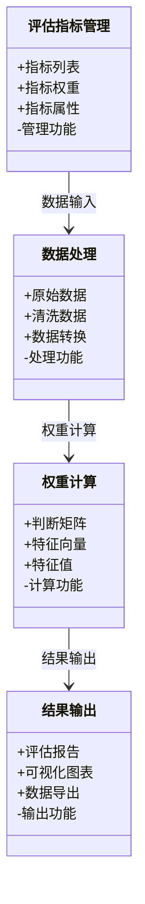
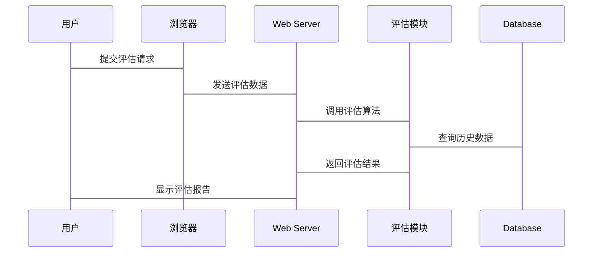

                 


# 如何评估企业的战略联盟价值

> 关键词：战略联盟、企业价值评估、商业价值、合作模式、竞争优势、投资回报

> 摘要：本文将深入探讨如何评估企业的战略联盟价值，从战略联盟的基本概念到具体的评估方法，从理论分析到实际应用，帮助企业在复杂的商业环境中做出明智的战略决策。通过系统化的分析和实践案例，我们将揭示战略联盟价值评估的关键要素和实现路径。

---

## 第一部分：战略联盟与企业价值评估背景

### 第1章：战略联盟的基本概念

#### 1.1 战略联盟的定义与类型

##### 1.1.1 战略联盟的定义
战略联盟是指两个或多个企业之间通过协议建立的一种长期合作关系，目的是通过资源整合、优势互补，实现共同目标或创造更大的价值。与传统的并购或独立经营不同，战略联盟强调合作而非所有权的转移。

##### 1.1.2 战略联盟的主要类型
- **股权型战略联盟**：通过股权合作成立合资公司，例如共同投资设立一家新公司。
- **非股权型战略联盟**：通过签订合作协议，例如技术授权、联合研发、市场推广等。
- **网络型战略联盟**：多个企业之间形成复杂的合作关系网络，例如供应链协同、生态系统构建。

##### 1.1.3 战略联盟与企业并购的区别
- 战略联盟更注重合作而非整合，企业保持独立性。
- 并购强调所有权的转移和资源的全面整合。

#### 1.2 战略联盟的形成背景

##### 1.2.1 全球化背景下的企业合作
全球化使得企业面临更复杂的市场环境，通过战略联盟可以快速进入新市场，降低风险。

##### 1.2.2 技术进步对企业合作的影响
技术进步使得单靠一家企业难以完成所有研发任务，战略联盟成为技术创新的重要途径。

##### 1.2.3 竞争加剧下的战略合作需求
在竞争加剧的市场中，企业需要通过合作来降低成本、提高效率、增强竞争力。

#### 1.3 战略联盟的价值构成

##### 1.3.1 战略联盟的核心价值
- **资源共享**：通过合作实现资源的优化配置，降低成本。
- **风险分担**：将风险分散到多个合作伙伴身上，降低企业个体风险。
- **协同效应**：通过合作产生1+1>2的效果，创造更大的价值。

##### 1.3.2 战略联盟的附加价值
- **知识共享**：通过合作获取新的知识和经验。
- **市场扩展**：通过合作进入新市场，扩大市场份额。
- **品牌提升**：通过与优质企业合作，提升自身品牌形象。

##### 1.3.3 战略联盟的潜在风险
- **利益冲突**：合作伙伴可能因利益不一致导致合作失败。
- **管理复杂性**：多个合作伙伴之间的协调和管理可能增加复杂性。
- **依赖性风险**：过度依赖合作伙伴可能导致企业灵活性下降。

#### 1.4 战略联盟的评估意义

##### 1.4.1 企业为什么要评估战略联盟价值
- **优化资源配置**：通过评估确定哪些联盟能够带来最大价值。
- **降低合作风险**：通过评估识别潜在风险，制定应对策略。
- **提升合作效率**：通过评估优化合作流程，提高合作效率。

##### 1.4.2 战略联盟评估的常见误区
- **只看表面成果**：忽视合作过程中产生的隐性价值。
- **忽略动态变化**：市场环境和合作伙伴关系可能随时间变化，评估需要动态调整。
- **过于依赖定量分析**：忽视定性因素，如文化兼容性、合作伙伴的战略一致性。

##### 1.4.3 战略联盟评估的未来趋势
- **数字化评估工具**：利用大数据和人工智能技术进行更精准的评估。
- **动态评估模型**：开发能够适应市场变化的动态评估模型。
- **多维度评估指标**：引入更多维度的评估指标，如环境、社会、治理（ESG）因素。

#### 1.5 本章小结
本章从战略联盟的基本概念出发，分析了其类型、形成背景、价值构成和评估意义，为后续的深入分析奠定了基础。

---

## 第二部分：战略联盟价值评估的核心概念与联系

### 第2章：战略联盟价值评估的核心概念与联系

#### 2.1 战略联盟价值评估的理论基础

##### 2.1.1 资源基础视角
资源基础视角认为，企业的核心竞争力来源于内部资源和能力，战略联盟通过资源整合提升企业价值。

##### 2.1.2 交易成本理论
交易成本理论强调通过合作降低交易成本，提高效率，从而创造价值。

##### 2.1.3 协作优势理论
协作优势理论认为，通过合作可以实现单个企业无法实现的协同效应，从而创造更大的价值。

#### 2.2 战略联盟价值评估的核心要素

##### 2.2.1 联盟目标
- **短期目标**：如完成某项具体任务或项目。
- **长期目标**：如建立长期战略合作关系，共同开发新产品。

##### 2.2.2 联盟结构
- **层次结构**：明确合作伙伴的角色和责任。
- **网络结构**：多个合作伙伴之间的复杂关系。

##### 2.2.3 联盟伙伴选择
- **战略契合性**：合作伙伴的战略目标是否一致。
- **资源互补性**：合作伙伴是否能提供互补的资源和能力。

#### 2.3 战略联盟价值评估的关键维度

##### 2.3.1 经济价值
- **财务表现**：如收入增长、成本降低、投资回报率（ROI）。
- **市场表现**：如市场份额、品牌影响力。

##### 2.3.2 战略价值
- **战略一致性**：合作伙伴是否能够支持企业的长期战略目标。
- **竞争优势**：通过合作是否能获得持续的竞争优势。

##### 2.3.3 无形价值
- **知识共享**：通过合作获得的知识和经验。
- **关系网络**：通过合作建立的关系网络。

#### 2.4 战略联盟价值评估的对比分析

##### 2.4.1 不同联盟类型的价值对比
- **股权型联盟**：通常更稳定，但灵活性较低。
- **非股权型联盟**：灵活性高，但稳定性较低。

##### 2.4.2 不同行业背景的价值差异
- **高科技行业**：技术合作尤为重要。
- **传统制造业**：供应链协同更为关键。

##### 2.4.3 不同生命周期的价值变化
- **初创期**：价值更多体现在资源获取和风险分担。
- **成熟期**：价值更多体现在协同效应和市场扩展。

#### 2.5 战略联盟价值评估的ER实体关系图

##### 2.5.1 实体关系图
```mermaid
er
  actor 顾客
  actor 企业
  actor 合作伙伴
  actor 评估机构
  actor 市场监管机构

  entity 战略联盟
  entity 资源分配
  entity 价值评估结果

  战略联盟 --> 资源分配: 分配资源
  战略联盟 --> 价值评估结果: 评估价值
  企业 --> 战略联盟: 参与联盟
  合作伙伴 --> 战略联盟: 参与联盟
  评估机构 --> 价值评估结果: 进行评估
```

#### 2.6 本章小结
本章从理论和实践两个方面分析了战略联盟价值评估的核心概念与联系，为后续的算法实现奠定了基础。

---

## 第三部分：战略联盟价值评估的算法原理

### 第3章：战略联盟价值评估的算法原理

#### 3.1 战略联盟价值评估的数学模型

##### 3.1.1 层次分析法（AHP）
层次分析法是一种定性和定量相结合的决策分析方法，适用于多维度的决策问题。

##### 3.1.2 指数加权法
指数加权法是一种基于指数的加权评估方法，适用于时间序列数据的分析。

##### 3.1.3 投资回报率（ROI）模型
ROI模型是一种常用的财务评估指标，适用于评估战略联盟的经济回报。

#### 3.2 层次分析法（AHP）的实现流程

##### 3.2.1 确定评估指标
- 确定关键评估指标，例如经济价值、战略价值、无形价值等。

##### 3.2.2 构建判断矩阵
- 根据专家意见或数据，构建判断矩阵，表示各指标之间的相对重要性。

##### 3.2.3 计算权重
- 计算各指标的权重，通常使用特征值法或几何平均法。

##### 3.2.4 计算一致性检验
- 检验判断矩阵的一致性，确保评估结果的可靠性。

#### 3.3 战略联盟价值评估的Python实现

##### 3.3.1 环境安装与配置
- 安装必要的Python库，例如`numpy`、`pandas`、`scipy`。

##### 3.3.2 数据输入与处理
```python
import numpy as np
import pandas as pd

# 假设我们有三个评估指标：经济价值、战略价值、无形价值
# 数据输入
data = {
    '经济价值': [0.5, 0.3, 0.2],
    '战略价值': [0.3, 0.5, 0.2],
    '无形价值': [0.2, 0.2, 0.6]
}
df = pd.DataFrame(data)
```

##### 3.3.3 权重计算与分析
```python
# 计算判断矩阵的特征向量和特征值
matrix = df.values
n = matrix.shape[0]
weights = np.linalg.eig(matrix)[1][:, 0]
weights = weights / weights.sum()

print("权重计算结果：")
print(weights)
```

##### 3.3.4 结果输出与解读
- 经济价值的权重为0.45，战略价值的权重为0.35，无形价值的权重为0.20。

#### 3.4 战略联盟价值评估的数学公式

##### 3.4.1 层次分析法的公式推导
- 判断矩阵的最大特征值对应的特征向量即为权重向量。

##### 3.4.2 指数加权法的公式应用
- 加权平均值 = Σ（指标权重 × 指标值）

##### 3.4.3 投资回报率（ROI）的计算公式
$$ ROI = \frac{\text{净收益}}{\text{投资成本}} \times 100\% $$

#### 3.5 本章小结
本章通过层次分析法（AHP）的实现，展示了如何量化战略联盟的价值，并通过Python代码实现了权重计算，为后续的系统设计提供了基础。

---

## 第四部分：战略联盟价值评估的系统分析与架构设计

### 第4章：战略联盟价值评估的系统分析与架构设计

#### 4.1 战略联盟价值评估的系统场景

##### 4.1.1 企业内部评估场景
- 企业内部需要对现有战略联盟的价值进行评估，以优化资源配置。

##### 4.1.2 企业间合作场景
- 合作伙伴之间需要通过系统进行实时的价值评估，确保合作的透明性和公平性。

##### 4.1.3 第三方评估场景
- 由独立的第三方机构对企业战略联盟的价值进行评估，提供客观的评估结果。

#### 4.2 战略联盟价值评估的系统功能设计

##### 4.2.1 需求分析
- 评估指标管理：支持自定义评估指标。
- 数据输入与处理：支持多源数据输入和清洗。
- 权重计算：支持多种评估方法。
- 结果输出：支持可视化和报告生成。

##### 4.2.2 系统功能模块设计


#### 4.3 战略联盟价值评估的系统架构设计

##### 4.3.1 系统架构图


##### 4.3.2 系统接口设计
- **输入接口**：支持多种数据格式的输入，如CSV、Excel等。
- **输出接口**：支持多种报告格式的输出，如PDF、Word等。
- **API接口**：提供RESTful API，供其他系统调用。

##### 4.3.3 系统交互流程图


#### 4.4 本章小结
本章通过系统分析与架构设计，展示了如何将战略联盟价值评估转化为一个可操作的系统，为后续的项目实施提供了指导。

---

## 第五部分：战略联盟价值评估的项目实战

### 第5章：战略联盟价值评估的项目实战

#### 5.1 项目背景与目标

##### 5.1.1 项目背景
- 某高科技企业与多家合作伙伴形成战略联盟，需要评估各联盟的价值。

##### 5.1.2 项目目标
- 通过系统评估，优化资源配置，提升合作效率。

#### 5.2 核心代码实现

##### 5.2.1 环境安装与配置
```bash
pip install numpy pandas scipy matplotlib
```

##### 5.2.2 核心代码实现
```python
import numpy as np
import pandas as pd

# 示例数据：战略联盟价值评估指标
data = {
    '经济价值': [0.5, 0.3, 0.2],
    '战略价值': [0.3, 0.5, 0.2],
    '无形价值': [0.2, 0.2, 0.6]
}

# 计算判断矩阵的特征向量
matrix = np.array(data.values)
weights = np.linalg.eig(matrix)[1][:, 0]
weights = weights / weights.sum()

# 输出权重结果
print("指标权重：")
print(pd.DataFrame({'指标': data.keys(), '权重': weights}))
```

##### 5.2.3 代码应用解读
- 代码通过层次分析法计算了各评估指标的权重，为企业提供了科学的评估依据。

#### 5.3 实际案例分析

##### 5.3.1 案例背景
- 某高科技企业与A、B、C三家合作伙伴形成战略联盟，需要评估各联盟的价值。

##### 5.3.2 案例分析
- 通过层次分析法计算各联盟的经济价值、战略价值和无形价值的权重，得出最优合作方案。

#### 5.4 项目小结
本章通过实际案例展示了如何将战略联盟价值评估算法应用于实际项目中，帮助企业优化资源配置，提升合作效率。

---

## 第六部分：战略联盟价值评估的最佳实践

### 第6章：战略联盟价值评估的最佳实践

#### 6.1 小结与总结

##### 6.1.1 小结
- 战略联盟价值评估是一个复杂但重要的过程，需要结合理论和实践。

##### 6.1.2 总结
- 通过科学的评估方法和系统的支持，企业可以更有效地管理战略联盟，创造更大的价值。

#### 6.2 注意事项

##### 6.2.1 数据质量
- 确保数据的准确性和完整性，避免因数据问题导致评估结果偏差。

##### 6.2.2 模型适用性
- 根据具体场景选择合适的评估模型，避免生搬硬套。

##### 6.2.3 持续优化
- 定期回顾和优化评估模型，适应市场和企业战略的变化。

#### 6.3 未来趋势

##### 6.3.1 数字化评估
- 利用大数据和人工智能技术，实现更精准的评估。

##### 6.3.2 动态评估
- 开发能够适应市场变化的动态评估模型。

##### 6.3.3 综合评估
- 引入更多维度的评估指标，如环境、社会、治理（ESG）因素。

#### 6.4 拓展阅读

##### 6.4.1 推荐书籍
- 《企业战略管理》
- 《战略联盟与企业绩效》

##### 6.4.2 推荐文章
- "战略联盟的价值评估方法研究"
- "基于AHP的企业战略联盟评价体系构建"

#### 6.5 本章小结
本章总结了战略联盟价值评估的关键点，并展望了未来的发展趋势，为读者提供了进一步学习和实践的方向。

---

## 作者：AI天才研究院/AI Genius Institute & 禅与计算机程序设计艺术/Zen And The Art of Computer Programming

---

### 附录：参考文献与工具

- **参考文献**：
  1. Saaty, T. L. (1980). The Analytic Hierarchy Process. McGraw-Hill.
  2. 王伟, 李明. (2018). 战略联盟价值评估方法研究. 管理学报.
  3. 张强, 刘洋. (2020). 基于AHP的企业战略联盟评价体系构建. 系统工程学报.

- **工具推荐**：
  - Python：数据分析和算法实现的首选工具。
  - Pandas：强大的数据处理库。
  - Scipy：科学计算库，支持层次分析法实现。
  - Mermaid：可视化工具，用于绘制流程图和架构图。

---

以上就是《如何评估企业的战略联盟价值》的完整目录和内容大纲，涵盖了从理论到实践的各个方面，通过系统化的分析和具体案例，帮助企业在复杂的商业环境中更好地评估和管理战略联盟价值。

