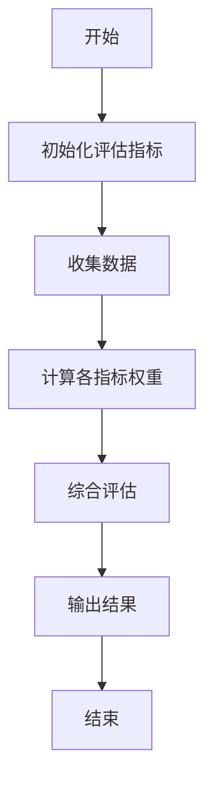
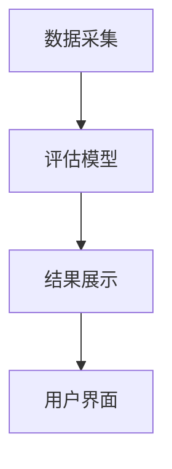

                 


```markdown
# 如何评估企业的敏捷管理能力价值

## 关键词：企业敏捷管理，能力评估，管理价值，敏捷团队，敏捷文化

## 摘要：  
本文从企业敏捷管理能力的评估角度出发，详细探讨了敏捷管理的核心概念、评估方法、算法原理、系统架构设计以及实际案例分析。通过分析敏捷管理的背景、关键要素和评估模型，结合具体的代码实现和图表设计，为读者提供了一个全面的视角来理解如何评估和提升企业的敏捷管理能力。

---

# 第一部分: 企业敏捷管理能力评估背景与基础

# 第1章: 敏捷管理能力评估的背景与意义

## 1.1 敏捷管理的起源与发展

### 1.1.1 敏捷管理的定义与核心理念  
敏捷管理是一种以迭代、增量和协作为核心理念的管理方法，强调快速响应变化和持续交付价值。其核心理念包括客户合作、响应变化、个体互动和交付可用的软件。

### 1.1.2 敏捷管理与传统管理的区别  
- **目标**：传统管理注重计划和控制，而敏捷管理注重快速响应和持续改进。  
- **过程**：传统管理强调严格的流程和层级结构，而敏捷管理强调灵活性和跨职能协作。  
- **交付方式**：传统管理倾向于一次性交付，而敏捷管理强调迭代交付和持续反馈。

### 1.1.3 敏捷管理在现代企业中的重要性  
随着市场竞争的加剧和客户需求的变化，敏捷管理帮助企业更快地适应变化、提高效率和客户满意度。特别是在数字化转型中，敏捷管理已成为企业生存和发展的关键能力。

## 1.2 企业敏捷管理能力评估的必要性

### 1.2.1 当今企业面临的挑战  
- 市场变化快，企业需要快速响应客户需求。  
- 团队协作效率低下，导致项目进度拖延。  
- 传统管理方法难以应对复杂多变的环境。  

### 1.2.2 敏捷管理能力对企业价值的影响  
- 提高团队协作效率，缩短交付周期。  
- 增强企业的灵活性和应对变化的能力。  
- 提高客户满意度和企业竞争力。

### 1.2.3 评估敏捷管理能力的现实意义  
通过评估敏捷管理能力，企业可以识别自身的不足，优化管理流程，提升整体竞争力。

## 1.3 敏捷管理能力评估的范围与边界

### 1.3.1 敏捷管理能力的构成要素  
- **团队协作能力**：团队成员之间的沟通与合作效率。  
- **敏捷文化**：组织中是否具备敏捷的价值观和思维方式。  
- **管理流程**：是否采用敏捷方法论（如Scrum、Kanban）以及流程的优化程度。  

### 1.3.2 评估范围的界定  
- 团队层面：评估单个团队的敏捷能力。  
- 部门层面：评估部门整体的敏捷管理能力。  
- 企业层面：评估整个企业的敏捷管理能力。  

### 1.3.3 与其他管理能力的关联性  
- 与企业战略目标的关联性。  
- 与技术创新能力的关联性。  
- 与组织文化转型的关联性。  

## 1.4 本章小结  
本章从敏捷管理的起源、核心理念以及与传统管理的区别入手，详细分析了敏捷管理在现代企业中的重要性，并探讨了评估敏捷管理能力的必要性及其范围界定。通过本章的分析，读者可以理解敏捷管理能力评估的基本框架和意义。

---

# 第2章: 敏捷管理能力的核心概念与联系

## 2.1 敏捷管理能力的核心要素

### 2.1.1 敏捷组织架构  
- **扁平化结构**：减少层级，促进跨部门协作。  
- **自组织团队**：团队具备自我管理能力，减少对外部指令的依赖。  
- **跨职能团队**：团队成员具备多种技能，能够独立完成项目。  

### 2.1.2 敏捷文化与价值观  
- **客户至上**：始终以客户需求为导向。  
- **持续改进**：通过 retrospectives 持续优化流程和方法。  
- **透明沟通**：信息对称，减少误解和冲突。  

### 2.1.3 敏捷团队协作模式  
- **Scrum 模式**：通过迭代（Sprint）交付增量价值。  
- **Kanban 模式**：通过可视化流程实现持续交付。  
- **混合模式**：结合 Scrum 和 Kanban 的优点，灵活调整流程。  

## 2.2 敏捷管理能力的属性特征对比

### 2.2.1 灵活性 vs 稳定性  
- **灵活性**：敏捷管理强调快速响应变化，能够根据需求调整计划。  
- **稳定性**：传统管理强调计划的严格执行和流程的稳定性。  

### 2.2.2 反应速度 vs 计划性  
- **反应速度**：敏捷管理通过持续交付和反馈快速响应需求变化。  
- **计划性**：传统管理强调详细的计划和按计划执行。  

### 2.2.3 创新能力 vs 标准化  
- **创新能力**：敏捷管理鼓励创新和实验，快速验证想法。  
- **标准化**：传统管理强调标准化流程和规范，减少不确定性。  

## 2.3 ER实体关系图架构

```mermaid
erDiagram
    customer[顾客] {
        string id
        string 姓名
        string 联系方式
    }
    manager[管理者] {
        string id
        string 职位
        string 部门
    }
    developer[开发者] {
        string id
        string 技能
        string 项目经验
    }
    customer --> manager : 提交需求
    manager --> developer : 分配任务
    developer --> manager : 提交成果
```

## 2.4 本章小结  
本章详细分析了敏捷管理能力的核心要素，包括组织架构、文化价值观和团队协作模式，并通过对比分析了敏捷管理与其他管理方式的差异。通过 ER 实体关系图，展示了敏捷管理在组织中的角色和职责分配。

---

# 第3章: 敏捷管理能力评估的算法原理

## 3.1 评估算法概述

### 3.1.1 基于指标的评估方法  
- **指标选择**：选择能够反映敏捷管理能力的关键指标，如交付周期、团队满意度、客户满意度等。  
- **权重分配**：根据指标的重要性赋予不同的权重。  
- **综合评分**：根据各指标的权重和实际表现计算综合评分。  

### 3.1.2 基于过程的评估方法  
- **流程分析**：分析敏捷管理的流程是否符合最佳实践。  
- **关键路径识别**：识别流程中的瓶颈和关键路径。  
- **优化建议**：根据分析结果提出优化建议。  

### 3.1.3 综合评估模型的构建  
- **数据收集**：收集与敏捷管理相关的数据，如项目进度、团队反馈、客户满意度等。  
- **模型构建**：使用统计方法构建综合评估模型。  
- **模型验证**：通过实际案例验证模型的有效性。  

## 3.2 算法流程图



## 3.3 算法实现代码

```python
import pandas as pd

# 假设我们有一个敏捷管理能力评估的数据集
data = pd.DataFrame({
    '团队协作': [85, 90, 75, 95],
    '客户满意度': [80, 85, 70, 90],
    '交付周期': [65, 70, 60, 75]
})

# 定义权重（假设团队协作占40%，客户满意度占30%，交付周期占30%）
weights = {'团队协作': 0.4, '客户满意度': 0.3, '交付周期': 0.3}

# 计算综合评分
def calculate_score(row, weights):
    score = 0
    for column in row.index:
        score += row[column] * weights[column]
    return score

# 应用评分模型
data['综合评分'] = data.apply(lambda row: calculate_score(row, weights), axis=1)

print(data)
```

## 3.4 本章小结  
本章通过介绍基于指标和基于过程的评估方法，详细讲解了敏捷管理能力评估的算法原理，并通过 Python 代码示例展示了评估模型的实现过程。通过流程图和数学公式，读者可以清晰地理解评估算法的逻辑和实现步骤。

---

# 第4章: 敏捷管理能力评估的系统分析与架构设计

## 4.1 系统分析

### 4.1.1 问题场景介绍  
假设我们正在评估一家中型企业的敏捷管理能力，需要分析其团队协作、流程效率和客户满意度等方面。

### 4.1.2 系统功能设计  
- **数据采集模块**：收集与敏捷管理相关的数据，如项目进度、团队反馈等。  
- **评估模型模块**：实现综合评估模型的计算和分析。  
- **结果展示模块**：将评估结果以可视化的方式呈现，如图表和报告。  

### 4.1.3 系统架构设计  


## 4.2 系统架构设计



## 4.3 系统接口设计

### 4.3.1 API 接口  
- **输入接口**：接收敏捷管理相关数据。  
- **输出接口**：返回评估结果和优化建议。  

### 4.3.2 数据流图  
```mermaid
dataFlowDiagram
    customer --> 数据采集模块
    数据采集模块 --> 评估模型模块
    评估模型模块 --> 结果展示模块
    结果展示模块 --> customer
```

## 4.4 本章小结  
本章通过系统分析和架构设计，详细展示了敏捷管理能力评估系统的实现过程。通过类图和数据流图，读者可以清晰地理解系统的各个组成部分及其相互关系。

---

# 第5章: 敏捷管理能力评估的项目实战

## 5.1 项目环境安装

### 5.1.1 安装 Python 和必要的库  
```bash
pip install pandas numpy matplotlib
```

## 5.2 核心代码实现

### 5.2.1 评估模型实现  
```python
import pandas as pd
import numpy as np
import matplotlib.pyplot as plt

# 数据准备
data = pd.DataFrame({
    '团队协作': [85, 90, 75, 95],
    '客户满意度': [80, 85, 70, 90],
    '交付周期': [65, 70, 60, 75]
})

# 定义权重
weights = {'团队协作': 0.4, '客户满意度': 0.3, '交付周期': 0.3}

# 计算综合评分
data['综合评分'] = data.apply(lambda row: np.dot(row, weights.values()), axis=1)

# 可视化
plt.bar(data.index, data['综合评分'])
plt.title('敏捷管理能力评估结果')
plt.xlabel('团队编号')
plt.ylabel('综合评分')
plt.show()
```

## 5.3 实际案例分析

### 5.3.1 案例介绍  
假设我们正在评估一个 IT 项目团队的敏捷管理能力，通过上述代码计算出的综合评分为：80、82.5、70、87.5。

### 5.3.2 优化建议  
- 对于评分较低的团队，建议加强团队协作和培训。  
- 对于评分较高的团队，建议继续保持并推广其优秀实践。  

## 5.4 本章小结  
本章通过实际案例分析，展示了敏捷管理能力评估模型的实现过程和应用效果。通过代码实现和案例分析，读者可以更好地理解如何将理论应用于实践。

---

# 第6章: 敏捷管理能力评估的最佳实践与总结

## 6.1 最佳实践 tips

### 6.1.1 定期评估与优化  
- 定期对敏捷管理能力进行评估，并根据结果优化管理流程。  
- 鼓励团队提出改进建议，促进持续改进。  

### 6.1.2 建立反馈机制  
- 通过 retrospectives 和客户反馈，持续优化敏捷管理流程。  
- 建立有效的沟通渠道，确保信息对称和快速响应。  

### 6.1.3 重视文化建设  
- 培养敏捷文化，鼓励创新和协作。  
- 建立激励机制，激发团队的积极性和创造力。  

## 6.2 小结  
通过本文的分析和实践，读者可以清晰地理解如何评估和优化企业的敏捷管理能力。从背景分析到算法实现，再到实际案例，本文为读者提供了一个全面的视角来理解和应用敏捷管理能力评估的方法。

## 6.3 注意事项

### 6.3.1 数据的准确性  
- 确保数据的准确性和完整性，避免因数据错误导致评估结果偏差。  
- 数据采集过程中，要注意样本的代表性和多样性。  

### 6.3.2 模型的适用性  
- 不同的企业可能有不同的管理需求，选择适合自身特点的评估模型。  
- 在实际应用中，根据企业的具体情况调整模型的参数和权重。  

### 6.3.3 团队的参与性  
- 评估过程中，鼓励团队成员积极参与，确保评估结果的客观性和可操作性。  
- 建立良好的沟通机制，确保团队理解评估的目的和意义。  

## 6.4 拓展阅读  
- 《敏捷宣言》：了解敏捷管理的核心价值观和原则。  
- 《Scrum 管理方法》：深入学习 Scrum 的理论和实践。  
- 《Kanban 管理方法》：探索 Kanban 的应用场景和优势。  

## 6.5 本章小结  
本章总结了敏捷管理能力评估的最佳实践，包括定期评估与优化、建立反馈机制和重视文化建设等方面，并提出了在实际应用中需要注意的事项和拓展阅读的建议。

---

# 结语

通过本文的系统分析和实践探讨，读者可以全面了解如何评估和优化企业的敏捷管理能力。从背景分析到算法实现，再到实际案例，本文为读者提供了一个完整的框架来理解和应用敏捷管理能力评估的方法。希望本文能够为企业的敏捷转型和管理优化提供有价值的参考。

---

# 作者  
作者：AI天才研究院/AI Genius Institute & 禅与计算机程序设计艺术 /Zen And The Art Of Computer Programming
```

