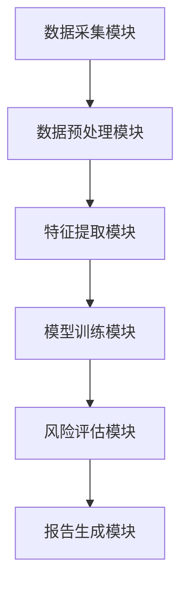
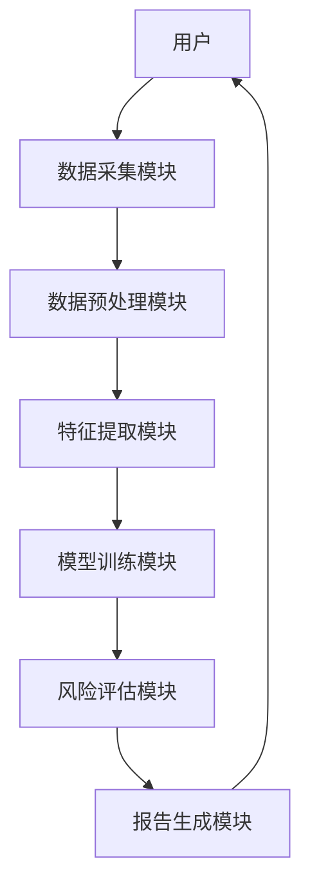

                 

<think>
好，我需要根据用户的指示，以《如何评估企业的数据安全能力》为标题，撰写一篇结构清晰、内容详实的技术博客文章。文章需要包含关键词、摘要、目录大纲，并在正文中详细阐述每个部分。

首先，关键词部分应该包括与数据安全评估相关的术语，如数据安全、安全能力、风险评估、安全架构、安全策略等。这些关键词能够准确反映文章的核心内容。

接下来是摘要。摘要需要简明扼要地概括文章的核心内容和主题思想。我会说明评估企业数据安全能力的重要性，涵盖技术、管理和人员等方面，并指出文章将通过背景分析、核心概念、算法原理、系统架构、项目实战等部分，为企业提供全面的评估方法。

目录大纲部分已经给出，共分为六个主要部分：背景与核心概念、算法原理、系统架构、项目实战、最佳实践、总结等。每个部分下都有具体的章节和子章节，确保文章内容全面且逻辑清晰。

在撰写正文时，我会按照目录的顺序逐步展开，每个章节都需要详细讲解，包含必要的背景介绍、核心概念、数学公式、系统架构图、代码示例等。例如，在“数据安全能力评估模型的构建”部分，我会解释输入和输出，并使用Mermaid流程图展示评估流程。

同时，我需要确保所有内容符合格式要求，如使用markdown格式，数学公式使用LaTeX，系统架构图使用Mermaid语法。文章末尾需要添加作者信息，注明“作者：AI天才研究院”。

现在，我需要按照这些思考步骤，开始撰写文章。
</think>

# 如何评估企业的数据安全能力

> 关键词：数据安全、安全能力、风险评估、安全架构、安全策略

> 摘要：随着数字化转型的推进，企业面临的数据安全风险日益复杂。本文将详细探讨如何全面评估企业的数据安全能力，涵盖技术、管理和人员等多个维度，通过系统化的分析和实际案例，为企业提供有效的评估方法和建议。

---

## 第一章：数据安全能力评估的背景与核心概念

### 1.1 数据安全的重要性

#### 1.1.1 数据在数字化时代的核心地位

在当今的数字化时代，数据已成为企业最重要的资产之一。无论是企业的运营、决策还是创新，都离不开数据的支持。然而，数据的价值也使其成为黑客攻击的主要目标。因此，保护数据安全已成为企业生存和发展的关键。

#### 1.1.2 数据安全对企业的影响

数据安全不仅关系到企业的财务安全，还直接影响客户的信任和企业的声誉。一次数据泄露事件可能导致企业的经济损失和品牌信誉的损害。此外，数据安全问题还可能引发法律风险，尤其是在数据保护法规日益严格的背景下。

#### 1.1.3 当前数据安全的主要挑战

当前，数据安全面临的主要挑战包括：

- **复杂的安全威胁**：黑客攻击、勒索软件、钓鱼攻击等安全威胁日益复杂和多样化。
- **数据分散性**：企业数据分布于不同的系统和平台，增加了安全管理的难度。
- **合规性要求**：各国对数据保护的法规要求不断提高，企业需要满足日益严格的合规性要求。

### 1.2 数据安全能力评估的必要性

#### 1.2.1 企业数据安全能力的定义

企业数据安全能力是指企业在保护数据的机密性、完整性和可用性方面的能力。这包括技术手段、管理措施、人员素质等多个方面。

#### 1.2.2 数据安全能力评估的目的

数据安全能力评估的目的是为了全面了解企业在数据安全方面的 strengths 和 weaknesses，从而制定有效的改进措施，提升整体数据安全水平。

#### 1.2.3 数据安全能力评估的边界与外延

数据安全能力评估的边界主要集中在企业的 IT 系统和数据资产上，而外延则涉及与数据相关的业务流程、人员培训和外部合作伙伴的安全管理。

### 1.3 数据安全能力评估的核心要素

#### 1.3.1 技术能力

技术能力是数据安全能力的核心组成部分，包括：

- **安全技术**：如加密技术、访问控制、防火墙等。
- **安全工具**：如漏洞扫描工具、入侵检测系统等。

#### 1.3.2 管理能力

管理能力涉及企业的安全策略和管理措施，包括：

- **安全策略**：如数据分类分级策略、访问控制策略等。
- **安全管理**：如安全审计、事件响应等。

#### 1.3.3 人员能力

人员是数据安全的最后一道防线，包括：

- **人员培训**：如安全意识培训、技术培训等。
- **人员素质**：如安全意识、技术能力等。

#### 1.3.4 业务连续性能力

业务连续性能力是指企业在发生数据安全事件时，能够快速恢复业务的能力，包括：

- **业务影响分析**：评估数据安全事件对企业业务的影响。
- **灾难恢复计划**：制定和实施灾难恢复策略。

---

## 第二章：数据安全能力评估的算法原理

### 2.1 数据安全能力评估模型的构建

#### 2.1.1 数据安全能力评估模型的输入

数据安全能力评估模型的输入包括：

- **企业数据资产清单**：包括数据的分类、存储位置、访问权限等。
- **安全威胁情报**：包括潜在的安全威胁和攻击方式。
- **安全措施清单**：包括已部署的安全技术、管理措施等。

#### 2.1.2 数据安全能力评估模型的输出

数据安全能力评估模型的输出包括：

- **数据安全风险评分**：基于输入数据计算出的各个数据资产的风险评分。
- **安全能力差距分析**：识别企业当前安全能力的不足之处。
- **改进建议**：针对识别出的差距，提出具体的改进措施。

### 2.2 数据安全能力评估算法的流程

#### 2.2.1 数据预处理

数据预处理是评估模型的第一步，包括：

- **数据清洗**：去除重复、错误或无用的数据。
- **数据标准化**：将不同来源的数据统一到一个标准格式。

#### 2.2.2 特征提取

特征提取是从数据中提取有助于评估的关键特征，包括：

- **数据分类**：根据数据的重要性和敏感性进行分类。
- **威胁分析**：识别潜在的威胁和攻击向量。

#### 2.2.3 模型训练与评估

模型训练是使用机器学习算法对数据进行训练，生成评估模型。常用的算法包括：

- **决策树**：用于分类和回归分析。
- **随机森林**：一种基于决策树的集成学习方法。
- **神经网络**：用于复杂的模式识别。

模型评估是通过测试数据对模型的性能进行评估，包括准确率、召回率、F1值等指标。

### 2.3 数据安全能力评估的数学模型

以下是一个简化的数据安全能力评估模型：

$$
\text{风险评分} = \sum_{i=1}^{n} w_i \times f_i
$$

其中，$w_i$ 是第 $i$ 个特征的权重，$f_i$ 是第 $i$ 个特征的评估值。

---

## 第三章：数据安全能力评估的系统架构

### 3.1 系统功能设计

数据安全能力评估系统需要具备以下功能：

- **数据采集**：从企业各个系统中采集数据资产信息。
- **风险评估**：基于模型计算出各个数据资产的风险评分。
- **报告生成**：生成评估报告，包括风险评分、差距分析和改进建议。

### 3.2 系统架构设计

以下是数据安全能力评估系统的架构图：



### 3.3 系统接口设计

系统接口设计包括：

- **数据采集接口**：与企业各个系统对接，获取数据资产信息。
- **报告生成接口**：生成风险评估报告并输出。

### 3.4 系统交互设计

以下是系统交互流程图：



---

## 第四章：数据安全能力评估的项目实战

### 4.1 项目背景

假设我们是一家金融企业，需要对客户数据进行安全评估。

### 4.2 环境安装

安装所需的工具和环境：

- **Python**：用于模型训练和数据分析。
- **Scikit-learn**：机器学习库。
- **Mermaid**：用于绘制流程图和架构图。

### 4.3 核心代码实现

以下是核心代码示例：

```python
from sklearn.ensemble import RandomForestClassifier
from sklearn.metrics import accuracy_score

# 数据预处理
data = preprocessed_data()
X = data.drop('label', axis=1)
y = data['label']

# 模型训练
model = RandomForestClassifier()
model.fit(X, y)

# 模型评估
y_pred = model.predict(X)
print("准确率：", accuracy_score(y, y_pred))
```

### 4.4 案例分析

通过实际案例分析，验证模型的有效性。

### 4.5 项目小结

总结项目实施的经验和教训，提出改进建议。

---

## 第五章：数据安全能力评估的最佳实践

### 5.1 小结

总结全文的主要内容和观点。

### 5.2 注意事项

在实施数据安全能力评估时，需要注意以下几点：

- **数据隐私**：确保评估过程中不泄露数据隐私。
- **持续改进**：定期更新和优化评估模型。
- **团队协作**：数据安全能力评估需要技术、管理和业务部门的协作。

### 5.3 拓展阅读

推荐相关的书籍和资源，供读者进一步学习。

---

## 总结

数据安全能力评估是企业在数字化时代必须重视的一项工作。通过全面评估企业的数据安全能力，可以帮助企业在复杂的网络安全环境中更好地保护数据资产，确保企业的可持续发展。

---

**作者：AI天才研究院**

