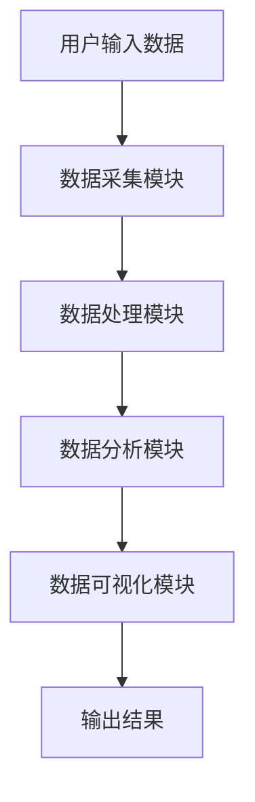
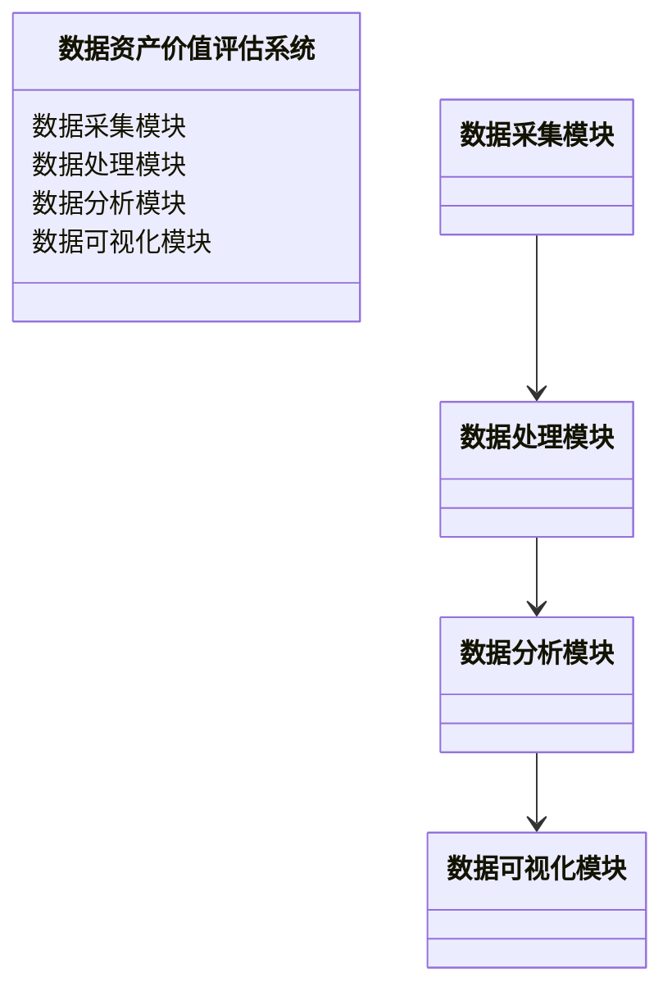
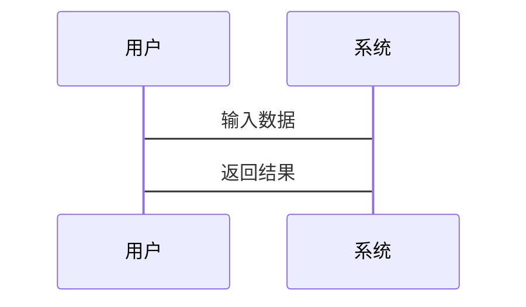

                 


# 如何评估企业的数据资产价值

> 关键词：数据资产、价值评估、企业数据管理、数据治理、数据资产化、数据价值、数据安全

> 摘要：本文详细探讨了如何评估企业的数据资产价值，从数据资产的定义、分类到价值评估的方法论，再到具体的算法实现和系统架构设计，层层深入，为企业提供一套完整的数据资产价值评估体系。

---

# 第1章 数据资产的概述

## 1.1 数据资产的定义与特征

### 1.1.1 数据资产的定义
数据资产是指企业在运营过程中所积累的所有数据资源，包括结构化数据、非结构化数据和半结构化数据。数据资产不仅仅是数据本身，还包括数据的质量、可用性、安全性以及数据所承载的价值。

### 1.1.2 数据资产的核心特征
数据资产具有以下核心特征：
- **可测量性**：数据资产的价值可以通过多种指标进行量化评估。
- **可扩展性**：数据资产的价值可以通过数据的深度挖掘和分析得到扩展。
- **动态性**：数据资产的价值会随着时间和业务环境的变化而变化。
- **共享性**：数据资产可以在企业内部或外部进行共享和利用。

### 1.1.3 数据资产与传统资产的区别
以下是数据资产与传统资产（如固定资产和无形资产）的对比：

| 特性             | 数据资产               | 固定资产         | 无形资产         |
|------------------|------------------------|------------------|------------------|
| 存在形式         | 数据                   | 实物             | 权益、品牌等      |
| 可流动性         | 高                     | 中               | 高               |
| 增值能力         | 高                     | 低               | 高               |
| 生命周期         | 短                     | 长               | 长               |
| 管理复杂度       | 高                     | 中               | 高               |

## 1.2 数据资产的重要性

### 1.2.1 数据资产对企业价值的影响
数据资产是企业在数字化转型中最重要的资源之一。通过数据资产的分析和挖掘，企业可以发现新的商业机会，优化业务流程，提高决策效率。

### 1.2.2 数据资产在数字化转型中的作用
在数字化转型中，数据资产是企业实现创新和竞争优势的核心。数据资产可以帮助企业实现智能化、自动化和个性化服务。

### 1.2.3 数据资产的潜在价值与风险
数据资产的潜在价值巨大，但同时也伴随着数据泄露、数据滥用等风险。因此，企业需要高度重视数据资产的安全管理和合规性。

## 1.3 数据资产的分类与管理

### 1.3.1 数据资产的分类标准
数据资产可以按照以下标准进行分类：
- **数据类型**：结构化数据、非结构化数据、半结构化数据。
- **数据来源**：内部数据、外部数据。
- **数据用途**：业务数据、分析数据、决策数据。

### 1.3.2 数据资产的生命周期管理
数据资产的生命周期包括数据的生成、存储、处理、分析和销毁。企业需要对数据资产的生命周期进行有效管理，确保数据的完整性和安全性。

### 1.3.3 数据资产的保护与安全
数据资产的安全保护是企业数据管理的重要组成部分。企业需要通过数据加密、访问控制、数据备份等手段，确保数据资产的安全性。

## 1.4 本章小结
本章介绍了数据资产的定义、特征、重要性和分类，帮助企业理解数据资产的基本概念和管理方法。

---

# 第2章 数据资产价值评估的核心概念

## 2.1 数据资产价值评估的背景与问题

### 2.1.1 数据资产价值评估的背景
随着数据资产的重要性日益增加，企业对数据资产的价值评估需求也在不断增加。数据资产价值评估可以帮助企业发现数据的价值，优化数据资源的利用。

### 2.1.2 数据资产价值评估的核心问题
数据资产价值评估的核心问题包括：
- 如何量化数据资产的价值？
- 如何确定数据资产的评估方法？
- 如何确保数据资产价值评估的准确性和可靠性？

### 2.1.3 数据资产价值评估的边界与外延
数据资产价值评估的边界包括：
- 数据资产的范围和类型。
- 数据资产的生命周期。
- 数据资产的评估环境。

## 2.2 数据资产价值评估的理论基础

### 2.2.1 数据资产价值评估的理论框架
数据资产价值评估的理论框架包括以下几个方面：
- 数据资产的属性分析。
- 数据资产的市场价值评估。
- 数据资产的风险评估。

### 2.2.2 数据资产价值评估的核心要素
数据资产价值评估的核心要素包括：
- 数据的质量。
- 数据的可用性。
- 数据的安全性。
- 数据的经济价值。

### 2.2.3 数据资产价值评估的属性特征对比表格

| 属性     | 数据资产                  | 非数据资产              |
|----------|--------------------------|--------------------------|
| 质量     | 数据的准确性、完整性      | 无                      |
| 可用性   | 数据的访问性、处理能力  | 无                      |
| 安全性   | 数据的保密性、安全性      | 无                      |
| 经济价值 | 数据的市场价值、投资价值 | 有                      |

### 2.2.4 数据资产价值评估的ER实体关系图
以下是数据资产价值评估的ER实体关系图：

```mermaid
erd
    系统模块
    |--- 数据资产
    数据资产
    |--- 数据类型
    数据类型
    |--- 数据来源
    数据来源
    |--- 数据用途
    数据用途
    |--- 数据价值
    数据价值
    |--- 数据风险
    数据风险
```

## 2.3 本章小结
本章介绍了数据资产价值评估的背景、核心问题、理论基础和ER实体关系图，为后续的评估方法和算法实现奠定了基础。

---

# 第3章 数据资产价值评估的方法论

## 3.1 数据资产价值评估的定性方法

### 3.1.1 数据资产的战略价值评估
战略价值评估是从企业战略角度对数据资产的价值进行评估。主要包括：
- 数据资产对企业发展目标的贡献。
- 数据资产在企业战略中的地位。

### 3.1.2 数据资产的业务价值评估
业务价值评估是从企业业务角度对数据资产的价值进行评估。主要包括：
- 数据资产对业务流程的支持。
- 数据资产对业务决策的影响。

### 3.1.3 数据资产的市场价值评估
市场价值评估是从市场角度对数据资产的价值进行评估。主要包括：
- 数据资产的市场竞争力。
- 数据资产的市场潜在价值。

## 3.2 数据资产价值评估的定量方法

### 3.2.1 数据资产的经济价值评估
经济价值评估是通过经济指标对数据资产的价值进行评估。主要包括：
- 数据资产的直接经济效益。
- 数据资产的间接经济效益。

### 3.2.2 数据资产的市场价值评估
市场价值评估是通过市场数据对数据资产的价值进行评估。主要包括：
- 数据资产的市场定价。
- 数据资产的市场需求。

### 3.2.3 数据资产的风险价值评估
风险价值评估是通过风险分析对数据资产的价值进行评估。主要包括：
- 数据资产的风险敞口。
- 数据资产的风险应对策略。

## 3.3 数据资产价值评估的流程与框架

### 3.3.1 数据资产价值评估的流程
数据资产价值评估的流程包括：
1. 数据资产的识别与分类。
2. 数据资产的属性分析。
3. 数据资产的价值评估方法选择。
4. 数据资产的价值评估实施。
5. 数据资产价值评估结果分析。

### 3.3.2 数据资产价值评估的框架
数据资产价值评估的框架包括：
- 数据资产的识别与分类。
- 数据资产的属性分析。
- 数据资产的价值评估方法选择。
- 数据资产价值评估结果分析。

## 3.4 本章小结
本章介绍了数据资产价值评估的定性方法和定量方法，以及评估的流程和框架，为后续的具体实现提供了方法论支持。

---

# 第4章 数据资产价值评估的算法与模型

## 4.1 数据资产价值评估的算法实现

### 4.1.1 数据资产价值评估的算法选择
数据资产价值评估的算法选择需要考虑以下因素：
- 数据资产的类型。
- 数据资产的规模。
- 数据资产的复杂性。

### 4.1.2 数据资产价值评估的算法实现步骤
数据资产价值评估的算法实现步骤包括：
1. 数据清洗与预处理。
2. 数据特征工程。
3. 数据建模。
4. 数据模型调优。
5. 数据模型评估。

### 4.1.3 数据资产价值评估的数学模型
以下是数据资产价值评估的数学模型：

$$
\text{数据资产价值} = \sum_{i=1}^{n} w_i \cdot x_i
$$

其中，$w_i$ 是第 $i$ 个特征的权重，$x_i$ 是第 $i$ 个特征的值。

## 4.2 数据资产价值评估的模型优化

### 4.2.1 数据资产价值评估的模型选择
数据资产价值评估的模型选择需要考虑以下因素：
- 数据资产的类型。
- 数据资产的规模。
- 数据资产的复杂性。

### 4.2.2 数据资产价值评估的模型优化策略
数据资产价值评估的模型优化策略包括：
- 参数优化。
- 特征选择。
- 模型融合。

## 4.3 本章小结
本章介绍了数据资产价值评估的算法实现和模型优化策略，为企业提供了一套完整的算法实现方案。

---

# 第5章 数据资产价值评估的系统架构设计

## 5.1 数据资产价值评估的系统功能设计

### 5.1.1 数据资产价值评估的系统功能模块
数据资产价值评估的系统功能模块包括：
- 数据采集模块。
- 数据处理模块。
- 数据分析模块。
- 数据可视化模块。

### 5.1.2 数据资产价值评估的系统功能流程
以下是数据资产价值评估的系统功能流程：



## 5.2 数据资产价值评估的系统架构设计

### 5.2.1 数据资产价值评估的系统架构
以下是数据资产价值评估的系统架构图：



## 5.3 数据资产价值评估的系统接口设计

### 5.3.1 数据资产价值评估的系统接口
数据资产价值评估的系统接口包括：
- 数据输入接口。
- 数据输出接口。
- 用户界面接口。

### 5.3.2 数据资产价值评估的系统交互流程
以下是数据资产价值评估的系统交互流程：



## 5.4 本章小结
本章介绍了数据资产价值评估的系统架构设计，包括功能模块、系统架构和接口设计。

---

# 第6章 数据资产价值评估的项目实战

## 6.1 数据资产价值评估的环境安装

### 6.1.1 环境需求
数据资产价值评估的环境需求包括：
- 操作系统：Linux/Windows/macOS。
- 数据处理工具：Python、R。
- 数据分析工具：Pandas、NumPy。
- 数据可视化工具：Matplotlib、Seaborn。

### 6.1.2 环境配置
以下是数据资产价值评估的环境配置示例：

```bash
# 安装Python
sudo apt-get install python3 python3-pip

# 安装数据分析库
pip install pandas numpy matplotlib seaborn scikit-learn
```

## 6.2 数据资产价值评估的核心实现

### 6.2.1 数据清洗与预处理
以下是数据清洗与预处理的Python代码示例：

```python
import pandas as pd

# 读取数据
data = pd.read_csv('data.csv')

# 删除缺失值
data.dropna(inplace=True)

# 处理异常值
data = data[~data['value'].isin(['异常值'])]
```

### 6.2.2 数据特征工程
以下是数据特征工程的Python代码示例：

```python
from sklearn.preprocessing import StandardScaler

# 标准化处理
scaler = StandardScaler()
data_features = scaler.fit_transform(data[['feature1', 'feature2', 'feature3']])
```

### 6.2.3 数据建模与调优
以下是数据建模与调优的Python代码示例：

```python
from sklearn.linear_model import LinearRegression
from sklearn.model_selection import GridSearchCV

# 定义模型
model = LinearRegression()

# 调参
param_grid = {'fit_intercept': [True, False]}
grid_search = GridSearchCV(model, param_grid, cv=5)
grid_search.fit(X_train, y_train)

# 输出最佳参数
print(grid_search.best_params_)
```

### 6.2.4 数据结果分析
以下是数据结果分析的Python代码示例：

```python
import matplotlib.pyplot as plt

# 绘制结果图
plt.scatter(y_true, y_pred)
plt.xlabel('真实值')
plt.ylabel('预测值')
plt.show()
```

## 6.3 本章小结
本章通过一个具体的项目实战，展示了数据资产价值评估的环境安装、核心实现和结果分析，帮助读者更好地理解数据资产价值评估的实际应用。

---

# 第7章 总结与展望

## 7.1 本章小结
数据资产价值评估是企业数据管理的重要组成部分。通过本文的介绍，读者可以全面了解数据资产的价值评估方法和实现方案。

## 7.2 数据资产价值评估的关键点回顾
数据资产价值评估的关键点包括：
- 数据资产的定义与分类。
- 数据资产价值评估的方法论。
- 数据资产价值评估的算法与模型。
- 数据资产价值评估的系统架构设计。

## 7.3 数据资产价值评估的未来展望
随着数据技术的不断发展，数据资产价值评估将更加智能化和自动化。未来的研究方向包括：
- 数据资产价值评估的智能化。
- 数据资产价值评估的实时化。
- 数据资产价值评估的全球化。

---

# 作者：AI天才研究院/AI Genius Institute & 禅与计算机程序设计艺术 /Zen And The Art of Computer Programming

