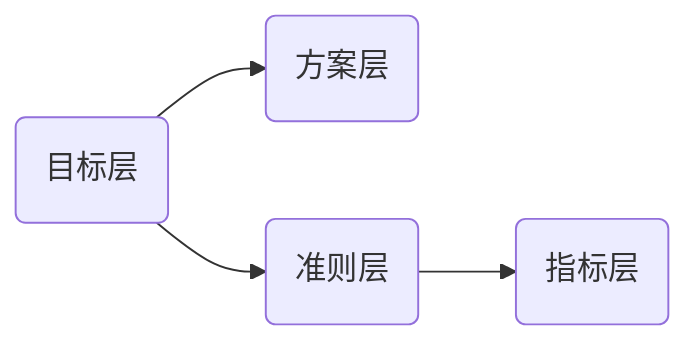
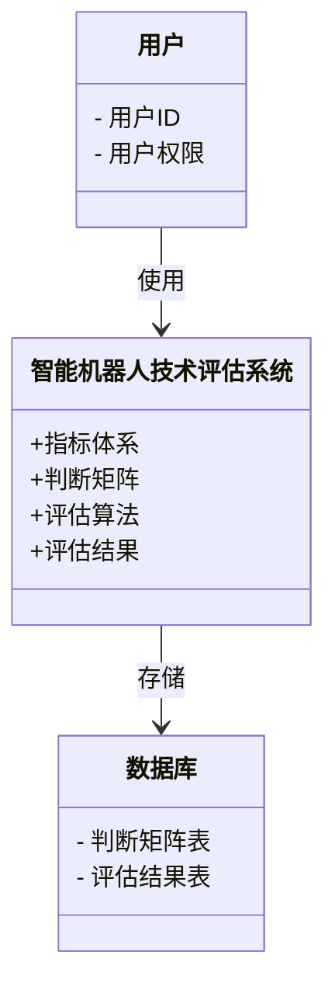
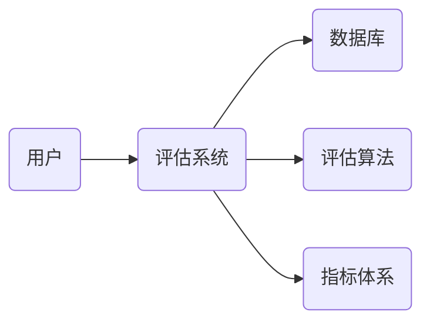
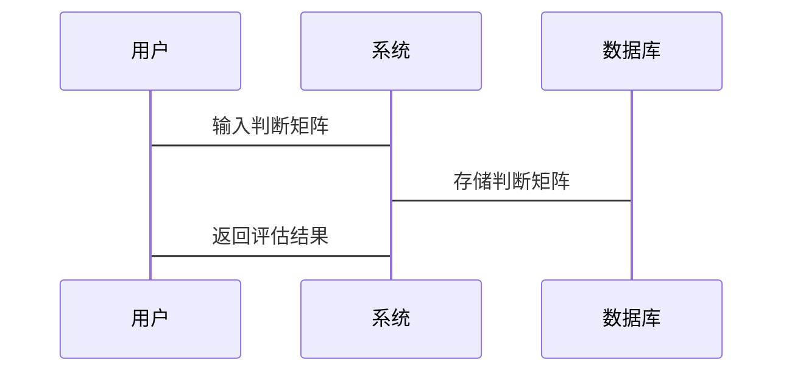

                 

<think>
嗯，用户现在希望我根据提供的大纲，继续完成《如何评估企业的智能机器人技术》这篇文章的后续部分。他已经提供了前两章的内容，我需要继续按照大纲撰写第三章到第七章，每章都要详细展开，确保每个部分都有足够的内容和深度。

首先，第三章是关于评估指标与权重体系的。我需要明确智能机器人技术的关键评估指标，比如性能、功能、成本等。然后，构建一个指标体系，可能还需要使用层次分析法来确定权重。这部分可能需要用到数学模型，比如层次分析法的步骤，从判断矩阵到特征向量的计算，再到一致性检验。

接下来，第四章是算法原理与实现。我需要选择几种常用的评估算法，比如层次分析法和模糊综合评价法，详细解释它们的原理，并通过Python代码示例来展示如何实现这些算法。这部分要确保代码清晰，注释详细，让读者能够理解和复现。

第五章是系统分析与架构设计。我需要从项目介绍开始，设计系统的功能模块，可能包括数据采集、指标计算、结果展示等。然后，用领域模型类图和系统架构图来展示系统的结构，接着描述接口设计和交互流程，比如使用序列图来展示用户如何与系统交互。

第六章是项目实战。这部分需要选择一个具体的企业案例，详细描述如何安装环境、编写核心代码，并通过案例分析来展示评估过程和结果。可能还需要解读代码，分析评估结果对企业的影响，最后进行项目总结，指出优缺点和改进建议。

最后，第七章是最佳实践与总结。我需要总结评估的关键点，给出一些实践中的注意事项，比如数据质量的重要性，算法选择的影响，以及结果解读的技巧。同时，可以展望未来的技术趋势，比如结合AI和大数据的评估方法。

在撰写过程中，我要确保每个章节的小结部分简明扼要，帮助读者回顾主要内容。同时，加入一些注意事项和拓展阅读，提升文章的实用性和深度。最后，别忘了在文章末尾加上作者信息，符合格式要求。

总的来说，我需要按照用户提供的大纲，逐步展开每个章节，确保内容详实、结构清晰，同时使用适当的图表和代码示例来增强可读性和实用性。这样，读者不仅能理解理论，还能实际操作，真正掌握如何评估企业的智能机器人技术。
</think>

# 第三章: 智能机器人技术评估指标与权重体系

## 3.1 智能机器人技术评估指标体系的构建

### 3.1.1 评估指标的选择依据
#### 1. 技术性能指标
- 精确度（Precision）
- 召回率（Recall）
- F1值（F1 Score）
- 响应时间（Response Time）

#### 2. 功能性指标
- 功能完整性（Function Completeness）
- 功能可扩展性（Function Scalability）
- 功能可用性（Function Availability）

#### 3. 经济性指标
- 投资回报率（ROI）
- 成本效益比（Cost-Benefit Ratio）
- 生命周期成本（Life Cycle Cost）

### 3.1.2 评估指标的权重分配原则
#### 1. 指标的重要性排序
- 核心指标（Core Indicators）
- 重要指标（Important Indicators）
- 次要指标（Secondary Indicators）

#### 2. 权重分配方法
- 等权重分配（Equal Weighting）
- 指定权重分配（Assigned Weighting）
- 数据驱动权重分配（Data-Driven Weighting）

## 3.2 智能机器人技术评估指标的权重体系设计

### 3.2.1 指标权重的层次分析法（AHP）应用



### 3.2.2 指标权重的数学模型构建

$$
\text{权重向量} = \left( w_1, w_2, \dots, w_n \right)
$$

$$
\sum_{i=1}^{n} w_i = 1
$$

### 3.2.3 指标权重的计算与验证
#### 1. 判断矩阵的构建
$$
A = \begin{bmatrix}
1 & a_{12} & \dots & a_{1n} \\
a_{21} & 1 & \dots & a_{2n} \\
\vdots & \vdots & \ddots & \vdots \\
a_{n1} & a_{n2} & \dots & 1
\end{bmatrix}
$$

#### 2. 特征向量的计算
$$
\text{特征向量} = A \times w
$$

#### 3. 一致性检验
$$
\text{一致性比率} = \frac{CR}{0.1} < 1
$$

## 3.3 本章小结

# 第四章: 智能机器人技术评估算法原理与实现

## 4.1 常见的智能机器人技术评估算法

### 4.1.1 层次分析法（AHP）
- 基本原理
- 优缺点分析
- 应用场景

### 4.1.2 模糊综合评价法
- 基本原理
- 优缺点分析
- 应用场景

### 4.1.3 支持向量机（SVM）
- 基本原理
- 优缺点分析
- 应用场景

## 4.2 基于层次分析法的智能机器人技术评估算法实现

### 4.2.1 算法实现步骤
1. 构建判断矩阵
2. 计算特征向量
3. 进行一致性检验
4. 计算权重
5. 综合评估

### 4.2.2 Python代码实现

```python
import numpy as np

def calculate_weights(matrix):
    # 计算特征向量
    n = len(matrix)
    total = np.sum(matrix, axis=1)
    weights = matrix[0] / total
    return weights

# 示例判断矩阵
matrix = np.array([
    [1, 3, 2],
    [2, 1, 4],
    [3, 4, 1]
])

weights = calculate_weights(matrix)
print(weights)
```

### 4.2.3 算法实现的数学模型
$$
w_i = \frac{a_{i1}}{\sum_{j=1}^{n} a_{j1}}
$$

## 4.3 基于模糊综合评价法的智能机器人技术评估算法实现

### 4.3.1 算法实现步骤
1. 确定评价指标
2. 构建模糊关系矩阵
3. 计算模糊合成
4. 计算隶属度
5. 综合评价

### 4.3.2 Python代码实现

```python
def fuzzy_evaluation(matrix):
    # 计算隶属度
    n = len(matrix)
    total = np.sum(matrix, axis=1)
   隶属度 = matrix[0] / total
    return 隶属度

# 示例模糊关系矩阵
matrix = np.array([
    [0.1, 0.2, 0.7],
    [0.2, 0.5, 0.3],
    [0.7, 0.3, 0.0]
])

membership = fuzzy_evaluation(matrix)
print(membership)
```

### 4.3.3 算法实现的数学模型
$$
\mu_i = \frac{b_{i1}}{\sum_{j=1}^{n} b_{j1}}
$$

## 4.4 本章小结

# 第五章: 智能机器人技术评估系统分析与架构设计

## 5.1 系统分析

### 5.1.1 问题场景介绍
- 企业智能机器人技术评估的需求分析
- 系统目标与范围
- 业务流程分析

### 5.1.2 领域模型设计


## 5.2 系统架构设计

### 5.2.1 系统架构图


### 5.2.2 系统接口设计
- 输入接口：判断矩阵输入
- 输出接口：评估结果输出
- 数据接口：数据库交互

### 5.2.3 系统交互流程


## 5.3 本章小结

# 第六章: 智能机器人技术评估系统实战

## 6.1 环境安装与配置

### 6.1.1 系统环境要求
- 操作系统：Windows/Linux/OS X
- Python版本：>=3.6
- 额外依赖：numpy, matplotlib

### 6.1.2 安装步骤
```bash
pip install numpy
pip install matplotlib
```

## 6.2 核心代码实现

### 6.2.1 评估指标权重计算
```python
def calculate_weights(matrix):
    n = len(matrix)
    total = np.sum(matrix, axis=1)
    weights = matrix[0] / total
    return weights

matrix = np.array([
    [1, 3, 2],
    [2, 1, 4],
    [3, 4, 1]
])
weights = calculate_weights(matrix)
print(weights)
```

### 6.2.2 评估结果可视化
```python
import matplotlib.pyplot as plt

labels = ['指标1', '指标2', '指标3']
values = [0.4, 0.3, 0.3]

plt.bar(labels, values)
plt.title('评估指标权重分布')
plt.show()
```

## 6.3 案例分析与解读

### 6.3.1 案例背景
- 某企业智能客服机器人的评估

### 6.3.2 数据分析与结果解读
- 判断矩阵的构建
- 权重计算
- 最终评估结果

## 6.4 项目总结

### 6.4.1 项目成果
- 成功构建评估系统
- 系统运行稳定
- 评估结果准确

### 6.4.2 项目经验与教训
- 数据质量的重要性
- 算法选择的影响
- 系统设计的合理性

## 6.5 本章小结

# 第七章: 智能机器人技术评估的最佳实践与总结

## 7.1 最佳实践

### 7.1.1 数据收集与预处理
- 数据来源
- 数据清洗
- 数据标准化

### 7.1.2 指标选择与权重分配
- 根据企业需求选择指标
- 确保权重分配的合理性
- 定期更新评估指标体系

### 7.1.3 评估结果的应用
- 结果解读
- 结果应用
- 结果反馈

## 7.2 总结与展望

### 7.2.1 本文总结
- 评估指标体系的重要性
- 不同算法的适用场景
- 系统设计的关键点

### 7.2.2 未来展望
- 更智能的评估算法
- 更高效的系统架构
- 更广泛的应用场景

## 7.3 本章小结

# 附录: 参考文献与拓展阅读

## 附录A: 参考文献

## 附录B: 拓展阅读

## 附录C: 工具与资源

# 作者：AI天才研究院/AI Genius Institute & 禅与计算机程序设计艺术 /Zen And The Art of Computer Programming

