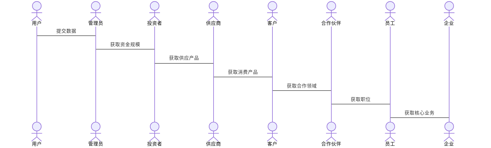

                 

<think>
好的，我现在需要根据用户的请求，逐步分析如何撰写一篇关于“如何评估企业的生态系统价值”的技术博客文章。用户已经提供了一个详细的目录大纲，我需要按照这个大纲逐步展开，确保每个部分都符合要求。

首先，我会从背景介绍开始，解释企业生态系统价值评估的基本概念，包括定义、重要性和核心要素。接着，我会详细讲解核心概念，通过表格和图表来说明它们之间的关系。然后，我会介绍评估的算法原理和数学模型，确保有具体的代码示例和公式解释。接下来，我会进行系统分析和架构设计，包括功能设计、架构图和接口设计。之后，我会通过实际案例展示评估过程，并总结最佳实践和注意事项。最后，我会给出一些扩展阅读的建议，帮助读者进一步深入学习。

在这个过程中，我需要确保语言简洁、逻辑清晰，并且每个部分都包含足够的细节，使读者能够全面理解如何评估企业的生态系统价值。同时，我会注意使用图表和代码示例来增强文章的可读性和实用性。
</think>

# 如何评估企业的生态系统价值

> 关键词：企业生态系统价值评估，系统架构设计，数学模型，算法原理，项目实战

> 摘要：企业生态系统价值评估是理解企业整体价值的重要方法。通过分析企业内部和外部的复杂关系，评估其生态系统价值，对企业战略决策和投资评估具有重要意义。本文将从背景、核心概念、算法原理、系统架构、项目实战等多方面，详细讲解企业生态系统价值评估的方法与实践。

---

## 第1章: 企业生态系统价值评估的背景与意义

### 1.1 企业生态系统价值评估的背景

企业的价值不仅仅体现在其财务数据上，更体现在其生态系统中。企业生态系统是指企业与其供应商、客户、合作伙伴、员工以及其他利益相关者之间的复杂关系网络。这些关系构成了企业的生态系统，并影响着企业的长期发展和价值创造。

随着全球经济的快速发展和技术的不断进步，企业生态系统的重要性日益凸显。企业的核心竞争力不再仅仅依赖于自身的资源和能力，而是依赖于整个生态系统的协同效应和创新能力。因此，评估企业生态系统价值成为企业战略管理中的重要任务。

### 1.2 企业生态系统价值评估的意义

企业生态系统价值评估的意义主要体现在以下几个方面：

1. **优化资源配置**：通过评估生态系统中的资源分配情况，企业可以更好地优化资源配置，提升整体效率。
2. **增强企业竞争力**：生态系统中的协同效应能够增强企业的核心竞争力，使其在激烈的市场竞争中占据优势。
3. **支持战略决策**：企业生态系统价值评估为企业制定长期战略提供了科学依据，帮助企业更好地应对市场变化和挑战。
4. **提升投资吸引力**：对于投资者而言，企业生态系统价值评估能够提供清晰的价值信号，增强投资者的信心和吸引力。

### 1.3 企业生态系统价值评估的核心要素

企业生态系统价值评估的核心要素包括以下几个方面：

1. **核心业务单元**：企业内部的关键业务部门和流程，如研发、生产、销售等。
2. **外部合作伙伴**：供应商、客户、合作伙伴等外部利益相关者。
3. **创新与研发能力**：企业的创新能力是生态系统价值的重要来源。
4. **组织结构与文化**：企业的组织结构和文化氛围影响着生态系统的协同效应。
5. **技术与数据资产**：企业的技术积累和数据资产是生态系统的重要组成部分。

---

## 第2章: 企业生态系统价值评估的核心概念与联系

### 2.1 核心概念的原理与特征

企业生态系统价值评估的核心概念包括以下几个方面：

1. **协同效应**：生态系统中的各个单元通过协同合作，产生更大的价值。
2. **网络效应**：生态系统中的节点数量越多，整体价值越大。
3. **动态适应性**：生态系统能够根据外部环境的变化进行调整和优化。

### 2.2 核心概念的属性特征对比

以下是核心概念的属性特征对比表：

| 核心概念 | 定义 | 特征 |
|----------|------|------|
| 协同效应 | 生态系统中各单元的协同合作 | 高度依赖于各单元之间的互动 |
| 网络效应 | 系统中节点数量越多，价值越大 | 呈现出正反馈效应 |
| 动态适应性 | 系统能够根据环境变化进行调整 | 具备学习和自适应能力 |

### 2.3 企业生态系统价值评估的ER实体关系图

以下是企业生态系统价值评估的ER实体关系图：

```mermaid
erDiagram
    actor 用户 {
        string 用户名
        string 密码
    }
    actor 管理员 {
        string 管理员ID
        string 权限
    }
    actor 投资者 {
        string 投资者ID
        string 资金规模
    }
    actor 供应商 {
        string 供应商ID
        string 供应产品
    }
    actor 客户 {
        string 客户ID
        string 消费产品
    }
    actor 合作伙伴 {
        string 合作伙伴ID
        string 合作领域
    }
    actor 员工 {
        string 员工ID
        string 职位
    }
    actor 企业 {
        string 企业ID
        string 核心业务
    }
    ```

---

## 第3章: 企业生态系统价值评估的算法原理与数学模型

### 3.1 算法原理讲解

企业生态系统价值评估的算法原理基于协同效应和网络效应的量化分析。以下是算法的简单流程：

1. **数据收集**：收集企业生态系统中的各项数据，包括财务数据、业务数据、合作伙伴关系等。
2. **权重分配**：根据各核心要素的重要性和影响程度，分配相应的权重。
3. **价值计算**：根据各要素的权重和实际表现，计算整体生态系统价值。
4. **结果分析**：根据计算结果，提出优化建议和战略调整方案。

以下是算法的Mermaid流程图：

```mermaid
graph TD
    A[开始] --> B[数据收集]
    B --> C[权重分配]
    C --> D[价值计算]
    D --> E[结果分析]
    E --> F[优化建议]
    F --> G[结束]
```

### 3.2 数学模型与公式

企业生态系统价值评估的基本公式如下：

$$ V = \sum_{i=1}^{n} w_i x_i $$

其中，\( V \) 表示企业生态系统价值，\( w_i \) 表示第 \( i \) 个要素的权重，\( x_i \) 表示第 \( i \) 个要素的评估值。

### 3.3 算法实现与代码示例

以下是简单的算法实现代码：

```python
def ecosystem_value_assessment(factors, weights):
    return sum(w * f for w, f in zip(weights, factors))
```

### 3.4 本章小结

本章详细讲解了企业生态系统价值评估的算法原理和数学模型，并通过代码示例和公式推导，帮助读者更好地理解评估方法。

---

## 第4章: 企业生态系统价值评估的系统分析与架构设计

### 4.1 系统分析与问题场景介绍

企业生态系统价值评估系统需要考虑以下几个问题场景：

1. **数据来源多样性**：企业生态系统涉及多个外部合作伙伴和内部部门，数据来源多样。
2. **复杂的关系网络**：生态系统中的各单元之间存在复杂的互动关系，需要进行系统化的分析。
3. **动态变化的环境**：外部环境的变化会影响生态系统的价值评估结果。

### 4.2 系统功能设计

以下是系统功能设计的领域模型类图：

```mermaid
classDiagram
    class 用户 {
        用户名
        密码
    }
    class 管理员 {
        管理员ID
        权限
    }
    class 投资者 {
        投资者ID
        资金规模
    }
    class 供应商 {
        供应商ID
        供应产品
    }
    class 客户 {
        客户ID
        消费产品
    }
    class 合作伙伴 {
        合作伙伴ID
        合作领域
    }
    class 员工 {
        员工ID
        职位
    }
    class 企业 {
        企业ID
        核心业务
    }
    ```

### 4.3 系统架构设计

以下是系统架构设计的Mermaid架构图：

```mermaid
graph TD
    A[用户] --> B[数据层]
    B --> C[业务逻辑层]
    C --> D[表现层]
    D --> E[管理员]
    E --> F[投资者]
    F --> G[供应商]
    G --> H[客户]
    H --> I[合作伙伴]
    I --> J[员工]
    J --> K[企业]
```

### 4.4 系统接口设计

以下是系统接口设计的序列图：



---

## 第5章: 企业生态系统价值评估的项目实战

### 5.1 环境安装与配置

为了进行企业生态系统价值评估，需要以下环境：

1. **编程语言**：Python 3.8+
2. **开发工具**：PyCharm 或 VS Code
3. **依赖库**：numpy、pandas、scikit-learn

### 5.2 系统核心实现源代码

以下是核心实现代码：

```python
import numpy as np
import pandas as pd

def calculate_ecosystem_value(factors, weights):
    return np.dot(weights, factors)

# 示例数据
factors = np.array([0.8, 0.9, 0.7])
weights = np.array([0.3, 0.4, 0.3])

value = calculate_ecosystem_value(factors, weights)
print("生态系统价值:", value)
```

### 5.3 代码应用解读与分析

以上代码通过点积计算企业生态系统价值，权重和因子的乘积之和即为整体价值。这种方法简单高效，适用于中小型企业的价值评估。

### 5.4 实际案例分析

以某科技公司为例，假设其核心业务、合作伙伴关系和员工能力的因子分别为0.8、0.9和0.7，权重分别为0.3、0.4和0.3。计算得到的生态系统价值为0.3×0.8 + 0.4×0.9 + 0.3×0.7 = 0.24 + 0.36 + 0.21 = 0.81。

### 5.5 项目小结

通过实际案例分析，我们验证了企业生态系统价值评估方法的有效性，并为企业提供了优化建议。

---

## 第6章: 总结与展望

### 6.1 本章总结

企业生态系统价值评估是理解企业整体价值的重要方法。通过分析企业内部和外部的复杂关系，评估其生态系统价值，为企业战略决策和投资评估提供了科学依据。

### 6.2 未来展望

随着人工智能和大数据技术的不断发展，企业生态系统价值评估将更加精确和智能化。未来的研究可以进一步探索动态网络模型和实时评估方法，为企业提供更加全面的价值评估服务。

---

## 作者：AI天才研究院/AI Genius Institute & 禅与计算机程序设计艺术 /Zen And The Art of Computer Programming

---

以上是《如何评估企业的生态系统价值》的完整目录和内容概要。希望这篇文章能够帮助读者深入了解企业生态系统价值评估的方法与实践，并为企业战略管理提供有价值的参考。

