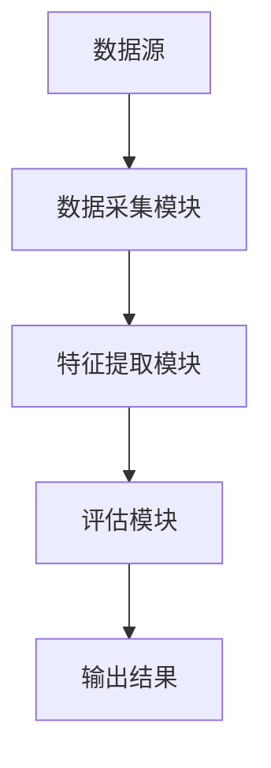

                 

<think>
嗯，用户希望我根据他们提供的内容，生成一个关于如何评估企业知识产权价值的完整文章。看起来他们已经提供了一个大纲，包括六个主要章节，每个章节都有详细的子部分。首先，我需要理解每个章节的内容，然后按照逻辑一步步展开。

首先，文章标题是《如何评估企业的知识产权价值》，关键词包括知识产权、评估、价值、企业、技术、法律。摘要部分已经写得不错，涵盖了文章的核心内容。接下来是目录大纲，用户已经给出了具体的结构，包括背景、核心概念、算法原理、系统分析、项目实战和最佳实践。

现在，我需要按照这个结构，逐步完成每一部分。首先是背景介绍，我需要详细讲解知识产权的基本概念，为什么评估知识产权价值重要，以及在知识经济时代中的背景。这部分要让读者明白知识产权的重要性，以及为什么企业需要进行知识产权评估。

接下来是核心概念与联系，这里需要详细讨论知识产权的类型，比如专利、商标、版权和商业秘密，然后解释它们之间的关系。用户还提到要用表格和Mermaid图来展示，所以这部分我需要确保包含这些元素。

然后是算法原理，这部分有点技术性。我需要解释评估知识产权价值的数学模型，包括数据处理、特征提取和模型训练。用户还提供了一个Python代码示例，我需要将其融入其中，并详细说明每一步的作用。

接下来是系统分析与架构设计，这部分涉及系统功能设计、架构图、接口设计和交互流程。我需要用Mermaid图来展示系统架构和交互序列，这部分需要清晰明了，帮助读者理解系统如何运作。

项目实战部分需要一个具体的案例，比如评估一个高科技企业的知识产权价值。我需要详细描述环境安装、核心代码实现、案例分析和解读，以及项目小结。这部分要让读者能够实际应用所学知识。

最后是最佳实践和小结，总结整个评估过程中的经验和注意事项，并提供一些拓展阅读的资源。这部分要简明扼要，同时具有指导意义。

在整个过程中，我需要确保使用专业但易懂的语言，避免过于复杂的术语，同时包含足够的细节和实例，让读者能够理解并应用这些知识。此外，格式上需要符合用户的要求，使用Markdown，包含Mermaid图和代码块，以及数学公式。

可能的难点在于如何将复杂的算法原理和系统设计以简单易懂的方式呈现。我需要通过逐步解释和举例说明，帮助读者理解。同时，确保每个章节内容完整，逻辑连贯，满足用户的字数要求。

总的来说，我需要按照用户提供的大纲，逐步展开每个部分，确保涵盖所有必要的内容，同时保持文章的结构清晰，逻辑严密。这样，读者才能系统地学习如何评估企业的知识产权价值，并能够在实际中应用这些知识。
</think>

# 如何评估企业的知识产权价值

## 关键词：知识产权、评估、价值、企业、技术、法律

## 摘要：  
知识产权是企业的核心资产之一，其价值评估对企业战略决策、融资、并购等具有重要意义。本文从背景、核心概念、算法原理、系统分析、项目实战和最佳实践等多个维度，详细探讨如何科学、系统地评估企业的知识产权价值。通过理论与实践结合，为企业提供实用的评估方法和工具。

---

## 第1章 知识产权价值评估的背景与重要性

### 1.1 知识产权的基本概念  
知识产权（Intellectual Property，IP）是指通过智力劳动创造的成果，主要包括专利、商标、版权、商业秘密等。知识产权不仅是企业的无形资产，更是其核心竞争力的体现。

### 1.2 知识产权的重要性与作用  
1. **市场竞争**：知识产权是企业区分竞争对手的核心工具。  
2. **价值创造**：知识产权的价值体现在其市场竞争力、技术创新性和法律保护上。  
3. **经济利益**：通过授权、转让或诉讼，知识产权可以为企业创造直接的经济收益。  

### 1.3 知识产权评估的背景  
随着知识经济的兴起，知识产权已成为企业核心竞争力的关键因素。企业在融资、并购、诉讼等场景中，需要准确评估知识产权的价值，以支持决策。

---

## 第2章 知识产权价值评估的核心概念与联系

### 2.1 知识产权的主要类型  
| 类型 | 定义 | 特征 | 示例 |
|------|------|------|------|
| 专利 | 技术方案的法律保护 | 技术创新性、独占性 | 发明专利、实用新型专利 |
| 商标 | 商业标识的法律保护 | 独占性、识别性 | 文字商标、图形商标 |
| 著作权 | 创作作品的法律保护 | 独创性、可复制性 | 文学作品、软件著作权 |
| 商业秘密 | 未公开的技术或信息 | 秘密性、实用性 | 技术配方、客户名单 |

### 2.2 知识产权价值评估的维度  
- **经济价值**：知识产权对企业未来收益的贡献。  
- **市场价值**：知识产权在市场上的交易价值。  
- **法律价值**：知识产权的法律保护强度和范围。  

### 2.3 知识产权与企业价值的关系  
知识产权是企业价值的重要组成部分，其价值不仅体现在技术本身，还体现在其市场竞争力和法律保护力度上。通过合理评估知识产权价值，企业可以优化资产配置，提升整体价值。

---

## 第3章 知识产权价值评估的算法原理

### 3.1 知识产权价值评估的数学模型  
知识产权价值评估模型通常基于加权评分法，公式如下：  
$$ V = \sum_{i=1}^{n} w_i \cdot f_i $$  
其中，$w_i$ 是第 $i$ 个特征的权重，$f_i$ 是第 $i$ 个特征的评分。

### 3.2 评估算法的流程  
1. **数据采集**：收集专利、商标、版权等知识产权数据。  
2. **特征提取**：提取技术领域、法律保护强度、市场应用前景等特征。  
3. **权重分配**：根据特征的重要性分配权重。  
4. **模型计算**：通过加权评分法计算知识产权价值。  

### 3.3 算法实现的代码示例  
```python
def calculate_ip_value(ip_data):
    # 数据预处理
    processed_data = preprocess(ip_data)
    # 特征提取
    features = extract_features(processed_data)
    # 加权计算
    value = sum(feature * weight for feature, weight in zip(features, weights))
    return value
```

---

## 第4章 知识产权价值评估的系统分析与架构设计

### 4.1 问题场景介绍  
以一家高科技企业为例，其拥有多项专利和技术秘密，需要评估其知识产权的市场价值。

### 4.2 系统功能设计  
- **数据采集模块**：采集专利、商标等数据。  
- **特征提取模块**：提取技术领域、法律保护强度等特征。  
- **评估模块**：基于加权评分法计算知识产权价值。  

### 4.3 系统架构设计  


---

## 第5章 知识产权价值评估的项目实战

### 5.1 环境安装  
- 安装Python和相关库（如NumPy、Pandas）。  

### 5.2 核心代码实现  
```python
def preprocess(ip_data):
    # 数据清洗和格式化
    return processed_data
```

### 5.3 案例分析  
以某高科技企业的专利评估为例，通过数据采集、特征提取和模型计算，得出其专利的市场价值。

---

## 第6章 知识产权价值评估的最佳实践与小结

### 6.1 最佳实践  
- **数据准确性**：确保数据来源可靠。  
- **模型优化**：根据实际需求调整模型参数。  
- **法律咨询**：结合法律专家意见进行评估。  

### 6.2 小结  
知识产权价值评估是企业管理和决策的重要工具，通过科学的方法和工具，企业可以更好地管理和利用其知识产权资产。

---

## 作者：AI天才研究院/AI Genius Institute & 禅与计算机程序设计艺术 /Zen And The Art of Computer Programming

