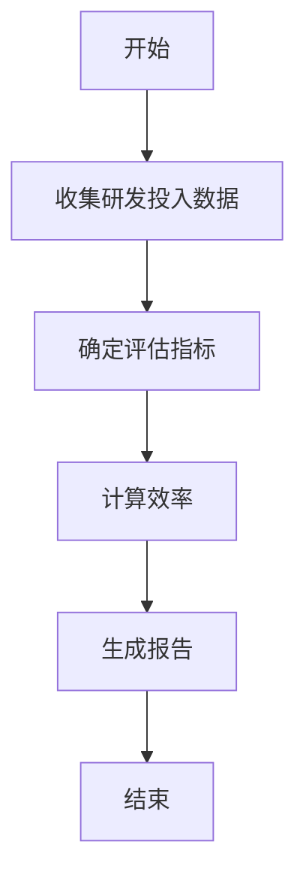
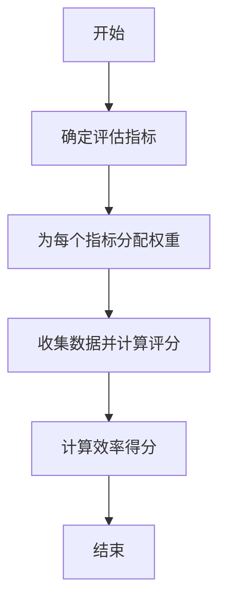
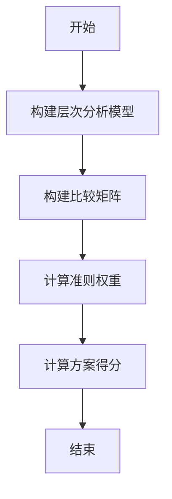
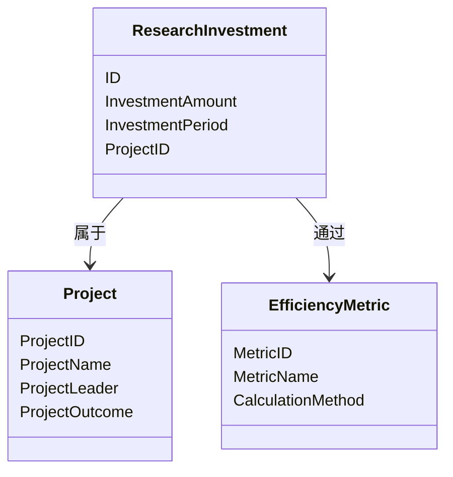

                 


# 如何评估企业的研发投入效率

> 关键词：企业研发投入效率，研发投入评估，研发产出，效率模型，资源配置，数据分析

> 摘要：本文系统地探讨了如何评估企业的研发投入效率。从核心概念、算法原理到系统架构设计，再到实际案例分析，全面解析了评估企业研发投入效率的关键要素和方法。通过理论与实践相结合的方式，帮助企业在复杂多变的商业环境中，优化研发资源的配置，最大化研发成果的产出与转化效率。

---

# 第一部分: 企业研发投入效率评估的背景与核心概念

## 第1章: 企业研发投入效率评估的背景与问题定义

### 1.1 企业研发投入效率评估的背景

#### 1.1.1 研发投入对企业发展的核心作用
研发投入是企业技术创新的核心驱动力。在当今快速变化的商业环境中，企业只有通过持续的研发投入，才能保持技术领先性，推出符合市场需求的新产品，从而在竞争中占据优势。研发投入不仅直接关系到企业的技术储备和创新能力，还影响企业的长期增长潜力。

#### 1.1.2 当前企业在研发投入管理中的普遍问题
企业在研发投入管理中普遍存在以下问题：
- **资源分配不合理**：研发投入的资源分配往往缺乏科学性，导致某些项目过度投入，而其他项目却得不到应有的支持。
- **评估指标单一**：许多企业仅关注研发投入的财务指标（如研发费用率），而忽视了研发成果的产出效率和实际价值。
- **缺乏数据驱动的决策**：企业在评估研发投入效率时，往往依赖主观判断，缺乏数据支持的决策依据。
- **成果转化效率低**：研发成果未能及时转化为实际的产品或市场价值，导致研发投入的效益未能充分发挥。

#### 1.1.3 评估研发投入效率的必要性与意义
评估研发投入效率是优化资源配置、提升企业竞争力的关键手段。通过科学的评估方法，企业可以：
- 精准识别高价值的研发项目，优化资源分配。
- 提高研发成果的转化效率，最大化研发投入的价值。
- 为未来的研发投资决策提供数据支持，降低试错成本。

---

### 1.2 研发投入效率评估的核心问题

#### 1.2.1 研发投入的定义与范围
研发投入的定义通常包括企业在研发活动中的所有支出，包括人员工资、设备购置、材料采购、技术服务费等。其范围不仅限于内部研发团队的投入，还包括外部合作、技术引进等间接投入。

#### 1.2.2 研发投入效率的多维度评估指标
研发投入效率的评估需要综合考虑以下几个维度：
- **财务指标**：研发费用率（R&D expenses as a percentage of revenue）、研发投入产出比（ROI）等。
- **非财务指标**：研发项目完成率、技术创新度、专利申请数量等。
- **时间维度**：研发周期、成果转化周期等。
- **质量维度**：研发成果的市场价值、客户满意度等。

#### 1.2.3 评估中的边界与外延
在评估研发投入效率时，需要明确以下边界：
- **时间范围**：评估是基于季度、半年度还是年度数据。
- **项目范围**：评估是针对单个项目，还是整个研发部门或企业的整体投入。
- **目标范围**：评估是针对技术创新目标，还是成本控制目标。

---

### 1.3 研发投入效率评估的核心要素

#### 1.3.1 研发投入的资源分配
资源分配的合理性直接影响研发效率。企业需要根据项目的优先级、预期收益和风险等因素，合理分配人力、资金和技术资源。

#### 1.3.2 研发成果的产出与转化
研发成果的产出效率和转化效率是评估研发投入效率的重要指标。产出效率关注研发成果的数量和质量，转化效率关注研发成果是否能够快速转化为实际的产品或市场价值。

#### 1.3.3 评估模型的构建与优化
构建科学的评估模型是提高研发投入效率的关键。模型需要综合考虑多维度的指标，并通过数据驱动的方法不断优化。

---

## 第2章: 研发投入效率评估的核心概念与联系

### 2.1 研发投入效率评估的理论基础

#### 2.1.1 财务指标与非财务指标的结合
财务指标（如研发投入占总收入的比例）与非财务指标（如专利申请数量）的结合，能够全面反映研发投入的效率。

#### 2.1.2 数据驱动与经验驱动的评估方法
数据驱动方法依赖于定量分析，而经验驱动方法依赖于专家判断。两者结合可以提高评估的准确性和全面性。

#### 2.1.3 企业内部与外部基准的对比
通过与行业基准或竞争对手的对比，可以更客观地评估企业的研发投入效率。

---

### 2.2 核心概念的属性特征对比

#### 2.2.1 财务指标的属性特征
| 属性 | 特征描述 |
|------|----------|
| 计量方式 | 财务指标通常以货币形式计量，便于量化比较。 |
| 时间维度 | 可以基于不同的时间范围进行计算，如季度、年度。 |
| 数据来源 | 主要来自企业的财务报表和相关账务记录。 |

#### 2.2.2 非财务指标的属性特征
| 属性 | 特征描述 |
|------|----------|
| 计量方式 | 非财务指标通常以定性或半定量方式计量，如专利数量、技术创新度等。 |
| 时间维度 | 可以基于项目周期或研发周期进行计算。 |
| 数据来源 | 主要来自企业的研发记录、专利数据库等。 |

#### 2.2.3 对比分析与适用场景
财务指标适用于衡量企业的整体研发投入规模和效率，而非财务指标适用于衡量具体项目的创新性和技术领先性。在实际应用中，应根据企业的战略目标选择合适的评估指标。

---

### 2.3 实体关系图与流程图

#### 2.3.1 实体关系图
```mermaid
er
    title 研发投入效率评估 ER 图
    ResearchInvestment {
        ID
        InvestmentAmount
        InvestmentPeriod
        ProjectID
    }
    Project {
        ProjectID
        ProjectName
        ProjectLeader
        ProjectOutcome
    }
    EfficiencyMetric {
        MetricID
        MetricName
        CalculationMethod
    }
    ResearchInvestment -> Project: 属于
    ResearchInvestment -> EfficiencyMetric: 通过
```

#### 2.3.2 流程图


---

## 第3章: 研发投入效率评估的算法原理

### 3.1 基于加权评分的评估模型

#### 3.1.1 模型概述
加权评分法是一种常用的评估方法，通过为不同指标分配权重，综合计算企业的研发投入效率。公式如下：

$$
\text{效率得分} = \sum_{i=1}^{n} (w_i \times x_i)
$$

其中，$w_i$ 是第 $i$ 个指标的权重，$x_i$ 是第 $i$ 个指标的评分。

#### 3.1.2 算法流程


---

### 3.2 基于层次分析法（AHP）的评估模型

#### 3.2.1 算法原理
层次分析法是一种定性与定量相结合的评估方法，适用于多指标评估场景。其核心步骤如下：
1. 构建层次分析模型，包括目标层、准则层和方案层。
2. 构建比较矩阵，计算各准则的权重。
3. 计算各方案相对于目标的总得分。

#### 3.2.2 算法流程


---

### 3.3 算法实现的Python代码示例

```python
# 示例代码：基于加权评分的评估模型
def calculate_efficiency_score(metrics, weights):
    return sum(w * m for w, m in zip(weights, metrics))

# 示例代码：基于层次分析法（AHP）的评估模型
import numpy as np

def calculate_weights(matrix):
    eigenvectors = np.linalg.eig(matrix)
    weights = eigenvectors[0] / sum(eigenvectors[0])
    return weights

# 示例代码：计算效率得分
def calculate_total_score(weights, metrics):
    return sum(w * m for w, m in zip(weights, metrics))
```

---

## 第4章: 系统分析与架构设计方案

### 4.1 系统功能设计

#### 4.1.1 功能模块
- 数据采集模块：收集企业的研发投入数据。
- 指标计算模块：根据选定的评估指标，计算研发效率得分。
- 报告生成模块：生成评估报告，包括数据可视化和改进建议。

#### 4.1.2 领域模型


---

### 4.2 系统架构设计

#### 4.2.1 架构图


---

## 第5章: 项目实战

### 5.1 实际案例分析

#### 5.1.1 案例背景
某科技公司计划评估其在人工智能领域的研发投入效率，希望通过数据分析优化资源配置。

#### 5.1.2 数据收集
- 研发项目数量：5 个
- 每个项目的研发投入金额：100万、200万、150万、300万、250万
- 项目成果：3 项专利、2 项新产品、1 项技术转让

#### 5.1.3 数据分析
- 计算每个项目的研发投入产出比（ROI）：
  $$
  ROI = \frac{\text{项目成果价值}}{\text{研发投入金额}}
  $$

---

### 5.2 最佳实践与小结

#### 5.2.1 关键要点
- 确保数据的准确性和完整性。
- 根据企业实际情况选择合适的评估模型。
- 定期更新评估指标和权重。

#### 5.2.2 注意事项
- 避免过度依赖单一指标。
- 注重数据可视化，提高报告的可读性。
- 结合行业基准，确保评估结果的客观性。

---

### 5.3 拓展阅读

#### 5.3.1 推荐书籍
- 《技术创新管理》
- 《研发项目管理》

#### 5.3.2 在线资源
- McKinsey关于研发投入效率的白皮书
- Harvard Business Review（HBR）相关文章

---

## 第6章: 最佳实践与小结

### 6.1 小结
评估企业研发投入效率是一个复杂但重要的任务。通过本文的系统分析，我们了解了核心概念、算法原理和实际应用方法。企业在实践中应结合自身特点，选择合适的评估模型，并持续优化资源配置。

### 6.2 注意事项
- 评估指标的选择应与企业的战略目标一致。
- 数据的准确性和完整性是评估的基础。
- 结果的解读应结合实际业务场景。

---

## 第7章: 作者介绍

作者：AI天才研究院/AI Genius Institute & 禅与计算机程序设计艺术/Zen And The Art of Computer Programming

