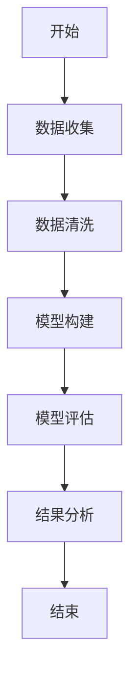

                 


# 如何评估企业的碳中和战略

---

## 关键词

碳中和，企业战略，评估框架，数学模型，系统架构，项目实战

---

## 摘要

企业碳中和战略的评估是实现可持续发展的重要步骤。本文从碳中和的背景出发，详细探讨了碳中和战略的核心概念、评估模型、系统架构及实施路径。通过数学模型和算法的分析，结合实际案例，为企业提供了一套全面的评估方法和工具。文章还总结了最佳实践，为企业的碳中和战略实施提供了指导和建议。

---

## 第一部分：碳中和战略的背景与概念

### 第1章：碳中和战略的背景与意义

#### 1.1 全球碳中和的背景与趋势

碳中和（Carbon Neutrality）是指在一定时间内，通过减少温室气体排放、增加碳汇等方式，使碳排放总量与碳清除量相等，达到净零排放的目标。全球气候变化问题日益严峻，碳中和已成为全球共识。

- **1.1.1 全球气候变化的现状与挑战**  
  全球气温上升、极端天气频发、生态系统破坏等问题严重威胁人类社会的可持续发展。科学研究表明，人类活动是温室气体排放的主要来源，尤其是化石能源的使用和工业生产过程。

- **1.1.2 碳中和目标的全球共识与政策推动**  
  全球多国政府和国际组织（如联合国、欧盟）纷纷提出碳中和目标。例如，欧盟提出到2050年实现碳中和，中国承诺在2060年实现碳中和。碳中和已成为全球经济发展的重要方向。

- **1.1.3 企业社会责任与可持续发展**  
  企业作为社会的重要组成部分，承担着减少碳排放的责任。碳中和不仅是政府的责任，也是企业的义务。通过实现碳中和，企业可以提升品牌形象，增强竞争力。

---

#### 1.2 企业碳中和的必要性

企业碳中和不仅是应对政策法规的要求，更是企业自身发展的需要。

- **1.2.1 企业碳排放的现状分析**  
  企业运营过程中会产生大量碳排放，主要来自能源消耗、运输、生产和供应链管理等方面。不同行业碳排放的强度和来源差异较大。

- **1.2.2 碳中和对企业竞争力的影响**  
  碳中和已成为企业竞争力的重要指标。消费者、投资者和合作伙伴越来越关注企业的碳足迹。通过实现碳中和，企业可以提升市场形象，吸引更多的客户和投资。

- **1.2.3 企业碳中和的战略意义**  
  碳中和战略是企业实现可持续发展的关键路径。通过优化能源结构、减少碳排放，企业可以降低成本，提高运营效率，同时为全球气候变化问题做出贡献。

---

#### 1.3 企业碳中和的目标与路径

企业碳中和的目标是实现净零排放，而路径包括减少碳排放、增加碳汇和碳抵消等方式。

- **1.3.1 碳中和的定义与实现方式**  
  碳中和的实现方式包括减少化石能源使用、发展可再生能源、提高能源效率、增加碳汇等。企业需要根据自身特点选择合适的路径。

- **1.3.2 企业碳中和的短期与长期目标**  
  短期目标：减少碳排放强度，优化能源结构。长期目标：实现净零排放，建立可持续的生产模式。

- **1.3.3 碳中和战略的实施路径**  
  企业可以通过制定碳中和计划、引入绿色技术、优化供应链、提升员工意识等方式实现碳中和。

---

## 第二部分：碳中和战略的核心概念与评估框架

### 第2章：碳中和战略的核心概念

#### 2.1 碳中和战略的定义与属性

碳中和战略是企业在生产和运营过程中，通过减少碳排放、增加碳汇等方式，实现净零碳排放的长期目标。

- **2.1.1 碳中和战略的核心要素**  
  - **目标设定**：明确碳中和的时间表和具体目标。  
  - **减排措施**：优化能源结构、减少能源消耗、采用清洁技术。  
  - **碳汇与抵消**：通过植树造林、碳捕获等方式抵消剩余碳排放。  
  - **监测与评估**：定期监测碳排放量，评估战略实施效果。

- **2.1.2 碳中和战略的属性对比**  
  通过对比不同战略的属性，明确碳中和战略的独特性。例如，碳中和战略与传统环保战略的区别在于目标的全面性和长期性。

- **2.1.3 碳中和战略的边界与外延**  
  碳中和战略不仅包括企业自身的减排，还涉及供应链、产品生命周期等外部因素。因此，企业在制定战略时需要考虑整个价值链的碳排放。

---

#### 2.2 碳中和战略的关键指标

为了科学评估企业碳中和战略的实施效果，需要建立一套完整的指标体系。

- **2.2.1 碳排放的量化方法**  
  碳排放的量化需要考虑直接排放（企业自身运营产生的排放）和间接排放（能源消耗、供应链等产生的排放）。常用方法包括生命周期评估（LCA）和碳足迹分析。

- **2.2.2 企业碳中和目标的分解与评估指标**  
  - **绝对减排量**：企业在一定时间内减少的碳排放总量。  
  - **减排强度**：单位产出的碳排放量。  
  - **碳中和进度**：企业实现碳中和目标的时间节点。

- **2.2.3 关键指标的权重与计算公式**  
  不同指标的权重需要根据企业的实际情况确定。例如，制造业企业可能更关注能源消耗的减排强度，而服务业可能更关注供应链的碳排放。

---

#### 2.3 碳中和战略的评估框架

评估框架是实现碳中和战略的重要工具，能够帮助企业制定科学的行动计划。

- **2.3.1 评估框架的构成与作用**  
  评估框架通常包括目标设定、减排措施、监测与评估三个部分。其作用是为企业提供一个系统化的评估工具，确保战略实施的科学性和有效性。

- **2.3.2 评估框架的实施步骤**  
  - **第一步**：明确企业的碳中和目标。  
  - **第二步**：制定减排措施，包括技术改造、能源结构优化等。  
  - **第三步**：定期监测碳排放量，评估战略实施效果。  
  - **第四步**：根据评估结果，调整战略实施路径。

- **2.3.3 评估框架的优化与调整**  
  根据评估结果，不断优化减排措施，调整战略目标。例如，如果发现某些措施效果不佳，可以尝试新的技术或方法。

---

## 第三部分：碳中和战略的评估模型与算法

### 第3章：碳中和战略评估的数学模型

#### 3.1 碳排放的计算公式

碳排放的计算需要考虑企业直接和间接的碳排放量。常用的公式包括：

- **直接排放**：$E_{\text{direct}} = \sum_{i=1}^{n} (Q_i \times C_i)$  
  其中，$Q_i$ 是第 $i$ 种能源的消耗量，$C_i$ 是单位能源的碳排放因子。

- **间接排放**：$E_{\text{indirect}} = \sum_{j=1}^{m} (Q_j \times C_j)$  
  其中，$Q_j$ 是第 $j$ 种外购电力的消耗量，$C_j$ 是单位电力的碳排放因子。

- **总排放**：$E_{\text{total}} = E_{\text{direct}} + E_{\text{indirect}}$

---

#### 3.2 碳中和目标的数学建模

碳中和目标的实现需要通过优化模型来确定减排措施。

- **线性规划模型**：  
  目标函数：$\min E_{\text{total}}$  
  约束条件：$E_{\text{total}} = 0$（碳中和目标）。

- **机器学习模型**：  
  使用回归分析预测碳排放量，并通过优化算法确定减排措施。

---

#### 3.3 碳中和战略的评估流程图



---

## 第四部分：碳中和战略的系统架构与实现

### 第4章：碳中和战略评估的系统架构

#### 4.1 系统功能设计

- **4.1.1 领域模型（Mermaid 类图）**  
  ```mermaid
  classDiagram
  class 碳排放数据 {
      消耗量
      碳排放因子
  }
  class 碳中和目标 {
      时间节点
      排放总量
  }
  class 算法模型 {
      目标函数
      约束条件
  }
  碳排放数据 --> 算法模型
  碳中和目标 --> 算法模型
  ```

- **4.1.2 系统架构（Mermaid 架构图）**  
  ```mermaid
  architecture
  Client --[HTTP请求]--> WebServer
  WebServer --[数据处理]--> 数据库
  数据库 --[调用]--> 算法模块
  算法模块 --[返回结果]--> WebServer
  ```

- **4.1.3 系统接口设计**  
  - **输入接口**：碳排放数据、碳中和目标。  
  - **输出接口**：减排措施、碳中和进度报告。

- **4.1.4 系统交互（Mermaid 序列图）**  
  ```mermaid
  sequenceDiagram
  用户 --> 系统：提交碳排放数据
  系统 --> 用户：返回减排措施
  用户 --> 系统：提交碳中和目标
  系统 --> 用户：返回碳中和进度报告
  ```

---

## 第五部分：碳中和战略的项目实战

### 第5章：碳中和战略评估的项目实战

#### 5.1 环境安装

- 安装 Python 和必要的库（如 numpy、pandas、scikit-learn）。  
  ```bash
  pip install numpy pandas scikit-learn
  ```

#### 5.2 核心代码实现

- 碳排放计算代码：  
  ```python
  import numpy as np
  import pandas as pd

  # 碳排放因子（单位：吨CO2/单位能源）
  carbon_factors = {
      '电力': 0.5,
      '天然气': 0.2,
      '汽油': 0.3
  }

  # 能源消耗数据（单位：千瓦时）
  energy_consumption = pd.DataFrame({
      '电力': [1000, 800, 1200],
      '天然气': [500, 600, 400],
      '汽油': [200, 300, 250]
  })

  # 计算碳排放
  def calculate_carbon_emissions(energy_consumption, carbon_factors):
      emissions = {}
      for fuel in energy_consumption.columns:
          emissions[fuel] = energy_consumption[fuel] * carbon_factors[fuel]
      return pd.DataFrame(emissions)

  # 执行计算
  emissions = calculate_carbon_emissions(energy_consumption, carbon_factors)
  print(emissions)
  ```

---

## 第六部分：碳中和战略的最佳实践与总结

### 第6章：碳中和战略的最佳实践

#### 6.1 最佳实践 tips

- **制定清晰的目标**：明确碳中和的时间节点和具体指标。  
- **采用先进技术**：利用人工智能、大数据等技术优化减排措施。  
- **加强供应链管理**：推动供应链上下游企业共同实现碳中和。  
- **提升员工意识**：通过培训和宣传，增强员工的环保意识。

---

#### 6.2 项目小结

本文从理论到实践，详细探讨了企业碳中和战略的评估方法。通过数学模型和系统架构的设计，帮助企业制定科学的碳中和计划。同时，通过实际案例的分析，验证了评估方法的有效性。

---

#### 6.3 未来展望与研究方向

未来，随着技术的进步，碳中和战略的评估方法将更加精准和智能化。研究方向包括：  
1. 推动多能互补的能源结构优化。  
2. 开发更加高效的碳捕获和封存技术。  
3. 加强国际合作，推动全球碳中和目标的实现。

---

## 作者

作者：AI天才研究院（AI Genius Institute） & 禅与计算机程序设计艺术（Zen And The Art of Computer Programming）

---

本文为原创内容，转载请注明出处。

