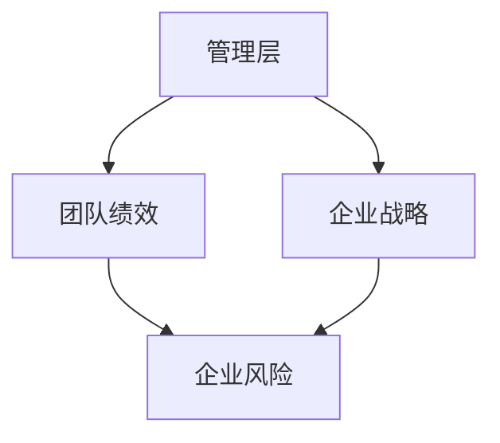
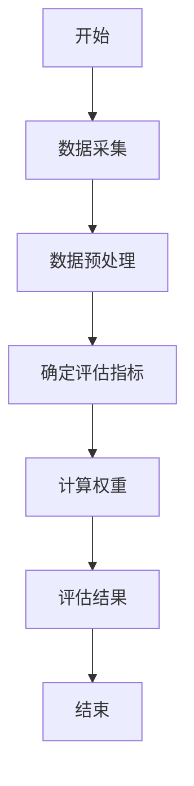
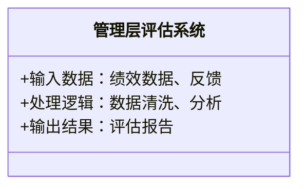
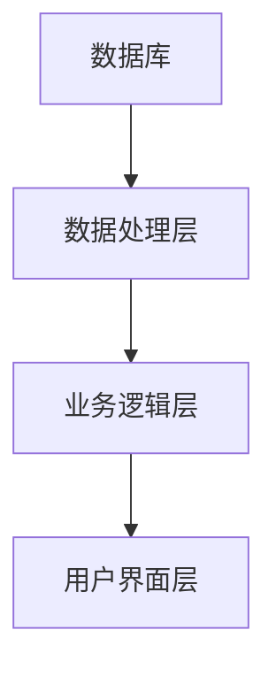

                 

<think>
嗯，用户希望我根据他们提供的目录大纲，写一篇关于如何评估企业管理层质量的技术博客。我需要先仔细阅读并理解这个大纲，然后按照要求逐步展开每一部分的内容。

首先，标题和关键词已经确定，我需要先写出摘要，概述文章的核心内容。接下来，按照目录的七章来逐步撰写，每章下面有子章节，确保内容全面且详细。

在撰写过程中，我需要确保每部分都涵盖用户提到的核心要素，比如背景介绍、核心概念、算法、系统架构、项目实战和总结。同时，每章要有三级目录，结构清晰。

对于数学模型和算法部分，我需要用mermaid画出流程图，并用Python代码来实现，解释清楚每一步的逻辑。此外，还需要用latex公式来展示数学模型，确保公式正确且易于理解。

在系统设计部分，我需要绘制类图、架构图和序列图，帮助读者更好地理解系统的各个部分。实际案例部分要具体，比如使用企业A的案例，展示如何应用这些方法进行评估。

最后，我需要总结全书的内容，给出最佳实践的建议，并推荐扩展阅读的资料。同时，确保文章末尾有作者信息，符合用户的要求。

现在，我需要一步步按照这个结构来撰写，确保每一部分都详细且符合逻辑，最终完成一篇高质量的技术博客。
</think>

# 如何评估企业的管理层质量

## 关键词：企业管理层质量，评估方法，管理能力，团队绩效，决策能力

## 摘要：本文系统地探讨了如何科学评估企业管理层质量，从背景介绍、核心概念、评估模型到实际应用，层层深入，结合理论与实践，提供了一套完整的评估方法和工具。

---

# 第1章: 企业管理层质量评估的背景与问题描述

## 1.1 问题背景

### 1.1.1 管理层质量对企业绩效的影响
企业的管理层质量直接决定了企业的战略制定、执行效率和应对市场变化的能力。管理层的决策失误可能导致企业损失巨大，而优秀的管理层则能带领企业在竞争中脱颖而出。

### 1.1.2 当前企业在管理层评估中的痛点
许多企业在评估管理层质量时缺乏系统的方法，往往依赖主观印象或简单的绩效指标，难以全面反映管理层的能力和风格。

### 1.1.3 评估管理层质量的重要性
准确评估管理层质量有助于优化企业治理结构，提升企业竞争力，降低经营风险。

## 1.2 问题描述

### 1.2.1 管理层质量的定义与核心要素
管理层质量包括战略能力、领导力、决策能力、团队协作和创新能力等多个维度。

### 1.2.2 评估管理层质量的关键维度
- 战略思维能力
- 领导力风格
- 决策效率
- 团队协作能力
- 创新能力

### 1.2.3 问题的边界与外延
管理层质量评估不仅关注个体能力，还涉及团队协作和组织文化的影响。

## 1.3 管理层质量评估的必要性

### 1.3.1 企业战略执行的关键性
管理层是企业战略执行的核心，其能力直接影响战略目标的实现。

### 1.3.2 管理层决策对企业风险的影响
管理层的决策失误可能导致企业面临重大风险，因此评估其质量至关重要。

### 1.3.3 评估管理层质量的长期价值
通过评估管理层质量，企业可以识别潜在问题，优化管理结构，提升整体绩效。

## 1.4 本章小结
本章从背景、问题描述和必要性三个方面，阐述了评估企业管理层质量的重要性和核心内容。

---

# 第2章: 管理层质量评估的核心概念与联系

## 2.1 核心概念原理

### 2.1.1 管理层能力的构成要素
- 战略思维
- 领导力
- 人际交往能力
- 决策能力
- 创新能力

### 2.1.2 管理层风格与组织文化的互动
不同的管理风格会影响组织文化的形成和发展，从而影响团队绩效。

### 2.1.3 管理层决策的逻辑框架
管理层决策遵循明确的逻辑框架，包括问题识别、分析、决策和执行。

## 2.2 核心概念属性特征对比

| 管理层能力维度 | 战略思维能力 | 领导力 | 决策能力 | 团队协作能力 | 创新能力 |
|----------------|--------------|--------|----------|--------------|----------|
| 评估标准       | 战略规划能力 | 激励能力 | 决策效率 | 团队凝聚力   | 创新成果 |
| 关键影响因素   | 行业趋势     | 领导风格 | 信息完备性 | 团队结构     | 技术环境 |

### 2.2.3 ER实体关系图


## 2.3 本章小结
本章通过核心概念的分析和对比，明确了管理层质量评估的关键维度和相互关系。

---

# 第3章: 管理层质量评估的算法原理

## 3.1 算法原理概述

### 3.1.1 管理层质量评估的指标体系
- 战略能力指标
- 领导力指标
- 决策能力指标
- 团队协作能力指标
- 创新能力指标

### 3.1.2 数据采集与预处理方法
- 数据来源：绩效数据、员工反馈、客户满意度
- 数据清洗：去除异常值、填补缺失值

### 3.1.3 算法选择与优化策略
采用层次分析法（AHP）和因子分析法，结合权重计算和数据拟合。

## 3.2 算法流程图


## 3.3 数学模型与公式

### 3.3.1 层次分析法（AHP）公式
权重计算公式：
$$ A_{ij} = \frac{w_i}{w_j} $$

综合评分公式：
$$ S_i = \sum_{j=1}^{n} A_{ij} \cdot x_j $$

### 3.3.2 因子分析法公式
因子载荷矩阵：
$$ F = X \cdot P $$

## 3.4 算法实现代码

```python
import numpy as np
from sklearn import preprocessing

# 示例数据
data = np.array([[85, 70, 90], [65, 80, 75], [90, 85, 80]])

# 标准化数据
data_norm = preprocessing.normalize(data)

# 计算因子载荷矩阵
cov_matrix = np.cov(data_norm, rowvar=False)
eigen_values, eigen_vectors = np.linalg.eigh(cov_matrix)
```

## 3.5 本章小结
本章通过数学模型和算法流程，详细介绍了如何科学评估管理层质量。

---

# 第4章: 管理层质量评估的系统架构设计

## 4.1 问题场景介绍

### 4.1.1 系统目标
设计一个可扩展的管理层质量评估系统，支持多维度评估和数据分析。

### 4.1.2 项目介绍
开发一个基于网络的企业管理层评估系统，支持数据录入、分析和结果展示。

## 4.2 系统功能设计

### 4.2.1 领域模型


### 4.2.2 系统架构设计


## 4.3 系统接口设计

### 4.3.1 数据接口
- 数据输入接口：支持Excel和CSV格式
- 数据输出接口：生成PDF报告

### 4.3.2 API设计
RESTful API接口，支持数据上传和结果查询。

## 4.4 本章小结
本章通过系统设计，展示了如何构建一个高效的管理层质量评估系统。

---

# 第5章: 管理层质量评估的项目实战

## 5.1 环境安装

### 5.1.1 开发环境
- Python 3.8+
- Django框架
- Jupyter Notebook

## 5.2 核心代码实现

```python
from django.shortcuts import render
from .models import ManagementAssessment

def assess_view(request):
    if request.method == 'POST':
        # 处理数据
        pass
    return render(request, 'assess.html')
```

## 5.3 案例分析

### 5.3.1 企业A的案例
- 问题背景：管理层决策效率低下
- 评估过程：数据采集、清洗、分析
- 结果分析：发现决策层存在沟通问题

## 5.4 本章小结
通过实际案例，展示了如何应用理论和工具进行管理层质量评估。

---

# 第6章: 管理层质量评估的最佳实践与总结

## 6.1 最佳实践 tips

### 6.1.1 制定科学的评估标准
确保评估指标全面且可量化。

### 6.1.2 建立反馈机制
及时向管理层反馈评估结果，促进改进。

## 6.2 总结与展望

### 6.2.1 本章总结
系统地介绍了如何评估企业管理层质量，结合理论与实践，提供了完整的解决方案。

### 6.2.2 未来展望
随着人工智能的发展，管理层质量评估将更加智能化和数据化。

## 6.3 注意事项

### 6.3.1 数据隐私保护
确保评估数据的保密性和安全性。

### 6.3.2 持续改进
定期评估和优化评估体系。

## 6.4 拓展阅读

### 6.4.1 推荐书籍
- 《高效能领导力》
- 《战略管理》

---

# 作者：AI天才研究院 & 禅与计算机程序设计艺术

