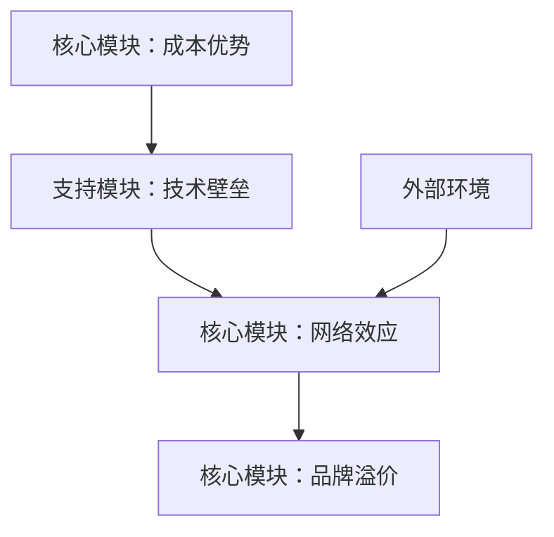
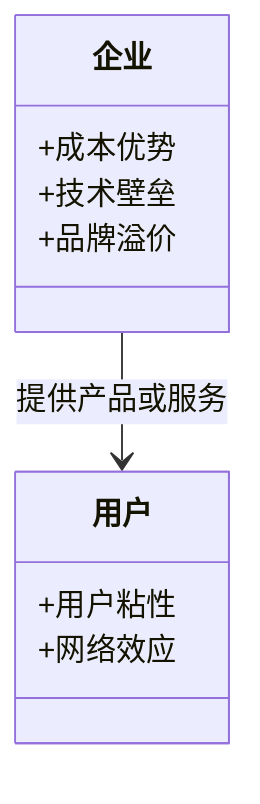

                 

<think>
好的，现在我需要按照用户的要求，逐步思考并撰写一篇关于“如何评估企业的经济护城河”的技术博客文章。首先，我需要理解用户的需求，他们希望有一个结构清晰、内容详实的文章，涵盖从理论到实践的各个方面，并且使用专业且易懂的技术语言。

我将按照用户提供的目录大纲来展开思考和写作。首先，我需要理解每个章节的核心内容，确保每个部分都覆盖必要的细节，并且逻辑连贯。同时，我需要注意使用适当的图表和公式来增强文章的可读性和专业性。

首先，我会从背景介绍开始，解释什么是经济护城河，它的重要性以及与企业竞争力的关系。接着，我会深入探讨经济护城河的核心概念，包括成本优势、网络效应、技术壁垒等，并通过具体的案例和图表来说明这些概念。

然后，我会讨论如何评估经济护城河，包括定性分析、定量分析以及一些常用的工具和方法。在系统分析部分，我会介绍如何从战略、运营等多个角度来构建和评估经济护城河，并使用系统架构图来展示这一过程。

最后，我会通过实际的项目案例来展示如何应用这些理论和方法，包括环境安装、代码实现、案例分析等步骤。同时，我会总结最佳实践，给出一些建议和注意事项，帮助读者更好地理解和应用这些知识。

在整个思考过程中，我会确保每个部分都详细且易于理解，避免使用过于复杂的术语，同时保持专业性和深度。这样，读者可以一步步地跟随我的思路，全面理解如何评估企业的经济护城河。
</think>

# 如何评估企业的经济护城河

> 关键词：经济护城河, 企业竞争力, 竞争优势, 技术壁垒, 网络效应, 成本优势, 品牌溢价

> 摘要：本文将详细介绍如何评估企业的经济护城河。从定义到核心概念，从评估方法到系统分析，再到实际案例，全面解析企业经济护城河的构建与评估。通过本文，读者将掌握如何识别和分析企业护城河，并利用这些知识来制定有效的战略决策。

---

## 第一部分：经济护城河的背景与重要性

### 第1章：经济护城河的定义与重要性

#### 1.1 经济护城河的定义
- **1.1.1 经济护城河的定义与核心概念**
  经济护城河是指企业在市场上构建的一种长期竞争优势，这种优势使得竞争对手难以在短期内复制或超越。它包括成本优势、网络效应、技术壁垒、品牌溢价和规模效应等多种形式。
  
- **1.1.2 经济护城河与企业竞争优势的关系**
  经济护城河是企业竞争优势的核心来源，它能够保护企业在市场中免受竞争对手的侵蚀，同时为企业创造持续的价值。

- **1.1.3 经济护城河的边界与外延**
  经济护城河的边界在于企业的核心竞争力，而外延则涉及企业的生态系统、合作伙伴和客户忠诚度等因素。

#### 1.2 经济护城河的重要性
- **1.2.1 经济护城河在企业长期价值创造中的作用**
  经济护城河能够确保企业在长期的竞争中保持优势，从而为股东创造持续的价值。

- **1.2.2 经济护城河与企业抗风险能力的关系**
  强大的经济护城河能够帮助企业抵御外部的市场波动和内部管理风险，增强企业的抗风险能力。

- **1.2.3 经济护城河对企业战略规划的意义**
  经济护城河是企业战略规划的重要组成部分，它能够指导企业在市场中制定有效的竞争策略。

---

## 第二部分：经济护城河的核心概念与联系

### 第2章：经济护城河的核心概念

#### 2.1 成本优势
- **2.1.1 成本优势的定义与特点**
  成本优势是指企业在生产或运营过程中，由于规模效应、技术优势或流程优化等原因，能够以低于竞争对手的成本提供产品或服务。

- **2.1.2 成本优势与其他经济护城河的联系**
  成本优势可以与其他经济护城河（如网络效应、技术壁垒）相结合，形成强大的综合竞争优势。

- **2.1.3 成本优势的典型案例分析**
  例如，沃尔玛通过全球供应链管理和规模效应，构建了强大的成本优势。

#### 2.2 网络效应
- **2.2.1 网络效应的定义与特点**
  网络效应是指随着用户数量的增加，产品或服务的价值也随之增加。例如，社交媒体平台，用户越多，平台的价值越大。

- **2.2.2 网络效应与企业护城河的构建**
  企业可以通过构建网络效应，吸引更多的用户，形成正反馈循环，从而构建强大的经济护城河。

- **2.2.3 网络效应的数学模型与应用**
  使用数学模型可以量化网络效应的价值，例如，使用网络收益函数来评估用户数量增加带来的收益变化。

#### 2.3 技术壁垒
- **2.3.1 技术壁垒的定义与特点**
  技术壁垒是指企业通过拥有独特的技术或专利，形成的技术优势，使得竞争对手难以复制或超越。

- **2.3.2 技术壁垒与企业创新的关系**
  技术壁垒是企业创新的结果，而创新又是维持技术壁垒的关键。

- **2.3.3 技术壁垒的典型案例分析**
  例如，苹果通过其独特的专利技术，构建了强大的技术壁垒。

#### 2.4 品牌溢价
- **2.4.1 品牌溢价的定义与特点**
  品牌溢价是指由于品牌知名度和美誉度，消费者愿意为某个品牌的产品支付更高的价格。

- **2.4.2 品牌溢价与消费者忠诚度的关系**
  强大的品牌溢价能够提高消费者的忠诚度，从而增强企业的市场地位。

- **2.4.3 品牌溢价的典型案例分析**
  例如，可口可乐通过长期的品牌建设，形成了强大的品牌溢价能力。

---

## 第三部分：经济护城河的评估方法

### 第3章：经济护城河的评估框架

#### 3.1 定性分析

- **3.1.1 定性分析的核心要素**
  定性分析包括对企业战略、市场地位、竞争优势等方面进行评估。

- **3.1.2 定性分析的步骤**
  1. 确定企业的核心竞争优势。
  2. 分析竞争对手的情况。
  3. 评估企业护城河的可持续性。

- **3.1.3 定性分析的案例**
  例如，评估某互联网企业的护城河，可以分析其用户粘性、品牌影响力等因素。

#### 3.2 定量分析

- **3.2.1 定量分析的核心指标**
  定量分析包括市场份额、利润率、成本优势等具体指标。

- **3.2.2 定量分析的工具**
  使用财务报表分析、市场份额分析等工具，量化企业的经济护城河。

- **3.2.3 定量分析的案例**
  例如，通过分析某企业的利润率和市场份额，评估其经济护城河的强度。

#### 3.3 综合评估

- **3.3.1 综合评估的方法**
  结合定性分析和定量分析，构建综合评估框架。

- **3.3.2 综合评估的步骤**
  1. 收集相关数据。
  2. 分析数据。
  3. 得出结论。

- **3.3.3 综合评估的案例**
  例如，评估某科技企业的经济护城河，可以结合其技术壁垒、品牌溢价和网络效应等多个因素。

---

## 第四部分：经济护城河的系统分析

### 第4章：经济护城河的系统分析

#### 4.1 系统架构设计

- **4.1.1 系统架构图**
  使用mermaid图展示经济护城河的系统架构，包括核心模块（如成本优势、技术壁垒）、支持模块（如品牌溢价）和外部接口（如市场环境）。



- **4.1.2 系统模块的交互**
  通过系统架构图，展示各模块之间的交互关系，例如，成本优势模块如何支持技术壁垒模块，从而增强企业的护城河。

#### 4.2 系统功能设计

- **4.2.1 领域模型设计**
  使用mermaid类图展示经济护城河的领域模型，包括核心概念（如成本优势、网络效应）和相关实体（如企业、用户）。



- **4.2.2 功能模块的交互**
  通过类图展示企业与用户之间的交互关系，例如，企业通过提供具有成本优势的产品，吸引更多的用户，从而增强网络效应。

---

## 第五部分：经济护城河的项目实战

### 第5章：经济护城河的项目实战

#### 5.1 项目背景

- **5.1.1 项目介绍**
  本项目旨在通过实际案例分析，展示如何评估某企业的经济护城河。

- **5.1.2 项目目标**
  通过分析某企业的市场表现、竞争优势等因素，评估其经济护城河的强度。

#### 5.2 项目实施

- **5.2.1 环境安装**
  安装必要的工具，如数据分析工具、绘图工具等。

- **5.2.2 核心代码实现**
  使用Python编写代码，分析企业的市场份额、利润率等数据。

```python
import pandas as pd
import numpy as np

# 示例数据
data = {
    '企业': ['A', 'B', 'C'],
    '市场份额': [30, 25, 20],
    '利润率': [20, 15, 10]
}

df = pd.DataFrame(data)
print(df)
```

- **5.2.3 代码应用解读**
  通过数据分析，评估企业的市场份额和利润率，进而评估其经济护城河的强度。

#### 5.3 案例分析

- **5.3.1 案例介绍**
  分析某互联网企业的经济护城河，包括其成本优势、网络效应和技术壁垒。

- **5.3.2 案例分析**
  通过数据分析和图表展示，评估该企业的经济护城河。

---

## 第六部分：总结与展望

### 第6章：总结与展望

#### 6.1 小结

- 本文详细介绍了如何评估企业的经济护城河，从核心概念到评估方法，再到系统分析和项目实战，为读者提供了全面的指导。

#### 6.2 注意事项

- 在实际应用中，需要注意数据的准确性和分析的深度，避免片面结论。

#### 6.3 最佳实践 tips

- 定期评估企业的经济护城河，及时调整战略，以应对市场变化。

#### 6.4 拓展阅读

- 推荐阅读相关书籍和论文，深入理解经济护城河的理论和实践。

---

## 作者信息

作者：AI天才研究院/AI Genius Institute & 禅与计算机程序设计艺术 /Zen And The Art of Computer Programming

---

以上是《如何评估企业的经济护城河》的完整目录大纲和文章内容。

