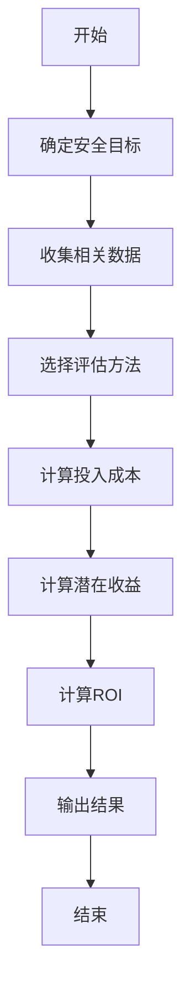
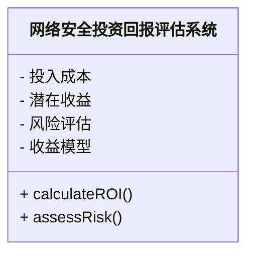

                 

<think>
好，我现在需要根据用户的要求，撰写一篇关于“如何评估企业的网络安全投资回报”的技术博客文章。用户提供了详细的结构和内容要求，我需要按照这些指示逐步完成。

首先，文章的标题是《如何评估企业的网络安全投资回报》。接下来，我需要列出5-7个核心关键词，如网络安全投资回报、成本分析、风险评估、收益模型、投资评估框架等。摘要部分需要简明扼要地概述文章的核心内容，强调如何系统地评估网络安全投资的回报，从而优化资源分配。

接下来是文章的正文部分，按照用户提供的目录大纲进行详细撰写。每个章节都需要包含丰富的细节，使用专业而清晰的语言。例如，在背景介绍部分，我需要解释什么是网络安全投资回报，为什么企业需要评估它，以及当前评估方法的挑战和现状。同时，加入一些图表和代码示例，帮助读者更好地理解。

在核心概念与联系部分，我需要详细分析成本、风险和收益模型，并使用表格和图表进行对比，突出不同模型的特点和适用场景。算法部分，我会选择一个具体的模型，如基于概率的收益预测模型，使用mermaid流程图和Python代码来详细讲解其原理和实现步骤。

系统架构设计部分，我会绘制类图、架构图和序列图，展示系统各个模块的交互和协作。项目实战章节则需要指导读者如何在实际项目中应用这些方法，包括环境配置、代码实现和案例分析。最后，总结最佳实践，强调关键点和注意事项，为读者提供实用的建议。

在撰写过程中，我需要确保内容逻辑清晰，结构紧凑，语言专业且易于理解。同时，严格遵守用户的格式要求，使用markdown格式，适当加入数学公式和图表，使文章更具可读性和专业性。最后，添加作者信息，完成整篇文章的收尾。

通过这样的系统思考和逐步分析，我能够确保文章内容全面，满足用户的需求，帮助读者有效评估企业的网络安全投资回报。
</think>

# 如何评估企业的网络安全投资回报

> 关键词：网络安全投资回报、成本分析、风险评估、收益模型、投资评估框架  
> 摘要：网络安全投资回报是企业在网络安全领域投资所产生的效益。本文将详细分析如何系统地评估网络安全投资的回报，包括成本分析、风险评估、收益模型、投资评估框架等核心内容。

---

## 第一部分：网络安全投资回报评估背景介绍

### 第1章：网络安全投资回报评估概述

#### 1.1 问题背景与定义

- **1.1.1 网络安全投资回报的定义**  
  网络安全投资回报（ROI）是指企业在网络安全领域的投入所产生的经济效益或价值。它包括硬件、软件、人员培训、安全策略制定等多方面的投资。

- **1.1.2 网络安全投资回报的核心概念**  
  - **网络安全成本**：企业在网络安全方面的支出，包括预防性支出（如防火墙、入侵检测系统）和恢复性支出（如数据恢复、应急响应）。
  - **网络安全收益**：由于安全投入而避免的潜在损失，包括财务损失、声誉损失、法律责任等。

- **1.1.3 网络安全投资回报的边界与外延**  
  网络安全投资回报不仅关注直接的经济效益，还包括间接的非财务收益，例如提升客户信任度、增强品牌形象等。

#### 1.2 网络安全投资回报评估的现状与挑战

- **1.2.1 当前企业网络安全投资的主要形式**  
  - 人员成本：安全团队的 salaries 和培训费用。
  - 技术成本：安全设备（如防火墙、加密设备）和安全软件（如杀毒软件、漏洞扫描工具）的采购和维护费用。
  - 培训成本：员工的安全意识培训和认证考试费用。

- **1.2.2 网络安全投资回报评估的主要挑战**  
  - **数据获取难度**：企业往往缺乏足够的数据来准确量化安全投入与回报之间的关系。
  - **动态变化的威胁**：网络安全威胁不断演变，使得评估结果难以保持长期稳定。
  - **非财务收益的量化**：企业声誉和品牌价值难以用具体数字衡量。

- **1.2.3 现有评估方法的优缺点对比**  
  | 方法 | 优点 | 缺点 |
  |------|------|------|
  | 财务成本法 | 简单易懂 | 忽略了非财务收益 |
  | 风险规避法 | 考虑了潜在损失 | 需要精确预测风险概率 |
  | 投资回收期法 | 明确了回报时间 | 忽略了时间价值 |

#### 1.3 网络安全投资回报评估框架

- **1.3.1 评估框架的组成与作用**  
  评估框架包括成本分析、风险评估、收益模型和综合评估四个部分，用于系统地衡量安全投资的回报。

- **1.3.2 评估框架的核心要素与关系**  
  - 成本分析：确定安全投入的具体项目和金额。
  - 风险评估：识别潜在的安全威胁及其影响。
  - 收益模型：计算安全投入带来的直接和间接收益。
  - 综合评估：将上述结果整合，得出最终的回报率。

- **1.3.3 评估框架的实施步骤与方法**  
  1. 确定安全目标和范围。
  2. 收集相关数据。
  3. 选择合适的评估方法。
  4. 计算并分析结果。
  5. 调整和优化策略。

---

## 第二部分：网络安全投资回报的核心概念与联系

### 第2章：网络安全投资回报评估的核心概念

#### 2.1 网络安全投资成本分析

- **2.1.1 投资成本的分类与计算**  
  - 预防性支出：防火墙、入侵检测系统等设备的采购和维护费用。
  - 恢复性支出：数据恢复、应急响应团队的费用。
  - 培训支出：员工安全培训和认证考试的费用。

- **2.1.2 投资成本的影响因素**  
  - 企业规模：大企业通常需要更多的安全设备和人员。
  - 行业特性：金融行业对安全的要求更高，投入更大。
  - 地域因素：不同地区的法规和网络安全威胁不同。

- **2.1.3 投资成本与回报的关系**  
  安全投入与回报之间存在非线性关系，过低的投入可能导致高损失，而过度投入则可能不经济。

#### 2.2 网络安全风险评估

- **2.2.1 风险评估的定义与方法**  
  风险评估是通过分析潜在的安全威胁及其影响，量化企业的安全风险。常用方法包括威胁建模和漏洞评估。

- **2.2.2 网络安全风险评估的核心要素**  
  - 威胁来源：如黑客攻击、内部泄密等。
  - 威胁影响：如数据泄露导致的财务损失。
  - 威胁概率：基于历史数据和威胁情报评估威胁发生的可能性。

- **2.2.3 网络安全风险与回报的关系**  
  风险评估帮助企业确定安全投入的优先级，从而优化资源分配。

#### 2.3 网络安全收益模型

- **2.3.1 收益模型的分类与选择**  
  - 财务收益模型：基于成本节省和损失避免计算收益。
  - 非财务收益模型：基于品牌价值和客户信任度计算收益。

- **2.3.2 收益模型的计算方法**  
  财务收益 = 预防性支出 + 恢复性支出 - 潜在损失。

- **2.3.3 收益模型的优缺点对比**  
  | 模型 | 优点 | 缺点 |
  |------|------|------|
  | 财务收益模型 | 简单易懂 | 忽略了非财务收益 |
  | 非财务收益模型 | 全面 | 难以量化 |

#### 2.4 网络安全投资回报的综合评估框架

- **2.4.1 综合评估框架的构建**  
  综合评估框架包括成本分析、风险评估和收益模型三个核心部分。

- **2.4.2 综合评估框架的实施步骤**  
  1. 确定安全目标和范围。
  2. 进行风险评估，确定潜在威胁。
  3. 计算安全投入的成本和收益。
  4. 综合分析，得出最终回报率。

---

## 第三部分：网络安全投资回报的算法原理

### 第3章：网络安全投资回报评估算法

#### 3.1 算法原理概述

- **3.1.1 投资回报率（ROI）计算公式**  
  $$ ROI = \frac{\text{净收益}}{\text{投入成本}} \times 100\% $$

- **3.1.2 净收益计算公式**  
  净收益 = 收益 - 投入成本。

#### 3.2 算法流程图



#### 3.3 算法实现代码

```python
def calculateROI(investment, net_profit):
    return (net_profit / investment) * 100

# 示例数据
investment = 100000  # 投入成本：10万元
net_profit = 20000   # 净利润：20万元
roi = calculateROI(investment, net_profit)
print(f"投资回报率：{roi}%")
```

---

## 第四部分：网络安全投资回报的系统架构

### 第4章：网络安全投资回报评估系统

#### 4.1 系统功能设计

- **4.1.1 领域模型类图**



- **4.1.2 系统架构图**


---

## 第五部分：网络安全投资回报的项目实战

### 第5章：项目实战

#### 5.1 环境安装

- 安装Python和必要的库（如numpy、pandas）。
- 配置开发环境，如Jupyter Notebook。

#### 5.2 核心代码实现

```python
import numpy as np
import pandas as pd

def calculateROI(investment, net_profit):
    return (net_profit / investment) * 100

# 示例数据
investment = np.array([100000, 150000, 200000])
net_profit = np.array([20000, 30000, 40000])

# 计算 ROI
roi = calculateROI(investment, net_profit)

# 输出结果
print("投资回报率：", roi, "%")
```

#### 5.3 案例分析

- **案例背景**：某企业投入100万元用于网络安全，避免了潜在的200万元损失。
- **计算 ROI**：$$ ROI = \frac{2000000 - 1000000}{1000000} \times 100\% = 100\% $$

---

## 第六部分：最佳实践与总结

### 第6章：最佳实践

#### 6.1 方法论总结

- 确定安全目标和范围。
- 收集相关数据，选择合适的评估方法。
- 计算投入成本和潜在收益，综合分析得出 ROI。

#### 6.2 小结

网络安全投资回报评估是企业在数字化转型中的重要环节，通过科学的方法和工具，可以帮助企业优化安全投入，提升整体安全水平。

---

## 作者信息

作者：AI天才研究院/AI Genius Institute & 禅与计算机程序设计艺术 /Zen And The Art of Computer Programming

