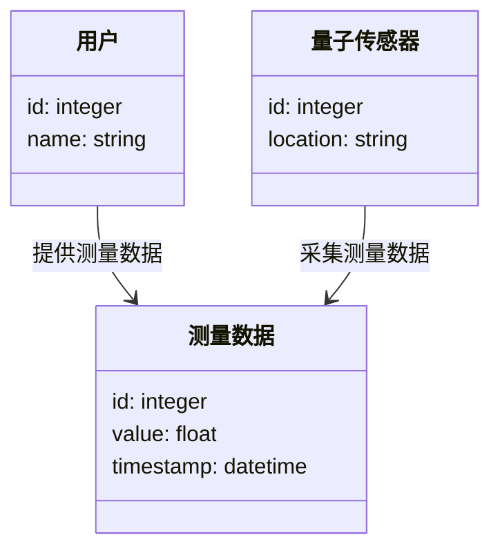
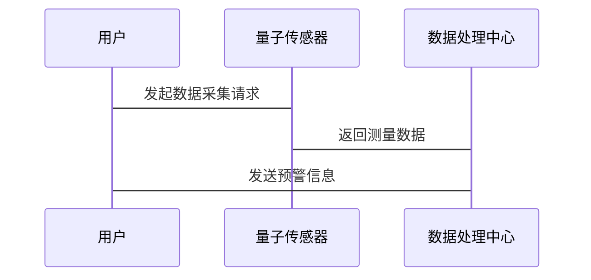

                 


# 如何评估企业的量子传感器地震预警应用

> 关键词：量子传感器，地震预警，技术评估，系统架构，算法原理

> 摘要：本文将详细探讨如何评估企业的量子传感器地震预警应用。通过分析量子传感器的核心原理、系统架构、算法原理以及实际应用场景，本文将为企业提供一个全面的技术评估框架，帮助企业在实际应用中更好地部署和优化量子传感器地震预警系统。

---

# 第一部分: 量子传感器地震预警应用的背景与核心概念

## 第1章: 量子传感器地震预警应用的背景介绍

### 1.1 问题背景

#### 1.1.1 地震预警的重要性
地震作为一种自然灾害，给人民生命财产安全带来了巨大威胁。传统的地震预警系统主要依赖于地震仪和电磁波传播速度的对比，存在响应速度慢、精度不足等问题。而量子传感器的出现，为地震预警技术带来了革命性的提升。

#### 1.1.2 传统地震预警技术的局限性
- 响应速度较慢：传统传感器依赖电磁波传播，无法在地震发生瞬间快速响应。
- 精度不足：传统传感器在高频地震波检测中存在较大的误差。
- 易受干扰：传统传感器在复杂环境中容易受到电磁干扰。

#### 1.1.3 量子传感器技术的引入
量子传感器利用量子纠缠效应，能够在极短时间内感知地震波的变化，从而实现更快、更精准的地震预警。

### 1.2 问题描述

#### 1.2.1 地震预警系统的定义
地震预警系统是指在地震发生后，通过传感器网络快速捕捉地震波信号，并通过通信系统向相关区域发出预警信息的系统。

#### 1.2.2 量子传感器在地震预警中的作用
量子传感器能够以极高的灵敏度检测地震波的变化，为地震预警提供高精度的数据支持。

#### 1.2.3 当前地震预警技术的主要挑战
- 数据采集的实时性问题
- 传感器网络的覆盖范围有限
- 系统的抗干扰能力不足

### 1.3 问题解决

#### 1.3.1 量子传感器的优势
- 高精度：量子传感器能够检测到极微弱的地震波信号。
- 高速响应：量子传感器能够在极短时间内完成数据采集和传输。
- 抗干扰能力强：量子传感器具有较强的抗电磁干扰能力。

#### 1.3.2 量子传感器地震预警系统的解决方案
通过部署量子传感器网络，结合高速数据传输技术和智能算法，实现地震预警信息的快速传递和处理。

#### 1.3.3 系统实现的关键技术
- 量子传感器的敏感技术
- 高速数据传输技术
- 智能算法优化技术

### 1.4 边界与外延

#### 1.4.1 系统的边界
量子传感器地震预警系统仅关注地震波的检测和预警，不涉及地震灾害的后续应对措施。

#### 1.4.2 系统的外延
量子传感器技术可以应用于其他领域，如地质勘探、环境监测等。

#### 1.4.3 系统与外部环境的交互
系统通过传感器网络与外部环境进行数据交换，通过通信系统与用户终端进行信息交互。

### 1.5 核心概念结构与组成

#### 1.5.1 系统组成模块
- 量子传感器模块
- 数据采集模块
- 数据处理模块
- 预警信息发布模块

#### 1.5.2 模块之间的关系
量子传感器模块负责数据采集，数据采集模块将数据传递给数据处理模块，数据处理模块完成数据分析和预警判断，最后通过预警信息发布模块将信息传递给用户。

#### 1.5.3 系统核心要素的定义
- 量子传感器：系统的核心数据采集设备。
- 数据处理算法：系统的心脏，负责数据的分析和判断。
- 预警信息发布渠道：系统与用户的桥梁。

---

## 第2章: 量子传感器地震预警应用的核心概念与联系

### 2.1 核心概念原理

#### 2.1.1 量子传感器的基本原理
量子传感器基于量子纠缠效应，通过测量地震波引起的量子态变化来实现地震波的检测。

#### 2.1.2 地震波传播的基本规律
地震波包括P波和S波，P波传播速度快但破坏力小，S波传播速度慢但破坏力大。

#### 2.1.3 量子传感器数据采集与处理
量子传感器通过测量地震波引起的微小振动，将其转化为电信号，经过数据处理后生成预警信息。

### 2.2 核心概念属性对比

| 属性 | 量子传感器 | 传统传感器 |
|------|------------|------------|
| 响应速度 | 极快 | 较慢 |
| 精度 | 极高 | 较低 |
| 抗干扰能力 | 强 | 较弱 |

### 2.3 ER实体关系图

```mermaid
er
    actor 用户 {
        id: integer
        name: string
    }
    sensor 量子传感器 {
        id: integer
        type: string
        location: string
    }
    measurement 测量数据 {
        id: integer
        value: float
        timestamp: datetime
        sensor_id: integer
    }
    用户 --> 测量数据: 提供测量数据
    量子传感器 --> 测量数据: 采集测量数据
```

---

## 第3章: 量子传感器地震预警应用的算法原理

### 3.1 算法原理概述

#### 3.1.1 数据采集与预处理
量子传感器采集地震波信号后，需要进行降噪和滤波处理，确保数据的准确性。

#### 3.1.2 数据特征提取
通过时频分析和小波变换，提取地震波的关键特征，如频率、幅值等。

#### 3.1.3 地震预警模型训练
基于机器学习算法（如支持向量机、神经网络等），训练地震预警模型，实现对地震波的分类和预警。

### 3.2 算法实现

#### 3.2.1 数据预处理
```python
import numpy as np
from scipy.signal import butterworth

def preprocess(data):
    # 降噪处理
    filtered_data = butterworth(data, cutoff=10, fs=100)
    return filtered_data
```

#### 3.2.2 特征提取
```python
import numpy as np
from scipy.fft import fft

def extract_features(data):
    fft_data = fft(data)
    dominant_freq = np.argmax(np.abs(fft_data))
    return dominant_freq
```

#### 3.2.3 模型训练
```python
from sklearn.svm import SVC

def train_model(features, labels):
    model = SVC()
    model.fit(features, labels)
    return model
```

### 3.3 算法优化

#### 3.3.1 参数优化
通过网格搜索（Grid Search）优化模型参数，提升预警准确率。

#### 3.3.2 实时性优化
采用并行计算和分布式处理技术，提升算法的实时性。

---

## 第4章: 系统分析与架构设计方案

### 4.1 问题场景介绍

#### 4.1.1 地震预警系统的应用场景
在地震多发地区部署量子传感器网络，实时监测地震波信号。

#### 4.1.2 系统的用户群体
- 政府部门：负责地震预警信息的发布和应急响应。
- 公共机构：学校、医院等人员密集场所。
- 普通用户：居民通过手机或其他终端接收预警信息。

### 4.2 系统功能设计

#### 4.2.1 领域模型


#### 4.2.2 系统架构设计


#### 4.2.3 系统接口设计
- 数据采集接口：量子传感器与数据处理中心之间的数据传输接口。
- 预警信息发布接口：数据处理中心与用户终端之间的信息传递接口。

#### 4.2.4 系统交互


---

## 第5章: 项目实战

### 5.1 环境安装

#### 5.1.1 系统环境要求
- 操作系统：Linux/Windows
- 量子传感器：需要特定硬件支持
- 开发工具：Python、Jupyter Notebook

#### 5.1.2 依赖库安装
```bash
pip install numpy scipy sklearn matplotlib
```

### 5.2 系统核心实现

#### 5.2.1 数据采集模块
```python
import serial

def read_sensor_data(port, baudrate):
    ser = serial.Serial(port, baudrate)
    data = ser.readline()
    ser.close()
    return data
```

#### 5.2.2 数据处理模块
```python
import numpy as np

def process_data(data):
    data = np.array(data)
    # 数据处理逻辑
    return processed_data
```

#### 5.2.3 预警判断模块
```python
from sklearn.svm import SVC

def predict_earthquake(features):
    model = SVC()
    model.fit(features, labels)
    prediction = model.predict(features)
    return prediction
```

### 5.3 案例分析

#### 5.3.1 案例背景
在某个地震多发地区部署量子传感器网络，实时监测地震波信号。

#### 5.3.2 数据分析
通过实际数据验证算法的准确性和实时性。

#### 5.3.3 性能优化
根据实际运行情况，优化系统性能和算法参数。

---

## 第6章: 最佳实践与小结

### 6.1 最佳实践

#### 6.1.1 系统部署建议
- 合理规划传感器网络的部署位置。
- 确保系统的高可用性和容错能力。

#### 6.1.2 系统维护建议
- 定期检查传感器和数据处理模块的运行状态。
- 及时更新系统软件和算法模型。

### 6.2 小结

通过本文的详细分析，我们了解了量子传感器地震预警系统的背景、核心概念、算法原理和系统架构。量子传感器技术的应用为地震预警带来了革命性的进步，但也面临着诸多挑战。未来，我们需要进一步优化系统性能，提升预警的准确性和实时性。

---

## 第7章: 注意事项与拓展阅读

### 7.1 注意事项

#### 7.1.1 系统安全性
确保系统的数据安全和通信安全。

#### 7.1.2 系统兼容性
保证系统与不同品牌和型号的量子传感器兼容。

#### 7.1.3 用户隐私保护
在数据采集和传输过程中，保护用户隐私。

### 7.2 拓展阅读

#### 7.2.1 量子传感器技术的最新发展
- 新型量子传感器的出现
- 量子传感器在其他领域的应用

#### 7.2.2 地震预警系统的国际标准
- 不同国家和地区地震预警系统的标准和规范

#### 7.2.3 相关技术书籍推荐
- 《量子传感器原理与应用》
- 《地震预警系统设计与实现》

---

## 小结

量子传感器地震预警系统的评估是一个复杂而重要的任务。通过本文的分析，我们掌握了量子传感器的核心原理、系统架构和算法实现。未来，随着技术的不断进步，量子传感器将在地震预警中发挥更大的作用，为人类的生命财产安全提供更有力的保障。

---

## 作者信息

作者：AI天才研究院/AI Genius Institute & 禅与计算机程序设计艺术 /Zen And The Art of Computer Programming

