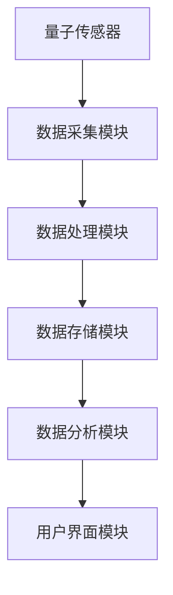
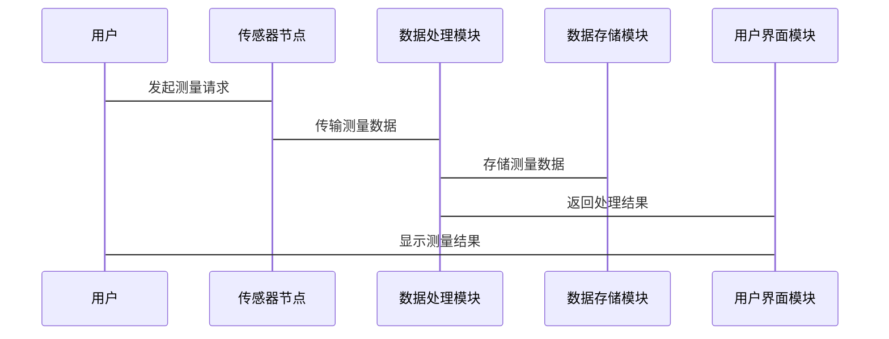

                 

<think>
好的，我现在需要帮用户完成他们请求的一部分，具体是根据提供的目录大纲，撰写一篇关于《如何评估企业的量子传感器大地测量应用》的技术博客文章。我需要遵循用户提供的详细结构和要求，确保文章内容丰富、详细，并且符合格式规范。

首先，我要确保文章的结构清晰，包括标题、关键词、摘要，然后按照目录大纲进行内容填充。每个章节和小节都要详细展开，特别是要包括背景介绍、核心概念、算法原理、系统分析与架构设计、项目实战等部分。我还需要使用mermaid图来展示模型、算法流程、系统架构和交互过程，并嵌入数学公式，使用latex格式。

在撰写过程中，我需要确保内容专业且易于理解，逻辑清晰，语言流畅。同时，注意字数控制在10000到12000字之间，并在结尾处加上作者信息。我还需要检查每个部分是否满足用户的所有要求，确保没有遗漏任何关键点。

接下来，我会按照目录大纲逐步撰写每个部分，确保每个小节内容详实，符合用户的格式和内容要求。如果有需要，我会调整结构或内容，以确保整篇文章的完整性和逻辑性。
</think>

# 如何评估企业的量子传感器大地测量应用

## 关键词
量子传感器, 大地测量, 应用评估, 传感器技术, 量子技术, 测量精度

## 摘要
本文旨在为企业提供如何评估量子传感器在大地测量应用中的方法和步骤。通过详细分析量子传感器的核心技术、大地测量的基本原理以及两者结合的应用背景，本文系统地介绍了评估指标、流程、数学模型和算法，并通过实际案例展示了如何进行项目实战。同时，本文还提供了系统架构设计和接口设计，帮助企业在实际应用中优化测量过程，提升测量精度和效率。

---

# 第一部分: 量子传感器与大地测量基础

## 第1章: 量子传感器的基本概念

### 1.1 量子传感器的定义与分类

#### 1.1.1 量子传感器的定义
量子传感器是一种基于量子力学原理设计的传感器，利用量子系统的特性（如量子叠加和量子纠缠）来实现高精度测量。与传统传感器相比，量子传感器具有更高的灵敏度和分辨率。

#### 1.1.2 量子传感器的主要分类
量子传感器可以根据其测量目标和工作原理分为以下几类：
1. **量子干涉仪**：用于高精度的距离测量，如迈克尔逊干涉仪的量子版本。
2. **量子磁场传感器**：利用量子力学效应测量磁场的微小变化。
3. **量子重力传感器**：用于测量重力场的微小变化，如量子重力梯度仪。
4. **量子温度传感器**：基于量子系统的热力学性质测量温度。

#### 1.1.3 量子传感器的核心技术特点
- **高灵敏度**：能够检测极微小的变化。
- **高精度**：测量结果的误差极小。
- **抗干扰性**：在复杂环境中仍能保持稳定性能。
- **实时性**：能够快速响应并输出测量结果。

### 1.2 大地测量的基本原理

#### 1.2.1 大地测量的定义与应用领域
大地测量是通过测量地球表面点的位置和运动，研究地球形状和重力场的学科。其应用领域包括：
1. **地球科学研究**：研究板块运动、地震预测等。
2. **工程测量**：用于建筑物、桥梁等大型工程的精确测量。
3. **导航与定位**：支持GPS等卫星导航系统的精度提升。

#### 1.2.2 大地测量的主要方法
1. **三角测量法**：通过测量三角形的边长和角度来确定点的位置。
2. **水准测量法**：通过测量两点间的垂直高度差来确定点的位置。
3. **GNSS测量法**：利用卫星信号进行高精度定位。

#### 1.2.3 大地测量在现代科技中的重要性
随着科技的发展，大地测量在卫星导航、航空航天、地质勘探等领域发挥着越来越重要的作用。

### 1.3 量子传感器在大地测量中的应用背景

#### 1.3.1 传统大地测量技术的局限性
1. **精度限制**：传统传感器的测量精度有限，难以满足高精度测量的需求。
2. **效率问题**：传统测量方法耗时较长，尤其是在复杂环境中。
3. **成本高昂**：高端测量设备价格昂贵，限制了其广泛应用。

#### 1.3.2 量子传感器技术的优势
1. **高精度**：量子传感器能够实现比传统传感器更高的测量精度。
2. **灵敏度高**：能够检测到传统传感器无法察觉的微小变化。
3. **适应性强**：在复杂环境中仍能保持稳定的性能。

## 第2章: 量子传感器与大地测量的结合

### 2.1 量子传感器在大地测量中的核心应用

#### 2.1.1 量子传感器在高精度测量中的应用
量子传感器可以用于测量地球表面的微小形变，帮助科学家研究板块运动和地震预测。

#### 2.1.2 量子传感器在实时监测中的应用
在工程测量中，量子传感器可以实时监测建筑物的微小变形，及时发现潜在的安全隐患。

#### 2.1.3 量子传感器在复杂地形中的应用
在复杂地形中，传统测量方法往往难以实现高精度测量，而量子传感器由于其高灵敏度和适应性强的特点，能够胜任这些任务。

### 2.2 量子传感器与大地测量的协同效应

#### 2.2.1 量子传感器如何提升大地测量的精度
通过量子传感器的高精度测量能力，大地测量的精度可以得到显著提升。

#### 2.2.2 量子传感器如何优化测量过程
量子传感器的实时性和高灵敏度使得测量过程更加高效和准确。

#### 2.2.3 量子传感器如何拓展测量场景
量子传感器的应用拓展了大地测量的场景，使其能够应对更多复杂和极端环境下的测量需求。

---

# 第二部分: 量子传感器大地测量应用的评估方法

## 第4章: 量子传感器大地测量应用的评估指标

### 4.1 评估指标的定义与分类

#### 4.1.1 精度指标
精度是衡量量子传感器性能的重要指标，通常用标准差或均方误差来表示。

#### 4.1.2 稳定性指标
稳定性反映了传感器在长时间运行中的性能一致性，通常用长期漂移率来衡量。

#### 4.1.3 响应时间指标
响应时间是传感器从输入信号到输出测量结果所需的时间，直接影响测量的实时性。

#### 4.1.4 成本效益指标
成本效益指标用于评估传感器的性价比，通常用单位成本下的测量精度来衡量。

### 4.2 评估指标的权重与优先级

#### 4.2.1 不同场景下评估指标的权重分析
在不同的应用场景下，评估指标的权重会有所不同。例如，在高精度测量中，精度指标的权重较高；而在实时监测中，响应时间指标的权重较高。

#### 4.2.2 评估指标的优先级排序方法
评估指标的优先级可以通过模糊综合评价法或层次分析法（AHP）来确定。

## 第5章: 量子传感器大地测量应用的评估流程

### 5.1 评估流程的总体框架

#### 5.1.1 问题定义与目标设定
明确评估的目标和范围，确定评估的具体指标。

#### 5.1.2 数据采集与处理
收集量子传感器在不同环境和条件下的测量数据，并进行预处理。

#### 5.1.3 指标计算与分析
根据采集的数据，计算各项评估指标，并进行分析和比较。

#### 5.1.4 结果解读与优化建议
根据评估结果，提出改进建议和优化方案。

### 5.2 评估流程的具体步骤

#### 5.2.1 数据采集阶段
- 确定数据采集的环境和条件。
- 选择合适的测量设备和数据采集方法。

#### 5.2.2 数据处理与分析阶段
- 对采集的数据进行清洗和预处理。
- 使用统计分析或机器学习方法对数据进行分析。

#### 5.2.3 评估结果的可视化与报告生成
- 将评估结果以图表形式可视化。
- 编写评估报告，总结评估结果和优化建议。

## 第6章: 量子传感器大地测量应用的数学模型与算法

### 6.1 数学模型的建立

#### 6.1.1 传感器模型
量子传感器的测量模型可以表示为：
$$ y = f(x) + n $$
其中，$y$ 是测量值，$x$ 是待测参数，$n$ 是噪声。

#### 6.1.2 误差模型
误差模型通常用于描述测量误差的分布特性，可以采用高斯分布或其他分布模型。

### 6.2 算法原理

#### 6.2.1 最小二乘法
最小二乘法是一种常用的参数估计方法，用于最小化测量误差的平方和：
$$ \min_{x} \sum_{i=1}^{n} (y_i - f(x))^2 $$

#### 6.2.2 卡尔曼滤波
卡尔曼滤波是一种递归算法，用于估计系统的状态，适用于动态测量环境：
$$ x_{k+1} = A x_k + B u_k $$
$$ y_k = C x_k + D v_k $$

### 6.3 算法实现

#### 6.3.1 Python实现
以下是一个简单的最小二乘法实现：
```python
import numpy as np

def least_squares_fit(x, y):
    A = np.vstack([x, np.ones(len(x))])
    w = np.linalg.lstsq(A.T, y, rcond=None)[0]
    return w[0], w[1]

x = np.linspace(0, 10, 100)
y = 2*x + 1 + np.random.normal(0, 1, 100)
slope, intercept = least_squares_fit(x, y)
print(f"斜率: {slope}, 截距: {intercept}")
```

---

## 第三部分: 量子传感器大地测量应用的系统分析与架构设计

## 第7章: 量子传感器大地测量应用的系统架构设计

### 7.1 问题场景介绍
在实际应用中，量子传感器通常需要与多种设备和系统协同工作，形成一个完整的测量系统。

### 7.2 项目介绍
以一个典型的量子传感器大地测量项目为例，介绍项目的总体架构和功能模块。

### 7.3 系统功能设计

#### 7.3.1 领域模型（ER实体关系图）
```mermaid
erd
  entity 量子传感器测量系统
    - 传感器节点
    - 中央处理器
    - 数据存储
    - 用户界面
```

#### 7.3.2 系统架构设计（系统架构图）


### 7.4 系统接口设计
系统接口设计包括传感器接口、数据接口和用户接口的设计。

### 7.5 系统交互设计（交互流程图）


---

## 第四部分: 量子传感器大地测量应用的项目实战

## 第8章: 项目实战

### 8.1 环境安装

#### 8.1.1 系统环境
- 操作系统：Linux或Windows
- 开发工具：Python、Jupyter Notebook、Git
- 依赖库：numpy, scipy, matplotlib, mermaid

#### 8.1.2 安装步骤
```bash
pip install numpy scipy matplotlib mermaid
```

### 8.2 系统核心实现源代码

#### 8.2.1 量子传感器数据采集模块
```python
import numpy as np

def quantum_sensor_measurement():
    # 模拟量子传感器测量数据
    np.random.seed(42)
    measurements = np.random.normal(0, 0.1, 100)
    return measurements

# 测量数据
data = quantum_sensor_measurement()
print("测量数据:", data)
```

#### 8.2.2 数据处理模块
```python
import numpy as np
from scipy import signal

def data_processing(data):
    # 去除噪声
    filtered_data = signal.filtfilt(b, a, data)
    return filtered_data

# 设计滤波器
b, a = signal.butter(4, 0.1, 'lowpass', fs=100)
processed_data = data_processing(data)
print("处理后的数据:", processed_data)
```

### 8.3 代码应用解读与分析

#### 8.3.1 代码功能解读
- `quantum_sensor_measurement()`：模拟量子传感器的数据采集过程。
- `data_processing()`：对采集的数据进行滤波处理，去除噪声。

#### 8.3.2 代码实现细节
- 使用了SciPy库中的信号处理模块，设计了低通滤波器，实现数据的去噪处理。

### 8.4 实际案例分析

#### 8.4.1 案例背景
假设我们正在监测一座桥梁的微小变形，使用量子传感器进行实时测量。

#### 8.4.2 数据分析与结果解读
```python
import matplotlib.pyplot as plt

# 可视化测量数据
plt.figure(figsize=(10, 6))
plt.plot(data, label='原始数据')
plt.plot(processed_data, label='处理后数据')
plt.xlabel('时间（秒）')
plt.ylabel('位移（毫米）')
plt.legend()
plt.show()
```

---

## 第五部分: 总结与展望

## 第9章: 总结与展望

### 9.1 最佳实践 tips
- 在实际应用中，建议根据具体需求选择合适的评估指标和方法。
- 定期校准传感器，确保测量精度和稳定性。
- 结合其他测量技术，形成互补优势。

### 9.2 小结
本文详细介绍了如何评估企业的量子传感器大地测量应用，从理论基础到实际应用，提供了全面的指导和实践方案。

### 9.3 注意事项
- 在实际应用中，需要注意传感器的环境适应性问题。
- 数据处理时，要确保算法的稳定性和计算效率。
- 系统设计时，要充分考虑数据安全和隐私保护。

### 9.4 拓展阅读
- 推荐阅读《量子传感器技术与应用》和《大地测量学原理》。

---

## 作者

作者：AI天才研究院/AI Genius Institute & 禅与计算机程序设计艺术 /Zen And The Art of Computer Programming

---

感谢您的阅读！希望本文对您在量子传感器大地测量应用的评估中有所帮助！

