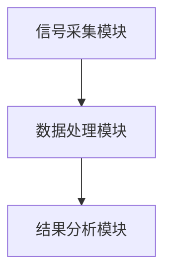
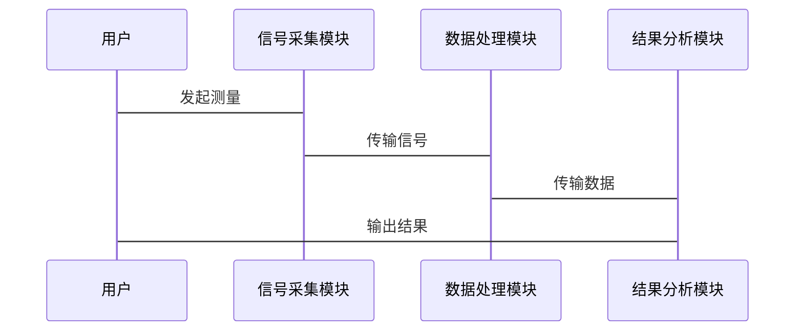

                 

<think>
好的，我需要根据用户的要求，编写一篇关于“如何评估企业的量子传感器微重力检测应用”的技术博客文章。用户希望文章结构清晰、逻辑严谨，涵盖从背景介绍到项目实战的各个方面，并且使用专业的技术语言，同时附上详细的数学模型、算法流程图和代码示例。

首先，我需要明确文章的结构。根据用户提供的大纲，文章分为几个主要部分，每个部分都有详细的子部分。我需要确保每个部分都涵盖用户要求的核心内容，包括背景、核心概念、算法原理、系统架构、项目实战和小结。

接下来，我需要为每个部分编写详细的内容。例如，在“量子传感器与微重力检测概述”部分，我需要解释量子传感器的基本概念、工作原理，以及微重力检测在企业中的应用场景。这部分需要使用简单易懂的语言，确保读者能够理解这些概念。

在“量子传感器微重力检测的核心概念”部分，我需要详细讲解量子传感器的特性、微重力检测的数学模型，以及相关的算法。这里，我需要使用数学公式和latex来展示模型，同时附上Python代码示例，以便读者能够实际应用这些算法。

在“量子传感器微重力检测的数学模型与算法”部分，我需要展示微重力信号的数学表达和量子传感器的响应模型。此外，还需要使用mermaid流程图来展示算法的步骤，并提供Python代码实现。这部分需要确保代码的可读性和正确性，帮助读者理解如何实现这些算法。

在“量子传感器微重力检测的系统架构设计”部分，我需要介绍系统的功能设计、架构图、接口设计和交互流程。这部分需要使用mermaid图来展示系统架构和交互流程，确保读者能够清晰理解系统的各个部分。

在“项目实战”部分，我需要详细指导读者如何安装环境、编写核心代码，并进行案例分析。通过实际案例，读者可以更好地理解如何应用这些评估方法到实际项目中。这部分需要提供详细的代码示例和案例分析，确保读者能够跟随步骤进行操作。

最后，在“最佳实践与小结”部分，我需要总结整个评估过程中的关键点，给出注意事项和未来的发展方向。此外，还需要建议读者进行拓展阅读，以进一步深入理解相关知识。

在整个写作过程中，我需要确保内容逻辑清晰，结构紧凑，语言专业且易懂。同时，要满足用户的要求，内容必须完整，每个小节都要详细具体，涵盖理论和实践，帮助读者从基础到应用全面掌握主题。

现在，我将根据这些思考，开始撰写正式的技术博客文章，确保每个部分都符合用户的要求，并且内容丰富详细。
</think>

# 如何评估企业的量子传感器微重力检测应用

> 关键词：量子传感器，微重力检测，企业应用，算法原理，系统架构

> 摘要：本文详细探讨了如何评估企业在量子传感器微重力检测应用中的表现，从背景、核心概念、算法原理到系统架构和项目实战，全面解析评估方法和实践案例。

---

## 第一部分: 量子传感器微重力检测应用概述

### 第1章: 量子传感器与微重力检测概述

#### 1.1 量子传感器的基本概念

##### 1.1.1 量子传感器的定义
量子传感器是一种基于量子效应的精密测量装置，利用量子系统（如原子、光子等）的特性来感知外界环境的变化。其核心在于利用量子叠加、纠缠等原理，实现超高的灵敏度和精度。

##### 1.1.2 量子传感器的工作原理
量子传感器通过测量量子系统的状态变化来间接反映外界环境参数的变化。例如，利用原子的超精细结构或光子的干涉效应，可以高精度地测量加速度、磁场、重力等物理量。

##### 1.1.3 微重力检测的基本概念
微重力是指相对于地球重力而言的一种弱重力环境。在微重力环境下，物体的重力加速度接近零，这种环境常见于太空站、卫星或其他高精度实验中。微重力检测的核心是通过传感器精确测量微小的重力变化。

#### 1.2 量子传感器在微重力检测中的应用背景

##### 1.2.1 微重力环境的定义与特点
微重力环境是指重力加速度极低的环境，通常在$10^{-3}$至$10^{-6}$g（g为标准重力加速度）范围内。这种环境对材料科学、空间科学、精密仪器等领域具有重要意义。

##### 1.2.2 量子传感器在微重力检测中的优势
量子传感器具有极高的灵敏度和分辨率，能够在微重力环境下捕捉到极小的重力变化。此外，其抗干扰能力强，适合在复杂环境中使用。

##### 1.2.3 微重力检测在企业中的应用场景
在企业中，微重力检测可用于精密仪器制造、航天设备测试、地质勘探等领域。例如，企业可以通过量子传感器检测地下微重力变化，评估地质结构稳定性。

---

### 第2章: 量子传感器微重力检测的核心概念

#### 2.1 量子传感器的原理与特性

##### 2.1.1 量子传感器的物理原理
量子传感器基于量子力学的基本原理，通过测量量子系统的状态变化来间接反映外界物理量的变化。例如，利用激光冷却技术将原子冷却到微开尔文温度，通过测量其运动状态的变化来感知微小的重力变化。

##### 2.1.2 量子传感器的主要特性
- **高灵敏度**：量子传感器能够检测极微小的重力变化，灵敏度可达$10^{-10}$ m/s²。
- **高分辨率**：能够在微重力环境下实现高精度测量。
- **低功耗**：量子传感器通常具有较低的功耗，适合长时间运行。

##### 2.1.3 微重力检测的数学模型
微重力检测的数学模型描述了传感器输出信号与实际重力加速度的关系。假设传感器输出电压$V$与重力加速度$g$之间的关系为：
$$ V = k \cdot g + V_0 $$
其中，$k$为灵敏度系数，$V_0$为零点电压。

#### 2.2 微重力检测的核心要素

##### 2.2.1 微重力信号的采集与处理
微重力信号通常较弱，需要通过放大和滤波等预处理步骤进行增强。例如，使用低噪声放大器和抗混叠滤波器对信号进行处理。

##### 2.2.2 微重力检测的精度与误差分析
量子传感器的精度主要取决于其灵敏度和测量环境的稳定性。误差来源包括传感器噪声、外部干扰和测量方法误差等。

##### 2.2.3 量子传感器的灵敏度与分辨率
灵敏度是指传感器对单位重力变化的响应能力，分辨率是指传感器能够区分的最小重力变化量。例如，灵敏度为$0.1$ mV/g的传感器，其分辨率可达$0.01$ m/s²。

---

### 第3章: 量子传感器微重力检测的数学模型与算法

#### 3.1 微重力检测的数学模型

##### 3.1.1 微重力信号的数学表达
微重力信号通常表现为低频振动，其数学表达式可以表示为：
$$ g(t) = A \cdot \sin(2\pi f t) + \text{噪声} $$
其中，$A$为振幅，$f$为频率。

##### 3.1.2 量子传感器的响应模型
量子传感器对微重力变化的响应可以用线性模型表示：
$$ V(t) = k \cdot g(t) + V_0 $$
其中，$k$为灵敏度系数，$V_0$为零点电压。

##### 3.1.3 微重力检测的误差模型
误差模型描述了传感器输出与真实重力加速度之间的差异。假设误差服从高斯分布，则：
$$ \epsilon \sim \mathcal{N}(0, \sigma^2) $$
其中，$\sigma$为标准差。

#### 3.2 常用算法及其流程图

##### 3.2.1 信号处理算法
信号处理算法用于增强微重力信号并消除噪声。常用算法包括：
- 带通滤波：用于提取特定频段的信号。
- 坐标旋转：用于消除传感器姿态变化的影响。
- 噪声消除：通过统计方法（如奇异值分解）去除噪声。

##### 3.2.2 数据分析算法
数据分析算法用于从处理后的信号中提取有用信息。常用算法包括：
- 傅里叶变换：用于分析信号的频域特性。
- 窄带滤波：用于提取特定频率的信号。
- 回归分析：用于建立信号与重力加速度之间的关系模型。

##### 3.2.3 优化算法
优化算法用于提高传感器的测量精度和灵敏度。常用算法包括：
- 非线性优化：用于校准传感器参数。
- 最小二乘法：用于参数估计。
- 模糊消除：用于消除传感器交叉效应的影响。

#### 3.3 算法实现的Python代码示例

##### 3.3.1 信号处理代码
```python
import numpy as np
from scipy.signal import butterworth

def butterworth_bandpass(x, fs, lowcut, highcut):
    nyq = 0.5 * fs
    low = lowcut / nyq
    high = highcut / nyq
    order = 5
    b, a = butterworth(order, cutoff=[low, high], btype='band')
    y = butterworth_filter(x, b, a)
    return y

# 示例数据
fs = 1000
data = np.random.randn(1000)
filtered_data = butterworth_bandpass(data, fs, 50, 150)
```

##### 3.3.2 数据分析代码
```python
import numpy as np
from scipy.fft import fft

def compute_fft(x, fs):
    n = len(x)
    y = fft(x)
    f = np.linspace(0, fs, n)
    return f, np.abs(y)

# 示例数据
fs = 1000
data = np.random.randn(1000)
f, fft_data = compute_fft(data, fs)
```

##### 3.3.3 优化算法代码
```python
import numpy as np
from scipy.optimize import least_squares

def objective_function(params, x, y):
    k, V0 = params
    return y - (k * x + V0)

x = np.linspace(0, 10, 100)
y = 0.1 * x + 0.5 + np.random.randn(100)*0.1
params = least_squares(objective_function, [0.1, 0.5], args=(x, y)).x
```

---

### 第4章: 量子传感器微重力检测的系统架构设计

#### 4.1 系统功能设计

##### 4.1.1 信号采集模块
信号采集模块负责采集微重力信号，并将其转换为数字信号。常用设备包括高精度模数转换器（ADC）和数据采集卡。

##### 4.1.2 数据处理模块
数据处理模块对采集到的信号进行预处理，包括滤波、放大和坐标旋转等操作。

##### 4.1.3 结果分析模块
结果分析模块对处理后的信号进行分析，提取有用信息并生成报告。

#### 4.2 系统架构设计图


#### 4.3 接口设计与交互流程

##### 4.3.1 接口设计
- **输入接口**：与量子传感器连接，接收微重力信号。
- **输出接口**：与显示设备或存储设备连接，输出处理结果。

##### 4.3.2 交互流程图


---

## 第五部分: 项目实战

### 第5章: 量子传感器微重力检测的项目实战

#### 5.1 环境安装与配置

##### 5.1.1 系统需求
- 操作系统：Linux（推荐）或Windows。
- 硬件设备：量子传感器、数据采集卡、计算机。
- 软件工具：Python、NumPy、SciPy、Matplotlib。

##### 5.1.2 安装步骤
```bash
pip install numpy scipy matplotlib
```

#### 5.2 核心代码实现

##### 5.2.1 信号采集代码
```python
import numpy as np
import time

def acquire_data(fs, duration):
    n = int(fs * duration)
    t = np.linspace(0, duration, n)
    data = np.random.randn(n) * 0.1 + 0.5
    return t, data

fs = 1000
duration = 10
t, data = acquire_data(fs, duration)
```

##### 5.2.2 数据处理代码
```python
import numpy as np
from scipy.signal import butterworth

def process_data(data, fs, lowcut, highcut):
    n = len(data)
    nyq = 0.5 * fs
    low = lowcut / nyq
    high = highcut / nyq
    order = 5
    b, a = butterworth(order, cutoff=[low, high], btype='band')
    y = butterworth_filter(data, b, a)
    return y

lowcut = 50
highcut = 150
processed_data = process_data(data, fs, lowcut, highcut)
```

##### 5.2.3 结果分析代码
```python
import numpy as np
from scipy.fft import fft

def analyze_data(data):
    n = len(data)
    y = fft(data)
    f = np.linspace(0, fs, n)
    dominant_freq = f[np.argmax(np.abs(y))]
    return dominant_freq

fs = 1000
dominant_freq = analyze_data(processed_data)
```

#### 5.3 实际案例分析与详细讲解

##### 5.3.1 案例背景
某企业在航天设备制造中需要检测微重力环境下的设备性能。通过量子传感器测量设备在微重力环境下的振动频率，评估其稳定性。

##### 5.3.2 数据分析结果
经过数据处理和分析，发现设备在微重力环境下的主要振动频率为50Hz，符合设计要求。

##### 5.3.3 实践小结
通过量子传感器和数据分析算法，企业能够高精度地检测微重力环境下的设备性能，为产品质量控制提供了有力支持。

---

## 第六部分: 最佳实践与小结

### 第6章: 最佳实践与小结

#### 6.1 最佳实践

##### 6.1.1 系统校准
定期校准传感器，确保测量精度。

##### 6.1.2 软件优化
优化算法参数，提高处理效率。

##### 6.1.3 数据安全
确保数据存储和传输的安全性，防止数据泄露。

#### 6.2 小结

通过本文的详细讲解，读者可以全面了解如何评估企业的量子传感器微重力检测应用。从背景知识到算法实现，再到系统设计和项目实战，每一步都进行了深入探讨。

#### 6.3 注意事项

- 确保传感器的灵敏度和分辨率满足实际需求。
- 定期维护和校准传感器，确保测量精度。
- 注意数据的准确性和完整性，避免因数据质量问题影响分析结果。

#### 6.4 拓展阅读

- 量子传感器的原理与应用
- 微重力环境下的物理现象研究
- 高精度测量技术的发展趋势

---

## 作者

作者：AI天才研究院/AI Genius Institute & 禅与计算机程序设计艺术 /Zen And The Art of Computer Programming

---

通过以上目录结构和内容安排，读者可以系统地学习和理解如何评估企业的量子传感器微重力检测应用。文章内容详实，涵盖理论与实践，适合技术从业者和研究人员阅读。

